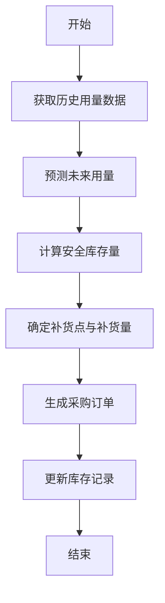

# 基于SSM的医药管理系统

## 1. 背景介绍

### 1.1 医药管理系统的重要性

在当今社会,医疗卫生行业发挥着至关重要的作用。为了确保医疗服务的高效运作,医药管理系统应运而生。医药管理系统是一种综合性的信息管理平台,旨在优化医院的药品采购、库存管理、处方管理等流程,提高工作效率,降低运营成本,并确保患者用药安全。

### 1.2 传统医药管理模式的挑战

在传统的医药管理模式下,医院通常采用人工记录和纸质文件的方式进行管理,这种做法存在诸多弊端:

1. 工作效率低下,容易出现人为失误
2. 数据共享和实时查询存在困难
3. 缺乏统一的管理平台,各部门之间协作效率低下
4. 难以及时掌握药品库存和流向情况

因此,构建一个高效、智能的医药管理信息系统,成为医院提升运营效率和服务质量的迫切需求。

## 2. 核心概念与联系

### 2.1 SSM架构

SSM是一种流行的Java Web开发架构,由Spring、SpringMVC和Mybatis三个开源框架组成。这三个框架相互补充,共同构建了一个高效、灵活的Web应用程序架构。

1. **Spring**: 提供了面向切面编程(AOP)和控制反转(IOC)等核心功能,简化了应用程序的开发。
2. **SpringMVC**: 基于MVC设计模式,实现了请求驱动型网站的开发,简化了Web层的开发。
3. **Mybatis**: 一个优秀的持久层框架,支持自定义SQL、存储过程以及高级映射,消除了几乎所有的JDBC代码。

### 2.2 医药管理系统的核心模块

一个完整的医药管理系统通常包含以下核心模块:

1. **药品信息管理**: 维护药品的基本信息、生产厂商、有效期等数据。
2. **采购管理**: 根据库存情况和临床需求,制定采购计划,完成药品采购流程。
3. **库存管理**: 实时监控药品库存量,处理药品入库、出库等操作。
4. **处方管理**: 医生开具处方,药房根据处方准备和发放药品。
5. **供应商管理**: 维护供应商信息,评估供应商绩效,优化供应链。
6. **统计报表**: 生成各类统计报表,支持决策分析。

### 2.3 SSM架构与医药管理系统的集成

基于SSM架构开发的医药管理系统,可以有效解决传统管理模式存在的问题:

1. Spring提供了强大的模块化支持,有利于系统的可扩展性和可维护性。
2. SpringMVC简化了Web层的开发,提高了开发效率。
3. Mybatis对数据持久层提供了高效的支持,减轻了开发人员的工作量。
4. 三个框架的有机结合,构建了一个高效、灵活、可伸缩的应用程序架构。

## 3. 核心算法原理具体操作步骤

在医药管理系统中,涉及多种核心算法,如库存管理算法、供应链优化算法等。以库存管理算法为例,其核心思想是通过合理的补货策略,在满足临床需求的同时,尽可能降低库存成本。

具体操作步骤如下:



1. **获取历史用量数据**: 从系统中提取过去一段时间内各种药品的实际用量数据。
2. **预测未来用量**: 基于历史数据,运用时间序列分析等统计学方法,对未来一段时间内各种药品的用量进行预测。
3. **计算安全库存量**: 根据预测的用量和医院对各药品的服务水平要求,计算出每种药品的安全库存量。
4. **确定补货点与补货量**: 当库存量下降到安全库存量时,触发补货;补货量 = 最大库存量 - 当前库存量。
5. **生成采购订单**: 将需要补货的药品及数量汇总,自动生成采购订单。
6. **更新库存记录**: 药品入库后,更新相应的库存记录。

该算法的优点是简单高效,易于实现,能够满足大多数医院的基本需求。在实际应用中,还可以根据具体情况进行优化和改进,如引入智能化预测模型、多目标优化等。

## 4. 数学模型和公式详细讲解举例说明

在库存管理算法中,计算安全库存量是一个关键环节。安全库存量的大小直接影响到医院的服务水平和库存成本。我们可以使用如下数学模型进行计算:

$$
安全库存量 = 安全系数 \times 标准用量偏差 \times \sqrt{补货周期(天)}
$$

其中:

- **安全系数**是一个常数,用于确定所需的服务水平。通常取值范围为0.67~1.65,值越大,服务水平越高,但库存成本也越高。
- **标准用量偏差**反映了用量的波动情况,可以从历史数据中计算得到。
- **补货周期**是从下订单到药品实际入库所需的时间,单位为天。

让我们以一种常用抗生素为例,来计算其安全库存量:

- 已知该抗生素的日均用量为50盒,用量标准差为10盒。
- 医院要求95%的服务水平,对应的安全系数为1.65。
- 该药品的补货周期为7天。

将这些数据代入公式,可以得到:

$$
\begin{aligned}
安全库存量 &= 1.65 \times 10 \times \sqrt{7} \\
          &= 46盒
\end{aligned}
$$

因此,该抗生素的安全库存量应设置为46盒。当库存量下降到这个水平时,就需要补货,以确保供应的连续性。

通过合理设置安全库存量,医院可以在满足临床需求的同时,尽可能降低库存成本,实现医疗资源的高效利用。

## 5. 项目实践: 代码实例和详细解释说明

为了更好地理解SSM架构在医药管理系统中的应用,我们将通过一个简单的示例项目来演示。该项目包括药品信息管理和库存管理两个核心模块。

### 5.1 项目结构

```
medical-management
├── src
│   ├── main
│   │   ├── java
│   │   │   └── com
│   │   │       └── example
│   │   │           ├── config
│   │   │           ├── controller
│   │   │           ├── dao
│   │   │           ├── entity
│   │   │           ├── service
│   │   │           └── utils
│   │   └── resources
│   │       ├── mapper
│   │       ├── spring
│   │       └── spring-mvc.xml
│   └── test
│       └── java
└── pom.xml
```

1. `config`包: 存放Spring和Mybatis的配置文件。
2. `controller`包: 存放SpringMVC的控制器类。
3. `dao`包: 存放Mybatis的Mapper接口。
4. `entity`包: 存放实体类,对应数据库表结构。
5. `service`包: 存放业务逻辑层的服务接口和实现类。
6. `utils`包: 存放工具类。
7. `resources`目录: 存放Mybatis的Mapper映射文件、Spring配置文件等资源文件。

### 5.2 药品信息管理模块

#### 5.2.1 实体类

```java
// Drug.java
public class Drug {
    private Long id;
    private String name;
    private String description;
    private Double price;
    private String manufacturer;
    // 省略 getter/setter
}
```

#### 5.2.2 Mapper接口

```java
// DrugMapper.java
@Mapper
public interface DrugMapper {
    List<Drug> getAllDrugs();
    Drug getDrugById(Long id);
    int addDrug(Drug drug);
    int updateDrug(Drug drug);
    int deleteDrug(Long id);
}
```

#### 5.2.3 服务层

```java
// DrugService.java
@Service
public class DrugServiceImpl implements DrugService {
    @Autowired
    private DrugMapper drugMapper;

    @Override
    public List<Drug> getAllDrugs() {
        return drugMapper.getAllDrugs();
    }

    // 其他方法省略
}
```

#### 5.2.4 控制器

```java
// DrugController.java
@Controller
@RequestMapping("/drugs")
public class DrugController {
    @Autowired
    private DrugService drugService;

    @GetMapping
    public String getAllDrugs(Model model) {
        List<Drug> drugs = drugService.getAllDrugs();
        model.addAttribute("drugs", drugs);
        return "drugList";
    }

    // 其他方法省略
}
```

在这个模块中,我们定义了`Drug`实体类,对应数据库中的`drugs`表。`DrugMapper`接口提供了基本的CRUD操作,而`DrugService`则封装了业务逻辑。`DrugController`负责处理HTTP请求,并将数据传递给视图层进行渲染。

### 5.3 库存管理模块

库存管理模块的代码结构类似,这里不再赘述。我们重点介绍一下库存管理算法的实现。

#### 5.3.1 预测未来用量

```java
// ForecastUtil.java
public class ForecastUtil {
    public static double[] forecastDemand(double[] history, int forecastPeriod) {
        // 使用简单移动平均法进行预测
        double[] forecast = new double[forecastPeriod];
        int n = history.length;
        int m = Math.min(n, 12); // 取最近12个月的数据
        double sum = 0;
        for (int i = n - m; i < n; i++) {
            sum += history[i];
        }
        double avg = sum / m;
        Arrays.fill(forecast, avg);
        return forecast;
    }
}
```

在这个示例中,我们使用简单移动平均法对未来用量进行预测。该方法的思路是取最近12个月的用量数据,计算它们的平均值,并将这个平均值作为未来每个月的预测值。

#### 5.3.2 计算安全库存量

```java
// InventoryUtil.java
public class InventoryUtil {
    private static final double SERVICE_LEVEL = 0.95; // 服务水平
    private static final double SAFETY_FACTOR = 1.65; // 对应的安全系数

    public static int calculateSafetyStock(double[] forecast, double stdDev, int leadTime) {
        double safetyStock = SAFETY_FACTOR * stdDev * Math.sqrt(leadTime);
        return (int) Math.ceil(safetyStock);
    }
}
```

这里我们直接使用之前介绍的公式计算安全库存量。`SERVICE_LEVEL`和`SAFETY_FACTOR`是预先设定的常量,分别表示期望的服务水平和对应的安全系数。`stdDev`是用量的标准差,可以从历史数据中计算得到。`leadTime`是补货周期,单位为天。

#### 5.3.3 生成采购订单

```java
// PurchaseOrderService.java
@Service
public class PurchaseOrderServiceImpl implements PurchaseOrderService {
    @Autowired
    private InventoryMapper inventoryMapper;

    @Override
    public List<PurchaseOrder> generateOrders() {
        List<PurchaseOrder> orders = new ArrayList<>();
        List<Inventory> lowStocks = inventoryMapper.getLowStockItems();
        for (Inventory item : lowStocks) {
            int quantity = item.getMaxStock() - item.getCurrentStock();
            PurchaseOrder order = new PurchaseOrder();
            order.setDrugId(item.getDrugId());
            order.setQuantity(quantity);
            orders.add(order);
        }
        return orders;
    }
}
```

在这个示例中,我们首先从数据库中查询出所有库存量低于安全库存量的药品。然后,对于每种药品,我们计算需要补货的数量,并生成一个采购订单。最后,将所有订单汇总返回。

通过这个简单的示例,我们可以看到如何将核心算法与SSM架构相结合,构建一个功能完备的医药管理系统。

## 6. 实际应用场景

医药管理系统在实际应用中扮演着重要角色,可以为医院带来诸多好处:

1. **提高工作效率**: 系统自动化地处理药品采购、库存管理等流程,减轻了工作人员的负担,提高了工作效率。

2. **降低运营成本**: 通过合理的库存管理策略,医院可以降低库存成本,避免资金