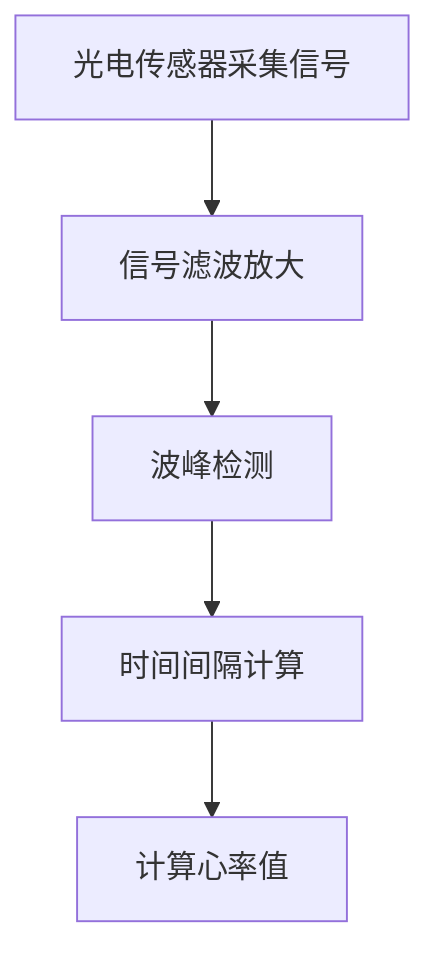
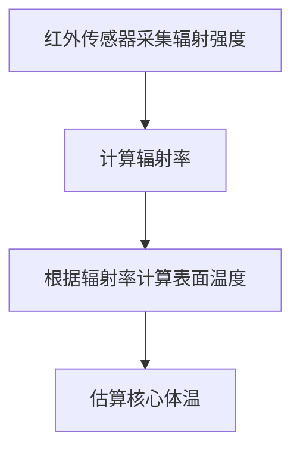
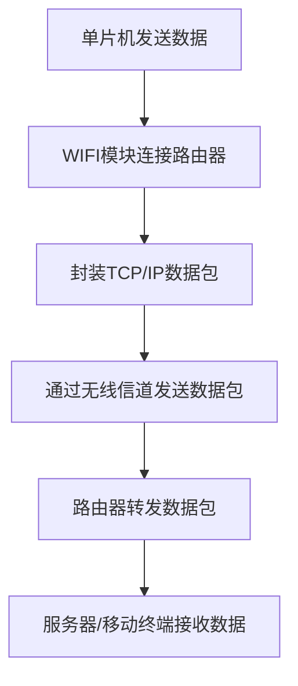
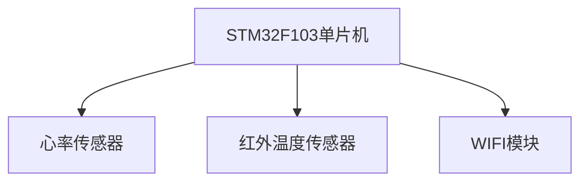
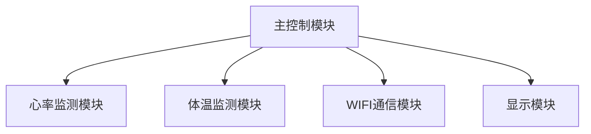

# 基于单片机手环心率脉搏体温测量WIFI传输的设计与实现

## 1.背景介绍

### 1.1 健康监测的重要性

在当今快节奏的生活方式中,人们越来越重视自身的健康状况。健康是人类生存和发展的基础,良好的健康状态不仅能够提高生活质量,还能够增强工作效率和创造力。因此,对于个人和社会而言,健康监测都具有重要的意义。

### 1.2 可穿戴设备的发展

随着科技的不断进步,可穿戴设备的发展也日新月异。可穿戴设备能够实时监测人体的各种生理参数,如心率、体温、血压等,为健康监测提供了便捷的方式。其中,手环作为一种常见的可穿戴设备,因其体积小巧、佩戴方便而备受青睐。

### 1.3 项目背景

本项目旨在设计并实现一款基于单片机的手环,用于监测佩戴者的心率、脉搏和体温等生理参数,并通过WIFI无线传输数据。该手环不仅能够实时监测身体状况,还能够将数据上传至云端,方便用户随时查看和管理自身的健康数据。

## 2.核心概念与联系

### 2.1 单片机

单片机(Single-Chip Microcomputer)是一种高度集成的微型计算机系统,它将微处理器的运算和控制单元、存储程序和数据的存储器、计数器/定时器、串行通信接口、并行输入/输出接口等多种功能集成在一个芯片上。单片机具有体积小、功耗低、成本低等优点,广泛应用于各种嵌入式系统中。

### 2.2 心率监测

心率是指心脏每分钟跳动的次数,是评估人体健康状况的重要指标之一。常见的心率监测方法包括光电容积脉搏波法、电极法等。光电容积脉搏波法利用光电传感器检测皮肤下血液流动引起的光吸收变化,从而计算心率。

### 2.3 体温监测

体温是反映人体代谢水平和健康状况的重要生理参数。常见的体温监测方法包括红外测温法、热电阻测温法等。红外测温法利用红外传感器检测人体辐射的红外线,从而计算体温。

### 2.4 WIFI通信

WIFI(Wireless Fidelity)是一种无线局域网技术,它采用2.4GHz或5GHz的无线电频率进行数据传输。WIFI技术具有传输距离远、传输速率快、使用方便等优点,广泛应用于各种无线通信场景。

### 2.5 核心概念之间的联系

本项目中,单片机作为核心控制单元,负责采集心率、脉搏和体温等生理参数,并通过WIFI模块将数据无线传输至远程服务器或移动终端。心率监测、体温监测和WIFI通信是实现该功能的三大核心技术,它们相互配合,共同实现了实时健康监测和数据传输的目标。

## 3.核心算法原理具体操作步骤

### 3.1 心率监测算法

本项目采用光电容积脉搏波法进行心率监测。具体步骤如下:

1. 通过光电传感器发射绿光,并检测皮肤下血液流动引起的光吸收变化。
2. 对检测到的光电信号进行滤波和放大,去除噪声和基线漂移。
3. 利用算法检测光电信号中的脉冲波峰,计算相邻波峰之间的时间间隔。
4. 根据时间间隔计算心率值,即每分钟的脉冲数。

该算法的核心在于波峰检测和时间间隔计算。可以采用阈值法、微分法、模板匹配法等多种算法实现波峰检测。时间间隔计算则需要对波峰进行精确定位,并记录其发生时刻。



### 3.2 体温监测算法

本项目采用红外测温法进行体温监测。具体步骤如下:

1. 通过红外传感器检测人体辐射的红外线强度。
2. 根据红外线强度和传感器特性,计算目标物体的辐射率。
3. 利用斯蒂芬-波尔兹曼定律,根据辐射率计算目标物体的表面温度。
4. 根据皮肤表面温度和经验公式,估算人体核心体温。

该算法的核心在于辐射率计算和温度换算。辐射率计算需要考虑传感器的响应特性和环境因素的影响。温度换算则需要利用物理定律和经验公式,将辐射率转换为实际体温值。



### 3.3 WIFI数据传输算法

本项目采用WIFI模块实现数据的无线传输。具体步骤如下:

1. 单片机通过串口与WIFI模块进行通信,发送连接命令和数据。
2. WIFI模块根据预设的网络参数,建立与路由器的无线连接。
3. WIFI模块将数据封装成TCP/IP数据包,通过无线信道发送至路由器。
4. 路由器根据目标IP地址,将数据包转发至远程服务器或移动终端。
5. 服务器或移动终端接收数据包,解析出原始数据,完成数据传输。

该算法的核心在于WIFI模块的配置和TCP/IP协议的实现。需要正确设置WIFI模块的工作模式、加密方式、IP地址等参数,并实现TCP/IP协议栈的数据封包和解包操作。



## 4.数学模型和公式详细讲解举例说明

### 4.1 心率计算公式

心率是指每分钟心脏跳动的次数,单位为次/分钟(bpm)。根据相邻脉冲波峰之间的时间间隔T(单位为秒),可以计算心率值HR:

$$
HR = \frac{60}{T}
$$

例如,如果相邻波峰间隔为0.8秒,则心率为:

$$
HR = \frac{60}{0.8} = 75\text{bpm}
$$

### 4.2 斯蒂芬-波尔兹曼定律

斯蒂芬-波尔兹曼定律描述了物体辐射能量与温度之间的关系,公式如下:

$$
M = \epsilon \sigma AT^4
$$

其中,M为辐射能量(W),ε为辐射率(无量纲),σ为斯蒂芬-波尔兹曼常数(5.67×10^-8 W/(m^2·K^4)),A为物体表面积(m^2),T为物体绝对温度(K)。

根据该定律,可以由测量到的辐射能量M计算出物体表面温度T:

$$
T = \sqrt[4]{\frac{M}{\epsilon \sigma A}}
$$

例如,假设红外传感器测量到的辐射能量为0.05W,辐射率为0.98,物体表面积为0.01m^2,则表面温度为:

$$
T = \sqrt[4]{\frac{0.05}{0.98 \times 5.67 \times 10^{-8} \times 0.01}} \approx 310\text{K} \approx 37^\circ\text{C}
$$

### 4.3 核心体温估算

人体核心体温通常高于皮肤表面温度,两者之间存在一定的温差。可以利用经验公式估算核心体温T_core:

$$
T_{\text{core}} = T_{\text{surface}} + \Delta T
$$

其中,T_surface为皮肤表面温度,ΔT为温差,通常取0.5~1.5°C。

例如,如果皮肤表面温度为36.5°C,温差取1°C,则核心体温为:

$$
T_{\text{core}} = 36.5^\circ\text{C} + 1^\circ\text{C} = 37.5^\circ\text{C}
$$

## 5.项目实践:代码实例和详细解释说明

### 5.1 硬件连接

本项目采用STM32F103单片机作为主控制器,连接了心率传感器、红外温度传感器和WIFI模块。硬件连接示意图如下:



### 5.2 软件架构

软件架构采用模块化设计,主要包括以下几个模块:

- 主控制模块:负责任务调度和数据处理
- 心率监测模块:实现心率算法,计算心率值
- 体温监测模块:实现体温算法,计算体温值
- WIFI通信模块:实现WIFI连接和数据传输
- 显示模块:将测量数据显示在OLED屏幕上



### 5.3 关键代码实现

以下是心率监测模块的关键代码实现,包括波峰检测和时间间隔计算:

```c
// 波峰检测函数
bool detectPeak(int data) {
    static int prev_data = 0;
    static int curr_slope = 0;
    static int max_slope = 0;
    static int peak_val = 0;
    
    // 计算当前斜率
    curr_slope = data - prev_data;
    
    // 检测波峰
    if (curr_slope > 0 && prev_slope < 0) {
        // 找到波峰
        peak_val = prev_data;
        max_slope = 0;
        return true;
    } else {
        // 更新最大斜率
        if (curr_slope > max_slope) {
            max_slope = curr_slope;
        }
        prev_data = data;
        prev_slope = curr_slope;
        return false;
    }
}

// 时间间隔计算函数
float calculateHeartRate(void) {
    static uint32_t prev_peak_time = 0;
    uint32_t curr_peak_time = HAL_GetTick();
    float heart_rate;
    
    // 计算时间间隔
    uint32_t interval = curr_peak_time - prev_peak_time;
    prev_peak_time = curr_peak_time;
    
    // 计算心率
    heart_rate = 60.0 / (interval / 1000.0);
    
    return heart_rate;
}
```

这段代码实现了基于斜率变化的波峰检测算法,以及根据相邻波峰时间间隔计算心率的函数。其中,`detectPeak`函数检测输入数据流中的波峰,`calculateHeartRate`函数计算相邻波峰之间的时间间隔,并根据公式计算心率值。

## 6.实际应用场景

### 6.1 健康监测

该手环可以广泛应用于个人健康监测领域。佩戴者可以实时了解自身的心率、体温等生理参数,及时发现身体异常,采取必要的健康干预措施。同时,手环还能够长期记录健康数据,帮助用户分析自身的健康状况,制定科学的运动和饮食计划。

### 6.2 远程医疗

手环采集的生理参数数据可以通过WIFI无线传输至医疗机构的服务器,实现远程医疗监控。医生可以随时查看患者的健康数据,及时发现异常情况,并给出诊断和治疗建议。这对于行动不便的患者、居家康复患者等群体来说,极大地提高了就医的便利性和及时性。

### 6.3 运动健身

手环也可以应用于运动健身领域。运动员可以佩戴手环实时监测自身的心率变化,根据心率数据调整运动强度,避免过度运动导致身体损伤。同时,手环还能够记录运动过程中的各项生理参数,为运动员的训练计划提供数据支持。

### 6.4 其他应用场景

除了上述应