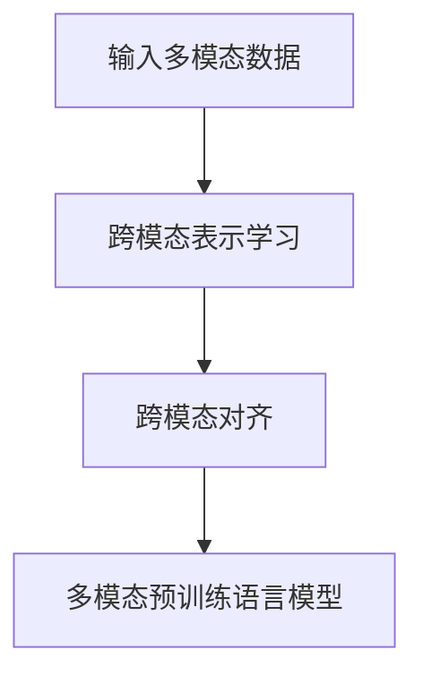

# 多模态大模型：技术原理与实战 基于Transformer的预训练语言模型

## 1. 背景介绍

近年来,随着深度学习技术的飞速发展,大规模预训练语言模型(Pretrained Language Models, PLMs)已经成为自然语言处理(Natural Language Processing, NLP)领域的研究热点。基于 Transformer 架构的预训练语言模型,如 BERT、GPT、XLNet 等,在多个 NLP 任务上取得了显著的性能提升,引领了 NLP 技术的新潮流。

然而,现有的预训练语言模型主要集中在单一模态(如文本)上,忽略了现实世界中大量存在的多模态信息(如图像、视频、音频等)。为了充分利用多模态信息,研究者开始探索多模态大模型(Multimodal Large Models)的构建方法。多模态大模型旨在将不同模态的信息有机结合,实现跨模态的信息理解和生成,具有广阔的应用前景。

本文将深入探讨多模态大模型的技术原理与实战,重点介绍基于 Transformer 的多模态预训练语言模型。我们将从多模态大模型的核心概念出发,详细阐述其算法原理和实现细节,并通过实际项目案例展示多模态大模型的应用价值。

## 2. 核心概念与联系

### 2.1 多模态学习

多模态学习(Multimodal Learning)是指利用来自多个信息源或模态(如文本、图像、音频、视频等)的数据进行机器学习的过程。与单模态学习相比,多模态学习能够充分利用不同模态数据之间的互补信息,提高模型的理解和生成能力。

### 2.2 预训练语言模型

预训练语言模型(Pretrained Language Models)是指在大规模无标注语料上进行自监督学习,从而学习到通用的语言表示的模型。这些模型可以在下游任务上进行微调(Fine-tuning),以适应特定的应用场景。代表性的预训练语言模型包括 BERT、GPT、XLNet 等。

### 2.3 Transformer 架构

Transformer 是一种基于自注意力机制(Self-attention)的神经网络架构,广泛应用于自然语言处理任务中。与传统的循环神经网络(RNN)和卷积神经网络(CNN)相比,Transformer 能够更好地捕捉长距离依赖关系,并支持并行计算,大大提高了模型的训练效率。

### 2.4 多模态预训练语言模型

多模态预训练语言模型(Multimodal Pretrained Language Models)是将预训练语言模型扩展到多模态场景的尝试。这些模型在文本模态的基础上,引入了图像、视频、音频等其他模态的信息,通过跨模态的预训练学习到更加全面和鲁棒的表示。

下图展示了多模态大模型的核心概念与联系:


## 3. 核心算法原理具体操作步骤

多模态预训练语言模型的核心算法包括两个关键步骤:跨模态表示学习和跨模态对齐。

### 3.1 跨模态表示学习

跨模态表示学习的目标是将不同模态的信息映射到一个共享的语义空间中,从而实现跨模态的信息融合。常见的跨模态表示学习方法包括:

1. 基于注意力机制的融合:通过注意力机制动态地调整不同模态特征的权重,实现自适应的跨模态融合。
2. 基于对抗学习的融合:引入对抗学习的思想,通过生成器和判别器的博弈,学习到模态无关的共享表示。
3. 基于知识蒸馏的融合:利用教师模型(如单模态预训练模型)的知识,指导学生模型(多模态模型)学习跨模态表示。

### 3.2 跨模态对齐

跨模态对齐旨在学习不同模态之间的语义对应关系,确保跨模态表示的一致性。常见的跨模态对齐方法包括:

1. 基于对比学习的对齐:通过最大化正样本对的相似度,最小化负样本对的相似度,学习跨模态的语义对齐。
2. 基于重建损失的对齐:通过重建任务(如图像到文本的生成)来学习跨模态的对齐关系。
3. 基于对应关系的对齐:利用不同模态数据之间的对应关系(如图文对齐),显式地学习跨模态的语义对齐。

下图展示了多模态预训练语言模型的核心算法流程:



## 4. 数学模型和公式详细讲解举例说明

### 4.1 注意力机制

注意力机制是 Transformer 架构的核心组件,用于动态地聚焦输入序列的不同部分。给定查询向量 $q$、键向量 $k$ 和值向量 $v$,注意力函数 $Attention(q,k,v)$ 的计算公式为:

$$Attention(q,k,v) = softmax(\frac{qk^T}{\sqrt{d_k}})v$$

其中,$d_k$ 表示键向量的维度,用于缩放点积结果。

### 4.2 多头注意力

多头注意力(Multi-head Attention)通过并行计算多个注意力函数,捕捉输入序列的不同方面的信息。假设有 $h$ 个注意力头,每个头的维度为 $d_h$,多头注意力的计算公式为:

$$MultiHead(Q,K,V) = Concat(head_1, ..., head_h)W^O$$

$$head_i = Attention(QW_i^Q, KW_i^K, VW_i^V)$$

其中,$W_i^Q, W_i^K, W_i^V$ 和 $W^O$ 是可学习的线性变换矩阵。

### 4.3 跨模态对比学习

跨模态对比学习通过最大化正样本对的相似度,最小化负样本对的相似度,学习跨模态的语义对齐。给定一个图文对 $(i,t)$,其对比学习损失函数为:

$$L(i,t) = -log\frac{exp(sim(i,t)/\tau)}{\sum_{t'}exp(sim(i,t')/\tau)}$$

其中,$sim(i,t)$ 表示图像 $i$ 和文本 $t$ 的相似度得分,$\tau$ 是温度超参数,$t'$ 表示负样本文本。

## 5. 项目实践：代码实例和详细解释说明

下面我们通过一个简单的多模态预训练语言模型项目,展示其实现细节。

### 5.1 数据准备

首先,我们需要准备多模态数据集,如图文对齐数据集 COCO。可以使用现有的数据加载器如 `torch.utils.data.DataLoader` 进行数据加载和预处理。

```python
from torch.utils.data import DataLoader
from datasets import load_dataset

# 加载COCO数据集
dataset = load_dataset("coco")
# 数据预处理
def preprocess_function(examples):
    # 对图像进行预处理,如缩放、归一化等
    # 对文本进行预处理,如分词、填充等
    return examples

# 构建数据加载器  
dataloader = DataLoader(dataset.map(preprocess_function, batched=True), 
                        batch_size=32, shuffle=True)
```

### 5.2 模型构建

接下来,我们构建多模态预训练语言模型。这里以 ViLBERT 模型为例,它采用双流 Transformer 架构,分别对图像和文本进行编码,并通过协同注意力实现跨模态交互。

```python
import torch
import torch.nn as nn
from transformers import BertModel, ViTModel

class ViLBERT(nn.Module):
    def __init__(self):
        super().__init__()
        # 图像编码器,使用ViT
        self.image_encoder = ViTModel.from_pretrained('google/vit-base-patch16-224')
        # 文本编码器,使用BERT
        self.text_encoder = BertModel.from_pretrained('bert-base-uncased')
        # 跨模态交互层
        self.cross_modal_attention = nn.MultiheadAttention(embed_dim=768, num_heads=8)
        
    def forward(self, images, texts):
        # 图像编码
        image_embeds = self.image_encoder(images)
        # 文本编码
        text_embeds = self.text_encoder(texts)
        # 跨模态交互
        cross_embeds, _ = self.cross_modal_attention(image_embeds, text_embeds, text_embeds)
        
        return cross_embeds
```

### 5.3 模型训练

最后,我们定义损失函数和优化器,并进行模型训练。这里使用跨模态对比学习损失函数 `ContrastiveLoss`,并采用 AdamW 优化器。

```python
from torch.optim import AdamW

# 实例化模型
model = ViLBERT()
# 定义损失函数
criterion = ContrastiveLoss()
# 定义优化器
optimizer = AdamW(model.parameters(), lr=1e-4)

# 训练循环
for epoch in range(10):
    for batch in dataloader:
        # 获取图像和文本数据
        images, texts = batch['image'], batch['text']
        # 前向传播
        outputs = model(images, texts)
        # 计算损失
        loss = criterion(outputs)
        # 反向传播和优化
        optimizer.zero_grad()
        loss.backward()
        optimizer.step()
        
    print(f"Epoch [{epoch+1}/10], Loss: {loss.item():.4f}")
```

通过以上步骤,我们就可以训练一个基本的多模态预训练语言模型了。当然,实际应用中还需要考虑更多的细节,如数据增强、模型微调、超参数调优等。

## 6. 实际应用场景

多模态大模型在许多实际应用场景中展现出了巨大的潜力,下面列举几个典型的应用方向:

1. 跨模态检索:利用多模态大模型,可以实现图文跨模态检索,如根据文本描述检索相关的图像,或根据图像检索相关的文本。
2. 图像描述生成:多模态大模型可以根据输入的图像,自动生成自然语言描述,实现图像到文本的转换。
3. 视觉问答:给定一张图像和一个相关问题,多模态大模型可以理解图像内容,并根据问题生成恰当的答案。
4. 多模态对话:多模态大模型可以处理包含文本、图像、视频等多种模态的对话,实现更加自然和交互的人机对话系统。
5. 多模态内容生成:利用多模态大模型,可以根据文本描述生成相应的图像、视频等多模态内容,实现跨模态的内容创作。

## 7. 工具和资源推荐

为了方便研究者和开发者快速上手多模态大模型,这里推荐一些常用的工具和资源:

1. Hugging Face Transformers:提供了多种预训练语言模型和跨模态模型的实现,如 BERT、ViLBERT、CLIP 等。
2. OpenAI CLIP:由 OpenAI 开源的跨模态模型,可以实现图文对齐和跨模态检索等任务。
3. MMF:由 Facebook AI 开源的多模态框架,集成了多种多模态模型和数据集,方便研究者进行对比实验。
4. COCO、Flickr30K、VQA:常用的图文对齐和视觉问答数据集,可用于多模态模型的训练和评估。
5. PyTorch、TensorFlow:主流的深度学习框架,提供了丰富的工具和库,方便多模态模型的实现和训练。

## 8. 总结：未来发展趋势与挑战

多模态大模型作为一个新兴的研究方向,展现出了广阔的应用前景和发展潜力。未来,多模态大模型的研究和应用可能呈现以下趋势:

1. 模型规模不断扩大:随着计算力的提升和数据规模的增长,多模态大模型的参数量和训练数据规模将不断扩大,以追求更好的性能。
2. 跨模态任务的多样化:多模态大模型将拓展到更多的跨模态任务,如多模态推理、多模态对话、多模态内容生成等,实现更加全面的跨模态理解和生成能力。
3. 更加高效的训练方法:为了应对多模