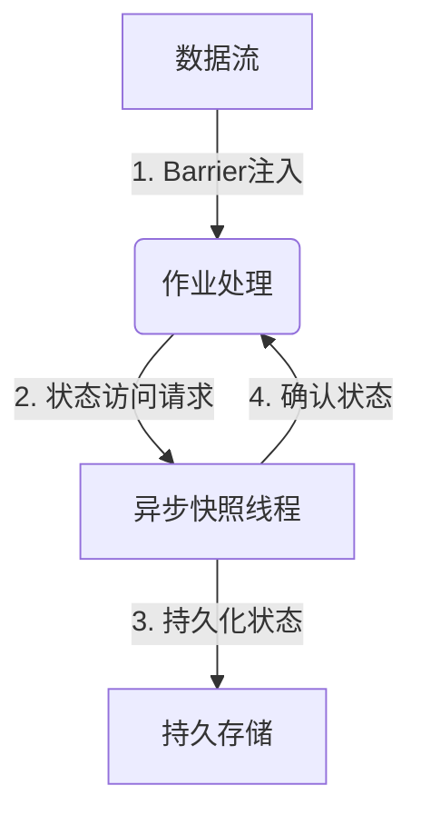

# 大状态小集群?Flink异步Checkpoint内存优化实践

## 1.背景介绍

随着大数据时代的到来,越来越多的企业开始采用流式计算框架来处理实时数据。Apache Flink作为一款开源的分布式流处理框架,凭借其低延迟、高吞吐、精确一次语义等优势,广泛应用于各行各业。然而,在实际生产环境中,Flink作业往往需要维护大量状态,这对集群的内存资源提出了巨大挑战。

Checkpoint机制是Flink实现精确一次语义的关键,它定期将作业的状态持久化到持久存储中,以防止发生故障时数据丢失。但是,传统的Checkpoint机制在处理大状态时存在一些问题,例如占用大量内存、暂停作业处理等,这可能会导致性能下降和资源浪费。为了解决这些问题,Flink社区推出了异步Checkpoint机制,旨在优化大状态场景下的内存使用和性能表现。

## 2.核心概念与联系

### 2.1 Checkpoint

Checkpoint是Flink实现容错和一致性的核心机制。它定期将作业的状态快照保存到持久存储中,以便在发生故障时能够从最近的一致状态恢复。Checkpoint分为两个阶段:

1. **Barrier注入阶段**:源源不断的数据流被注入Barrier记录,标记Checkpoint的开始。
2. **状态快照阶段**:作业的状态被持久化到持久存储中,如HDFS或RocksDB。

### 2.2 异步Checkpoint

传统的Checkpoint机制在处理大状态时存在一些问题,例如:

- **内存开销大**:状态快照需要在内存中构建,对于大状态作业,这可能会导致内存不足。
- **性能下降**:在状态快照期间,作业处理会被暂停,导致延迟增加和吞吐量下降。

为了解决这些问题,Flink引入了异步Checkpoint机制。它将状态快照的构建过程与作业处理解耦,通过异步线程在后台执行状态快照,从而降低对作业处理的影响。

异步Checkpoint的工作原理如下:



1. Barrier注入阶段与传统Checkpoint相同,源源不断的数据流被注入Barrier记录。
2. 在状态快照阶段,作业处理线程将状态访问请求发送给异步快照线程。
3. 异步快照线程负责将状态持久化到持久存储中。
4. 异步快照线程将状态确认发送回作业处理线程,表示状态已成功持久化。

通过这种方式,作业处理线程不再需要等待状态快照的构建,从而降低了延迟和性能影响。

## 3.核心算法原理具体操作步骤

异步Checkpoint的核心算法原理可以分为以下几个步骤:

### 3.1 Barrier注入

1. 作业的Source将Barrier注入到数据流中,标记Checkpoint的开始。
2. Barrier在算子之间传递,每个算子在处理完所有之前的记录后,将自身的状态置为"暂停"状态。

### 3.2 状态访问请求

1. 算子将状态访问请求发送给异步快照线程。
2. 异步快照线程接收状态访问请求,并将其加入请求队列。

### 3.3 异步状态快照

1. 异步快照线程从请求队列中取出状态访问请求。
2. 异步快照线程通过算子提供的快照上下文,获取算子的状态数据。
3. 异步快照线程将状态数据持久化到持久存储中。

### 3.4 状态确认

1. 异步快照线程将状态确认发送回算子。
2. 算子收到状态确认后,将自身的状态置为"活动"状态,继续处理数据流。

### 3.5 Checkpoint完成

1. 所有算子的状态都被成功持久化后,Checkpoint完成。
2. JobManager将Checkpoint元数据持久化到持久存储中。

通过这种方式,异步Checkpoint将状态快照的构建过程与作业处理解耦,从而降低了对作业处理的影响。

## 4.数学模型和公式详细讲解举例说明

在异步Checkpoint中,内存使用是一个关键问题。我们需要合理分配内存资源,以确保作业处理和状态快照都能顺利进行。

假设我们有一个Flink作业,它包含$n$个算子,每个算子维护的状态大小为$s_i(1 \leq i \leq n)$。我们需要为每个算子分配内存空间,以存储它的状态快照。

我们定义一个目标函数$F$,它表示内存使用的总成本:

$$F = \sum_{i=1}^{n}c_i(m_i)$$

其中,$c_i(m_i)$表示第$i$个算子分配$m_i$个内存单元的成本函数。我们假设$c_i(m_i)$是一个凸函数,即当$m_i$增加时,成本也会增加,但增长速率逐渐减小。

我们的目标是找到一组内存分配方案$\{m_1, m_2, \ldots, m_n\}$,使得$F$最小化,同时满足以下约束条件:

$$\sum_{i=1}^{n}m_i \leq M$$
$$m_i \geq s_i, \forall i$$

其中,$M$表示集群的总内存大小,第二个约束条件表示每个算子分配的内存空间必须足以存储它的状态快照。

这是一个典型的约束优化问题,我们可以使用拉格朗日乘数法来求解。定义拉格朗日函数$L$:

$$L = \sum_{i=1}^{n}c_i(m_i) + \lambda\left(\sum_{i=1}^{n}m_i - M\right) + \sum_{i=1}^{n}\mu_i(s_i - m_i)$$

其中,$\lambda$和$\mu_i$是拉格朗日乘数。我们需要求解$L$对$m_i$的偏导数为0时的解:

$$\frac{\partial L}{\partial m_i} = c_i'(m_i) + \lambda - \mu_i = 0, \forall i$$

根据KKT条件,我们可以得到最优解$\{m_1^*, m_2^*, \ldots, m_n^*\}$,它表示了每个算子的最优内存分配方案。

通过这种方式,我们可以在满足状态快照需求的前提下,最小化内存使用的总成本,从而优化异步Checkpoint的性能表现。

## 5.项目实践:代码实例和详细解释说明

为了更好地理解异步Checkpoint的实现,我们以一个简单的WordCount作业为例,展示如何在Flink作业中启用异步Checkpoint。

### 5.1 启用异步Checkpoint

在Flink作业中,我们可以通过`ExecutionCheckpointingOptions.ASYNC_CHECKPOINT.key`配置项来启用异步Checkpoint:

```java
StreamExecutionEnvironment env = StreamExecutionEnvironment.getExecutionEnvironment();
env.setStateBackend(new RocksDBStateBackend("hdfs://namenode:40010/flink/checkpoints"));
env.enableCheckpointing(60000); // 每60秒做一次Checkpoint
env.getCheckpointConfig().setCheckpointingMode(CheckpointingMode.EXACTLY_ONCE);
env.getCheckpointConfig().enableExternalizedCheckpoints(ExternalizedCheckpointCleanup.RETAIN_ON_CANCELLATION);
env.getCheckpointConfig().setAsyncCheckpointingEnabled(true); // 启用异步Checkpoint
```

在上面的代码中,我们首先设置了状态后端为RocksDB,并启用了Checkpoint机制。然后,我们将Checkpoint模式设置为`EXACTLY_ONCE`,以确保精确一次语义。最后,我们通过`setAsyncCheckpointingEnabled(true)`启用了异步Checkpoint。

### 5.2 WordCount作业实现

下面是一个简单的WordCount作业的实现:

```java
DataStream<String> text = env.socketTextStream("localhost", 9999);
DataStream<Tuple2<String, Integer>> wordCounts = text
    .flatMap(new FlatMapFunction<String, Tuple2<String, Integer>>() {
        @Override
        public void flatMap(String value, Collector<Tuple2<String, Integer>> out) {
            String[] words = value.split(" ");
            for (String word : words) {
                out.collect(new Tuple2<>(word, 1));
            }
        }
    })
    .keyBy(0)
    .sum(1);

wordCounts.print();
env.execute("Async Checkpoint WordCount");
```

在这个作业中,我们从Socket中读取文本数据流,将每行文本拆分为单词,并对每个单词计数。最后,我们将结果打印到控制台。

### 5.3 运行作业

我们可以使用以下命令在本地运行这个作业:

```bash
$ nc -lk 9999
hello world
hello flink
```

在另一个终端中,运行Flink作业:

```bash
$ ./bin/flink run /path/to/WordCount.jar
```

作业运行后,我们可以在日志中看到异步Checkpoint的相关信息:

```
2023-05-31 14:12:45,495 INFO  org.apache.flink.runtime.checkpoint.AsyncCheckpointingOperation           - Requesting Checkpoint 1 @ 1685528365495 for job 0fe90a5d3e7d3a9fbf2088e442f4fb0e
2023-05-31 14:12:45,496 INFO  org.apache.flink.runtime.checkpoint.AsyncCheckpointingOperation           - Completed Checkpoint 1 (AsyncCheckpointingOperation=AsyncCheckpointingOperation#1) successfully
```

从日志中我们可以看到,作业成功触发并完成了一次异步Checkpoint。

通过这个示例,我们可以看到在Flink作业中启用异步Checkpoint的方式,以及异步Checkpoint在运行时的行为。

## 6.实际应用场景

异步Checkpoint机制在处理大状态作业时具有显著优势,它可以有效降低内存开销和性能影响。以下是一些典型的应用场景:

### 6.1 实时数据分析

在实时数据分析领域,我们经常需要维护大量的状态,例如会话窗口、机器学习模型等。异步Checkpoint可以确保这些状态在发生故障时不会丢失,同时也不会影响作业的实时性能。

### 6.2 物联网数据处理

物联网设备产生的数据通常具有高吞吐、高延迟等特点。异步Checkpoint可以帮助Flink作业高效地处理这些数据,同时保证数据的一致性和可靠性。

### 6.3 在线机器学习

在线机器学习系统需要持续地从数据流中学习和更新模型。异步Checkpoint可以确保模型状态的持久化和恢复,从而提高系统的容错能力和可靠性。

### 6.4 金融风控

在金融风控领域,我们需要实时监控和分析大量的交易数据,以发现潜在的风险和欺诈行为。异步Checkpoint可以帮助Flink作业高效地处理这些数据,同时确保数据的精确性和一致性。

## 7.工具和资源推荐

在使用异步Checkpoint时,以下工具和资源可能会对您有所帮助:

### 7.1 Flink Web UI

Flink Web UI提供了丰富的监控和调试功能,您可以在其中查看作业的状态、Checkpoint进度等信息,以及调试异步Checkpoint的相关问题。

### 7.2 Flink Metrics

Flink Metrics可以收集和展示作业的各种指标,包括Checkpoint相关的指标。您可以通过监控这些指标来了解异步Checkpoint的性能表现,并及时发现和解决潜在的问题。

### 7.3 Flink社区

Flink拥有一个活跃的开源社区,您可以在社区中寻求帮助、分享经验,或者参与Flink的开发和改进。

### 7.4 Flink官方文档

Flink官方文档提供了详细的介绍和指南,包括异步Checkpoint的配置和使用方法。您可以在文档中找到更多有关异步Checkpoint的信息。

## 8.总结:未来发展趋势与挑战

异步Checkpoint机制为Flink在处理大状态作业时带来了巨大的优势,但它也面临一些挑战和未来发展趋势:

### 8.1 内存管理优化

虽然异步Checkpoint可以降低内存开销,但对于超大状态作业而言,内存管理仍然是一个挑战。未来可能需要引入更加智能的内存管理策略,例如基于工作负载的动态内存分配等。

### 8.