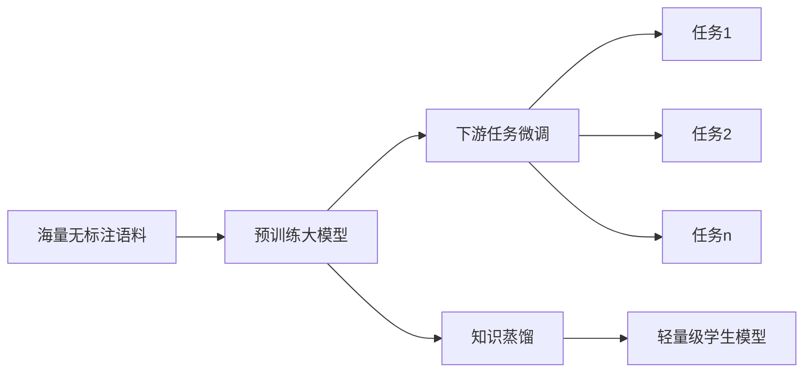

# 大规模语言模型从理论到实践 RefinedWeb

## 1. 背景介绍
### 1.1 大规模语言模型概述
#### 1.1.1 语言模型的定义与发展历程
#### 1.1.2 大规模语言模型的特点与优势
#### 1.1.3 大规模语言模型的代表性工作

### 1.2 RefinedWeb项目介绍  
#### 1.2.1 RefinedWeb的研发背景与目标
#### 1.2.2 RefinedWeb在大规模语言模型领域的创新点
#### 1.2.3 RefinedWeb的整体架构与技术路线

## 2. 核心概念与联系
### 2.1 Transformer模型
#### 2.1.1 Transformer的网络结构与核心思想
#### 2.1.2 Self-Attention机制详解
#### 2.1.3 Transformer在NLP任务中的应用

### 2.2 预训练与微调
#### 2.2.1 预训练的概念与优势  
#### 2.2.2 微调的流程与技巧
#### 2.2.3 预训练-微调范式在工业界的实践

### 2.3 知识蒸馏
#### 2.3.1 知识蒸馏的基本原理
#### 2.3.2 知识蒸馏在模型压缩中的应用
#### 2.3.3 RefinedWeb中的蒸馏技术创新



## 3. 核心算法原理具体操作步骤
### 3.1 RefinedWeb的预训练过程
#### 3.1.1 语料选取与清洗  
#### 3.1.2 文本编码与分词
#### 3.1.3 预训练目标函数设计
#### 3.1.4 训练超参数设置

### 3.2 RefinedWeb的微调流程
#### 3.2.1 下游任务的数据准备
#### 3.2.2 微调的网络结构设计
#### 3.2.3 微调的训练技巧 
#### 3.2.4 模型评估与调优

### 3.3 RefinedWeb的蒸馏方法
#### 3.3.1 软标签蒸馏
#### 3.3.2 注意力蒸馏
#### 3.3.3 多粒度蒸馏
#### 3.3.4 渐进式蒸馏

## 4. 数学模型和公式详细讲解举例说明
### 4.1 Transformer的数学原理
#### 4.1.1 Self-Attention的计算过程
假设输入序列为 $X=(x_1,x_2,...,x_n)$,其中 $x_i \in \mathbb{R}^d$。Self-Attention的计算公式为:

$$
Attention(Q,K,V) = softmax(\frac{QK^T}{\sqrt{d_k}})V
$$

其中，$Q$,$K$,$V$ 分别为查询矩阵、键矩阵和值矩阵，$d_k$为键向量的维度。

#### 4.1.2 前馈网络的计算过程
前馈网络由两个线性变换和一个非线性激活函数组成,其公式为:

$$
FFN(x) = max(0, xW_1 + b_1)W_2 + b_2
$$

其中,$W_1 \in \mathbb{R}^{d_{model} \times d_{ff}}, b_1 \in \mathbb{R}^{d_{ff}}$,$W_2 \in \mathbb{R}^{d_{ff} \times d_{model}}, b_2 \in \mathbb{R}^{d_{model}}$为可学习参数。

### 4.2 预训练目标函数的数学表达
#### 4.2.1 Masked Language Model(MLM)
MLM的目标是根据上下文预测被遮挡的单词,其损失函数定义为:

$$
\mathcal{L}_{MLM} = -\sum_{i \in masked} log P(x_i|x_{\backslash masked}) 
$$

其中,$masked$表示被遮挡位置的集合。

#### 4.2.2 Next Sentence Prediction(NSP)
NSP判断两个句子在原文中是否相邻,其损失函数为:

$$
\mathcal{L}_{NSP} = -log P(y|s_1,s_2)
$$

其中,$y \in \{0,1\}$表示两个句子$s_1$和$s_2$是否相邻。

### 4.3 知识蒸馏的数学原理
#### 4.3.1 软标签蒸馏
软标签蒸馏通过最小化教师模型和学生模型输出分布的KL散度来训练学生模型:

$$
\mathcal{L}_{KD} = \alpha \mathcal{L}_{CE}(y,\sigma(z_s)) + (1-\alpha) \mathcal{L}_{KL}(\sigma(z_t/\tau), \sigma(z_s/\tau))
$$

其中,$\mathcal{L}_{CE}$为交叉熵损失,$\mathcal{L}_{KL}$为KL散度损失,$\sigma$为Softmax函数,$z_t$和$z_s$分别为教师和学生模型的logits,$\tau$为温度超参数。

## 5. 项目实践：代码实例和详细解释说明
### 5.1 预训练代码实例
#### 5.1.1 数据预处理
```python
def load_dataset(args):
  train_data = []
  with open(args.train_data_path, 'r') as f:
    for line in f:
      line = line.strip()
      if len(line) > 0:
        train_data.append(line)
  
  tokenizer = BertTokenizer.from_pretrained(args.model_name)
  
  train_encodings = tokenizer(train_data, truncation=True, padding=True, max_length=args.max_len)
  train_dataset = Dataset(train_encodings)

  return train_dataset, tokenizer
```

以上代码展示了如何加载无标注语料,并使用BERT的分词器进行编码,最终得到用于预训练的Dataset对象。

#### 5.1.2 预训练主循环
```python
model = RefinedWebModel.from_pretrained(args.model_name)
model.to(args.device)

no_decay = ["bias", "LayerNorm.weight"]
optimizer_grouped_parameters = [
  {
    "params": [p for n, p in model.named_parameters() if not any(nd in n for nd in no_decay)],
    "weight_decay": args.weight_decay,
  },
  {
    "params": [p for n, p in model.named_parameters() if any(nd in n for nd in no_decay)],
    "weight_decay": 0.0,
  },
]
optimizer = AdamW(optimizer_grouped_parameters, lr=args.learning_rate)

for epoch in range(args.num_train_epochs):
  model.train()
  for step, batch in enumerate(train_dataloader):
    batch = {k: v.to(args.device) for k, v in batch.items()}
    outputs = model(**batch)
    loss = outputs.loss
    loss.backward()
    
    optimizer.step()
    optimizer.zero_grad()

  model.save_pretrained(args.output_dir)
```

以上代码展示了预训练的主循环,包括模型定义、优化器设置、前向传播、反向传播和参数更新等关键步骤。每个epoch结束后会保存当前模型到指定目录。

### 5.2 微调代码实例
#### 5.2.1 加载预训练模型
```python
model = RefinedWebModel.from_pretrained(args.model_name)
model.to(args.device) 
```

从指定目录加载预训练好的RefinedWeb模型,并将其移动到相应的设备(CPU或GPU)上。

#### 5.2.2 微调主循环
```python
for epoch in range(args.num_train_epochs):
  model.train()
  for step, batch in enumerate(train_dataloader):
    batch = {k: v.to(args.device) for k, v in batch.items()}
    outputs = model(**batch)
    loss = outputs.loss
    loss.backward()
    
    optimizer.step()
    optimizer.zero_grad()
  
  model.eval()
  for step, batch in enumerate(eval_dataloader):
    batch = {k: v.to(args.device) for k, v in batch.items()}
    with torch.no_grad():
      outputs = model(**batch)
    
    predictions = outputs.logits.argmax(dim=-1)
    metric.add_batch(predictions=predictions, references=batch["labels"])
  
  eval_metric = metric.compute()
  print(f"Epoch {epoch}: {eval_metric}")

model.save_pretrained(args.output_dir)  
```

微调主循环与预训练类似,区别在于每个epoch不仅要对训练集进行训练,还要在验证集上进行评估。根据任务的不同,选择合适的评估指标(如准确率、F1等)。最后将微调后的模型保存到指定目录。

### 5.3 知识蒸馏代码实例
#### 5.3.1 定义教师和学生模型
```python
teacher_model = RefinedWebModel.from_pretrained(args.teacher_model)
student_model = RefinedWebModel.from_pretrained(args.student_model)

teacher_model.to(args.device)
student_model.to(args.device)
```

分别加载预训练好的教师模型和学生模型,并将它们移动到设备上。

#### 5.3.2 蒸馏损失函数
```python
def distillation_loss(student_logits, teacher_logits, labels, temperature, alpha):
  soft_loss = F.kl_div(
    F.log_softmax(student_logits/temperature, dim=-1),
    F.softmax(teacher_logits/temperature, dim=-1),
    reduction='batchmean'
  ) * temperature**2
  
  hard_loss = F.cross_entropy(student_logits, labels)

  return alpha * hard_loss + (1-alpha) * soft_loss
```

以上函数定义了软标签蒸馏的损失函数,包括软目标的KL散度损失和硬目标的交叉熵损失,通过超参数`alpha`来控制两种损失的权重。

#### 5.3.3 蒸馏训练主循环
```python
for epoch in range(args.num_train_epochs):
  student_model.train()
  for step, batch in enumerate(train_dataloader):
    batch = {k: v.to(args.device) for k, v in batch.items()}
    
    with torch.no_grad():
      teacher_outputs = teacher_model(**batch)
    
    student_outputs = student_model(**batch)
    
    loss = distillation_loss(
      student_outputs.logits, 
      teacher_outputs.logits, 
      batch['labels'],
      args.temperature,
      args.alpha
    )
    
    loss.backward()
    
    optimizer.step()
    optimizer.zero_grad()

student_model.save_pretrained(args.output_dir)
```

蒸馏训练的主循环与微调类似,不同之处在于需要先用教师模型进行前向传播得到软目标,再用学生模型的输出和教师模型的输出计算蒸馏损失,对学生模型进行优化。最终将蒸馏后的学生模型保存下来。

## 6. 实际应用场景
### 6.1 智能客服
RefinedWeb可以应用于智能客服系统,通过预训练和微调,使系统能够自动理解用户问题并给出相应答复,大大提高客服效率和用户体验。

### 6.2 舆情监测
RefinedWeb可用于社交媒体的舆情监测,通过对海量文本数据进行情感分析、主题聚类等,及时发现舆情热点和负面信息,为决策提供参考。

### 6.3 知识图谱构建
利用RefinedWeb从非结构化文本中抽取实体和关系,辅助构建领域知识图谱,为智能问答、推荐等应用提供知识支持。

### 6.4 机器翻译
RefinedWeb可作为机器翻译系统的语言模型和编码器,与解码器结合实现更加流畅自然的翻译结果。

## 7. 工具和资源推荐
### 7.1 开源代码
- BERT: https://github.com/google-research/bert
- RoBERTa: https://github.com/pytorch/fairseq/tree/master/examples/roberta
- HuggingFace Transformers: https://github.com/huggingface/transformers

### 7.2 数据集
- Wikipedia: https://dumps.wikimedia.org/
- BooksCorpus: https://github.com/soskek/bookcorpus
- Common Crawl: https://commoncrawl.org/

### 7.3 预训练模型
- BERT: https://huggingface.co/bert-base-uncased
- RoBERTa: https://huggingface.co/roberta-base
- ALBERT: https://huggingface.co/albert-base-v2

### 7.4 教程与文档
- Transformer论文: https://arxiv.org/abs/1706.03762
- BERT论文: https://arxiv.org/abs/1810.04805
- Hugging Face Course: https://huggingface.co/course/chapter1/1

## 8. 总结：未来发展趋势与挑战
### 8.1 模型参数量持续增长
预计未来大规模语言模型的参数量还将持续增长,从而获得更强大的语言理解和