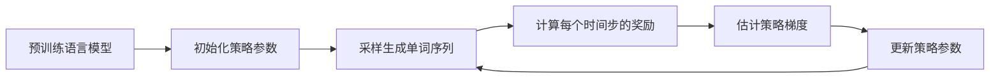

# 大规模语言模型从理论到实践 策略梯度

## 1. 背景介绍

### 1.1 大规模语言模型的发展历程

近年来,随着深度学习技术的快速发展,大规模语言模型(Large Language Models, LLMs)在自然语言处理(Natural Language Processing, NLP)领域取得了突破性进展。从2018年的BERT[1]、GPT[2],到2019年的GPT-2[3],再到2020年的GPT-3[4]和2021年的PaLM[5],语言模型的规模不断扩大,性能也在多个NLP任务上达到了新的高度。这些模型展示了在大规模无监督预训练后,语言模型能够习得丰富的语言知识,具备强大的语言理解和生成能力。

### 1.2 策略梯度在语言模型训练中的应用

尽管目前主流的语言模型大多采用最大似然估计(Maximum Likelihood Estimation, MLE)的方式进行训练,但这种训练范式存在一些局限性,如曝光偏差(Exposure Bias)问题[6]。为了克服这些问题,研究者开始探索强化学习(Reinforcement Learning, RL)在语言模型训练中的应用。其中,策略梯度(Policy Gradient)作为一种经典的强化学习算法,在近期的一些工作中得到了尝试和验证[7,8]。本文将重点介绍如何利用策略梯度算法来训练大规模语言模型,讨论其优势和面临的挑战。

## 2. 核心概念与联系

### 2.1 语言模型

语言模型是一种对语言概率分布进行建模的方法。给定一个单词序列 $x=(x_1,\dots,x_T)$,语言模型的目标是估计该序列的概率 $p(x)$。现代的神经语言模型通常基于Transformer[9]架构,通过自注意力机制建模单词之间的长距离依赖关系。语言模型可以是单向的(如GPT系列),也可以是双向的(如BERT)。

### 2.2 强化学习与策略梯度

强化学习是一种让智能体(Agent)通过与环境交互来学习最优决策的机器学习范式。在强化学习中,策略(Policy)定义了智能体选择动作(Action)的概率分布。策略梯度算法通过优化策略的参数,使得智能体能够在给定状态下选择能获得更高累积奖励的动作。策略梯度定义为策略对数概率关于参数的梯度与累积奖励的乘积的期望[10]。

### 2.3 语言模型训练中的强化学习框架

将强化学习应用于语言模型训练时,可以将语言模型视为智能体,将单词生成过程视为与环境的交互[7,8]。在每个时间步,语言模型根据当前的状态(即之前生成的单词)选择下一个单词作为动作。环境根据生成的单词序列给出一个奖励(如BLEU分数[11]或人工反馈),语言模型的目标是最大化累积奖励,即生成高质量、符合人类偏好的文本。

## 3. 核心算法原理与具体操作步骤

### 3.1 策略梯度算法

假设语言模型的策略为 $\pi_\theta$,其中 $\theta$ 为模型参数。在第 $t$ 时间步,语言模型根据策略 $\pi_\theta$ 选择单词 $x_t$,得到的奖励为 $r_t$。我们定义从第 $t$ 时间步开始的累积奖励为:

$$R_t=\sum_{t'=t}^T \gamma^{t'-t}r_{t'}$$

其中 $\gamma \in [0,1]$ 为折扣因子,用于平衡短期和长期奖励。

策略梯度定义为累积奖励关于策略对数概率的梯度的期望:

$$\nabla_\theta J(\theta)=\mathbb{E}_{\pi_\theta}[\sum_{t=1}^T R_t \nabla_\theta \log \pi_\theta(x_t|x_{<t})]$$

直观地理解,这个梯度鼓励语言模型多生成能获得高累积奖励的单词序列,少生成累积奖励低的单词序列。

### 3.2 基于策略梯度的语言模型训练流程



训练流程如下:

1. 使用无监督预训练(如MLE)得到一个初始的语言模型,作为策略 $\pi_\theta$ 的初始参数。

2. 根据当前策略 $\pi_\theta$ 采样生成一批单词序列 $\{x^{(i)}\}_{i=1}^N$。

3. 对每个生成的单词序列 $x^{(i)}$,计算每个时间步 $t$ 的奖励 $r_t^{(i)}$。奖励可以是序列级别的(如BLEU分数),也可以是词级别的(如人工反馈)。 

4. 根据公式(2)估计策略梯度 $\nabla_\theta J(\theta)$。在实践中,我们通常使用蒙特卡洛估计:

$$\nabla_\theta J(\theta) \approx \frac{1}{N}\sum_{i=1}^N \sum_{t=1}^{T^{(i)}} R_t^{(i)} \nabla_\theta \log \pi_\theta(x_t^{(i)}|x_{<t}^{(i)})$$

5. 使用梯度上升法更新策略参数:

$$\theta \leftarrow \theta + \alpha \nabla_\theta J(\theta)$$

其中 $\alpha$ 为学习率。

6. 重复步骤2-5,直到策略收敛或达到预设的训练轮数。

## 4. 数学模型和公式详细讲解举例说明

为了更好地理解策略梯度算法,我们通过一个简单的例子来说明其数学原理。

考虑一个只有两个单词 $\{x_1,x_2\}$ 的语言模型,其生成一个单词序列 $x=(x_1,x_2)$ 的概率为:

$$p(x)=p(x_1)p(x_2|x_1)$$

假设语言模型的策略为:

$$
\begin{aligned}
\pi_\theta(x_1=1) &= \sigma(\theta_1) \\
\pi_\theta(x_2=1|x_1) &= \sigma(\theta_2 x_1)
\end{aligned}
$$

其中 $\sigma(x)=\frac{1}{1+e^{-x}}$ 为sigmoid函数。

假设生成单词序列 $(1,1)$ 的奖励为1,生成 $(1,0)$ 的奖励为0.5,生成 $(0,1)$ 和 $(0,0)$ 的奖励均为0。

我们可以写出累积奖励的表达式:

$$
\begin{aligned}
R(1,1) &= 1 \\
R(1,0) &= 0.5 \\
R(0,1) = R(0,0) &= 0
\end{aligned}
$$

根据公式(2),策略梯度为:

$$
\begin{aligned}
\nabla_\theta J(\theta) &= \mathbb{E}_{\pi_\theta}[R(x) \nabla_\theta \log \pi_\theta(x)] \\
&= R(1,1) \pi_\theta(1,1) \nabla_\theta \log \pi_\theta(1,1) + R(1,0) \pi_\theta(1,0) \nabla_\theta \log \pi_\theta(1,0) \\
&\quad + R(0,1) \pi_\theta(0,1) \nabla_\theta \log \pi_\theta(0,1) + R(0,0) \pi_\theta(0,0) \nabla_\theta \log \pi_\theta(0,0)
\end{aligned}
$$

展开后可得:

$$
\begin{aligned}
\nabla_{\theta_1} J(\theta) &= \sigma(\theta_1)(1-\sigma(\theta_1))(\sigma(\theta_2)-0.5) \\
\nabla_{\theta_2} J(\theta) &= \sigma(\theta_1)\sigma(\theta_2)(1-\sigma(\theta_2))
\end{aligned}
$$

可以看出,梯度的方向鼓励语言模型提高生成高奖励序列 $(1,1)$ 的概率,降低生成低奖励序列 $(1,0)$ 的概率。通过不断更新参数 $\theta$,语言模型最终会收敛到一个能够生成高质量文本的策略。

## 5. 项目实践:代码实例和详细解释说明

下面我们使用PyTorch实现一个简单的基于策略梯度的语言模型训练示例。

首先定义语言模型:

```python
import torch
import torch.nn as nn
import torch.optim as optim

class LanguageModel(nn.Module):
    def __init__(self, vocab_size, hidden_size):
        super(LanguageModel, self).__init__()
        self.embedding = nn.Embedding(vocab_size, hidden_size)
        self.lstm = nn.LSTM(hidden_size, hidden_size, batch_first=True)
        self.fc = nn.Linear(hidden_size, vocab_size)
        
    def forward(self, x, hidden):
        x = self.embedding(x)
        x, hidden = self.lstm(x, hidden)
        x = self.fc(x)
        return x, hidden
```

这里我们使用了一个简单的LSTM语言模型,其中 `vocab_size` 为词表大小,`hidden_size` 为隐藏层维度。

接下来定义策略梯度训练函数:

```python
def train_pg(model, optimizer, data, num_epochs, batch_size, seq_len, reward_func):
    for epoch in range(num_epochs):
        model.train()
        total_loss = 0
        hidden = None
        for i in range(0, len(data)-batch_size, batch_size):
            batch = data[i:i+batch_size]
            inputs = torch.tensor(batch[:-1])
            targets = torch.tensor(batch[1:])
            
            optimizer.zero_grad()
            outputs, hidden = model(inputs, hidden)
            hidden = (hidden[0].detach(), hidden[1].detach())
            
            probs = nn.functional.softmax(outputs, dim=-1)
            log_probs = torch.log(probs.gather(2, targets.unsqueeze(-1)).squeeze())
            
            rewards = [reward_func(seq.tolist()) for seq in targets]
            rewards = torch.tensor(rewards)
            
            loss = -log_probs * rewards
            loss = loss.mean()
            
            loss.backward()
            optimizer.step()
            
            total_loss += loss.item()
        
        print(f"Epoch {epoch+1}, Loss: {total_loss:.4f}")
```

这里 `data` 为训练数据,`num_epochs` 为训练轮数,`batch_size` 为批大小,`seq_len` 为序列长度,`reward_func` 为奖励函数,用于计算生成序列的奖励。

在每个批次中,我们首先生成输入和目标序列,然后通过语言模型计算输出概率分布。接着我们计算目标序列的对数概率,并根据奖励函数计算每个序列的奖励。最后我们计算策略梯度损失,并进行参数更新。

下面是一个完整的训练示例:

```python
# 准备数据
data = [...]  # 训练数据
vocab_size = ...  # 词表大小

# 定义奖励函数
def reward_func(seq):
    # 计算生成序列的奖励,如BLEU分数
    return bleu(seq, ref_seqs)

# 初始化模型和优化器    
model = LanguageModel(vocab_size, hidden_size=128)
optimizer = optim.Adam(model.parameters(), lr=0.01)

# 训练模型
train_pg(model, optimizer, data, num_epochs=10, batch_size=32, seq_len=20, reward_func=reward_func)
```

通过合适地定义奖励函数,我们可以引导语言模型学习生成特定风格或主题的文本,如新闻、诗歌、对话等。

## 6. 实际应用场景

基于策略梯度的语言模型训练在以下场景中有广泛的应用前景:

1. 文本生成:通过设计合适的奖励函数,可以训练语言模型生成特定风格、主题或语义的文本,如新闻报道、产品评论、诗歌等。

2. 对话系统:在对话系统中,可以使用策略梯度训练语言模型根据上下文生成连贯、相关且吸引人的回复,提高对话质量和用户体验。

3. 机器翻译:传统的机器翻译模型通常使用MLE训练,存在曝光偏差等问题。使用策略梯度可以直接优化翻译质量评价指标(如BLEU),生成更加流畅、准确的翻译结果。

4. 文本摘要:在文本摘要任务中,策略梯度可以帮助语言模型学习生成简