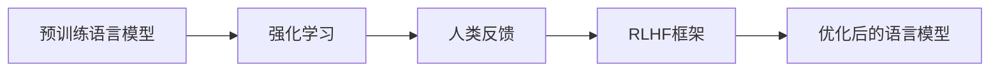

# 大语言模型原理与工程实践：RLHF 实战框架

## 1. 背景介绍
### 1.1 大语言模型的发展历程
#### 1.1.1 早期的语言模型
#### 1.1.2 Transformer 的出现
#### 1.1.3 预训练语言模型的崛起
### 1.2 RLHF 技术的提出
#### 1.2.1 RLHF 的起源
#### 1.2.2 RLHF 的核心思想
#### 1.2.3 RLHF 的优势与挑战
### 1.3 RLHF 在大语言模型中的应用
#### 1.3.1 RLHF 与大语言模型的结合
#### 1.3.2 RLHF 在对话生成中的应用
#### 1.3.3 RLHF 在其他自然语言处理任务中的应用

## 2. 核心概念与联系
### 2.1 大语言模型
#### 2.1.1 语言模型的定义
#### 2.1.2 大语言模型的特点
#### 2.1.3 大语言模型的训练方法
### 2.2 强化学习
#### 2.2.1 强化学习的基本概念
#### 2.2.2 马尔可夫决策过程
#### 2.2.3 价值函数与策略梯度
### 2.3 人类反馈
#### 2.3.1 人类反馈的重要性
#### 2.3.2 人类反馈的类型
#### 2.3.3 人类反馈的收集与处理
### 2.4 RLHF 框架
#### 2.4.1 RLHF 的核心组件
#### 2.4.2 RLHF 的训练流程
#### 2.4.3 RLHF 与传统强化学习的区别



## 3. 核心算法原理具体操作步骤
### 3.1 预训练阶段
#### 3.1.1 数据准备
#### 3.1.2 模型架构选择
#### 3.1.3 预训练目标函数
### 3.2 强化学习阶段
#### 3.2.1 环境设置
#### 3.2.2 奖励函数设计
#### 3.2.3 策略网络更新
### 3.3 人类反馈阶段
#### 3.3.1 反馈数据收集
#### 3.3.2 反馈数据清洗与标注
#### 3.3.3 反馈信号融合
### 3.4 模型微调阶段
#### 3.4.1 微调数据准备
#### 3.4.2 微调目标函数设计
#### 3.4.3 模型参数更新

## 4. 数学模型和公式详细讲解举例说明
### 4.1 语言模型的概率公式
$$P(w_1, w_2, ..., w_n) = \prod_{i=1}^n P(w_i | w_1, w_2, ..., w_{i-1})$$
其中，$w_i$ 表示第 $i$ 个单词，$P(w_i | w_1, w_2, ..., w_{i-1})$ 表示给定前 $i-1$ 个单词的情况下，第 $i$ 个单词的条件概率。

### 4.2 强化学习的价值函数
$$V^{\pi}(s) = \mathbb{E}_{\pi}[\sum_{t=0}^{\infty} \gamma^t r_t | s_0 = s]$$
其中，$V^{\pi}(s)$ 表示在状态 $s$ 下，遵循策略 $\pi$ 的期望累积奖励，$\gamma$ 是折扣因子，$r_t$ 是在时间步 $t$ 获得的奖励。

### 4.3 策略梯度定理
$$\nabla_{\theta} J(\theta) = \mathbb{E}_{\tau \sim \pi_{\theta}}[\sum_{t=0}^{T} \nabla_{\theta} \log \pi_{\theta}(a_t|s_t) Q^{\pi_{\theta}}(s_t, a_t)]$$
其中，$J(\theta)$ 是策略 $\pi_{\theta}$ 的期望累积奖励，$\tau$ 是从策略 $\pi_{\theta}$ 采样得到的轨迹，$Q^{\pi_{\theta}}(s_t, a_t)$ 是在状态 $s_t$ 下采取动作 $a_t$ 的动作值函数。

### 4.4 人类反馈的损失函数
$$L(\theta) = -\sum_{i=1}^{N} y_i \log p_{\theta}(x_i) + (1 - y_i) \log (1 - p_{\theta}(x_i))$$
其中，$y_i$ 是人类对样本 $x_i$ 的反馈标签（0 或 1），$p_{\theta}(x_i)$ 是模型对样本 $x_i$ 的预测概率。

## 5. 项目实践：代码实例和详细解释说明
### 5.1 预训练阶段代码示例
```python
import torch
from transformers import GPT2LMHeadModel, GPT2Tokenizer

# 加载预训练模型和分词器
model = GPT2LMHeadModel.from_pretrained('gpt2')
tokenizer = GPT2Tokenizer.from_pretrained('gpt2')

# 准备训练数据
texts = [...]  # 文本数据列表
encoded_texts = tokenizer(texts, padding=True, truncation=True, return_tensors='pt')

# 定义优化器和损失函数
optimizer = torch.optim.Adam(model.parameters(), lr=1e-5)
loss_fn = torch.nn.CrossEntropyLoss()

# 训练循环
for epoch in range(num_epochs):
    for batch in data_loader:
        input_ids = batch['input_ids']
        attention_mask = batch['attention_mask']
        labels = batch['labels']
        
        outputs = model(input_ids, attention_mask=attention_mask, labels=labels)
        loss = outputs.loss
        
        optimizer.zero_grad()
        loss.backward()
        optimizer.step()
```

以上代码示例展示了使用 Hugging Face 的 Transformers 库进行 GPT-2 模型的预训练过程。首先加载预训练的 GPT-2 模型和分词器，然后准备训练数据，将文本数据转换为模型可接受的输入格式。接下来定义优化器和损失函数，最后在训练循环中进行前向传播、损失计算和反向传播，更新模型参数。

### 5.2 强化学习阶段代码示例
```python
import gym
import torch
import numpy as np
from transformers import GPT2LMHeadModel, GPT2Tokenizer

# 加载预训练的语言模型
model = GPT2LMHeadModel.from_pretrained('gpt2')
tokenizer = GPT2Tokenizer.from_pretrained('gpt2')

# 定义强化学习环境
env = gym.make('TextGeneration-v0')

# 定义奖励函数
def reward_function(generated_text, reference_text):
    # 计算生成文本和参考文本之间的相似度作为奖励
    similarity = ...
    return similarity

# 强化学习训练循环
for episode in range(num_episodes):
    state = env.reset()
    done = False
    
    while not done:
        # 使用语言模型生成文本
        input_ids = tokenizer.encode(state, return_tensors='pt')
        output = model.generate(input_ids, max_length=100, num_return_sequences=1)
        generated_text = tokenizer.decode(output[0], skip_special_tokens=True)
        
        # 计算奖励
        reward = reward_function(generated_text, reference_text)
        
        # 更新语言模型参数
        model.zero_grad()
        loss = -reward * torch.log(model(input_ids).logits.softmax(dim=-1)[0, -1])
        loss.backward()
        optimizer.step()
        
        # 更新环境状态
        state, _, done, _ = env.step(generated_text)
```

以上代码示例展示了如何将预训练的语言模型与强化学习结合，用于文本生成任务。首先加载预训练的 GPT-2 模型和分词器，然后定义强化学习环境和奖励函数。在训练循环中，使用语言模型生成文本，计算生成文本与参考文本之间的相似度作为奖励，并利用奖励更新语言模型的参数。通过不断与环境交互并优化语言模型，使其生成的文本更加符合预期。

### 5.3 人类反馈阶段代码示例
```python
import torch
from transformers import GPT2LMHeadModel, GPT2Tokenizer

# 加载预训练的语言模型
model = GPT2LMHeadModel.from_pretrained('gpt2')
tokenizer = GPT2Tokenizer.from_pretrained('gpt2')

# 准备人类反馈数据
human_feedback_data = [...]  # 人类反馈数据列表，每个元素为 (input_text, feedback_label) 的元组

# 定义损失函数
loss_fn = torch.nn.BCEWithLogitsLoss()

# 人类反馈训练循环
for epoch in range(num_epochs):
    for batch in feedback_data_loader:
        input_ids = batch['input_ids']
        attention_mask = batch['attention_mask']
        feedback_labels = batch['feedback_labels']
        
        outputs = model(input_ids, attention_mask=attention_mask)
        logits = outputs.logits[:, -1]
        
        loss = loss_fn(logits, feedback_labels)
        
        optimizer.zero_grad()
        loss.backward()
        optimizer.step()
```

以上代码示例展示了如何将人类反馈信息融入语言模型的训练过程。首先加载预训练的 GPT-2 模型和分词器，然后准备人类反馈数据，每个数据样本包含输入文本和对应的反馈标签（0 或 1）。在训练循环中，将输入文本传入语言模型，获取最后一个时间步的输出 logits，并使用二元交叉熵损失函数计算 logits 与反馈标签之间的损失。通过反向传播和优化器更新模型参数，使语言模型逐渐适应人类反馈，生成更加符合人类偏好的文本。

## 6. 实际应用场景
### 6.1 智能对话系统
RLHF 框架可以应用于构建智能对话系统，通过强化学习和人类反馈不断优化对话模型，使其生成更加自然、流畅和符合人类偏好的对话响应。这在客户服务、虚拟助手等场景中有广泛应用。

### 6.2 内容生成
RLHF 框架可以用于各种内容生成任务，如新闻写作、故事创作、广告文案生成等。通过强化学习和人类反馈，模型可以学习生成更加吸引人、有创意和符合特定风格的内容。

### 6.3 个性化推荐
RLHF 框架可以应用于个性化推荐系统，通过强化学习和用户反馈不断优化推荐模型，生成更加符合用户兴趣和偏好的推荐结果。这在电商、社交媒体、新闻推荐等场景中有广泛应用。

### 6.4 智能教育
RLHF 框架可以用于开发智能教育系统，通过强化学习和学生反馈不断优化教学策略和内容生成模型，提供个性化的学习体验和智能化的教学辅导。

## 7. 工具和资源推荐
### 7.1 开源框架
- Hugging Face Transformers：提供了丰富的预训练语言模型和强大的 NLP 工具包。
- OpenAI Gym：强化学习环境和算法的标准化接口。
- Stable Baselines：基于 OpenAI Gym 的强化学习算法集合。

### 7.2 数据集
- OpenAI GPT-3 数据集：大规模的文本数据集，适用于语言模型的预训练。
- GLUE 基准测试：自然语言理解任务的评测基准，包含多个数据集。
- PersonaChat：对话数据集，包含个性化的对话内容。

### 7.3 学习资源
- 《Reinforcement Learning: An Introduction》：强化学习经典教材，全面介绍强化学习的基本概念和算法。
- 《Deep Reinforcement Learning Hands-On》：实践性强的强化学习教程，提供了多个项目实例。
- 《Natural Language Processing with Transformers》：使用 Transformers 库进行自然语言处理的实用指南。

## 8. 总结：未来发展趋势与挑战
### 8.1 大语言模型的持续优化
随着计算能力的提升和数据规模的增长，大语言模型将继续得到优化和改进。未来的语言模型将具有更强的语言理解和生成能力，能够处理更加复杂和多样化的任务。

### 8.2 强化学习算法的创新
强化学习领域的研究将不断深入，新的算法和技术将不断涌现。未来的强化学习算法将更加高效、稳