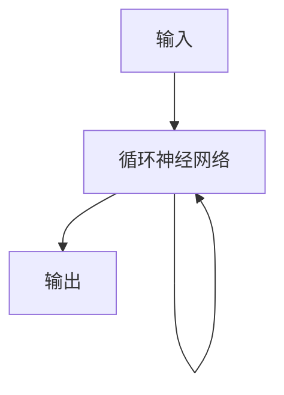
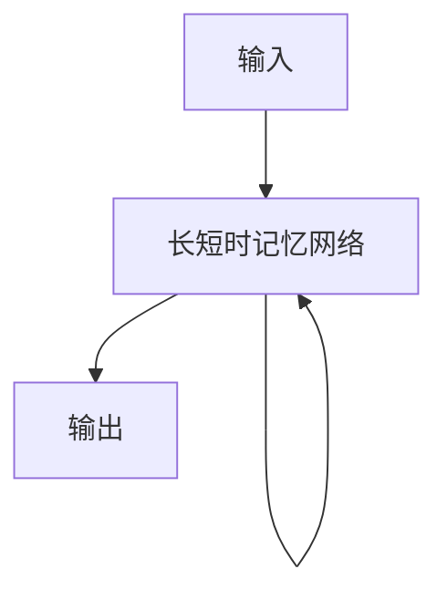
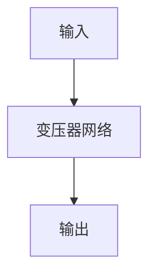

## 1. 背景介绍

自然语言处理（NLP）是人工智能领域的一个重要分支，它涉及到计算机如何理解和处理人类语言。在NLP中，语言模型是一个重要的概念，它是一种用于预测下一个单词或字符的概率分布的数学模型。近年来，随着深度学习技术的发展，大型语言模型（LM）已经成为了NLP领域的热门研究方向。大型语言模型可以通过学习大量的文本数据来生成高质量的自然语言文本，这对于机器翻译、语音识别、文本生成等任务都有着重要的应用价值。

然而，随着大型语言模型的发展，人们也开始关注它们的有害性。一些研究表明，大型语言模型可能会带来一些负面影响，例如歧视性、误导性、不当内容等。因此，了解大型语言模型的原理和有害性，对于我们更好地应用和管理这些模型都是非常重要的。

本文将介绍大型语言模型的基础原理和前沿技术，探讨它们的有害性，并提供一些应对策略和未来发展趋势的展望。

## 2. 核心概念与联系

### 2.1 语言模型

语言模型是一种用于预测下一个单词或字符的概率分布的数学模型。在NLP中，语言模型通常用于自然语言生成、机器翻译、语音识别等任务中。语言模型可以通过学习大量的文本数据来建立，其中最常用的方法是n-gram模型和神经网络模型。

### 2.2 大型语言模型

大型语言模型是指使用大量文本数据训练的语言模型。这些模型通常使用神经网络模型，例如循环神经网络（RNN）、长短时记忆网络（LSTM）和变压器网络（Transformer）等。大型语言模型可以生成高质量的自然语言文本，例如文章、对话、诗歌等。

### 2.3 有害性

大型语言模型的有害性主要包括以下几个方面：

- 歧视性：大型语言模型可能会学习到一些歧视性的语言模式，例如性别歧视、种族歧视等。
- 误导性：大型语言模型可能会生成一些误导性的文本，例如虚假新闻、不实言论等。
- 不当内容：大型语言模型可能会生成一些不当的内容，例如暴力、色情、仇恨等。

## 3. 核心算法原理具体操作步骤

### 3.1 循环神经网络（RNN）

循环神经网络是一种常用的神经网络模型，它可以处理序列数据，例如文本、音频、视频等。循环神经网络的核心思想是将前一个时间步的输出作为当前时间步的输入，从而实现对序列数据的建模。

循环神经网络的基本结构如下图所示：



循环神经网络的训练过程通常使用反向传播算法，通过最小化损失函数来优化模型参数。

### 3.2 长短时记忆网络（LSTM）

长短时记忆网络是一种特殊的循环神经网络，它可以解决传统循环神经网络中的梯度消失和梯度爆炸问题。长短时记忆网络的核心思想是引入了三个门控单元，分别是输入门、遗忘门和输出门，用于控制信息的输入、遗忘和输出。

长短时记忆网络的基本结构如下图所示：



长短时记忆网络的训练过程也通常使用反向传播算法，通过最小化损失函数来优化模型参数。

### 3.3 变压器网络（Transformer）

变压器网络是一种新型的神经网络模型，它可以处理序列数据，例如文本、音频、视频等。变压器网络的核心思想是引入了自注意力机制，用于捕捉序列数据中的长距离依赖关系。

变压器网络的基本结构如下图所示：



变压器网络的训练过程也通常使用反向传播算法，通过最小化损失函数来优化模型参数。

## 4. 数学模型和公式详细讲解举例说明

### 4.1 语言模型

语言模型可以表示为一个条件概率分布，即给定前面的单词或字符，预测下一个单词或字符的概率。假设$w_1,w_2,...,w_n$表示一个长度为$n$的文本序列，$P(w_i|w_1,w_2,...,w_{i-1})$表示给定前面的单词或字符，预测下一个单词或字符的概率，则语言模型可以表示为：

$$P(w_1,w_2,...,w_n)=\prod_{i=1}^{n}P(w_i|w_1,w_2,...,w_{i-1})$$

### 4.2 大型语言模型

大型语言模型通常使用神经网络模型，例如循环神经网络、长短时记忆网络和变压器网络等。以变压器网络为例，它的核心公式如下：

$$Attention(Q,K,V)=softmax(\frac{QK^T}{\sqrt{d_k}})V$$

其中，$Q,K,V$分别表示查询、键和值，$d_k$表示键的维度。这个公式表示了变压器网络中的自注意力机制，用于捕捉序列数据中的长距离依赖关系。

## 5. 项目实践：代码实例和详细解释说明

### 5.1 语言模型

以n-gram模型为例，下面是一个简单的Python代码实现：

```python
import nltk
from nltk.util import ngrams

# 读取文本数据
text = "This is a test sentence."

# 将文本数据转换为单词列表
words = nltk.word_tokenize(text)

# 计算2-gram模型
n = 2
ngrams = list(ngrams(words, n))

# 输出2-gram模型
print(ngrams)
```

### 5.2 大型语言模型

以GPT-2模型为例，下面是一个简单的Python代码实现：

```python
import torch
import transformers

# 加载GPT-2模型
model = transformers.GPT2LMHeadModel.from_pretrained('gpt2')

# 输入文本
input_text = "This is a test sentence."

# 将文本转换为张量
input_ids = torch.tensor(model.tokenizer.encode(input_text)).unsqueeze(0)

# 生成文本
output = model.generate(input_ids, max_length=50, do_sample=True)

# 输出生成的文本
print(model.tokenizer.decode(output[0], skip_special_tokens=True))
```

## 6. 实际应用场景

大型语言模型在自然语言处理领域有着广泛的应用，例如：

- 机器翻译：使用大型语言模型可以实现高质量的机器翻译。
- 文本生成：使用大型语言模型可以生成高质量的自然语言文本，例如文章、对话、诗歌等。
- 语音识别：使用大型语言模型可以提高语音识别的准确率。

## 7. 工具和资源推荐

以下是一些常用的大型语言模型工具和资源：

- TensorFlow：一个常用的深度学习框架，支持大型语言模型的训练和应用。
- PyTorch：另一个常用的深度学习框架，支持大型语言模型的训练和应用。
- Hugging Face：一个提供预训练模型和NLP工具的平台，支持多种大型语言模型的应用。

## 8. 总结：未来发展趋势与挑战

大型语言模型是NLP领域的热门研究方向，未来的发展趋势包括：

- 模型规模的增大：随着计算资源的增加，大型语言模型的规模将会越来越大。
- 多模态语言模型的发展：多模态语言模型可以处理多种类型的数据，例如文本、图像、音频等。
- 有害性的解决：解决大型语言模型的有害性是未来的一个重要挑战。

## 9. 附录：常见问题与解答

Q: 大型语言模型有哪些应用场景？

A: 大型语言模型在自然语言处理领域有着广泛的应用，例如机器翻译、文本生成、语音识别等。

Q: 大型语言模型有哪些有害性？

A: 大型语言模型的有害性主要包括歧视性、误导性、不当内容等。

Q: 如何解决大型语言模型的有害性？

A: 解决大型语言模型的有害性是一个重要的挑战，可以采取一些策略，例如数据清洗、模型解释、模型监控等。