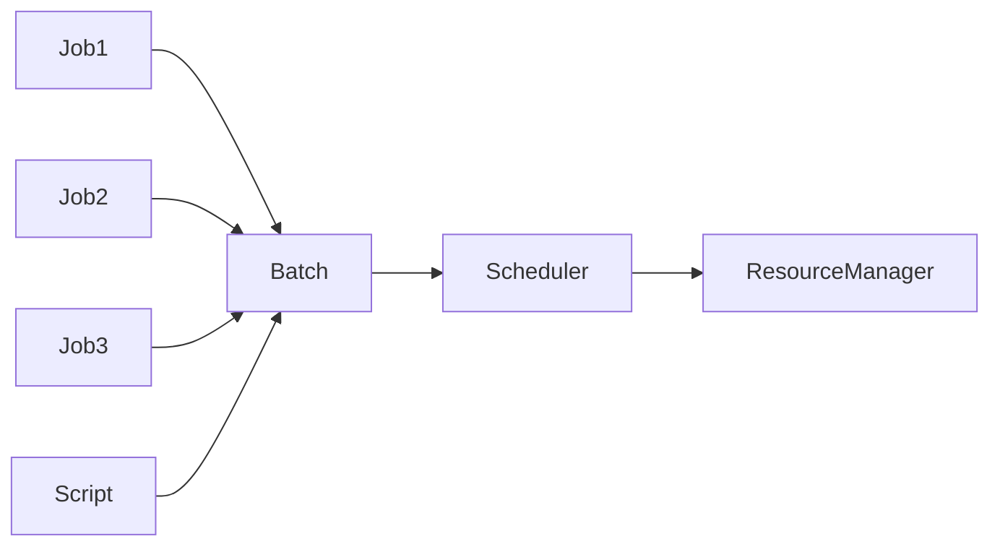

# 批处理 原理与代码实例讲解

## 1.背景介绍

### 1.1 批处理的定义与起源
批处理(Batch Processing)是一种非交互式的数据处理方式,它允许用户将一系列任务打包成一个"批次",然后由计算机自动执行,无需人工干预。这种处理模式起源于早期的计算机系统,当时的计算资源非常有限,通过将任务排队并批量执行,可以提高系统的吞吐量和效率。

### 1.2 批处理的应用场景
批处理在现代计算机系统中仍然扮演着重要的角色,尤其适用于以下场景:

- 定期执行的任务:如数据备份、系统维护等
- 大规模数据处理:如数据挖掘、科学计算等  
- 资源密集型任务:如视频渲染、代码编译等
- 业务流程自动化:如订单处理、工资结算等

### 1.3 批处理的优缺点分析
批处理的主要优点包括:

- 自动化程度高,减少人工干预
- 可以充分利用系统资源,提高效率
- 任务调度灵活,可根据优先级安排
- 易于管理和监控

批处理的缺点则包括:

- 实时性差,不适合交互式应用
- 出错后果严重,可能导致整批数据丢失
- 调试困难,出错时不易定位

## 2.核心概念与联系

### 2.1 作业(Job)
在批处理系统中,一个作业(Job)就是一个独立的任务单元。它包含了要执行的程序、所需的输入数据以及期望的输出结果。多个作业可以组成一个批次(Batch)。

### 2.2 作业控制语言(JCL)
作业控制语言(Job Control Language,JCL)是一种特殊的命令语言,用于描述作业的执行环境和流程。通过JCL,用户可以指定作业的资源需求、执行顺序、输入输出等。不同的批处理系统支持不同的JCL语法。

### 2.3 调度器(Scheduler)  
调度器(Scheduler)是批处理系统的核心组件,负责管理和调度作业的执行。它根据作业的优先级、资源需求等因素,决定作业的执行顺序和时机。常见的调度算法有先来先服务(FCFS)、短作业优先(SJF)等。

### 2.4 脚本(Script)
在现代的批处理场景中,通常使用脚本(Script)来描述和执行批处理任务。脚本语言如Shell、Python、PowerShell等提供了强大的功能,使得编写批处理脚本变得简单高效。

### 2.5 概念联系
下面是一个简单的示意图,展示了上述核心概念之间的联系:



## 3.核心算法原理具体操作步骤

### 3.1 批处理的一般步骤

1. 提交作业:用户将一批作业提交给批处理系统。
2. 作业入队:调度器将作业放入队列,等待调度。
3. 资源分配:调度器为作业分配所需的系统资源。
4. 作业执行:作业开始执行,直到完成或异常中止。
5. 结果输出:作业的执行结果被输出到指定位置。
6. 作业出队:完成的作业被从队列中移除。

### 3.2 先来先服务(FCFS)调度算法

1. 作业按照提交的时间顺序排队。 
2. 调度器总是选择队首的作业执行。
3. 一个作业执行完毕后,才会调度下一个作业。

特点:简单易行,但不考虑作业的紧迫程度和资源需求。

### 3.3 短作业优先(SJF)调度算法

1. 调度器根据作业的预估执行时间排序。
2. 优先调度执行时间最短的作业。 
3. 若有新提交的更短作业,可抢占当前作业。

特点:平均等待时间最优,但需要预知作业执行时间。

### 3.4 优先级调度算法

1. 为每个作业指定一个优先级。
2. 调度器总是选择优先级最高的作业执行。
3. 可根据作业的紧迫程度、资源需求等动态调整优先级。

特点:可根据实际需求灵活控制作业的执行顺序。

## 4.数学模型和公式详细讲解举例说明

### 4.1 批处理系统的数学描述
我们可以用一个五元组来描述批处理系统:
$$S={J,R,S,O,C}$$

其中:
- $J$:提交的作业集合
- $R$:系统的资源集合
- $S$:调度器的调度策略
- $O$:输出结果的集合
- $C$:作业执行的约束条件

### 4.2 调度算法的数学建模
以短作业优先(SJF)算法为例,假设有$n$个作业,第$i$个作业的执行时间为$t_i$,则平均等待时间$T_w$为:

$$T_w=\frac{1}{n}\sum_{i=1}^{n}\sum_{j=1}^{i-1}t_j$$

例如,有三个作业,执行时间分别为2、5、1,则平均等待时间为:

$$T_w=((0)+(2)+(2+5))/3=3$$

### 4.3 优先级调度的数学描述
假设有$n$个作业,第$i$个作业的优先级为$p_i$,优先级越大,数值越小。则在优先级调度下,作业的执行顺序满足:

$$p_1 \leq p_2 \leq ... \leq p_n$$

例如,有三个作业,优先级分别为3、1、2,则执行顺序为:作业2、作业3、作业1。

## 5.项目实践:代码实例和详细解释说明

下面是一个使用Python编写的简单批处理脚本示例:

```python
import os
import time

# 定义作业类
class Job:
    def __init__(self, name, command):
        self.name = name
        self.command = command

    def run(self):
        print(f"作业{self.name}开始执行...")
        os.system(self.command)
        print(f"作业{self.name}执行完毕。")

# 定义批处理类  
class BatchProcessor:
    def __init__(self):
        self.jobs = []

    def add_job(self, job):
        self.jobs.append(job)

    def run(self):
        for job in self.jobs:
            job.run()
            time.sleep(1)

# 创建批处理器实例
processor = BatchProcessor()

# 添加作业
processor.add_job(Job("备份数据", "backup.sh"))
processor.add_job(Job("生成报表", "report.py"))  
processor.add_job(Job("发送邮件", "send_email.py"))

# 执行批处理
processor.run()
```

这个示例定义了一个`Job`类来表示单个作业,包含了作业的名称和要执行的命令。`BatchProcessor`类则表示批处理器,维护一个作业列表,并提供添加和执行作业的方法。

在实际使用时,我们创建一个`BatchProcessor`实例,然后通过`add_job`方法添加多个`Job`实例。最后,调用`run`方法执行整个批处理过程。

这个示例只是一个简单的演示,实际的批处理系统要复杂得多。但核心思想是一致的:将多个任务打包成批次,然后依次执行,中间可以添加必要的逻辑控制。

## 6.实际应用场景

批处理在实际开发中有广泛的应用,下面是一些常见的场景:

### 6.1 数据ETL
ETL(Extract-Transform-Load)是数据仓库中的一个重要概念,批处理通常用于实现ETL流程的自动化。如从业务数据库中提取数据,经过清洗转换,最终加载到数据仓库。

### 6.2 机器学习模型训练
训练机器学习模型通常需要处理大量数据,这非常适合使用批处理。可以将数据集分批次输入到模型中进行训练,提高资源利用率。

### 6.3 财务系统
在财务系统中,如工资结算、账单生成等任务通常以批处理的方式运行。这些任务往往有严格的时间要求,使用批处理可以确保及时完成。

### 6.4 日志分析
Web服务器、应用程序会生成大量的日志数据,使用批处理可以定期对这些日志进行分析,生成统计报告,发现潜在问题。

### 6.5 自动化部署
在持续集成/持续部署(CI/CD)的场景下,批处理脚本可用于自动化构建、测试、部署等环节,提高开发效率。

## 7.工具和资源推荐

### 7.1 批处理工具
- IBM z/OS:大型机上的经典批处理系统。 
- Spring Batch:Java平台上的开源批处理框架。
- AWS Batch:亚马逊云平台提供的批处理服务。
- Azure Batch:微软云平台提供的批处理服务。

### 7.2 脚本语言
- Shell:Linux/Unix环境下的常用脚本语言。
- Python:通用脚本语言,生态丰富,适合数据处理。
- PowerShell:Windows环境下的脚本语言,也可跨平台使用。

### 7.3 学习资源
- 《批处理系统设计》:介绍批处理系统的经典书籍。
- 《Spring Batch in Action》:Spring Batch的实战指南。
- 《数据密集型应用系统设计》:讨论了批处理在大规模数据处理中的应用。

## 8.总结:未来发展趋势与挑战

### 8.1 云化与无服务器化
随着云计算的普及,批处理工作负载也逐步迁移到云端。各大云平台提供的无服务器计算服务(如AWS Lambda、Azure Functions),使得运行批处理任务变得更加方便和经济。

### 8.2 实时化趋势
虽然批处理擅长处理大规模数据,但在实时性要求越来越高的今天,如何缩短数据的处理延迟,将批处理与实时处理有机结合,是一个值得探索的方向。Lambda架构和Kappa架构就是面向这一问题的解决方案。

### 8.3 批流一体化
传统的批处理和流处理是两个独立的领域,但现代的大数据处理框架如Spark、Flink,提供了同时支持批处理和流处理的能力。这种批流一体化的趋势,使得数据处理的架构更加统一和简洁。

### 8.4 与机器学习的结合
机器学习是批处理的一个重要应用场景,但同时也对批处理系统提出了新的挑战。如何高效处理海量的训练数据?如何支持复杂的数据依赖?如何实现模型的增量更新?这些都是值得关注的问题。

### 8.5 数据治理与安全
批处理往往涉及对大规模数据的处理,如何加强数据的治理和安全?如何防止敏感数据泄露?如何保证数据处理的合规性?这些问题需要在批处理系统的设计中予以考虑。

## 9.附录:常见问题与解答

### 9.1 批处理与实时处理的区别是什么?
批处理是对一批数据进行离线处理,实时处理则是对数据进行实时的流式处理。二者在时效性、数据量、处理方式上有所不同,但也可以结合使用,形成一个完整的数据处理系统。

### 9.2 批处理会不会被实时处理取代?
不会。尽管实时处理越来越重要,但在处理历史数据、生成全量报表等场景下,批处理仍然是不可或缺的。未来批处理与实时处理会更加紧密地结合,而不是此消彼长。

### 9.3 什么样的作业适合使用批处理?
对实时性要求不高、数据量大、处理时间长的作业适合使用批处理。如果作业对时效性要求高,或处理的是持续产生的数据流,则更适合使用实时处理。

### 9.4 如何保证批处理作业的稳定性?
可以从以下几方面入手:

1. 充分测试,覆盖各种异常场景。
2. 添加必要的日志和监控。
3. 合理设置重试和告警机制。
4. 定期检查和清理系统资源。
5. 建立完善的应急预案。

### 9.5 批处