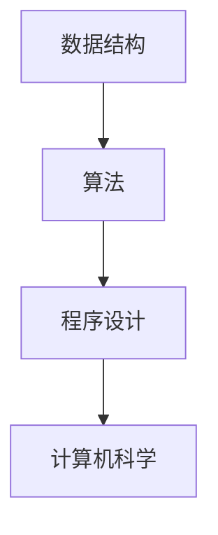

## 1. 背景介绍

数据结构和算法是计算机科学中最基础的概念之一，它们是计算机程序设计的基础。数据结构是指数据的组织方式，而算法是指解决问题的方法。在计算机科学中，数据结构和算法的研究是非常重要的，因为它们可以帮助我们更好地理解计算机程序的运行原理，提高程序的效率和性能。

本文将介绍数据结构和算法的基本概念、原理和实现方法，并通过实例演示如何使用数据结构和算法解决实际问题。

## 2. 核心概念与联系

数据结构和算法是密不可分的，数据结构是算法的基础，算法是数据结构的应用。数据结构是指数据的组织方式，包括线性结构、树形结构、图形结构等。算法是指解决问题的方法，包括排序、查找、图形遍历等。

数据结构和算法的关系可以用下图表示：



数据结构和算法是程序设计的基础，程序设计是计算机科学的核心，因此数据结构和算法是计算机科学的基础。

## 3. 核心算法原理具体操作步骤

### 3.1 排序算法

排序算法是指将一组数据按照一定的顺序排列的算法，常见的排序算法有冒泡排序、选择排序、插入排序、快速排序、归并排序等。

#### 3.1.1 冒泡排序

冒泡排序是一种简单的排序算法，它的基本思想是通过相邻元素之间的比较和交换来实现排序。具体操作步骤如下：

1. 从第一个元素开始，依次比较相邻的两个元素，如果前一个元素大于后一个元素，则交换它们的位置。
2. 继续比较下一个相邻的两个元素，直到最后一个元素。
3. 重复以上步骤，直到所有元素都排好序。

冒泡排序的时间复杂度为O(n^2)，空间复杂度为O(1)。

#### 3.1.2 快速排序

快速排序是一种高效的排序算法，它的基本思想是通过分治法将一个大问题分解成若干个小问题，然后递归地解决这些小问题。具体操作步骤如下：

1. 选择一个基准元素，将数组分成两个子数组，一个子数组中的元素都小于基准元素，另一个子数组中的元素都大于基准元素。
2. 对两个子数组分别递归地进行快速排序。
3. 合并两个子数组，得到最终的排序结果。

快速排序的时间复杂度为O(nlogn)，空间复杂度为O(logn)。

### 3.2 查找算法

查找算法是指在一组数据中查找指定元素的算法，常见的查找算法有线性查找、二分查找、哈希查找等。

#### 3.2.1 二分查找

二分查找是一种高效的查找算法，它的基本思想是通过不断缩小查找范围来逐步逼近目标元素。具体操作步骤如下：

1. 将数组按照升序排列。
2. 选择数组的中间元素，如果中间元素等于目标元素，则查找成功。
3. 如果中间元素大于目标元素，则在左半部分继续查找。
4. 如果中间元素小于目标元素，则在右半部分继续查找。
5. 重复以上步骤，直到找到目标元素或查找范围为空。

二分查找的时间复杂度为O(logn)，空间复杂度为O(1)。

## 4. 数学模型和公式详细讲解举例说明

### 4.1 排序算法

#### 4.1.1 冒泡排序

冒泡排序的时间复杂度可以用以下公式表示：

$$T(n) = \sum_{i=1}^{n-1} \sum_{j=1}^{n-i} 1 = \frac{n(n-1)}{2}$$

其中，n表示数组的长度。

#### 4.1.2 快速排序

快速排序的时间复杂度可以用以下公式表示：

$$T(n) = 2T(\frac{n}{2}) + O(n)$$

其中，n表示数组的长度。

### 4.2 查找算法

#### 4.2.1 二分查找

二分查找的时间复杂度可以用以下公式表示：

$$T(n) = T(\frac{n}{2}) + O(1)$$

其中，n表示数组的长度。

## 5. 项目实践：代码实例和详细解释说明

### 5.1 排序算法

#### 5.1.1 冒泡排序

以下是冒泡排序的Python代码实现：

```python
def bubble_sort(arr):
    n = len(arr)
    for i in range(n):
        for j in range(0, n-i-1):
            if arr[j] > arr[j+1]:
                arr[j], arr[j+1] = arr[j+1], arr[j]
    return arr
```

#### 5.1.2 快速排序

以下是快速排序的Python代码实现：

```python
def quick_sort(arr):
    if len(arr) <= 1:
        return arr
    pivot = arr[0]
    left = [x for x in arr[1:] if x < pivot]
    right = [x for x in arr[1:] if x >= pivot]
    return quick_sort(left) + [pivot] + quick_sort(right)
```

### 5.2 查找算法

#### 5.2.1 二分查找

以下是二分查找的Python代码实现：

```python
def binary_search(arr, target):
    left, right = 0, len(arr) - 1
    while left <= right:
        mid = (left + right) // 2
        if arr[mid] == target:
            return mid
        elif arr[mid] < target:
            left = mid + 1
        else:
            right = mid - 1
    return -1
```

## 6. 实际应用场景

数据结构和算法在计算机科学中有着广泛的应用，例如：

- 排序算法可以用于对大量数据进行排序，例如搜索引擎中的网页排序、股票交易中的股票排序等。
- 查找算法可以用于在大量数据中查找指定元素，例如数据库中的数据查找、搜索引擎中的网页查找等。
- 图形算法可以用于计算机视觉、机器人导航、网络拓扑等领域。

## 7. 工具和资源推荐

以下是一些学习数据结构和算法的工具和资源：

- LeetCode：一个在线编程平台，提供各种算法题目和解答。
- Coursera：一个在线学习平台，提供各种计算机科学课程，包括数据结构和算法。
- 算法导论：一本经典的算法教材，详细介绍了各种算法的原理和实现方法。

## 8. 总结：未来发展趋势与挑战

数据结构和算法是计算机科学中最基础的概念之一，随着计算机技术的不断发展，数据结构和算法的研究也在不断深入。未来，数据结构和算法将在人工智能、大数据、云计算等领域发挥越来越重要的作用。

然而，数据结构和算法的研究也面临着一些挑战，例如：

- 数据规模的增大，需要更高效的算法和数据结构。
- 多核处理器的普及，需要更好的并行算法和数据结构。
- 数据隐私和安全的保护，需要更好的加密算法和数据结构。

## 9. 附录：常见问题与解答

Q: 数据结构和算法有哪些分类？

A: 数据结构可以分为线性结构、树形结构、图形结构等；算法可以分为排序算法、查找算法、图形算法等。

Q: 数据结构和算法的时间复杂度有哪些？

A: 常见的时间复杂度有O(1)、O(logn)、O(n)、O(nlogn)、O(n^2)等。

Q: 数据结构和算法的应用有哪些？

A: 数据结构和算法可以应用于各种领域，例如搜索引擎、数据库、计算机视觉、机器人导航、网络拓扑等。