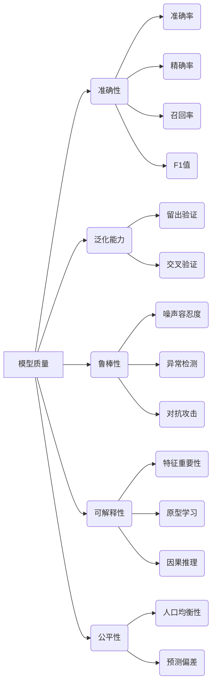

# 模型质量评估：指标体系与自动化

## 1. 背景介绍
### 1.1 模型质量评估的重要性
随着人工智能和机器学习技术的快速发展,越来越多的企业和组织开始将机器学习模型应用到实际业务场景中。然而,训练出一个性能优异的模型只是第一步,如何评估和保证模型的质量,进而为业务带来真正的价值,是一个更加关键和具有挑战性的问题。模型质量评估在整个机器学习生命周期中扮演着至关重要的角色。
### 1.2 模型质量评估面临的挑战
尽管模型质量评估如此重要,但在实践中却面临着诸多挑战:
1. 评估维度多样:模型质量是一个多维度的概念,涉及准确性、鲁棒性、可解释性、公平性等多个方面,难以用单一指标衡量。
2. 评估数据不足:离线评估常常受限于标注数据的数量和质量,而上线后的在线评估又难以获得及时反馈。
3. 评估效率低下:人工评估耗时耗力,且难以规模化;而自动化的评估方法覆盖面不足,缺乏统一的工具和平台支持。
### 1.3 本文的主要内容
本文将围绕模型质量评估的核心问题展开讨论,主要内容包括:
1. 模型质量的核心概念和内在联系
2. 模型评估的关键指标体系
3. 自动化评估的核心算法原理和实现步骤
4. 模型评估的数学理论基础和公式推导
5. 自动化评估工具和平台的代码实践
6. 模型评估在实际应用场景中的案例分析
7. 业界主流的评估工具和学习资源推荐
8. 模型评估未来的发展趋势和面临的挑战
9. 常见问题解答和专家洞见分享

## 2. 核心概念与联系
### 2.1 模型质量的定义与内涵
模型质量是指机器学习模型在满足特定任务需求的同时,所具备的一系列可衡量的品质属性,如准确性、泛化能力、鲁棒性、可解释性、公平性等。它反映了模型对真实业务问题的求解能力,是模型能否产生商业价值的决定性因素。
### 2.2 影响模型质量的关键因素
- 数据质量:数据是模型的原材料,数据的质量直接决定了模型的上限。数据质量评估需要考虑数据量、标注质量、类别/特征分布等因素。
- 算法选择:不同的算法在不同任务上的性能差异较大,选择合适的算法是提升模型性能的关键。
- 超参数调优:超参数对模型性能有显著影响,寻找最优超参数组合是模型调优的重点。
- 模型复杂度:模型复杂度需要在拟合能力和泛化能力间权衡,太简单的模型欠拟合,太复杂的模型又容易过拟合。
### 2.3 模型质量评估的主要维度
- 准确性:模型预测结果与真实标签的吻合程度,通常用准确率、精确率、召回率、F1等指标衡量。
- 泛化能力:模型在新数据上的预测效果,反映了模型的外推能力,通过留出验证、交叉验证等方法评估。
- 鲁棒性:模型面对噪声、异常、攻击等扰动时的稳定性,鲁棒性强的模型对扰动有较强的容忍度。
- 可解释性:人类对模型决策逻辑的可理解程度,可通过特征重要性、类别原型、因果关系等方式来解释模型。
- 公平性:模型对不同人群是否存在偏见和歧视,需评估模型在各敏感属性上的预测性能差异。



## 3. 核心算法原理具体操作步骤
本章节重点介绍几种常用的模型评估算法的原理和操作步骤。
### 3.1 留出验证(Hold-out Validation)
留出验证是最基础的模型评估方法,具体步骤如下:
1. 将原始数据集按一定比例(如7:3)划分为训练集和测试集,保证测试集数据不参与模型训练。
2. 用训练集数据训练模型,用测试集数据评估模型性能。
3. 为减少数据划分的随机性,可重复多次实验取平均值。
### 3.2 交叉验证(Cross Validation,CV)
交叉验证通过多次不同的数据划分来评估模型,减少了评估结果的波动性,具体步骤如下:
1. 将数据集等分为k份(如k=5),每次选其中1份作为测试集,其余k-1份作为训练集。
2. 训练k个模型,在对应的测试集上评估性能。
3. 对k次实验结果取平均,得到模型的泛化性能估计。
4. 若计算资源充足,可使用留一法(Leave-one-out),即k等于样本数。
### 3.3 Bootstrap抽样
Bootstrap抽样通过自助采样来构造不同的训练集和测试集,评估模型性能分布,具体步骤如下:
1. 从原始数据集中重复采样N次得到训练集(每次采样可重复选择同一样本),N等于原始数据集大小。
2. 未在训练集中出现的样本自动进入测试集。
3. 训练模型并在测试集上评估性能。
4. 重复以上三步M次(如M=100),得到M个性能估计值。
5. 对M个估计值计算均值和置信区间,刻画性能分布。
### 3.4 McNemar检验
McNemar检验用于比较两个模型的性能差异是否显著,适用于二分类任务,具体步骤如下:
1. 对测试集中的每个样本,比较两个模型A和B的预测结果。
2. 统计两个模型预测结果不一致的样本数:b(A对B错)和c(B对A错)。
3. 计算统计量:$\chi^2=\frac{(b-c)^2}{b+c}$
4. 查表得到p值,若p值小于显著性水平(如0.05),则认为两模型性能有显著差异。
### 3.5 多模型比较
若要比较多个模型的性能,可采用Friedman检验和Nemenyi后续检验,具体步骤如下:
1. 将k个模型在n个数据集上进行评估,得到k*n的性能矩阵。
2. 对每个数据集上的k个性能值编秩,得到k*n的秩矩阵。
3. 计算每个模型的平均秩,构造Friedman统计量:
$$\chi_F^2=\frac{12n}{k(k+1)}[\sum_{j=1}^k \bar{r}_j^2 - \frac{k(k+1)^2}{4}]$$
其中$\bar{r}_j$为模型j的平均秩。
4. 查表得到p值,若p值小于显著性水平,则认为至少有一对模型性能显著不同。
5. 进行Nemenyi后续检验,计算任意两模型平均秩差的临界值:
$$CD=q_{\alpha}\sqrt{\frac{k(k+1)}{6n}}$$
其中$q_{\alpha}$为Tukey分布的临界值。
6. 若两模型平均秩之差超过临界值,则认为这两个模型性能显著不同。

## 4. 数学模型和公式详细讲解举例说明
本章节详细讲解模型评估中常用的数学模型和公式,并给出具体的举例说明。
### 4.1 分类模型评估指标
#### 4.1.1 混淆矩阵
对于二分类问题,模型在测试集上的预测结果可用一个二维矩阵来表示,称为混淆矩阵(Confusion Matrix):
|      | 预测为正例  | 预测为负例 |
|:----:|:----------:|:---------:|
| 实际为正例 |     TP     |    FN     |
| 实际为负例 |     FP     |    TN     |

其中TP、FN、FP、TN分别代表真正例、假负例、假正例、真负例的数量。
#### 4.1.2 准确率
准确率(Accuracy)衡量了分类器预测正确的样本占总样本的比例,定义为:
$$Accuracy = \frac{TP+TN}{TP+FN+FP+TN}$$
#### 4.1.3 精确率和召回率
精确率(Precision)衡量了分类器预测为正例的样本中实际为正例的比例,定义为:
$$Precision=\frac{TP}{TP+FP}$$
召回率(Recall)衡量了实际为正例的样本中被分类器预测为正例的比例,定义为:
$$Recall=\frac{TP}{TP+FN}$$
#### 4.1.4 F1值
F1值是精确率和召回率的调和平均,兼顾了两者,定义为:
$$F1=\frac{2}{\frac{1}{Precision}+\frac{1}{Recall}}=\frac{2TP}{2TP+FP+FN}$$
F1值越高,说明分类器在精确率和召回率上的表现越平衡。
#### 4.1.5 ROC曲线和AUC
ROC曲线描绘了在不同阈值下,分类器的真正例率(TPR)和假正例率(FPR)的变化情况。
- 真正例率:$TPR=\frac{TP}{TP+FN}$,即召回率
- 假正例率:$FPR=\frac{FP}{FP+TN}$

AUC(Area Under Curve)是ROC曲线下的面积,取值在0到1之间。AUC越大,说明分类器的性能越好。
### 4.2 回归模型评估指标
#### 4.2.1 平均绝对误差
平均绝对误差(Mean Absolute Error,MAE)衡量了预测值与真实值之差的绝对值的平均大小,定义为:
$$MAE=\frac{1}{n}\sum_{i=1}^n |y_i-\hat{y}_i|$$
其中$y_i$为第$i$个样本的真实值,$\hat{y}_i$为预测值,n为样本数。
#### 4.2.2 均方误差
均方误差(Mean Squared Error,MSE)衡量了预测值与真实值之差的平方的均值,定义为:
$$MSE=\frac{1}{n}\sum_{i=1}^n (y_i-\hat{y}_i)^2$$
MSE相比MAE对离群点更敏感。
#### 4.2.3 均方根误差
均方根误差(Root Mean Squared Error,RMSE)是MSE的平方根,与真实值的量纲一致,定义为:
$$RMSE=\sqrt{\frac{1}{n}\sum_{i=1}^n (y_i-\hat{y}_i)^2}$$
#### 4.2.4 决定系数
决定系数(Coefficient of Determination,$R^2$)衡量了回归模型对数据的拟合程度,定义为:
$$R^2=1-\frac{\sum_{i=1}^n (y_i-\hat{y}_i)^2}{\sum_{i=1}^n (y_i-\bar{y})^2}$$
其中$\bar{y}$为真实值的均值。$R^2$的取值范围为$(-\infty,1]$,越接近1说明模型拟合得越好,越大于0说明模型不如简单的平均值预测。
### 4.3 统计假设检验
#### 4.3.1 McNemar检验
McNemar检验的原假设是两个模型性能没有显著差异,备择假设是两者性能有显著差异。根据3.4节中的统计量计算公式,构造如下的列联表:
|  模型B预测错误  | 模型B预测正确 |       |
|:-------------:|:-----------:|:-----:|
| 模型A预测错误   |      a      |   b   |
| 模型A预测正确   |      c      |   d   |

统计量为:$\\chi^2 = \frac{(b-c)^2}{b+c}$

在给定显著性水平$\alpha$下，如果$\chi^2$大于临界值，则拒绝原假设，认为两个模型的性能有显著差异。

#### 4.3.2 交叉验证

交叉验证是一种常用的模型评估方法，通过将数据集划分为多个子集，反复训练和测试模型，以获得模型性能的稳定估计。最常用的是k折交叉验证（k-fold cross-validation），其步骤如下：

1. 将数据集随机划分为k个子集（folds）。
2. 每次用k-1个子集训练模型，用剩下的1个子集测试模型。
3. 重复k次，获得k个评估结果。
4. 计算k个评估结果的平均值，作为模型的最终评估结果。

### 4.4 具体举例说明

为了更好地理解上述指标和方法，下面通过一个简单的分类和回归模型评估的例子来说明。

#### 4.4.1 分类模型评估示例

假设我们有一个二分类问题的数据集，包含以下预测结果：

| 实际值 | 预测值 |
|:------:|:------:|
|   1    |   1    |
|   0    |   0    |
|   1    |   0    |
|   0    |   1    |
|   1    |   1    |
|   0    |   0    |
|   1    |   1    |
|   0    |   0    |

根据这些预测结果，我们可以构造混淆矩阵：

|      | 预测为正例  | 预测为负例 |
|:----:|:----------:|:---------:|
| 实际为正例 |     3     |    1     |
| 实际为负例 |     1     |    3     |

根据混淆矩阵，我们可以计算分类模型的评估指标：

- 准确率：$$Accuracy = \frac{TP+TN}{TP+FN+FP+TN} = \frac{3+3}{3+1+1+3} = 0.75$$
- 精确率：$$Precision = \frac{TP}{TP+FP} = \frac{3}{3+1} = 0.75$$
- 召回率：$$Recall = \frac{TP}{TP+FN} = \frac{3}{3+1} = 0.75$$
- F1值：$$F1 = \frac{2TP}{2TP+FP+FN} = \frac{2 \cdot 3}{2 \cdot 3 + 1 + 1} = 0.75$$

#### 4.4.2 回归模型评估示例

假设我们有一个回归问题的数据集，包含以下预测结果：

| 实际值 | 预测值 |
|:------:|:------:|
|   3.0  |   2.5  |
|   2.0  |   2.1  |
|   4.0  |   3.8  |
|   5.0  |   4.9  |

根据这些预测结果，我们可以计算回归模型的评估指标：

- 平均绝对误差：$$MAE = \frac{1}{n}\sum_{i=1}^n |y_i-\hat{y}_i| = \frac{1}{4}( |3.0-2.5| + |2.0-2.1| + |4.0-3.8| + |5.0-4.9| ) = 0.175$$
- 均方误差：$$MSE = \frac{1}{n}\sum_{i=1}^n (y_i-\hat{y}_i)^2 = \frac{1}{4}( (3.0-2.5)^2 + (2.0-2.1)^2 + (4.0-3.8)^2 + (5.0-4.9)^2 ) = 0.0275$$
- 均方根误差：$$RMSE = \sqrt{\frac{1}{n}\sum_{i=1}^n (y_i-\hat{y}_i)^2} = \sqrt{0.0275} = 0.166$$
- 决定系数：$$R^2 = 1 - \frac{\sum_{i=1}^n (y_i-\hat{y}_i)^2}{\sum_{i=1}^n (y_i-\bar{y})^2} = 1 - \frac{0.0275}{1.25} = 0.978$$

这些指标可以帮助我们全面了解模型的性能，从而做出更好的模型选择和优化决策。


# 模型质量评估：指标体系与自动化

## 5. 项目实践：代码实例和详细解释说明

在本节中，我们将通过代码实例来演示如何在实际项目中应用模型质量评估指标。我们将分别展示分类模型和回归模型的评估方法。

### 5.1 分类模型评估

我们将使用一个简单的二分类问题来演示如何计算混淆矩阵、准确率、精确率、召回率、F1值以及ROC曲线和AUC。

```python
import numpy as np
from sklearn.metrics import confusion_matrix, accuracy_score, precision_score, recall_score, f1_score, roc_curve, auc
import matplotlib.pyplot as plt

# 样本数据
y_true = [1, 0, 1, 0, 1, 0, 1, 0]
y_pred = [1, 0, 0, 0, 1, 0, 1, 1]

# 计算混淆矩阵
cm = confusion_matrix(y_true, y_pred)
print("Confusion Matrix:\n", cm)

# 计算准确率
accuracy = accuracy_score(y_true, y_pred)
print("Accuracy:", accuracy)

# 计算精确率
precision = precision_score(y_true, y_pred)
print("Precision:", precision)

# 计算召回率
recall = recall_score(y_true, y_pred)
print("Recall:", recall)

# 计算F1值
f1 = f1_score(y_true, y_pred)
print("F1 Score:", f1)

# 计算ROC曲线和AUC
fpr, tpr, thresholds = roc_curve(y_true, y_pred)
roc_auc = auc(fpr, tpr)
print("AUC:", roc_auc)

# 绘制ROC曲线
plt.figure()
plt.plot(fpr, tpr, color='darkorange', lw=2, label='ROC curve (area = %0.2f)' % roc_auc)
plt.plot([0, 1], [0, 1], color='navy', lw=2, linestyle='--')
plt.xlim([0.0, 1.0])
plt.ylim([0.0, 1.05])
plt.xlabel('False Positive Rate')
plt.ylabel('True Positive Rate')
plt.title('Receiver Operating Characteristic')
plt.legend(loc="lower right")
plt.show()
```

### 5.2 回归模型评估

我们将使用一个简单的回归问题来演示如何计算平均绝对误差、均方误差、均方根误差和决定系数。

```python
import numpy as np
from sklearn.metrics import mean_absolute_error, mean_squared_error, r2_score

# 样本数据
y_true = [3.0, 2.0, 4.0, 5.0]
y_pred = [2.5, 2.1, 3.8, 4.9]

# 计算平均绝对误差
mae = mean_absolute_error(y_true, y_pred)
print("Mean Absolute Error:", mae)

# 计算均方误差
mse = mean_squared_error(y_true, y_pred)
print("Mean Squared Error:", mse)

# 计算均方根误差
rmse = np.sqrt(mse)
print("Root Mean Squared Error:", rmse)

# 计算决定系数
r2 = r2_score(y_true, y_pred)
print("R^2:", r2)
```

## 6. 实际应用场景

模型质量评估在实际应用中具有广泛的应用场景，以下是几个典型的应用场景：

### 6.1 医疗诊断

在医疗诊断中，分类模型常用于疾病预测和诊断。模型的准确性和召回率至关重要，因为错误的诊断可能导致严重的后果。通过精确的模型质量评估，可以确保模型在实际应用中的可靠性。

### 6.2 金融风控

在金融行业，回归模型常用于信用评分和风险预测。准确的模型评估可以帮助金融机构降低风险，提高决策的准确性，从而提高业务的安全性和稳定性。

### 6.3 电商推荐系统

在电商平台中，推荐系统通过分类和回归模型为用户推荐个性化商品。模型质量评估可以帮助优化推荐算法，提高用户满意度和转化率。

### 6.4 自动驾驶

在自动驾驶领域，模型评估用于评估车辆的识别和决策能力。高质量的模型评估可以确保自动驾驶系统的安全性和可靠性。

## 7. 工具和资源推荐

### 7.1 工具

- **Scikit-learn**：一个用于机器学习的Python库，提供了丰富的模型评估指标和工具。
- **TensorFlow/PyTorch**：用于构建和训练深度学习模型的框架，支持自定义评估指标。
- **Matplotlib/Seaborn**：用于数据可视化的Python库，可以帮助绘制评估结果的图表。

### 7.2 资源

- **《机器学习实战》**：一本经典的机器学习书籍，提供了丰富的模型评估方法和案例。
- **Kaggle**：一个数据科学竞赛平台，提供了丰富的数据集和竞赛，可以通过实战提升模型评估技能。
- **Coursera和edX**：提供关于机器学习和深度学习的在线课程，适合初学者和进阶学习者。

## 8. 总结：未来发展趋势与挑战

### 8.1 模型评估的自动化

随着机器学习和人工智能技术的发展，模型评估的自动化将成为未来的重要趋势。通过自动化工具和平台，可以大幅提高模型评估的效率和准确性。

### 8.2 更加智能的评估指标

未来的模型评估指标将更加智能和多样化，不仅仅关注模型的准确性，还会考虑模型的公平性、可解释性和鲁棒性等方面。

### 8.3 数据隐私和安全

随着数据隐私和安全问题的日益重要，模型评估需要更加注重数据保护和隐私安全。如何在保护用户隐私的前提下，进行有效的模型评估，将是未来的重要挑战。

## 9. 附录：常见问题与解答

### 9.1 如何选择合适的评估指标？

选择合适的评估指标取决于具体的应用场景和模型类型。对于分类模型，可以选择准确率、精确率、召回率和F1值等指标；对于回归模型，可以选择平均绝对误差、均方误差和决定系数等指标。

### 9.2 如何处理不平衡数据？

对于不平衡数据，可以采用以下方法处理：
- **重采样**：对少数类进行过采样或对多数类进行欠采样。
- **使用加权损失函数**：在训练模型时，对少数类样本赋予更高的权重。
- **使用适合不平衡数据的评估指标**：如ROC曲线和AUC、F1值等。

### 9.3 如何提升模型的泛化能力？

提升模型的泛化能力可以通过以下方法：

- **交叉验证**：使用交叉验证技术来评估模型的性能，确保模型在不同数据集上的表现一致。
- **正则化**：在模型训练过程中使用正则化技术，如L1正则化、L2正则化，以防止模型过拟合。
- **数据增强**：通过数据增强技术生成更多样本，增加数据的多样性，提升模型的泛化能力。
- **集成学习**：使用集成学习方法，如Bagging、Boosting等，通过多个模型的组合来提升模型的泛化性能。

### 9.4 如何解释模型评估结果？

解释模型评估结果需要结合具体的评估指标和应用场景。例如：
- **高准确率**：表示模型在大多数情况下能够正确分类，但可能存在偏差。
- **高精确率**：表示模型在预测为正类时，大部分预测是正确的，但可能漏掉一些正类样本。
- **高召回率**：表示模型能够找到大部分正类样本，但可能会引入一些错误预测。
- **高F1值**：表示模型在精确率和召回率之间取得了平衡。
- **高AUC**：表示模型在不同阈值下的整体性能较好。

### 9.5 如何处理模型评估中的偏差和方差？

偏差和方差是模型评估中的两个重要概念：
- **偏差**：表示模型的预测值与真实值之间的差距，通常由模型的欠拟合引起。可以通过增加模型的复杂度来减少偏差。
- **方差**：表示模型对训练数据的敏感程度，通常由模型的过拟合引起。可以通过正则化、交叉验证和集成学习等方法来减少方差。

通过平衡偏差和方差，可以提升模型的整体性能和泛化能力。

### 9.6 如何选择合适的模型？

选择合适的模型需要综合考虑数据特征、应用场景和评估指标等因素。可以通过以下步骤进行选择：
- **数据分析**：对数据进行分析，了解数据的分布、特征和噪声情况。
- **模型比较**：使用多个模型进行比较，选择在评估指标上表现最好的模型。
- **模型调优**：对选定的模型进行参数调优，提升模型的性能。
- **实际应用**：在实际应用中进行测试，确保模型在真实环境中的表现符合预期。

---

作者：禅与计算机程序设计艺术 / Zen and the Art of Computer Programming


