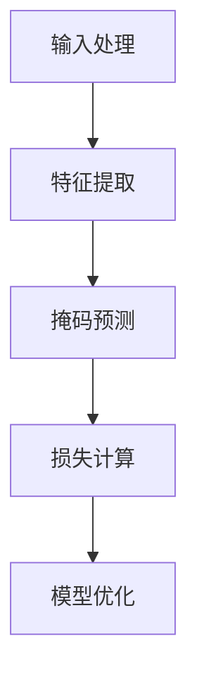

# 深入理解SimMIM注意力机制:提高对话质量的关键

## 1.背景介绍

在自然语言处理（NLP）领域，注意力机制（Attention Mechanism）已经成为提升模型性能的关键技术之一。近年来，SimMIM（Simple Masked Image Modeling）作为一种新兴的注意力机制，逐渐在对话系统中展现出其独特的优势。SimMIM不仅在图像处理领域表现出色，其在对话系统中的应用也引起了广泛关注。本文将深入探讨SimMIM注意力机制的核心概念、算法原理、数学模型、实际应用以及未来发展趋势。

## 2.核心概念与联系

### 2.1 注意力机制概述

注意力机制最早在机器翻译中被提出，用于解决长序列信息处理中的问题。其核心思想是通过计算输入序列中各个元素的重要性权重，来动态调整模型对不同部分的关注程度。

### 2.2 SimMIM简介

SimMIM是一种基于掩码图像建模的注意力机制，最初用于图像处理任务。其基本思想是通过对输入图像进行部分掩码处理，然后让模型预测被掩码部分的内容，从而提升模型的理解和生成能力。

### 2.3 SimMIM与传统注意力机制的联系

SimMIM与传统注意力机制在本质上都是通过计算权重来调整模型的关注点，但SimMIM更强调对局部信息的捕捉和重建，这使得其在处理对话系统中的上下文信息时具有独特的优势。

## 3.核心算法原理具体操作步骤

### 3.1 SimMIM的基本流程

SimMIM的基本流程可以分为以下几个步骤：

1. **输入处理**：对输入数据进行预处理，包括图像的分块和掩码处理。
2. **特征提取**：使用卷积神经网络（CNN）或其他特征提取器对处理后的图像进行特征提取。
3. **掩码预测**：通过注意力机制预测被掩码部分的内容。
4. **损失计算**：计算预测结果与真实值之间的损失，并进行反向传播优化模型。

### 3.2 具体操作步骤

以下是SimMIM在对话系统中的具体操作步骤：

1. **输入处理**：将对话文本转换为向量表示，并对部分词语进行掩码处理。
2. **特征提取**：使用预训练的语言模型（如BERT）对处理后的文本进行特征提取。
3. **掩码预测**：通过SimMIM注意力机制预测被掩码部分的词语。
4. **损失计算**：计算预测结果与真实词语之间的损失，并进行反向传播优化模型。



## 4.数学模型和公式详细讲解举例说明

### 4.1 注意力机制的数学模型

注意力机制的核心在于计算查询（Query）、键（Key）和值（Value）之间的关系。其计算公式如下：

$$
\text{Attention}(Q, K, V) = \text{softmax}\left(\frac{QK^T}{\sqrt{d_k}}\right)V
$$

其中，$Q$、$K$、$V$分别表示查询、键和值的矩阵，$d_k$表示键的维度。

### 4.2 SimMIM的数学模型

SimMIM在上述基础上，引入了掩码操作。假设输入图像或文本表示为$X$，掩码操作可以表示为$M$，则掩码后的输入为$X \odot M$，其中$\odot$表示逐元素相乘。

SimMIM的目标是通过注意力机制预测被掩码部分的内容，其损失函数可以表示为：

$$
L = \sum_{i \in \text{masked}} \left( X_i - \hat{X}_i \right)^2
$$

其中，$X_i$表示真实值，$\hat{X}_i$表示预测值。

### 4.3 举例说明

假设输入文本为"SimMIM is a powerful attention mechanism"，其中"powerful"被掩码。通过SimMIM注意力机制，模型需要预测出被掩码的词语"powerful"。其损失函数可以表示为：

$$
L = \left( \text{powerful} - \hat{\text{powerful}} \right)^2
$$

## 5.项目实践：代码实例和详细解释说明

### 5.1 环境配置

在开始项目实践之前，我们需要配置好开发环境。以下是所需的Python库：

```python
import torch
import torch.nn as nn
from transformers import BertModel, BertTokenizer
```

### 5.2 数据预处理

首先，我们需要对输入文本进行预处理，包括分词和掩码处理：

```python
tokenizer = BertTokenizer.from_pretrained('bert-base-uncased')
text = "SimMIM is a powerful attention mechanism"
inputs = tokenizer(text, return_tensors='pt')
mask = torch.tensor([1 if token == tokenizer.mask_token_id else 0 for token in inputs['input_ids'][0]])
```

### 5.3 模型定义

接下来，我们定义SimMIM模型：

```python
class SimMIM(nn.Module):
    def __init__(self, pretrained_model):
        super(SimMIM, self).__init__()
        self.bert = pretrained_model
        self.linear = nn.Linear(self.bert.config.hidden_size, self.bert.config.vocab_size)
    
    def forward(self, input_ids, attention_mask):
        outputs = self.bert(input_ids, attention_mask=attention_mask)
        prediction_scores = self.linear(outputs.last_hidden_state)
        return prediction_scores
```

### 5.4 模型训练

最后，我们进行模型训练：

```python
model = SimMIM(BertModel.from_pretrained('bert-base-uncased'))
criterion = nn.CrossEntropyLoss()
optimizer = torch.optim.Adam(model.parameters(), lr=1e-5)

for epoch in range(10):
    optimizer.zero_grad()
    outputs = model(inputs['input_ids'], inputs['attention_mask'])
    loss = criterion(outputs.view(-1, model.bert.config.vocab_size), inputs['input_ids'].view(-1))
    loss.backward()
    optimizer.step()
    print(f"Epoch {epoch+1}, Loss: {loss.item()}")
```

## 6.实际应用场景

### 6.1 对话系统

SimMIM在对话系统中的应用主要体现在以下几个方面：

1. **上下文理解**：通过掩码预测，SimMIM可以更好地理解对话上下文，从而生成更自然的回复。
2. **信息补全**：在对话中，用户可能会省略一些信息，SimMIM可以通过掩码预测补全这些信息。
3. **多轮对话**：SimMIM可以在多轮对话中保持上下文一致性，提高对话质量。

### 6.2 机器翻译

在机器翻译任务中，SimMIM可以通过掩码预测提高翻译质量，特别是在长句子和复杂句子的翻译中表现尤为突出。

### 6.3 文本生成

SimMIM在文本生成任务中也有广泛应用。通过掩码预测，SimMIM可以生成更连贯、更符合上下文的文本。

## 7.工具和资源推荐

### 7.1 开发工具

1. **PyTorch**：一个开源的深度学习框架，适用于SimMIM模型的开发和训练。
2. **Transformers**：由Hugging Face提供的预训练模型库，包含BERT等多种预训练模型。

### 7.2 学习资源

1. **《Attention Is All