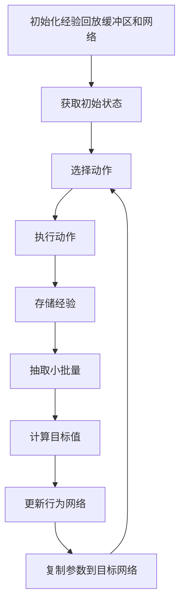

# 深度 Q-learning：在智能城市构建中的应用

## 1.背景介绍

随着城市化进程的加速，智能城市的概念逐渐成为现实。智能城市通过整合信息技术和物联网（IoT）来提升城市管理和服务的效率。深度 Q-learning 作为一种强化学习算法，能够在复杂的环境中进行决策和优化，因此在智能城市的构建中具有广泛的应用前景。

智能城市的核心目标是通过数据驱动的方式提升城市的运行效率和居民的生活质量。深度 Q-learning 可以在交通管理、能源优化、环境监测等多个领域发挥重要作用。本文将深入探讨深度 Q-learning 的核心概念、算法原理、数学模型、实际应用场景以及未来发展趋势。

## 2.核心概念与联系

### 2.1 强化学习

强化学习是一种机器学习方法，通过与环境的交互来学习最优策略。智能体（Agent）通过执行动作（Action）影响环境（Environment），并根据环境反馈的奖励（Reward）来调整策略。强化学习的目标是最大化累积奖励。

### 2.2 Q-learning

Q-learning 是一种无模型的强化学习算法，通过学习状态-动作值函数（Q函数）来估计每个状态-动作对的价值。Q函数表示在给定状态下执行某个动作的预期累积奖励。Q-learning 的更新公式为：

$$
Q(s, a) \leftarrow Q(s, a) + \alpha [r + \gamma \max_{a'} Q(s', a') - Q(s, a)]
$$

其中，$s$ 和 $a$ 分别表示当前状态和动作，$r$ 表示即时奖励，$\alpha$ 是学习率，$\gamma$ 是折扣因子，$s'$ 和 $a'$ 分别表示下一状态和下一动作。

### 2.3 深度 Q-learning

深度 Q-learning 结合了深度学习和 Q-learning，通过深度神经网络（DNN）来近似 Q函数。深度 Q-learning 能够处理高维状态空间，适用于复杂的智能城市环境。深度 Q-learning 的核心思想是使用神经网络来估计 Q值，并通过经验回放（Experience Replay）和目标网络（Target Network）来稳定训练过程。

## 3.核心算法原理具体操作步骤

### 3.1 初始化

1. 初始化经验回放缓冲区（Replay Buffer）$D$。
2. 初始化行为网络（Behavior Network）$Q$，并复制其参数到目标网络（Target Network）$Q'$。

### 3.2 训练过程

1. 从环境中获取初始状态 $s$。
2. 重复以下步骤直到终止状态：
   - 使用 $\epsilon$-贪婪策略选择动作 $a$：
     - 以概率 $\epsilon$ 随机选择动作。
     - 以概率 $1 - \epsilon$ 选择使 $Q(s, a)$ 最大化的动作。
   - 执行动作 $a$，观察奖励 $r$ 和下一个状态 $s'$。
   - 将 $(s, a, r, s')$ 存储到经验回放缓冲区 $D$ 中。
   - 从 $D$ 中随机抽取一个小批量 $(s_j, a_j, r_j, s_j')$。
   - 计算目标值 $y_j$：
     $$
     y_j = \begin{cases} 
     r_j & \text{if } s_j' \text{ is terminal} \\
     r_j + \gamma \max_{a'} Q'(s_j', a') & \text{otherwise}
     \end{cases}
     $$
   - 使用均方误差（MSE）损失函数更新行为网络 $Q$ 的参数：
     $$
     L = \frac{1}{N} \sum_{j=1}^N (y_j - Q(s_j, a_j))^2
     $$
   - 每隔 $C$ 步，将行为网络 $Q$ 的参数复制到目标网络 $Q'$。

### 3.3 算法流程图



## 4.数学模型和公式详细讲解举例说明

### 4.1 Q函数

Q函数 $Q(s, a)$ 表示在状态 $s$ 下执行动作 $a$ 的预期累积奖励。Q-learning 的目标是找到最优 Q函数 $Q^*(s, a)$，使得在任意状态下选择最优动作能够最大化累积奖励。

### 4.2 Bellman 方程

Bellman 方程描述了最优 Q函数的递归关系：

$$
Q^*(s, a) = \mathbb{E}[r + \gamma \max_{a'} Q^*(s', a') | s, a]
$$

其中，$\mathbb{E}$ 表示期望值，$s'$ 是执行动作 $a$ 后的下一个状态，$a'$ 是在状态 $s'$ 下选择的最优动作。

### 4.3 损失函数

深度 Q-learning 使用均方误差（MSE）损失函数来更新行为网络的参数：

$$
L(\theta) = \mathbb{E}[(y - Q(s, a; \theta))^2]
$$

其中，$\theta$ 是行为网络的参数，$y$ 是目标值，定义为：

$$
y = \begin{cases} 
r & \text{if } s' \text{ is terminal} \\
r + \gamma \max_{a'} Q'(s', a'; \theta') & \text{otherwise}
\end{cases}
$$

### 4.4 举例说明

假设我们有一个简单的智能交通管理系统，状态 $s$ 表示当前交通流量，动作 $a$ 表示交通信号灯的切换。奖励 $r$ 表示交通流量的改善程度。通过深度 Q-learning，我们可以训练一个模型来优化交通信号灯的切换策略，从而最大化交通流量的通畅度。

## 5.项目实践：代码实例和详细解释说明

### 5.1 环境设置

首先，我们需要设置一个模拟环境来表示智能交通管理系统。我们可以使用 OpenAI Gym 来创建一个自定义环境。

```python
import gym
from gym import spaces
import numpy as np

class TrafficEnv(gym.Env):
    def __init__(self):
        super(TrafficEnv, self).__init__()
        self.action_space = spaces.Discrete(2)  # 0: Red, 1: Green
        self.observation_space = spaces.Box(low=0, high=100, shape=(1,), dtype=np.float32)
        self.state = 50  # Initial traffic flow

    def reset(self):
        self.state = 50
        return np.array([self.state], dtype=np.float32)

    def step(self, action):
        if action == 0:
            self.state = max(0, self.state - 10)  # Red light decreases traffic flow
        else:
            self.state = min(100, self.state + 10)  # Green light increases traffic flow
        reward = -abs(self.state - 50)  # Reward is higher when traffic flow is around 50
        done = False
        return np.array([self.state], dtype=np.float32), reward, done, {}

    def render(self, mode='human'):
        pass
```

### 5.2 深度 Q-learning 实现

接下来，我们实现深度 Q-learning 算法。

```python
import torch
import torch.nn as nn
import torch.optim as optim
import random
from collections import deque

class DQN(nn.Module):
    def __init__(self, input_dim, output_dim):
        super(DQN, self).__init__()
        self.fc1 = nn.Linear(input_dim, 128)
        self.fc2 = nn.Linear(128, 128)
        self.fc3 = nn.Linear(128, output_dim)

    def forward(self, x):
        x = torch.relu(self.fc1(x))
        x = torch.relu(self.fc2(x))
        x = self.fc3(x)
        return x

def train_dqn(env, num_episodes=1000, batch_size=64, gamma=0.99, epsilon_start=1.0, epsilon_end=0.01, epsilon_decay=0.995):
    replay_buffer = deque(maxlen=10000)
    behavior_net = DQN(env.observation_space.shape[0], env.action_space.n)
    target_net = DQN(env.observation_space.shape[0], env.action_space.n)
    target_net.load_state_dict(behavior_net.state_dict())
    optimizer = optim.Adam(behavior_net.parameters())
    epsilon = epsilon_start

    for episode in range(num_episodes):
        state = env.reset()
        total_reward = 0
        done = False

        while not done:
            if random.random() < epsilon:
                action = env.action_space.sample()
            else:
                with torch.no_grad():
                    action = torch.argmax(behavior_net(torch.tensor(state, dtype=torch.float32))).item()

            next_state, reward, done, _ = env.step(action)
            replay_buffer.append((state, action, reward, next_state, done))
            state = next_state
            total_reward += reward

            if len(replay_buffer) >= batch_size:
                batch = random.sample(replay_buffer, batch_size)
                states, actions, rewards, next_states, dones = zip(*batch)

                states = torch.tensor(states, dtype=torch.float32)
                actions = torch.tensor(actions, dtype=torch.int64).unsqueeze(1)
                rewards = torch.tensor(rewards, dtype=torch.float32)
                next_states = torch.tensor(next_states, dtype=torch.float32)
                dones = torch.tensor(dones, dtype=torch.float32)

                q_values = behavior_net(states).gather(1, actions).squeeze(1)
                next_q_values = target_net(next_states).max(1)[0]
                target_q_values = rewards + gamma * next_q_values * (1 - dones)

                loss = nn.MSELoss()(q_values, target_q_values)
                optimizer.zero_grad()
                loss.backward()
                optimizer.step()

        if episode % 10 == 0:
            target_net.load_state_dict(behavior_net.state_dict())

        epsilon = max(epsilon_end, epsilon * epsilon_decay)
        print(f"Episode {episode}, Total Reward: {total_reward}")

env = TrafficEnv()
train_dqn(env)
```

### 5.3 代码解释

1. **环境设置**：我们创建了一个自定义的智能交通管理环境，定义了状态空间、动作空间和奖励函数。
2. **深度 Q-learning 实现**：我们定义了一个深度 Q网络（DQN），并使用经验回放和目标网络来稳定训练过程。
3. **训练过程**：在每个训练回合中，我们使用 $\epsilon$-贪婪策略选择动作，执行动作并存储经验，然后从经验回放缓冲区中抽取小批量进行训练。

## 6.实际应用场景

### 6.1 智能交通管理

深度 Q-learning 可以用于优化交通信号灯的切换策略，从而减少交通拥堵，提高交通流量的通畅度。通过实时监控交通流量数据，深度 Q-learning 模型可以动态调整信号灯的切换时间，最大化交通流量的通畅度。

### 6.2 能源优化

在智能电网中，深度 Q-learning 可以用于优化能源分配和调度策略。通过预测能源需求和供应情况，深度 Q-learning 模型可以动态调整能源分配策略，最大化能源利用效率，减少能源浪费。

### 6.3 环境监测

深度 Q-learning 可以用于优化环境监测系统的传感器部署和数据采集策略。通过实时监控环境数据，深度 Q-learning 模型可以动态调整传感器的部署位置和数据采集频率，最大化环境监测的覆盖范围和精度。

## 7.工具和资源推荐

### 7.1 开发工具

- **Python**：Python 是实现深度 Q-learning 的主要编程语言，具有丰富的机器学习库和工具。
- **PyTorch**：PyTorch 是一个流行的深度学习框架，支持动态计算图和自动微分，适用于实现深度 Q-learning。
- **OpenAI Gym**：OpenAI Gym 是一个用于开发和比较强化学习算法的工具包，提供了丰富的模拟环境。

### 7.2 学习资源

- **《深度强化学习》**：这本书详细介绍了深度强化学习的基本概念和算法，适合初学者和进阶学习者。
- **Coursera 强化学习课程**：Coursera 提供了多门关于强化学习的在线课程，涵盖了从基础到高级的内容。
- **GitHub 代码库**：在 GitHub 上可以找到许多开源的深度 Q-learning 实现和项目实例，适合参考和学习。

## 8.总结：未来发展趋势与挑战

### 8.1 未来发展趋势

随着智能城市的不断发展，深度 Q-learning 在智能城市中的应用前景广阔。未来，深度 Q-learning 将在以下几个方面取得重要进展：

1. **多智能体系统**：在智能城市中，多个智能体（如无人驾驶汽车、智能家居设备）需要协同工作。多智能体深度 Q-learning 将成为研究热点。
2. **自适应学习**：智能城市环境复杂多变，自适应深度 Q-learning 模型能够根据环境变化动态调整策略，提高模型的鲁棒性和适应性。
3. **边缘计算**：随着物联网设备的普及，边缘计算将成为智能城市的重要组成部分。深度 Q-learning 模型可以在边缘设备上进行部署，实现实时决策和优化。

### 8.2 挑战

尽管深度 Q-learning 在智能城市中具有广泛的应用前景，但仍面临一些挑战：

1. **计算资源**：深度 Q-learning 模型的训练过程需要大量的计算资源，如何高效利用计算资源是一个重要问题。
2. **数据质量**：智能城市中的数据质量参差不齐，如何处理噪声数据和缺失数据是一个挑战。
3. **安全性和隐私**：智能城市中的数据涉及居民的隐私和安全，如何保护数据安全和隐私是一个重要问题。

## 9.附录：常见问题与解答

### 9.1 深度 Q-learning 与传统 Q-learning 有何区别？

深度 Q-learning 结合了深度学习和 Q-learning，通过深度神经网络来近似 Q函数，能够处理高维状态空间。传统 Q-learning 只能处理低维状态空间，无法应对复杂的智能城市环境。

### 9.2 如何选择深度 Q-learning 的超参数？

深度 Q-learning 的超参数包括学习率、折扣因子、经验回放缓冲区大小等。可以通过网格搜索或随机搜索来选择最优超参数。

### 9.3 深度 Q-learning 在智能城市中的应用有哪些？

深度 Q-learning 在智能城市中的应用包括智能交通管理、能源优化、环境监测等。通过优化决策和调度策略，深度 Q-learning 能够提升城市管理和服务的效率。

### 9.4 如何处理深度 Q-learning 中的过拟合问题？

可以通过增加训练数据、使用正则化技术、早停（Early Stopping）等方法来处理深度 Q-learning