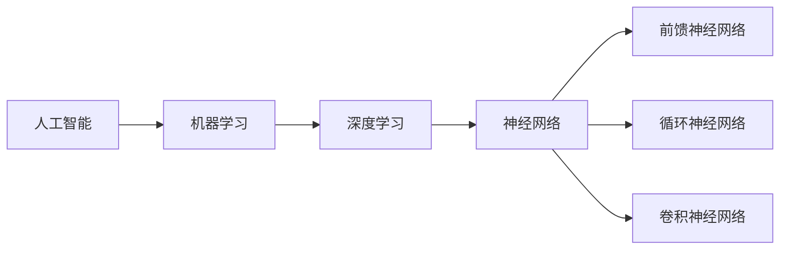

# 神经网络(Neural Networks) - 原理与代码实例讲解

## 1. 背景介绍

### 1.1 人工智能与机器学习发展历程
#### 1.1.1 人工智能的起源与发展
#### 1.1.2 机器学习的兴起
#### 1.1.3 深度学习的崛起

### 1.2 神经网络在人工智能中的地位
#### 1.2.1 神经网络的历史
#### 1.2.2 神经网络在机器学习中的重要性
#### 1.2.3 神经网络在深度学习中的核心作用

### 1.3 神经网络的应用领域
#### 1.3.1 计算机视觉
#### 1.3.2 自然语言处理
#### 1.3.3 语音识别
#### 1.3.4 其他应用领域

## 2. 核心概念与联系

### 2.1 神经元模型
#### 2.1.1 生物神经元
#### 2.1.2 人工神经元
#### 2.1.3 激活函数

### 2.2 神经网络结构
#### 2.2.1 前馈神经网络
#### 2.2.2 循环神经网络
#### 2.2.3 卷积神经网络

### 2.3 神经网络训练
#### 2.3.1 损失函数
#### 2.3.2 优化算法
#### 2.3.3 反向传播算法

### 2.4 神经网络概念关系图


## 3. 核心算法原理具体操作步骤

### 3.1 前馈神经网络
#### 3.1.1 网络结构
#### 3.1.2 前向传播
#### 3.1.3 反向传播

### 3.2 循环神经网络
#### 3.2.1 网络结构
#### 3.2.2 前向传播
#### 3.2.3 反向传播

### 3.3 卷积神经网络  
#### 3.3.1 卷积层
#### 3.3.2 池化层
#### 3.3.3 全连接层

## 4. 数学模型和公式详细讲解举例说明

### 4.1 感知机模型
#### 4.1.1 感知机模型定义
单层感知机是一种最简单的前馈神经网络，由输入层和输出层组成。假设输入为$\boldsymbol{x}=[x_1,x_2,\cdots,x_n]^T$，权重为$\boldsymbol{w}=[w_1,w_2,\cdots,w_n]^T$，偏置为$b$，输出为$y$，则感知机模型可表示为：

$$
y=f(\boldsymbol{w}^T\boldsymbol{x}+b)
$$

其中$f$为激活函数，常用的有：

- 阶跃函数（Heaviside函数）：
  $$
  f(x)=\begin{cases}
  1, & x\geq0 \\
  0, & x<0
  \end{cases}
  $$
- Sigmoid函数：
  $$
  f(x)=\frac{1}{1+e^{-x}}
  $$
- 双曲正切函数（Tanh函数）：  
  $$
  f(x)=\frac{e^x-e^{-x}}{e^x+e^{-x}}
  $$

#### 4.1.2 感知机学习规则
感知机的学习目标是找到合适的权重$\boldsymbol{w}$和偏置$b$，使得对于给定的训练样本$(\boldsymbol{x}_i,y_i)$，感知机的输出与真实标签尽可能接近。常用的学习规则有：

- 感知机学习规则（Perceptron Learning Rule）：
  $$
  \boldsymbol{w} \leftarrow \boldsymbol{w} + \eta(y_i-\hat{y}_i)\boldsymbol{x}_i
  $$
  $$
  b \leftarrow b + \eta(y_i-\hat{y}_i)
  $$
  其中$\eta$为学习率，$\hat{y}_i$为感知机对第$i$个样本的预测输出。

- 最小二乘法（Least Mean Square，LMS）：
  $$
  E=\frac{1}{2}\sum_{i=1}^{n}(y_i-\hat{y}_i)^2
  $$
  $$
  \boldsymbol{w} \leftarrow \boldsymbol{w} - \eta\frac{\partial E}{\partial \boldsymbol{w}}
  $$
  $$  
  b \leftarrow b - \eta\frac{\partial E}{\partial b}
  $$
  其中$E$为均方误差，$\frac{\partial E}{\partial \boldsymbol{w}}$和$\frac{\partial E}{\partial b}$为误差对权重和偏置的梯度。

### 4.2 多层感知机模型
#### 4.2.1 网络结构
多层感知机（Multi-Layer Perceptron，MLP）由输入层、一个或多个隐藏层和输出层组成。假设有$L$层网络，第$l$层有$n_l$个神经元，第$l$层第$j$个神经元的输出为$a_j^{(l)}$，则多层感知机的前向传播过程可表示为：

$$
\boldsymbol{z}^{(l)}=\boldsymbol{W}^{(l)}\boldsymbol{a}^{(l-1)}+\boldsymbol{b}^{(l)}
$$
$$
\boldsymbol{a}^{(l)}=f(\boldsymbol{z}^{(l)})
$$

其中$\boldsymbol{W}^{(l)}$为第$l$层的权重矩阵，$\boldsymbol{b}^{(l)}$为第$l$层的偏置向量，$f$为激活函数（通常为Sigmoid函数或ReLU函数）。

#### 4.2.2 反向传播算法
反向传播（Backpropagation）算法是训练多层感知机的常用方法，其基本思想是通过误差的反向传播来调整网络的权重和偏置，使网络的输出与真实标签尽可能接近。反向传播算法的核心是链式法则，对于第$l$层第$j$个神经元，其误差项$\delta_j^{(l)}$可表示为：

$$
\delta_j^{(L)}=\frac{\partial E}{\partial z_j^{(L)}}=\frac{\partial E}{\partial a_j^{(L)}}\frac{\partial a_j^{(L)}}{\partial z_j^{(L)}}=(a_j^{(L)}-y_j)f'(z_j^{(L)})
$$
$$
\delta_j^{(l)}=\frac{\partial E}{\partial z_j^{(l)}}=\sum_{k=1}^{n_{l+1}}\frac{\partial E}{\partial z_k^{(l+1)}}\frac{\partial z_k^{(l+1)}}{\partial a_j^{(l)}}\frac{\partial a_j^{(l)}}{\partial z_j^{(l)}}=\sum_{k=1}^{n_{l+1}}\delta_k^{(l+1)}w_{kj}^{(l+1)}f'(z_j^{(l)})
$$

其中$E$为损失函数，$y_j$为第$j$个输出神经元的真实标签。有了误差项，就可以对权重和偏置进行更新：

$$
w_{ij}^{(l)} \leftarrow w_{ij}^{(l)} - \eta\frac{\partial E}{\partial w_{ij}^{(l)}}=w_{ij}^{(l)}-\eta\delta_j^{(l)}a_i^{(l-1)}
$$
$$
b_j^{(l)} \leftarrow b_j^{(l)} - \eta\frac{\partial E}{\partial b_j^{(l)}}=b_j^{(l)}-\eta\delta_j^{(l)}
$$

其中$\eta$为学习率。

## 5. 项目实践：代码实例和详细解释说明

下面我们使用Python和TensorFlow实现一个简单的多层感知机，用于手写数字识别。

### 5.1 数据准备

```python
import tensorflow as tf
from tensorflow import keras

# 加载MNIST数据集
(x_train, y_train), (x_test, y_test) = keras.datasets.mnist.load_data()

# 数据预处理
x_train = x_train.reshape((60000, 28 * 28)) / 255.0
x_test = x_test.reshape((10000, 28 * 28)) / 255.0
y_train = keras.utils.to_categorical(y_train)
y_test = keras.utils.to_categorical(y_test)
```

这里我们使用MNIST手写数字数据集，并对数据进行了归一化和one-hot编码。

### 5.2 模型构建

```python
# 构建多层感知机模型
model = keras.Sequential([
    keras.layers.Dense(128, activation='relu', input_shape=(28 * 28,)),
    keras.layers.Dense(10, activation='softmax')
])

# 编译模型
model.compile(optimizer='adam',
              loss='categorical_crossentropy',
              metrics=['accuracy'])
```

我们构建了一个包含一个隐藏层（128个神经元）和一个输出层（10个神经元）的多层感知机模型，使用ReLU激活函数和Softmax输出。模型使用Adam优化器和交叉熵损失函数进行训练。

### 5.3 模型训练

```python
# 训练模型
model.fit(x_train, y_train, epochs=5, batch_size=32, validation_data=(x_test, y_test))
```

我们对模型进行5个epoch的训练，每个batch包含32个样本，并使用测试集进行验证。

### 5.4 模型评估

```python
# 评估模型
test_loss, test_acc = model.evaluate(x_test, y_test)
print('Test accuracy:', test_acc)
```

最后，我们在测试集上评估模型的性能，输出测试准确率。

通过这个简单的例子，我们展示了如何使用TensorFlow构建和训练一个多层感知机模型。在实际应用中，我们可以根据具体任务的需求，调整网络结构、超参数和数据预处理方法，以获得更好的性能。

## 6. 实际应用场景

### 6.1 图像分类
#### 6.1.1 手写数字识别
#### 6.1.2 物体检测
#### 6.1.3 人脸识别

### 6.2 自然语言处理
#### 6.2.1 情感分析
#### 6.2.2 文本分类
#### 6.2.3 机器翻译

### 6.3 语音识别
#### 6.3.1 语音转文字
#### 6.3.2 说话人识别
#### 6.3.3 语音合成

### 6.4 其他应用
#### 6.4.1 推荐系统
#### 6.4.2 异常检测
#### 6.4.3 预测分析

## 7. 工具和资源推荐

### 7.1 深度学习框架
#### 7.1.1 TensorFlow
#### 7.1.2 PyTorch
#### 7.1.3 Keras

### 7.2 数据集
#### 7.2.1 MNIST
#### 7.2.2 CIFAR-10/CIFAR-100
#### 7.2.3 ImageNet

### 7.3 在线课程与教程
#### 7.3.1 吴恩达的机器学习课程
#### 7.3.2 CS231n: 面向视觉识别的卷积神经网络
#### 7.3.3 TensorFlow官方教程

### 7.4 书籍推荐
#### 7.4.1 《深度学习》(Deep Learning) - Ian Goodfellow, Yoshua Bengio, Aaron Courville
#### 7.4.2 《神经网络与深度学习》(Neural Networks and Deep Learning) - Michael Nielsen
#### 7.4.3 《Python深度学习》(Deep Learning with Python) - François Chollet

## 8. 总结：未来发展趋势与挑战

### 8.1 神经网络的发展趋势
#### 8.1.1 模型的深度与复杂度不断增加
#### 8.1.2 注意力机制和记忆机制的引入
#### 8.1.3 多模态学习和跨域迁移学习

### 8.2 面临的挑战
#### 8.2.1 可解释性和透明度
#### 8.2.2 数据质量和标注成本
#### 8.2.3 模型的鲁棒性和安全性

### 8.3 未来展望
#### 8.3.1 神经网络与符号推理的结合
#### 8.3.2 神经网络在更广泛领域的应用
#### 8.3.3 神经网络与其他人工智能技术的融合

## 9. 附录：常见问题与解答

### 9.1 如何选择神经网络的结构和超参数？
### 9.2 如何处理过拟合和欠拟合问题？
### 9.3 如何加速神经网络的训练过程？
### 9.4 如何解释神经网络的决策过程