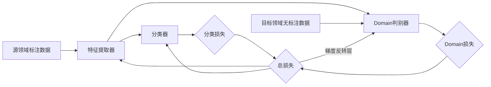

# 第九部分：迁移学习的前沿研究

## 1. 背景介绍
### 1.1 迁移学习的定义与起源
迁移学习(Transfer Learning)是机器学习中的一个重要分支,其目标是利用已有的知识来辅助目标问题的学习。与传统机器学习方法不同,迁移学习并不要求训练数据和测试数据满足独立同分布假设,因此可以利用不同但相关领域的知识来辅助目标领域的学习任务。迁移学习的思想最早可以追溯到20世纪90年代,但直到近年来,随着深度学习的兴起,迁移学习才得到了广泛关注和深入研究。

### 1.2 迁移学习的意义
在现实应用中,我们往往面临着标注数据缺乏、训练样本不足的问题,直接在目标领域训练模型的泛化性能难以保证。迁移学习为这一问题提供了新的解决思路,通过借鉴其他领域的知识,我们可以显著提升模型的性能,降低对大规模标注数据的依赖。此外,迁移学习还为知识的复用和推广提供了有力工具,使得我们可以将一个领域学习到的知识迁移到相关的其他领域,大大提高了知识的利用效率。

### 1.3 迁移学习的分类
根据源领域和目标领域的相似程度,迁移学习可以分为同构迁移和异构迁移两大类:
- 同构迁移:源领域和目标领域的特征空间相同,只是数据分布存在差异。代表性的方法有TCA、JDA等。  
- 异构迁移:源领域和目标领域的特征空间不同,需要在迁移过程中进行特征变换。代表性的方法有DAMA、SHFA等。

根据标签空间的变化,迁移学习又可以分为归纳式迁移和直推式迁移:
- 归纳式迁移:目标领域存在标签信息,但标签空间与源领域不同。代表性的方法有AMDA、CDML等。
- 直推式迁移:目标领域没有任何标签信息。代表性的方法有ARTL、MEDA等。

## 2. 核心概念与联系
### 2.1 Domain自适应
Domain自适应是迁移学习的核心问题之一,旨在缩小源领域和目标领域的分布差异,使得在源领域学习到的知识可以更好地迁移到目标领域。常见的Domain自适应方法包括:
- 基于特征变换的方法:通过特征变换将源领域和目标领域的数据映射到一个共同的特征空间,使得它们的分布尽可能接近。代表性方法有TCA、JDA等。
- 基于对抗学习的方法:利用对抗网络消除源领域和目标领域的分布差异。代表性方法有DANN、ADDA等。

### 2.2 Few-Shot Learning
Few-Shot Learning关注如何利用少量标注样本学习新的类别,与迁移学习的目标类似。不同的是,Few-Shot Learning主要关注快速学习新类别的能力,而迁移学习更侧重于在不同领域之间进行知识迁移。常见的Few-Shot Learning方法包括:
- 度量学习:通过学习一个度量空间,使得不同类别的样本在此空间中可以有效区分。代表性方法有Siamese Network、Matching Network等。
- 元学习:学习一个快速适应新任务的优化器或初始化参数。代表性方法有MAML、Reptile等。

### 2.3 Knowledge Distillation
Knowledge Distillation旨在将一个复杂模型(Teacher Model)的知识迁移到一个简单模型(Student Model),使Student Model在不显著增加参数量的情况下,达到与Teacher Model相近的性能。Knowledge Distillation的思想也被广泛应用于迁移学习领域,用于进行跨模态、跨领域的知识迁移。

## 3. 核心算法原理具体操作步骤
下面以DANN(Domain-Adversarial Neural Networks)为例,详细介绍一种代表性的对抗式Domain自适应算法。DANN由三部分组成:特征提取器(Feature Extractor)、分类器(Label Predictor)和Domain判别器(Domain Discriminator)。其主要步骤如下:

### 3.1 预训练阶段
- 用源领域的标注数据预训练特征提取器和分类器,使其能够很好地完成源领域的分类任务。
- 冻结特征提取器和分类器,用源领域和目标领域的无标注数据训练Domain判别器,使其能够区分数据来自于哪个领域。

### 3.2 对抗训练阶段  
- 联合优化三个组件:特征提取器、分类器和Domain判别器。
- 特征提取器和分类器的优化目标是最小化源领域上的分类损失,使提取的特征能够很好地完成分类任务。
- 特征提取器和Domain判别器之间是一个minimax博弈,特征提取器要最大化Domain判别器的损失,使提取的特征具有Domain不变性;而Domain判别器要最小化自身的判别损失。
- 通过梯度反转层(Gradient Reversal Layer)将梯度反转,实现minimax博弈中的梯度反传。

### 3.3 推断阶段
- 移除Domain判别器,只使用特征提取器和分类器对目标领域的数据进行预测。
- 由于对抗训练使得提取的特征具有Domain不变性,因此可以很好地迁移到目标领域。

DANN算法的流程可以用下面的Mermaid图表示:



## 4. 数学模型和公式详细讲解举例说明
DANN的数学模型可以表示为以下优化问题:

$$
\min_{F,C}\max_D \mathcal{L}_C(F,C) - \lambda \mathcal{L}_D(F,D)
$$

其中,$F$表示特征提取器,$C$表示分类器,$D$表示Domain判别器。$\mathcal{L}_C$是分类损失:

$$
\mathcal{L}_C(F,C)=\mathbb{E}_{(x,y)\sim P_S}[L_C(C(F(x)),y)]
$$

$L_C$是交叉熵损失函数,$(x,y)$是源领域的样本和标签。$\mathcal{L}_D$是Domain损失:

$$
\mathcal{L}_D(F,D)=\mathbb{E}_{x\sim P_S}[L_D(D(F(x)),0)]+\mathbb{E}_{x\sim P_T}[L_D(D(F(x)),1)]
$$

$L_D$也是交叉熵损失函数,$P_S$和$P_T$分别表示源领域和目标领域的数据分布。

在训练过程中,我们交替地优化$\mathcal{L}_C$和$\mathcal{L}_D$。对于$\mathcal{L}_C$,我们使用标准的梯度下降法进行优化:

$$
\theta_F\leftarrow\theta_F-\alpha\frac{\partial\mathcal{L}_C}{\partial\theta_F}, \quad
\theta_C\leftarrow\theta_C-\alpha\frac{\partial\mathcal{L}_C}{\partial\theta_C}
$$

其中$\alpha$是学习率。对于$\mathcal{L}_D$,我们使用梯度上升法优化$D$,使用梯度反转层优化$F$:

$$
\theta_D\leftarrow\theta_D-\alpha\frac{\partial\mathcal{L}_D}{\partial\theta_D}, \quad
\theta_F\leftarrow\theta_F+\alpha\lambda\frac{\partial\mathcal{L}_D}{\partial\theta_F}
$$

$\lambda$是一个平衡因子,控制Domain自适应的强度。

举个例子,假设我们要将MNIST数据集上训练的手写数字识别模型迁移到USPS数据集。我们可以将MNIST视为源领域,USPS视为目标领域。通过DANN算法,我们可以学习到一个Domain不变的特征表示,使得在MNIST上训练的分类器可以直接应用于USPS,而不需要在USPS上重新训练。

## 5. 项目实践：代码实例和详细解释说明
下面是一个使用PyTorch实现DANN的简单示例:

```python
import torch
import torch.nn as nn
import torch.optim as optim
from torch.autograd import Function

class FeatureExtractor(nn.Module):
    def __init__(self):
        super(FeatureExtractor, self).__init__()
        self.conv1 = nn.Conv2d(1, 32, 3)
        self.conv2 = nn.Conv2d(32, 64, 3)
        self.fc1 = nn.Linear(64 * 5 * 5, 128)
    
    def forward(self, x):
        x = F.relu(self.conv1(x))
        x = F.max_pool2d(x, 2)
        x = F.relu(self.conv2(x))
        x = F.max_pool2d(x, 2)
        x = x.view(-1, 64 * 5 * 5)
        x = F.relu(self.fc1(x))
        return x

class LabelPredictor(nn.Module):
    def __init__(self):
        super(LabelPredictor, self).__init__()
        self.fc2 = nn.Linear(128, 10)
    
    def forward(self, x):
        x = self.fc2(x)
        return x

class DomainDiscriminator(nn.Module):
    def __init__(self):
        super(DomainDiscriminator, self).__init__()
        self.fc3 = nn.Linear(128, 2)
    
    def forward(self, x):
        x = F.relu(self.fc3(x))
        return x

class GradientReversalLayer(Function):
    @staticmethod
    def forward(ctx, x, lambda_):
        ctx.lambda_ = lambda_
        return x.view_as(x)
    
    @staticmethod
    def backward(ctx, grad_output):
        return grad_output.neg() * ctx.lambda_, None

def train(source_dataloader, target_dataloader, feature_extractor, label_predictor, domain_discriminator,
          class_criterion, domain_criterion, optimizer, lambda_):
    for source_data, source_label in source_dataloader:
        for target_data, _ in target_dataloader:
            source_feature = feature_extractor(source_data)
            source_output = label_predictor(source_feature)
            class_loss = class_criterion(source_output, source_label)
            
            target_feature = feature_extractor(target_data)
            source_domain_output = domain_discriminator(GradientReversalLayer.apply(source_feature, lambda_))
            target_domain_output = domain_discriminator(GradientReversalLayer.apply(target_feature, lambda_))
            source_domain_label = torch.zeros(source_domain_output.size(0)).long()
            target_domain_label = torch.ones(target_domain_output.size(0)).long()
            domain_loss = domain_criterion(source_domain_output, source_domain_label) + \
                          domain_criterion(target_domain_output, target_domain_label)
            
            loss = class_loss + domain_loss
            optimizer.zero_grad()
            loss.backward()
            optimizer.step()

if __name__ == '__main__':
    feature_extractor = FeatureExtractor()
    label_predictor = LabelPredictor()
    domain_discriminator = DomainDiscriminator()
    class_criterion = nn.CrossEntropyLoss()
    domain_criterion = nn.CrossEntropyLoss()
    optimizer = optim.Adam(list(feature_extractor.parameters()) + list(label_predictor.parameters()) +
                           list(domain_discriminator.parameters()))
    lambda_ = 1.0
    
    # 加载源领域和目标领域数据
    source_dataloader = ...
    target_dataloader = ...
    
    # 训练模型
    for epoch in range(num_epochs):
        train(source_dataloader, target_dataloader, feature_extractor, label_predictor, domain_discriminator,
              class_criterion, domain_criterion, optimizer, lambda_)
```

这个示例中,我们定义了三个网络:特征提取器`FeatureExtractor`、分类器`LabelPredictor`和Domain判别器`DomainDiscriminator`。在训练过程中,我们交替地从源领域和目标领域的数据集中抽取批次数据。对于源领域数据,我们计算分类损失`class_loss`;对于源领域和目标领域数据,我们先用梯度反转层`GradientReversalLayer`进行梯度反转,然后计算Domain损失`domain_loss`。最后,我们将两个损失相加得到总损失,并进行梯度下降优化所有网络的参数。

需要注意的是,这只是一个简化版的实现,实际应用中还需要考虑更多细节,如学习率调整、早停等。此外,不同的任务和数据集可能需要使用不同的网络结构和超参数。

## 6. 实际应用场景
迁移学习在许多实际