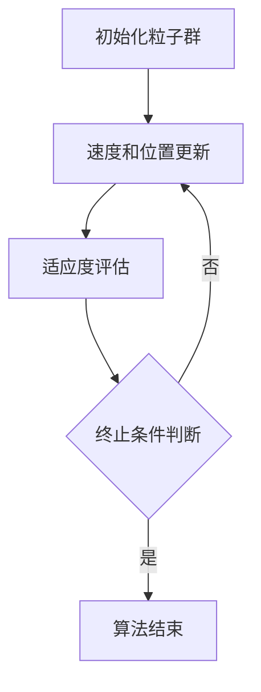

# 粒子群算法在数据挖掘中的应用研究

## 1.背景介绍

粒子群算法（Particle Swarm Optimization, PSO）是一种基于群体智能的优化算法，由Kennedy和Eberhart于1995年提出。该算法受鸟群觅食行为的启发，通过个体间的信息共享和协作来寻找最优解。PSO在解决复杂优化问题方面表现出色，广泛应用于工程、经济、人工智能等领域。随着大数据时代的到来，数据挖掘成为从海量数据中提取有价值信息的关键技术。本文将探讨粒子群算法在数据挖掘中的应用，旨在为研究人员和工程师提供实用的指导和见解。

## 2.核心概念与联系

### 2.1 粒子群算法概述

粒子群算法是一种基于群体智能的优化算法，其基本思想是通过模拟鸟群觅食行为来寻找问题的最优解。每个个体（粒子）在搜索空间中移动，并根据自身经验和群体经验调整位置。粒子群算法的核心在于个体间的信息共享和协作。

### 2.2 数据挖掘概述

数据挖掘是从大量数据中提取有价值信息的过程，涉及数据预处理、特征选择、模型构建和结果评估等步骤。常用的数据挖掘技术包括分类、聚类、关联规则挖掘和回归分析等。

### 2.3 粒子群算法与数据挖掘的联系

粒子群算法在数据挖掘中的应用主要体现在以下几个方面：

- 特征选择：通过优化特征子集，提高模型的性能。
- 聚类分析：通过优化聚类中心，提高聚类效果。
- 参数优化：通过优化模型参数，提高模型的准确性和泛化能力。

## 3.核心算法原理具体操作步骤

粒子群算法的基本操作步骤如下：

1. **初始化**：在搜索空间中随机生成一组粒子，每个粒子代表一个潜在解。
2. **速度和位置更新**：根据粒子的历史最佳位置和全局最佳位置更新粒子的速度和位置。
3. **适应度评估**：计算每个粒子的适应度值，并更新粒子的历史最佳位置和全局最佳位置。
4. **终止条件判断**：判断是否满足终止条件（如达到最大迭代次数或适应度值达到预定阈值），若满足则结束算法，否则返回步骤2。

以下是粒子群算法的Mermaid流程图：



## 4.数学模型和公式详细讲解举例说明

粒子群算法的数学模型主要包括速度更新公式和位置更新公式。

### 4.1 速度更新公式

速度更新公式如下：

$$
v_{i}(t+1) = w \cdot v_{i}(t) + c_{1} \cdot r_{1} \cdot (p_{i} - x_{i}(t)) + c_{2} \cdot r_{2} \cdot (g - x_{i}(t))
$$

其中：
- $v_{i}(t)$ 表示粒子 $i$ 在第 $t$ 代的速度。
- $w$ 表示惯性权重，控制粒子搜索的广度。
- $c_{1}$ 和 $c_{2}$ 分别表示个体学习因子和群体学习因子。
- $r_{1}$ 和 $r_{2}$ 是在 $[0, 1]$ 之间的随机数。
- $p_{i}$ 表示粒子 $i$ 的历史最佳位置。
- $g$ 表示全局最佳位置。
- $x_{i}(t)$ 表示粒子 $i$ 在第 $t$ 代的位置。

### 4.2 位置更新公式

位置更新公式如下：

$$
x_{i}(t+1) = x_{i}(t) + v_{i}(t+1)
$$

### 4.3 举例说明

假设我们有一个二维搜索空间，目标是找到使目标函数 $f(x, y)$ 最小的点。初始时，粒子的位置和速度如下：

- 粒子1：位置 $(2, 3)$，速度 $(0.5, -0.5)$
- 粒子2：位置 $(4, 1)$，速度 $(-0.3, 0.4)$

假设惯性权重 $w = 0.7$，个体学习因子 $c_{1} = 1.5$，群体学习因子 $c_{2} = 1.5$，随机数 $r_{1} = 0.6$，$r_{2} = 0.8$。粒子1的历史最佳位置为 $(2, 2.5)$，全局最佳位置为 $(3, 2)$。

根据速度更新公式，粒子1的新速度为：

$$
v_{1}(t+1) = 0.7 \cdot (0.5, -0.5) + 1.5 \cdot 0.6 \cdot ((2, 2.5) - (2, 3)) + 1.5 \cdot 0.8 \cdot ((3, 2) - (2, 3))
$$

计算得：

$$
v_{1}(t+1) = (0.35, -0.35) + (0, -0.45) + (1.2, -1.2) = (1.55, -2)
$$

根据位置更新公式，粒子1的新位置为：

$$
x_{1}(t+1) = (2, 3) + (1.55, -2) = (3.55, 1)
$$

## 5.项目实践：代码实例和详细解释说明

以下是一个使用Python实现粒子群算法进行特征选择的示例代码：

```python
import numpy as np
from sklearn.datasets import load_iris
from sklearn.model_selection import train_test_split
from sklearn.neighbors import KNeighborsClassifier
from sklearn.metrics import accuracy_score

# 粒子群算法参数
w = 0.7
c1 = 1.5
c2 = 1.5
num_particles = 30
num_iterations = 100

# 加载数据集
data = load_iris()
X = data.data
y = data.target

# 特征选择目标函数
def fitness_function(particle):
    selected_features = np.where(particle > 0.5, 1, 0)
    if np.sum(selected_features) == 0:
        return 0
    X_selected = X[:, selected_features == 1]
    X_train, X_test, y_train, y_test = train_test_split(X_selected, y, test_size=0.3, random_state=42)
    model = KNeighborsClassifier(n_neighbors=3)
    model.fit(X_train, y_train)
    y_pred = model.predict(X_test)
    return accuracy_score(y_test, y_pred)

# 初始化粒子群
particles = np.random.rand(num_particles, X.shape[1])
velocities = np.random.rand(num_particles, X.shape[1])
p_best = particles.copy()
g_best = particles[np.argmax([fitness_function(p) for p in particles])]

# 粒子群算法迭代
for t in range(num_iterations):
    for i in range(num_particles):
        r1, r2 = np.random.rand(), np.random.rand()
        velocities[i] = w * velocities[i] + c1 * r1 * (p_best[i] - particles[i]) + c2 * r2 * (g_best - particles[i])
        particles[i] = particles[i] + velocities[i]
        if fitness_function(particles[i]) > fitness_function(p_best[i]):
            p_best[i] = particles[i]
    g_best = p_best[np.argmax([fitness_function(p) for p in p_best])]

# 输出最佳特征子集和准确率
selected_features = np.where(g_best > 0.5, 1, 0)
print("最佳特征子集:", selected_features)
print("最佳准确率:", fitness_function(g_best))
```

### 代码解释

1. **参数设置**：设置粒子群算法的参数，包括惯性权重 $w$、个体学习因子 $c1$、群体学习因子 $c2$、粒子数量和迭代次数。
2. **数据加载**：加载Iris数据集，并定义特征选择的目标函数。
3. **初始化粒子群**：随机生成粒子的位置和速度，并初始化个体最佳位置和全局最佳位置。
4. **迭代更新**：在每次迭代中，更新粒子的速度和位置，并根据适应度值更新个体最佳位置和全局最佳位置。
5. **输出结果**：输出最佳特征子集和对应的准确率。

## 6.实际应用场景

粒子群算法在数据挖掘中的应用场景广泛，以下是几个典型的应用场景：

### 6.1 特征选择

在高维数据中，特征选择是提高模型性能和减少计算复杂度的重要步骤。粒子群算法通过优化特征子集，选择最优特征组合，从而提高模型的准确性和泛化能力。

### 6.2 聚类分析

聚类分析是将数据集划分为若干个相似子集的过程。粒子群算法可以通过优化聚类中心的位置，提高聚类效果，广泛应用于图像处理、市场细分和生物信息学等领域。

### 6.3 参数优化

在机器学习模型中，参数的选择对模型性能有重要影响。粒子群算法可以通过优化模型参数，提高模型的准确性和泛化能力，常用于神经网络、支持向量机和决策树等模型的参数调优。

### 6.4 关联规则挖掘

关联规则挖掘是发现数据集中项集之间的关联关系。粒子群算法可以通过优化关联规则的支持度和置信度，发现高质量的关联规则，广泛应用于市场篮分析、推荐系统和网络安全等领域。

## 7.工具和资源推荐