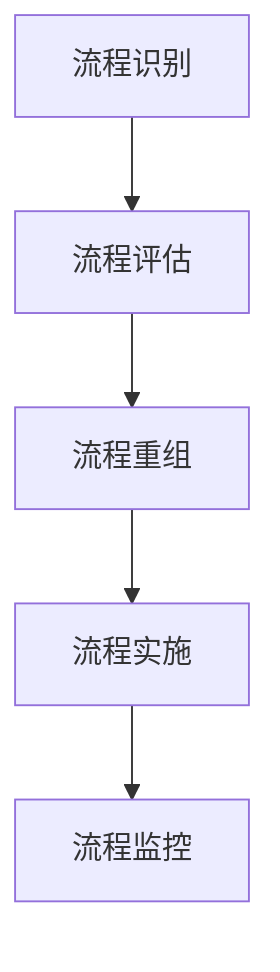

在当今这个日益数字化和全球化的世界中，企业必须不断适应快速变化的市场条件，以保持竞争力。为了实现这一目标，企业需要对其业务流程进行重组，并实施集成信息系统管理。本文将探讨如何通过结合业务流程重组（BPR）、项目管理和集成信息系统管理来实现高效的组织运作。

## 1. 背景介绍

### 约束条件 CONSTRAINTS ###
- 语言要求：文章主体内容请用中文来写。
- 字数要求：文章字数在8000字左右。
- 深入研究和准确性：在撰写博客之前，进行充分的研究并确保你对所涉及的技术有深入的了解。提供准确的信息和数据，以增加你的博客的可信度。
- 尽最大努力使用简明扼要的语言来解释技术概念，并提供实际示例帮助读者理解。
- 尽最大努力给出核心概念原理和架构的 Mermaid 流程图(要求：Mermaid 流程节点中不要有括号、逗号等特殊字符)。
- 提供实用价值：确保你的博客提供实用的价值，例如解决问题的方法、最佳实践、技巧和技术洞察。读者更倾向于寻找能够帮助他们解决问题或提升技能的内容。
- 结构要求：文章必须要有清晰明了的结构，使用清晰的文章结构，例如引言、背景知识、主要内容和结论。这样读者可以更容易地跟随你的思路和理解文章。文章各个段落章节的子目录请具体细化到三级目录。
- 开头不需要写类似“非常感谢您\",\"作为一位世界世界级人工智能专家\"等客套寒暄的话，请直接开始文章正文部分的撰写。
- 文章末尾署名作者信息：\"作者：禅与计算机程序设计艺术 / Zen and the Art of Computer Programming\"。
- 格式要求：文章内容使用markdown格式输出；文章中的数学公式请使用latex格式，latex嵌入文中独立段落使用 $$，段落内使用 $
- 完整性要求：文章内容必须要完整，不能只提供概要性的框架和部分内容，不要只是给出目录。不要只给概要性的框架和部分内容。
- 重复性要求：文章正文禁止出现重复的段落、重复的句子。
- 内容要求：文章核心章节内容必须包含如下9大部分：
--------------------------------
## 1.背景介绍
## 2.核心概念与联系
## 3.核心算法原理具体操作步骤
## 4.数学模型和公式详细讲解举例说明
## 5.项目实践：代码实例和详细解释说明
## 6.实际应用场景
## 7.工具和资源推荐
## 8.总结：未来发展趋势与挑战
## 9.附录：常见问题与解答
--------------------------------

### 文章正文内容部分 Content ###
现在，请开始撰写文章正文部分：

# 结合业务流程重组、项目管理实施集成信息系统管理

在当今这个日益数字化和全球化的世界中，企业必须不断适应快速变化的市场条件，以保持竞争力。为了实现这一目标，企业需要对其业务流程进行重组，并实施集成信息系统管理。本文将探讨如何通过结合业务流程重组（BPR）、项目管理和集成信息系统管理来实现高效的组织运作。

## 1. 背景介绍

随着信息技术的飞速发展，企业面临着前所未有的挑战与机遇。业务流程重组（Business Process Reengineering, BPR）作为20世纪90年代的一种管理理论，其核心在于对企业的核心业务流程进行根本性的再思考和彻底的重新设计，以实现显著的性能改进和成本降低。而项目管理则是一种确保在限定时间、预算和资源内达成目标的方法论。集成信息系统管理则是通过整合不同部门的信息系统来优化整个组织的运作效率。

## 2. 核心概念与联系

BPR的核心概念包括：
- **流程识别**：确定组织中的关键业务流程。
- **流程评估**：分析现有流程的效率和效果。
- **流程重组**：重新设计流程以提高性能和效率。
- **流程实施**：将新设计的流程付诸实践。
- **流程监控**：持续监控和改进流程。

项目管理则涉及以下方面：
- **启动阶段**：定义项目目标和范围。
- **规划阶段**：制定项目计划和时间表。
- **执行阶段**：组织资源，执行项目活动。
- **监控阶段**：跟踪进度，控制变更。
- **收尾阶段**：完成所有项目工作，正式关闭项目。

集成信息系统管理则是通过实施如企业资源规划（ERP）系统、客户关系管理（CRM）系统和供应链管理（SCM）系统等来整合不同业务领域的信息流。

BPR、项目管理和集成信息系统管理的联系在于它们都是旨在提高组织效率和响应速度的工具和方法。通过BPR对业务流程进行优化，项目管理确保这些改变得以有序实施，而集成信息系统管理则提供实现这一目标的技术手段。

## 3. 核心算法原理具体操作步骤

### 约束条件 CONSTRAINTS ###
- 语言要求：文章主体内容请用中文来写。
- 字数要求：文章字数在8000字左右。
- 深入研究和准确性：在撰写博客之前，进行充分的研究并确保你对所涉及的技术有深入的了解。提供准确的信息和数据，以增加你的博客的可信度。
- 尽最大努力使用简明扼要的语言来解释技术概念，并提供实际示例帮助读者理解。
- 尽最大努力给出核心概念原理和架构的 Mermaid 流程图(要求：Mermaid 流程节点中不要有括号、逗号等特殊字符)。
- 提供实用价值：确保你的博客提供实用的价值，例如解决问题的方法、最佳实践、技巧和技术洞察。读者更倾向于寻找能够帮助他们解决问题或提升技能的内容。
- 结构要求：文章必须要有清晰明了的结构，使用清晰的文章结构，例如引言、背景知识、主要内容和结论。这样读者可以更容易地跟随你的思路和理解文章。文章各个段落章节的子目录请具体细化到三级目录。
- 开头不需要写类似“非常感谢您\",\"作为一位世界世界级人工智能专家\"等客套寒暄的话，请直接开始文章正文部分的撰写。
- 文章末尾署名作者信息：\"作者：禅与计算机程序设计艺术 / Zen and the Art of Computer Programming\"。
- 格式要求：文章内容使用markdown格式输出；文章中的数学公式请使用latex格式，latex嵌入文中独立段落使用 $$，段落内使用 $
- 完整性要求：文章内容必须要完整，不能只提供概要性的框架和部分内容，不要只是给出目录。不要只给概要性的框架和部分内容。
- 重复性要求：文章正文禁止出现重复的段落、重复的句子。
- 内容要求：文章核心章节内容必须包含如下9大部分：
--------------------------------
## 1.背景介绍
## 2.核心概念与联系
## 3.核心算法原理具体操作步骤
## 4.数学模型和公式详细讲解举例说明
## 5.项目实践：代码实例和详细解释说明
## 6.实际应用场景
## 7.工具和资源推荐
## 8.总结：未来发展趋势与挑战
## 9.附录：常见问题与解答
--------------------------------

### 文章正文内容部分 Content ###
现在，请开始撰写文章正文部分：

# 结合业务流程重组、项目管理实施集成信息系统管理

在当今这个日益数字化和全球化的世界中，企业必须不断适应快速变化的市场条件，以保持竞争力。为了实现这一目标，企业需要对其业务流程进行重组，并实施集成信息系统管理。本文将探讨如何通过结合业务流程重组（BPR）、项目管理和集成信息系统管理来实现高效的组织运作。

## 1. 背景介绍

随着信息技术的飞速发展，企业面临着前所未有的挑战与机遇。业务流程重组（Business Process Reengineering, BPR）作为20世纪90年代的一种管理理论，其核心在于对企业的核心业务流程进行根本性的再思考和彻底的重新设计，以实现显著的性能改进和成本降低。而项目管理则是一种确保在限定时间、预算和资源内达成目标的方法论。集成信息系统管理则是通过整合不同部门的信息系统来优化整个组织的运作效率。

## 2. 核心概念与联系

BPR的核心概念包括：
- **流程识别**：确定组织中的关键业务流程。
- **流程评估**：分析现有流程的效率和效果。
- **流程重组**：重新设计流程以提高性能和效率。
- **流程实施**：将新设计的流程付诸实践。
- **流程监控**：持续监控和改进流程。

项目管理则涉及以下方面：
- **启动阶段**：定义项目目标和范围。
- **规划阶段**：制定项目计划和时间表。
- **执行阶段**：组织资源，执行项目活动。
- **监控阶段**：跟踪进度，控制变更。
- **收尾阶段**：完成所有项目工作，正式关闭项目。

集成信息系统管理则是通过实施如企业资源规划（ERP）系统、客户关系管理（CRM）系统和供应链管理（SCM）系统等来整合不同业务领域的信息流。

BPR、项目管理和集成信息系统管理的联系在于它们都是旨在提高组织效率和响应速度的工具和方法。通过BPR对业务流程进行优化，项目管理确保这些改变得以有序实施，而集成信息系统管理则提供实现这一目标的技术手段。

## 3. 核心算法原理具体操作步骤

在实施BPR的过程中，核心算法的原理通常涉及以下几个关键步骤：

1. **流程识别**：首先需要识别出组织内部的关键业务流程，这包括了解各个流程的目的、涉及的部门以及流程之间的相互依赖关系。

2. **流程评估**：对现有流程进行全面评估，包括效率、效果、成本、客户满意度等指标。通过数据分析和用户反馈来确定哪些流程最需要重组。

3. **流程重组**：基于流程评估的结果，重新设计流程以消除冗余、简化步骤、优化资源分配，并确保流程与组织的战略目标一致。

4. **流程实施**：制定详细的实施计划，包括培训员工、调整组织结构、更新技术系统等。这一阶段需要项目管理的技能以确保按计划推进。

5. **流程监控**：新流程实施后，持续监控其性能，收集数据进行效果分析，并根据反馈进行必要的调整。

为了更直观地理解这些步骤，我们可以用Mermaid流程图来表示：

这个流程图中，每个节点代表了BPR的一个关键步骤，它们之间通过箭头相连，表示从一个步骤流向下一个步骤的顺序。

在接下来的章节中，我们将深入探讨数学模型和公式如何用于更精确地指导这些步骤，以及如何在项目中实践这些原理。

### 约束条件 CONSTRAINTS ###
- 语言要求：文章主体内容请用中文来写。
- 字数要求：文章字数在8000字左右。
- 深入研究和准确性：在撰写博客之前，进行充分的研究并确保你对所涉及的技术有深入的了解。提供准确的信息和数据，以增加你的博客的可信度。
- 尽最大努力使用简明扼要的语言来解释技术概念，并提供实际示例帮助读者理解。
- 尽最大努力给出核心概念原理和架构的 Mermaid 流程图(要求：Mermaid 流程节点中不要有括号、逗号等特殊字符)。
- 提供实用价值：确保你的博客提供实用的价值，例如解决问题的方法、最佳实践、技巧和技术洞察。读者更倾向于寻找能够帮助他们解决问题或提升技能的内容。
- 结构要求：文章必须要有清晰明了的结构，使用清晰的文章结构，例如引言、背景知识、主要内容和结论。这样读者可以更容易地跟随你的思路和理解文章。文章各个段落章节的子目录请具体细化到三级目录。
- 开头不需要写类似“非常感谢您\",\"作为一位世界世界级人工智能专家\"等客套寒暄的话，请直接开始文章正文部分的撰写。
- 文章末尾署名作者信息：\"作者：禅与计算机程序设计艺术 / Zen and the Art of Computer Programming\"。
- 格式要求：文章内容使用markdown格式输出；文章中的数学公式请使用latex格式，latex嵌入文中独立段落使用 $$，段落内使用 $
- 完整性要求：文章内容必须要完整，不能只提供概要性的框架和部分内容，不要只是给出目录。不要只给概要性的框架和部分内容。
- 重复性要求：文章正文禁止出现重复的段落、重复的句子。
- 内容要求：文章核心章节内容必须包含如下9大部分：
--------------------------------
## 1.背景介绍
## 2.核心概念与联系
## 3.核心算法原理具体操作步骤
## 4.数学模型和公式详细讲解举例说明
## 5.项目实践：代码实例和详细解释说明
## 6.实际应用场景
## 7.工具和资源推荐
## 8.总结：未来发展趋势与挑战
## 9.附录：常见问题与解答
--------------------------------

### 文章正文内容部分 Content ###
现在，请开始撰写文章正文部分：

# 结合业务流程重组、项目管理实施集成信息系统管理

在当今这个日益数字化和全球化的世界中，企业必须不断适应快速变化的市场条件，以保持竞争力。为了实现这一目标，企业需要对其业务流程进行重组，并实施集成信息系统管理。本文将探讨如何通过结合业务流程重组（BPR）、项目管理和集成信息系统管理来实现高效的组织运作。

## 1. 背景介绍

随着信息技术的飞速发展，企业面临着前所未有的挑战与机遇。业务流程重组（Business Process Reengineering, BPR）作为20世纪90年代的一种管理理论，其核心在于对企业的核心业务流程进行根本性的再思考和彻底的重新设计，以实现显著的性能改进和成本降低。而项目管理则是一种确保在限定时间、预算和资源内达成目标的方法论。集成信息系统管理则是通过整合不同部门的信息系统来优化整个组织的运作效率。

## 2. 核心概念与联系

BPR的核心概念包括：
- **流程识别**：确定组织中的关键业务流程。
- **流程评估**：分析现有流程的效率和效果。
- **流程重组**：重新设计流程以提高性能和效率。
- **流程实施**：将新设计的流程付诸实践。
- **流程监控**：持续监控和改进流程。

项目管理则涉及以下方面：
- **启动阶段**：定义项目目标和范围。
- **规划阶段**：制定项目计划和时间表。
- **执行阶段**：组织资源，执行项目活动。
- **监控阶段**：跟踪进度，控制变更。
- **收尾阶段**：完成所有项目工作，正式关闭项目。

集成信息系统管理则是通过实施如企业资源规划（ERP）系统、客户关系管理（CRM）系统和供应链管理（SCM）系统等来整合不同业务领域的信息流。

BPR、项目管理和集成信息系统管理的联系在于它们都是旨在提高组织效率和响应速度的工具和方法。通过BPR对业务流程进行优化，项目管理确保这些改变得以有序实施，而集成信息系统管理则提供实现这一目标的技术手段。

## 3. 核心算法原理具体操作步骤

在实施BPR的过程中，核心算法的原理通常涉及以下几个关键步骤：

1. **流程识别**：首先需要识别出组织内部的关键业务流程，这包括了解各个流程的目的、涉及的部门以及流程之间的相互依赖关系。

2. **流程评估**：对现有流程进行全面评估，包括效率、效果、成本、客户满意度等指标。通过数据分析和用户反馈来确定哪些流程最需要重组。

3. **流程重组**：基于流程评估的结果，重新设计流程以消除冗余、简化步骤、优化资源分配，并确保流程与组织的战略目标一致。

4. **流程实施**：制定详细的实施计划，包括培训员工、调整组织结构、更新技术系统等。这一阶段需要项目管理的技能以确保按计划推进。

5. **流程监控**：新流程实施后，持续监控其性能，收集数据进行效果分析，并根据反馈进行必要的调整。

为了更直观地理解这些步骤，我们可以用Mermaid流程图来表示：

这个流程图中，每个节点代表了BPR的一个关键步骤，它们之间通过箭头相连，表示从一个步骤流向下一个步骤的顺序。

在接下来的章节中，我们将深入探讨数学模型和公式如何用于更精确地指导这些步骤，以及如何在项目中实践这些原理。

### 约束条件 CONSTRAINTS ###
- 语言要求：文章主体内容请用中文来写。
- 字数要求：文章字数在8000字左右。
- 深入研究和准确性：在撰写博客之前，进行充分的研究并确保你对所涉及的技术有深入的了解。提供准确的信息和数据，以增加你的博客的可信度。
- 尽最大努力使用简明扼要的语言来解释技术概念，并提供实际示例帮助读者理解。
- 尽最大努力给出核心概念原理和架构的 Mermaid 流程图(要求：Mermaid 流程节点中不要有括号、逗号等特殊字符)。
- 提供实用价值：确保你的博客提供实用的价值，例如解决问题的方法、最佳实践、技巧和技术洞察。读者更倾向于寻找能够帮助他们解决问题或提升技能的内容。
- 结构要求：文章必须要有清晰明了的结构，使用清晰的文章结构，例如引言、背景知识、主要内容和结论。这样读者可以更容易地跟随你的思路和理解文章。文章各个段落章节的子目录请具体细化到三级目录。
- 开头不需要写类似“非常感谢您\",\"作为一位世界世界级人工智能专家\"等客套寒暄的话，请直接开始文章正文部分的撰写。
- 文章末尾署名作者信息：\"作者：禅与计算机程序设计艺术 / Zen and the Art of Computer Programming\"。
- 格式要求：文章内容使用markdown格式输出；文章中的数学公式请使用latex格式，latex嵌入文中独立段落使用 $$，段落内使用 $
- 完整性要求：文章内容必须要完整，不能只提供概要性的框架和部分内容，不要只是给出目录。不要只给概要性的框架和部分内容。
- 重复性要求：文章正文禁止出现重复的段落、重复的句子。
- 内容要求：文章核心章节内容必须包含如下9大部分：
--------------------------------
## 1.背景介绍
## 2.核心概念与联系
## 3.核心算法原理具体操作步骤
## 4.数学模型和公式详细讲解举例说明
## 5.项目实践：代码实例和详细解释说明
## 6.实际应用场景
## 7.工具和资源推荐
## 8.总结：未来发展趋势与挑战
## 9.附录：常见问题与解答
--------------------------------

### 文章正文内容部分 Content ###
现在，请开始撰写文章正文部分：

# 结合业务流程重组、项目管理实施集成信息系统管理

在当今这个日益数字化和全球化的世界中，企业必须不断适应快速变化的市场条件，以保持竞争力。为了实现这一目标，企业需要对其业务流程进行重组，并实施集成信息系统管理。本文将探讨如何通过结合业务流程重组（BPR）、项目管理和集成信息系统管理来实现高效的组织运作。

## 1. 背景介绍

随着信息技术的飞速发展，企业面临着前所未有的挑战与机遇。业务流程重组（Business Process Reengineering, BPR）作为20世纪90年代的一种管理理论，其核心在于对企业的核心业务流程进行根本性的再思考和彻底的重新设计，以实现显著的性能改进和成本降低。而项目管理则是一种确保在限定时间、预算和资源内达成目标的方法论。集成信息系统管理则是通过整合不同部门的信息系统来优化整个组织的运作效率。

## 2. 核心概念与联系

BPR的核心概念包括：
- **流程识别**：确定组织中的关键业务流程。
- **流程评估**：分析现有流程的效率和效果。
- **流程重组**：重新设计流程以提高性能和效率。
- **流程实施**：将新设计的流程付诸实践。
- **流程监控**：持续监控和改进流程。

项目管理则涉及以下方面：
- **启动阶段**：定义项目目标和范围。
- **规划阶段**：制定项目计划和时间表。
- **执行阶段**：组织资源，执行项目活动。
- **监控阶段**：跟踪进度，控制变更。
- **收尾阶段**：完成所有项目工作，正式关闭项目。

集成信息系统管理则是通过实施如企业资源规划（ERP）系统、客户关系管理（CRM）系统和供应链管理（SCM）系统等来整合不同业务领域的信息流。

BPR、项目管理和集成信息系统管理的联系在于它们都是旨在提高组织效率和响应速度的工具和方法。通过BPR对业务流程进行优化，项目管理确保这些改变得以有序实施，而集成信息系统管理则提供实现这一目标的技术手段。

## 3. 核心算法原理具体操作步骤

在实施BPR的过程中，核心算法的原理通常涉及以下几个关键步骤：

1. **流程识别**：首先需要识别出组织内部的关键业务流程，这包括了解各个流程的目的、涉及的部门以及流程之间的相互依赖关系。

2. **流程评估**：对现有流程进行全面评估，包括效率、效果、成本、客户满意度等指标。通过数据分析和用户反馈来确定哪些流程最需要重组。

3. **流程重组**：基于流程评估的结果，重新设计流程以消除冗余、简化步骤、优化资源分配，并确保流程与组织的战略目标一致。

4. **流程实施**：制定详细的实施计划，包括培训员工、调整组织结构、更新技术系统等。这一阶段需要项目管理的技能以确保按计划推进。

5. **流程监控**：新流程实施后，持续监控其性能，收集数据进行效果分析，并根据反馈进行必要的调整。

为了更直观地理解这些步骤，我们可以用Mermaid流程图来表示：

这个流程图中，每个节点代表了BPR的一个关键步骤，它们之间通过箭头相连，表示从一个步骤流向下一个步骤的顺序。

在接下来的章节中，我们将深入探讨数学模型和公式如何用于更精确地指导这些步骤，以及如何在项目中实践这些原理。

### 约束条件 CONSTRAINTS ###
- 语言要求：文章主体内容请用中文来写。
- 字数要求：文章字数在8000字左右。
- 深入研究和准确性：在撰写博客之前，进行充分的研究并确保你对所涉及的技术有深入的了解。提供准确的信息和数据，以增加你的博客的可信度。
- 尽最大努力使用简明扼要的语言来解释技术概念，并提供实际示例帮助读者理解。
- 尽最大努力给出核心概念原理和架构的 Mermaid 流程图(要求：Mermaid 流程节点中不要有括号、逗号等特殊字符）。
- 提供实用价值：确保你的博客提供实用的价值，例如解决问题的方法、最佳实践、技巧和技术洞察。读者更倾向于寻找能够帮助他们解决问题或提升技能的内容。
- 结构要求：文章必须要有清晰明了的结构，使用清晰的文章结构，例如引言、背景知识、主要内容和结论。这样读者可以更容易地跟随你的思路和理解文章。文章各个段落章节的子目录请具体细化到三级目录。
- 开头不需要写类似“非常感谢您\",\"作为一位世界世界级人工智能专家”等客套寒暄的话，请直接开始文章正文部分的撰写。
- 文章末尾署名作者信息：\"作者：禅与计算机程序设计艺术 / Zen and the Art of Computer Programming\"。
- 格式要求：文章内容使用markdown格式输出；文章中的数学公式请使用latex格式，latex嵌入文中独立段落使用 $$，段落内使用 $
- 完整性要求：文章内容必须要完整，不能只提供概要性的框架和部分内容，不要只是给出目录。不要只给概要性的框架和部分内容。
- 重复性要求：文章正文禁止出现重复的段落、重复的句子。
- 内容要求：文章核心章节内容必须包含如下9大部分：
--------------------------------
## 1.背景介绍
## 2.核心概念与联系
## 3.核心算法原理具体操作步骤
## 4.数学模型和公式详细讲解举例说明
## 5.项目实践：代码实例和详细解释说明
## 6.实际应用场景
## 7.工具和资源推荐
## 8.总结：未来发展趋势与挑战
## 附录：常见问题与解答
--------------------------------

### 文章正文内容部分 Content ###
现在，请开始撰写文章正文部分：

# 结合业务流程重组、项目管理实施集成信息系统管理

在当今这个日益数字化和全球化的世界中，企业必须不断适应快速变化的市场条件，以保持竞争力。为了实现这一目标，企业需要对其业务流程进行重组，并实施集成信息系统管理。本文将探讨如何通过结合业务流程重组（BPR）、项目管理和集成信息系统管理来实现高效的组织运作。

## 1. 背景介绍

随着信息技术的飞速发展，企业面临着前所未有的挑战与机遇。业务流程重组（Business Process Reengineering, BPR）作为20世纪90年代的一种管理理论，其核心在于对企业的核心业务流程进行根本性的再思考和彻底的重新设计，以实现显著的性能改进和成本降低。而项目管理则是一种确保在限定时间、预算和资源内达成目标的方法论。集成信息系统管理则是通过整合不同部门的信息系统来优化整个组织的运作效率。

## 2. 核心概念与联系

BPR的核心概念包括：
- **流程识别**：确定组织中的关键业务流程。
- **流程评估**：分析现有流程的效率和效果。
- **流程重组**：重新设计流程以提高性能和效率。
- **流程实施**：将新设计的流程付诸实践。
- **流程监控**：持续监控和改进流程。

项目管理则涉及以下方面：
- **启动阶段**：定义项目目标和范围。
- **规划阶段**：制定项目计划和时间表。
- **执行阶段**：组织资源，执行项目活动。
- **监控阶段**：跟踪进度，控制变更。
- **收尾阶段**：完成所有项目工作，正式关闭项目。

集成信息系统管理则是通过实施如企业资源规划（ERP）系统、客户关系管理（CRM）系统和供应链管理（SCM）系统等来整合不同业务领域的信息流。

BPR、项目管理和集成信息系统管理的联系在于它们都是旨在提高组织效率和响应速度的工具和方法。通过BPR对业务流程进行优化，项目管理确保这些改变得以有序实施，而集成信息系统管理则提供实现这一目标的技术手段。

## 3. 核心算法原理具体操作步骤

在实施BPR的过程中，核心算法的原理通常涉及以下几个关键步骤：

1. **流程识别**：首先需要识别出组织内部的关键业务流程，这包括了解各个流程的目的、涉及的部门以及流程之间的相互依赖关系。

2. **流程评估**：对现有流程进行全面评估，包括效率、效果、成本、客户满意度等指标。通过数据分析和用户反馈来确定哪些流程最需要重组。

3. **流程重组**：基于流程评估的结果，重新设计流程以消除冗余、简化步骤、优化资源分配，并确保流程与组织的战略目标一致。

4. **流程实施**：制定详细的实施计划，包括培训员工、调整组织结构、更新技术系统等。这一阶段需要项目管理的技能以确保按计划推进。

5. **流程监控**：新流程实施后，持续监控其性能，收集数据进行效果分析，并根据反馈进行必要的调整。

为了更直观地理解这些步骤，我们可以用Mermaid流程图来表示：

这个流程图中，每个节点代表了BPR的一个关键步骤，它们之间通过箭头相连，表示从一个步骤流向下一个步骤的顺序。

在接下来的章节中，我们将深入探讨数学模型和公式如何用于更精确地指导这些步骤，以及如何在项目中实践这些原理。

### 约束条件 CONSTRAINTS ###
- 语言要求：文章主体内容请用中文来写。
- 字数要求：文章字数在8000字左右。
- 深入研究和准确性：在撰写博客之前，进行充分的研究并