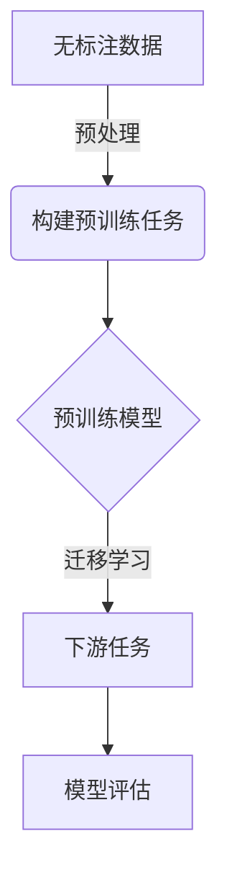

# 自监督学习原理与代码实战案例讲解

## 1.背景介绍

在过去几年中,深度学习取得了令人瞩目的成就,但其高度依赖大量标注数据的缺点也日益凸显。标注高质量数据的过程往往代价高昂且耗时耗力。为了解决这一问题,自监督学习(Self-Supervised Learning)应运而生,它利用无标注数据本身的信息进行模型训练,从而避免了人工标注的需求。

自监督学习的核心思想是通过构建预训练任务,从无标注数据中自动产生监督信号,使模型学习到有价值的表征,进而将预训练模型迁移到下游任务中,提高任务性能。这种方法极大地降低了对标注数据的依赖,同时也为深度学习模型提供了更加通用和健壮的表征能力。

## 2.核心概念与联系

### 2.1 自监督学习的核心概念

1. **预训练(Pretraining)**: 在无标注数据上训练模型,使其学习到有价值的表征。
2. **下游任务(Downstream Task)**: 将预训练模型迁移到具体的有监督任务中,如图像分类、目标检测等。
3. **监督信号(Supervisory Signal)**: 从无标注数据中自动构建的监督信号,用于指导模型训练。
4. **表征学习(Representation Learning)**: 模型从数据中学习到有价值的特征表示。

### 2.2 自监督学习与其他学习范式的联系

- **监督学习(Supervised Learning)**: 利用标注数据进行模型训练,自监督学习可以看作是一种无监督预训练与有监督微调相结合的范式。
- **无监督学习(Unsupervised Learning)**: 自监督学习利用无标注数据进行预训练,可以看作是一种引入监督信号的无监督学习方法。
- **迁移学习(Transfer Learning)**: 自监督学习的预训练模型可以迁移到下游任务中,提高任务性能,属于迁移学习的一种形式。

## 3.核心算法原理具体操作步骤

自监督学习的核心算法原理可以概括为以下几个步骤:

1. **数据预处理**: 对无标注数据进行预处理,如数据增强、数据变换等,以增加数据的多样性。

2. **构建预训练任务**: 设计预训练任务,从无标注数据中自动产生监督信号。常见的预训练任务包括:
   - 遮挡补全(Masked Language Modeling)
   - 下一个词预测(Next Sentence Prediction)
   - 图像补全(Inpainting)
   - 相对位置预测(Relative Patch Location)
   - 旋转角度预测(Rotation Prediction)

3. **预训练模型**: 在无标注数据上训练模型,使其学习到有价值的表征。常用的预训练模型包括:
   - 卷积神经网络(CNN)
   - 自注意力机制(Self-Attention)
   - 变换器(Transformer)

4. **迁移学习**: 将预训练模型迁移到下游任务中,通过微调(Fine-tuning)或特征提取(Feature Extraction)等方式,提高任务性能。

5. **模型评估**: 在测试集上评估模型的性能,并根据需要进行模型调整和优化。

以下是自监督学习的一般流程图:



## 4.数学模型和公式详细讲解举例说明

在自监督学习中,常见的数学模型和公式包括:

### 4.1 遮挡补全(Masked Language Modeling)

遮挡补全是自然语言处理领域中一种常见的预训练任务,其目标是根据上下文预测被遮挡的词。给定一个句子 $X = (x_1, x_2, \ldots, x_n)$,我们随机选择一些位置进行遮挡,得到遮挡后的句子 $\tilde{X} = (x_1, \text{MASK}, x_3, \ldots, \text{MASK})$。模型的目标是最大化被遮挡词的条件概率:

$$\mathcal{L}_\text{MLM} = -\mathbb{E}_{X, \tilde{X}} \left[\sum_{i \in \text{MASK}} \log P(x_i | \tilde{X})\right]$$

其中 $P(x_i | \tilde{X})$ 表示在给定遮挡后句子 $\tilde{X}$ 的情况下,正确预测第 $i$ 个位置的词 $x_i$ 的概率。

### 4.2 下一个词预测(Next Sentence Prediction)

下一个词预测是另一种常见的预训练任务,其目标是判断两个句子是否相邻。给定两个句子 $X^A$ 和 $X^B$,我们需要预测它们是否为连续的句子对。这可以通过二分类任务实现:

$$\mathcal{L}_\text{NSP} = -\mathbb{E}_{X^A, X^B} \left[\log P(y | X^A, X^B)\right]$$

其中 $y \in \{0, 1\}$ 表示两个句子是否相邻,概率 $P(y | X^A, X^B)$ 由模型预测得到。

### 4.3 图像补全(Inpainting)

图像补全是计算机视觉领域中一种常见的预训练任务,其目标是根据上下文预测被遮挡的图像区域。给定一幅图像 $I$,我们随机选择一些区域进行遮挡,得到遮挡后的图像 $\tilde{I}$。模型的目标是最小化重建误差:

$$\mathcal{L}_\text{Inpainting} = \mathbb{E}_{I, \tilde{I}} \left[\|\text{Mask}(I) - \text{Mask}(\hat{I})\|_2^2\right]$$

其中 $\hat{I}$ 是模型预测的重建图像,函数 $\text{Mask}(\cdot)$ 用于提取被遮挡的区域。

这些只是自监督学习中一些常见的数学模型和公式,在实际应用中还有许多其他变体和扩展。

## 5.项目实践:代码实例和详细解释说明

在这一部分,我们将通过一个实际的代码示例,演示如何使用 PyTorch 实现一个简单的自监督学习模型。我们将使用 CIFAR-10 数据集,并构建一个图像补全任务进行预训练。

### 5.1 导入所需库

```python
import torch
import torch.nn as nn
import torch.optim as optim
import torchvision
import torchvision.transforms as transforms
```

### 5.2 定义数据预处理

```python
transform = transforms.Compose([
    transforms.ToTensor(),
    transforms.Normalize((0.5, 0.5, 0.5), (0.5, 0.5, 0.5))
])

trainset = torchvision.datasets.CIFAR10(root='./data', train=True, download=True, transform=transform)
trainloader = torch.utils.data.DataLoader(trainset, batch_size=128, shuffle=True, num_workers=2)
```

### 5.3 定义自监督学习模型

```python
class InpaintingModel(nn.Module):
    def __init__(self):
        super(InpaintingModel, self).__init__()
        self.encoder = nn.Sequential(
            nn.Conv2d(3, 32, kernel_size=3, padding=1),
            nn.ReLU(),
            nn.MaxPool2d(2, stride=2),
            nn.Conv2d(32, 64, kernel_size=3, padding=1),
            nn.ReLU(),
            nn.MaxPool2d(2, stride=2)
        )
        self.decoder = nn.Sequential(
            nn.ConvTranspose2d(64, 32, kernel_size=3, stride=2, padding=1, output_padding=1),
            nn.ReLU(),
            nn.ConvTranspose2d(32, 3, kernel_size=3, stride=2, padding=1, output_padding=1),
            nn.Sigmoid()
        )

    def forward(self, x):
        x = self.encoder(x)
        x = self.decoder(x)
        return x
```

### 5.4 定义损失函数和优化器

```python
criterion = nn.MSELoss()
model = InpaintingModel()
optimizer = optim.Adam(model.parameters(), lr=0.001)
```

### 5.5 训练模型

```python
num_epochs = 10

for epoch in range(num_epochs):
    running_loss = 0.0
    for i, data in enumerate(trainloader, 0):
        inputs, _ = data
        
        # 构建图像补全任务
        masks = torch.bernoulli(torch.ones_like(inputs) * 0.5)
        masked_inputs = inputs * masks
        
        outputs = model(masked_inputs)
        loss = criterion(outputs * masks, inputs * masks)
        
        optimizer.zero_grad()
        loss.backward()
        optimizer.step()
        
        running_loss += loss.item()
        if i % 100 == 99:
            print('[%d, %5d] loss: %.3f' % (epoch + 1, i + 1, running_loss / 100))
            running_loss = 0.0

print('Finished Training')
```

在这个示例中,我们定义了一个简单的自编码器模型 `InpaintingModel`,用于图像补全任务。在每个训练迭代中,我们随机生成一个遮挡掩码 `masks`,将输入图像 `inputs` 与遮挡掩码相乘,得到遮挡后的图像 `masked_inputs`。然后,我们将遮挡后的图像输入到模型中,获得预测的重建图像 `outputs`。我们计算预测图像与原始图像在被遮挡区域的均方误差作为损失函数,并使用 Adam 优化器进行模型训练。

经过预训练后,我们可以将学习到的特征表征迁移到下游任务中,如图像分类、目标检测等,从而提高任务性能。

## 6.实际应用场景

自监督学习在各个领域都有广泛的应用,包括但不限于:

1. **自然语言处理**: 通过预训练语言模型(如 BERT、GPT)学习通用的语义表征,提高下游任务如文本分类、机器翻译、问答系统等的性能。

2. **计算机视觉**: 利用图像补全、相对位置预测等预训练任务,学习视觉表征,提高图像分类、目标检测、语义分割等任务的性能。

3. **语音识别**: 通过预训练语音模型,学习有价值的语音表征,提高语音识别、说话人识别等任务的性能。

4. **推荐系统**: 利用自监督学习技术,从用户行为数据中学习用户和物品的表征,提高推荐系统的准确性。

5. **医疗影像分析**: 在医疗影像数据上进行自监督预训练,学习有价值的医疗影像表征,提高疾病诊断、病灶检测等任务的性能。

6. **金融风险管理**: 通过自监督学习技术,从金融数据中学习有价值的表征,提高风险预测、欺诈检测等任务的性能。

总的来说,自监督学习为各个领域提供了一种有效的表征学习方法,可以充分利用无标注数据,降低对标注数据的依赖,提高下游任务的性能。

## 7.工具和资源推荐

在自监督学习领域,有许多优秀的工具和资源可供参考和使用:

1. **开源框架**:
   - PyTorch: https://pytorch.org/
   - TensorFlow: https://www.tensorflow.org/
   - Hugging Face Transformers: https://huggingface.co/transformers/

2. **预训练模型**:
   - BERT: https://github.com/google-research/bert
   - GPT-2: https://github.com/openai/gpt-2
   - SimCLR: https://github.com/google-research/simclr
   - MoCo: https://github.com/facebookresearch/moco

3. **数据集**:
   - ImageNet: http://www.image-net.org/
   - CIFAR-10/100: https://www.cs.toronto.edu/~kriz/cifar.html
   - WikiText: https://www.salesforce.com/products/einstein/ai-research/the-wikitext-dependency-language-modeling-dataset/

4. **教程和资源**:
   - PyTorch 自监督学习教程: https://pytorch.org/tutorials/stable/beginner/self_supervised_tutorial.html
   - TensorFlow 自监督学习教程: https://www.tensorflow.org/tutorials/generative/self_supervised
   -自监督学习论文列表: https://github.com/jason718/self-supervised-papers

5. **在线课程**:
   - 深度学习专项课程(吴恩达): https://www.coursera.org/specializations/deep-learning
   - 自监督学习课程(OpenAI): https://www.openai.com/self-supervised-learning

这些工具和资源可以帮助您更好地理解