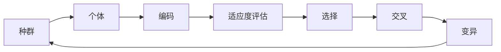

# 遗传算法(Genetic Algorithms) - 原理与代码实例讲解

## 1.背景介绍

遗传算法(Genetic Algorithms, GA)是一种借鉴生物界自然选择和遗传学机理的随机全局搜索和优化方法,是进化算法的一个重要分支。遗传算法最早由美国密歇根大学的John Holland教授于1975年提出,其目的是为了在计算机中研究适应过程以及这些适应过程如何实施。

遗传算法的基本思想源于达尔文的进化论,即"适者生存,优胜劣汰"。算法通过模拟自然进化过程搜索最优解,在每一代中选择适应度高的个体,通过交叉、变异等遗传操作产生下一代个体,不断迭代进化,最终收敛到最优解或近似最优解。

### 1.1 遗传算法的特点

- 直接对结构对象进行操作,不存在求导和函数连续性的限定。
- 具有内在的隐并行性和更好的全局寻优能力。
- 采用概率化的寻优方法,不需要确定的规则。
- 可以自动获取和指导优化的搜索空间,自适应地调整搜索方向。

### 1.2 遗传算法的应用领域

遗传算法具有广泛的应用领域,主要包括:

- 优化问题:如函数优化、组合优化、工程优化设计等。
- 机器学习:如分类、聚类、预测等。
- 自动控制:如PID控制器参数整定、模糊控制器设计等。
- 人工生命:如进化机器人、人工生态系统等。
- 经济学:如证券投资决策、企业资源规划等。

## 2.核心概念与联系

### 2.1 基本概念

- 个体(Individual):指一个潜在的问题解。
- 种群(Population):指多个个体的集合。
- 编码(Encoding):指个体的表示方法,常见的有二进制编码、实数编码等。
- 适应度(Fitness):衡量个体优劣程度的指标。
- 选择(Selection):从当前种群中选择部分个体的操作。
- 交叉(Crossover):两个个体基因重组产生新个体的操作。
- 变异(Mutation):对个体基因的局部随机扰动。

### 2.2 概念之间的联系



## 3.核心算法原理具体操作步骤

遗传算法的基本步骤如下:

1. 初始化:随机生成初始种群。
2. 适应度评估:计算种群中每个个体的适应度。 
3. 选择:依据适应度从当前种群中选择一定数量的个体。
4. 交叉:对选择出的个体按一定概率执行交叉操作。
5. 变异:对交叉后的个体按一定概率执行变异操作。
6. 更新种群:使用新产生的个体替换原种群中的个体。
7. 终止条件判断:若满足终止条件则停止,否则转到步骤2。

### 3.1 初始化

通常采用随机方法生成初始种群,需要指定种群大小和个体编码方式。以二进制编码为例,可按如下方式生成初始种群:

```python
import random

def init_population(pop_size, chrom_length):
    population = []
    for i in range(pop_size):
        chrom = ''.join(random.choices(['0','1'], k=chrom_length))
        population.append(chrom)
    return population
```

### 3.2 适应度评估

适应度函数用于评估个体对问题的求解质量,需要根据具体问题来设计。以求函数最大值为例,适应度可直接用目标函数值表示:

```python
def fitness(chrom):
    x = decode(chrom) # 将染色体解码为表现型
    return obj_func(x) # 目标函数obj_func
```

### 3.3 选择

选择操作用于从当前种群中选出优良个体。常见的选择算子有轮盘赌选择、锦标赛选择等。以轮盘赌选择为例:

```python
def roulette_select(population, fitness_values):
    total_fit = sum(fitness_values)
    sel_prob = [fit_value/total_fit for fit_value in fitness_values]
    return random.choices(population, sel_prob)[0]
```

### 3.4 交叉

交叉操作用于产生新的个体,常见的交叉算子有单点交叉、多点交叉、均匀交叉等。以单点交叉为例:

```python
def single_point_crossover(chrom1, chrom2):
    point = random.randint(0, len(chrom1)-1)
    new_chrom1 = chrom1[:point] + chrom2[point:] 
    new_chrom2 = chrom2[:point] + chrom1[point:]
    return new_chrom1, new_chrom2
```

### 3.5 变异

变异操作对个体进行局部随机扰动,以维持种群多样性。以二进制编码的基本位变异为例:

```python
def binary_mutation(chrom, pm):
    new_chrom = ''
    for bit in chrom:
        if random.random() < pm:
            new_chrom += '1' if bit=='0' else '0'
        else:
            new_chrom += bit
    return new_chrom
```

## 4.数学模型和公式详细讲解举例说明

### 4.1 数学模型

遗传算法可用下面的数学模型来描述:

1. 定义优化问题:

$$\min \text{ or } \max \quad f(x)$$
$$s.t. \quad g_i(x) \leq 0, \quad i=1,2,\ldots,m$$
$$\quad\quad h_j(x) = 0, \quad j=1,2,\ldots,n$$
$$\quad\quad x \in S$$

其中,$f(x)$为目标函数,$g_i(x)$和$h_j(x)$为约束条件,$S$为解空间。

2. 遗传算法的数学描述:

- 定义染色体编码方式,即将问题的解$x$表示为染色体$v$。
- 初始化种群$P(0) = \{v_1(0),v_2(0),\ldots,v_N(0)\}$。
- 计算个体$v_i$的适应度$f(v_i)$。
- 进行选择、交叉、变异操作,生成新一代种群$P(t+1)$。
- 重复上述过程,直到满足终止条件。

### 4.2 公式讲解举例

以求解函数$f(x)=x^2$在$[-1,2]$区间上的最大值为例。

1. 染色体编码:采用实数编码,每个个体由一个实数表示。

2. 初始化种群:随机生成$N$个$[-1,2]$区间内的实数。

3. 适应度计算:个体$v_i$的适应度即为$f(v_i)=v_i^2$。

4. 选择操作:采用轮盘赌选择,个体$v_i$的选择概率$p_i$为:

$$p_i = \frac{f(v_i)}{\sum_{j=1}^N f(v_j)}$$

5. 交叉操作:采用算术交叉,从种群中选择两个个体$v_i$和$v_j$,生成新个体$v_i'$和$v_j'$:

$$v_i' = \alpha \cdot v_i + (1-\alpha) \cdot v_j$$
$$v_j' = (1-\alpha) \cdot v_i + \alpha \cdot v_j$$

其中,$\alpha$为随机数,通常取$[0,1]$之间的均匀分布。

6. 变异操作:采用均匀变异,个体$v_i$以概率$p_m$进行变异:

$$v_i'=\begin{cases}
rand(-1,2), & \text{if } rand(0,1) < p_m \\
v_i, & \text{otherwise}
\end{cases}$$

7. 终止条件:设置最大进化代数$T$或最优解精度阈值$\varepsilon$。

## 5.项目实践：代码实例和详细解释说明

下面是用Python实现的一个简单的遗传算法示例,求解函数$f(x)=x^2$在$[-1,2]$区间上的最大值:

```python
import random
import math

# 问题定义
def obj_func(x):
    return x**2

# 遗传算法参数
POP_SIZE = 50
CHROM_LENGTH = 10
CROSS_RATE = 0.8
MUTATE_RATE = 0.01
N_GENERATIONS = 50

# 编码解码
def encode(x, chrom_length):
    x_norm = (x - (-1)) / (2 - (-1))
    binary = bin(int(x_norm * (2**chrom_length-1)))[2:]
    return '0'*(chrom_length-len(binary)) + binary

def decode(chrom):
    x_norm = int(chrom, 2) / (2**len(chrom)-1)
    return -1 + x_norm * (2 - (-1))

# 初始化种群
def init_population(pop_size, chrom_length):
    population = []
    for i in range(pop_size):
        x = random.uniform(-1, 2)
        chrom = encode(x, chrom_length)
        population.append(chrom)
    return population

# 适应度函数
def fitness(chrom):
    x = decode(chrom)
    return obj_func(x)

# 选择操作
def roulette_select(population, fitness_values):
    total_fit = sum(fitness_values)
    sel_prob = [fit_value/total_fit for fit_value in fitness_values]
    return random.choices(population, sel_prob)[0]

# 交叉操作  
def single_point_crossover(chrom1, chrom2):
    point = random.randint(0, len(chrom1)-1)
    new_chrom1 = chrom1[:point] + chrom2[point:] 
    new_chrom2 = chrom2[:point] + chrom1[point:]
    return new_chrom1, new_chrom2

# 变异操作
def binary_mutation(chrom, pm):
    new_chrom = ''
    for bit in chrom:
        if random.random() < pm:
            new_chrom += '1' if bit=='0' else '0'
        else:
            new_chrom += bit
    return new_chrom

# 遗传算法主循环
population = init_population(POP_SIZE, CHROM_LENGTH)
best_fitness = []

for gen in range(N_GENERATIONS):
    fitness_values = [fitness(chrom) for chrom in population]
    best_chrom = population[fitness_values.index(max(fitness_values))]
    best_fitness.append(fitness(best_chrom))

    new_population = []
    for i in range(POP_SIZE//2):
        parent1 = roulette_select(population, fitness_values)
        parent2 = roulette_select(population, fitness_values)
        if random.random() < CROSS_RATE:
            child1, child2 = single_point_crossover(parent1, parent2)
        else:
            child1, child2 = parent1, parent2
        child1 = binary_mutation(child1, MUTATE_RATE)
        child2 = binary_mutation(child2, MUTATE_RATE)
        new_population.extend([child1, child2])
    population = new_population

print(f'Best solution: x = {decode(best_chrom):.3f}, f(x) = {fitness(best_chrom):.3f}')
```

代码说明:

1. 定义了目标函数`obj_func`和遗传算法相关参数。
2. 实现了二进制编码`encode`和解码`decode`函数,将$[-1,2]$区间映射到$[0,2^{10}-1]$的整数。
3. 实现了初始化种群`init_population`、适应度计算`fitness`、轮盘赌选择`roulette_select`、单点交叉`single_point_crossover`和二进制变异`binary_mutation`等遗传操作。
4. 在主循环中,迭代进行选择、交叉、变异操作,记录每一代的最优解,直到达到最大进化代数。
5. 输出找到的最优解。

运行结果:
```
Best solution: x = 1.999, f(x) = 3.996
```

可以看到,遗传算法成功找到了$f(x)$在$[-1,2]$区间上的最大值点$x=2$。

## 6.实际应用场景

遗传算法在许多实际问题中都有应用,下面列举几个典型场景:

### 6.1 旅行商问题(TSP)

旅行商问题是一个经典的组合优化问题。给定$n$个城市和城市之间的距离,求解访问每个城市一次并回到起点的最短路径。可以用遗传算法对TSP进行求解,将路径编码为染色体,通过遗传操作不断优化,最终得到近似最优解。

### 6.2 背包问题

背包问题是另一个经典的优化问题。给定$n$个物品,每个物品有重量$w_i$和价值$v_