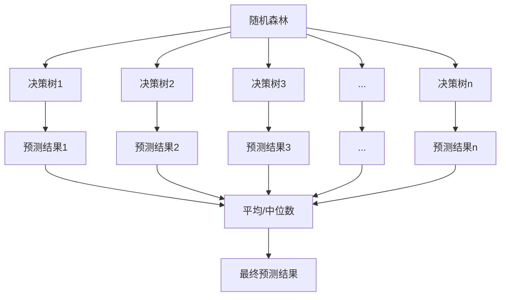

# 随机森林 原理与代码实例讲解

## 1.背景介绍

随机森林是一种流行的集成学习算法,它通过构建多个决策树并将它们的预测结果进行组合,从而提高了模型的准确性和鲁棒性。随机森林在解决分类和回归问题时都表现出色,并广泛应用于多个领域,如计算机视觉、自然语言处理、生物信息学等。

### 1.1 什么是集成学习?

集成学习(Ensemble Learning)是一种将多个弱学习器(Weak Learner)组合成一个强学习器(Strong Learner)的机器学习范式。每个弱学习器单独作出预测时,其准确性可能不高,但通过合理地组合多个弱学习器的预测结果,可以获得比任何一个单一学习器更好的综合性能。

### 1.2 为什么需要随机森林?

单一决策树存在过拟合的风险,即在训练数据上表现良好,但在新的测试数据上表现不佳。随机森林通过构建多个决策树并对它们的预测结果进行平均,从而减少了过拟合的风险,提高了模型的泛化能力。此外,随机森林还具有以下优点:

- 鲁棒性强,对异常值不敏感
- 可以处理高维数据,无需进行特征选择
- 可以估计特征的重要性
- 训练速度快,可以有效利用多核处理器进行并行计算

## 2.核心概念与联系

### 2.1 决策树

决策树是一种树形结构的监督学习算法,它通过对特征进行递归分割来构建一个决策树模型。决策树由节点和边组成,每个内部节点代表一个特征,边代表该特征取值的不同情况,而叶节点则代表最终的预测结果。

在构建决策树时,我们需要选择一个最优特征进行分割,通常使用信息增益或基尼指数作为分割标准。信息增益衡量了使用该特征进行分割后,数据的无序程度降低了多少。基尼指数衡量了数据集的不纯度,值越小表示数据集越纯。

$$
\begin{aligned}
\text{信息增益}(D, a) &= \text{熵}(D) - \sum_{v=1}^{V} \frac{|D^v|}{|D|} \text{熵}(D^v) \\
\text{基尼指数}(D) &= 1 - \sum_{k=1}^{K} p_k^2
\end{aligned}
$$

其中 $D$ 表示数据集, $a$ 表示特征, $V$ 表示特征 $a$ 的取值个数, $D^v$ 表示特征 $a$ 取值为 $v$ 的子集, $K$ 表示类别个数, $p_k$ 表示第 $k$ 类的概率。

### 2.2 随机森林

随机森林是一种集成学习方法,它通过构建多个决策树并对它们的预测结果进行平均,从而提高了模型的准确性和鲁棒性。随机森林的核心思想是通过引入随机性来减少决策树之间的相关性,从而降低过拟合的风险。

在构建每个决策树时,随机森林会从以下两个方面引入随机性:

1. **随机数据采样**: 对于每棵决策树,我们从原始训练集中随机抽取一部分样本作为该树的训练集,这种采样方式称为有放回抽样(Bootstrapping)。
2. **随机特征选择**: 在每个节点进行分割时,不是从所有特征中选择最优特征,而是从随机选择的一个特征子集中选择最优特征。

通过上述两种随机性的引入,每棵决策树都是基于不同的训练集和特征子集构建的,因此它们之间的差异性增大,相关性降低。在预测时,随机森林会对每棵决策树的预测结果进行平均(分类问题)或求中位数(回归问题),从而获得最终的预测结果。



## 3.核心算法原理具体操作步骤

随机森林算法的核心步骤如下:

1. **随机数据采样**: 对于每棵决策树,从原始训练集中通过有放回抽样的方式随机抽取 $N$ 个样本作为该树的训练集,其中 $N$ 通常等于原始训练集的样本数。
2. **随机特征选择**: 对于每个节点的分割,从所有特征中随机选择 $m$ 个特征作为该节点的特征子集,通常 $m = \sqrt{M}$ (分类问题) 或 $m = M/3$ (回归问题),其中 $M$ 是所有特征的个数。
3. **构建决策树**: 对于每棵决策树,基于该树的训练集和特征子集,使用信息增益或基尼指数作为分割标准,递归地构建决策树,直到满足停止条件(如最大深度、最小样本数等)。
4. **预测结果**: 对于每个测试样本,将其输入到每棵决策树中,获得每棵树的预测结果。对于分类问题,随机森林会对每棵树的预测结果进行投票,选择票数最多的类别作为最终预测结果。对于回归问题,随机森林会对每棵树的预测结果求中位数作为最终预测结果。

## 4.数学模型和公式详细讲解举例说明

### 4.1 基尼指数

基尼指数是一种衡量数据集纯度的指标,它反映了数据集中不同类别样本的混杂程度。基尼指数的取值范围为 $[0, 1]$,值越小表示数据集越纯。

对于一个包含 $K$ 个类别的数据集 $D$,基尼指数的计算公式如下:

$$
\text{Gini}(D) = 1 - \sum_{k=1}^{K} p_k^2
$$

其中 $p_k$ 表示第 $k$ 类样本在数据集 $D$ 中的比例。

例如,对于一个包含两个类别的数据集 $D$,其中第一类样本占 $60\%$,第二类样本占 $40\%$,则基尼指数为:

$$
\begin{aligned}
\text{Gini}(D) &= 1 - (0.6^2 + 0.4^2) \\
&= 1 - (0.36 + 0.16) \\
&= 0.48
\end{aligned}
$$

基尼指数越小,说明数据集越纯,因此在构建决策树时,我们希望选择能够最大程度降低基尼指数的特征进行分割。

### 4.2 信息增益

信息增益是另一种常用的特征选择标准,它衡量了使用某个特征进行分割后,数据集的无序程度降低了多少。信息增益的计算公式如下:

$$
\text{Gain}(D, a) = \text{Ent}(D) - \sum_{v=1}^{V} \frac{|D^v|}{|D|} \text{Ent}(D^v)
$$

其中 $D$ 表示数据集, $a$ 表示特征, $V$ 表示特征 $a$ 的取值个数, $D^v$ 表示特征 $a$ 取值为 $v$ 的子集, $\text{Ent}(D)$ 表示数据集 $D$ 的信息熵。

信息熵是衡量数据集无序程度的指标,它的计算公式如下:

$$
\text{Ent}(D) = -\sum_{k=1}^{K} p_k \log_2 p_k
$$

其中 $K$ 表示类别个数, $p_k$ 表示第 $k$ 类的概率。

例如,对于一个包含两个类别的数据集 $D$,其中第一类样本占 $60\%$,第二类样本占 $40\%$,则信息熵为:

$$
\begin{aligned}
\text{Ent}(D) &= -(0.6 \log_2 0.6 + 0.4 \log_2 0.4) \\
&= -(0.6 \times (-0.737) + 0.4 \times (-1.322)) \\
&= 0.971
\end{aligned}
$$

在构建决策树时,我们希望选择能够最大化信息增益的特征进行分割,从而使得数据集的无序程度降低最多。

## 5.项目实践:代码实例和详细解释说明

以下是使用Python中的scikit-learn库实现随机森林算法的示例代码:

```python
from sklearn.ensemble import RandomForestClassifier
from sklearn.datasets import make_classification
from sklearn.model_selection import train_test_split
from sklearn.metrics import accuracy_score

# 生成模拟数据
X, y = make_classification(n_samples=1000, n_features=10, n_informative=5, random_state=42)

# 划分训练集和测试集
X_train, X_test, y_train, y_test = train_test_split(X, y, test_size=0.2, random_state=42)

# 创建随机森林分类器
rf = RandomForestClassifier(n_estimators=100, max_depth=5, random_state=42)

# 训练模型
rf.fit(X_train, y_train)

# 进行预测
y_pred = rf.predict(X_test)

# 计算准确率
accuracy = accuracy_score(y_test, y_pred)
print(f"Accuracy: {accuracy:.2f}")
```

在上述代码中,我们首先使用scikit-learn提供的`make_classification`函数生成了一个模拟的分类数据集,其中包含1000个样本,10个特征,其中5个特征是信息特征。

接下来,我们使用`train_test_split`函数将数据集划分为训练集和测试集,测试集占20%。

然后,我们创建了一个`RandomForestClassifier`对象,设置了一些参数,如`n_estimators`表示决策树的数量,`max_depth`表示决策树的最大深度。

使用`fit`方法训练随机森林模型,并使用`predict`方法对测试集进行预测。最后,我们计算了预测结果的准确率。

除了分类任务,随机森林也可以用于回归任务。以下是一个回归示例:

```python
from sklearn.ensemble import RandomForestRegressor
from sklearn.datasets import make_regression
from sklearn.model_selection import train_test_split
from sklearn.metrics import mean_squared_error

# 生成模拟数据
X, y = make_regression(n_samples=1000, n_features=10, n_informative=5, random_state=42)

# 划分训练集和测试集
X_train, X_test, y_train, y_test = train_test_split(X, y, test_size=0.2, random_state=42)

# 创建随机森林回归器
rf = RandomForestRegressor(n_estimators=100, max_depth=5, random_state=42)

# 训练模型
rf.fit(X_train, y_train)

# 进行预测
y_pred = rf.predict(X_test)

# 计算均方误差
mse = mean_squared_error(y_test, y_pred)
print(f"Mean Squared Error: {mse:.2f}")
```

在这个例子中,我们使用`make_regression`函数生成了一个模拟的回归数据集,然后创建了一个`RandomForestRegressor`对象。训练和预测的过程与分类任务类似,但我们使用均方误差(Mean Squared Error, MSE)作为评估指标。

## 6.实际应用场景

随机森林算法由于其优秀的性能和易用性,在多个领域都有广泛的应用,包括但不限于:

1. **计算机视觉**: 在图像分类、目标检测和语义分割等任务中,随机森林常被用作基线模型或特征提取器。
2. **自然语言处理**: 在文本分类、情感分析和命名实体识别等任务中,随机森林也表现出色。
3. **生物信息学**: 在基因表达数据分析、蛋白质结构预测和药物设计等领域,随机森林被广泛应用。
4. **金融**: 在信用评分、欺诈检测和风险管理等金融应用中,随机森林也发挥着重要作用。
5. **推荐系统**: 随机森林可以用于构建个性化推荐模型,预测用户对商品或内容的偏好。
6. **异常检测**: 由于随机森林对异常值不敏感,它可以用于检测数据中的异常点或异