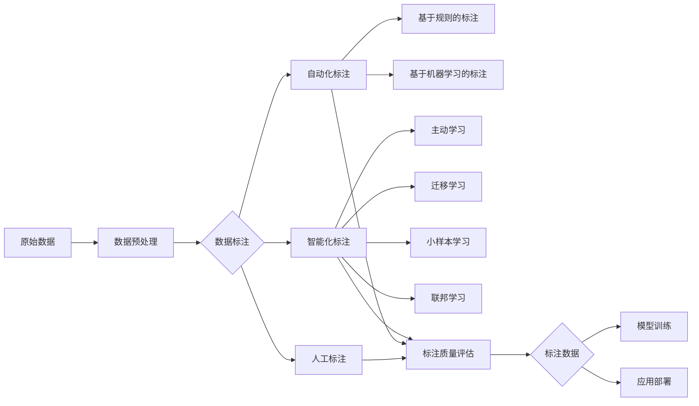

# AI数据标注的未来：自动化、智能化趋势解读

## 1. 背景介绍
### 1.1 数据标注的重要性
在人工智能和机器学习领域,高质量的训练数据是模型性能的关键。而数据标注作为生产高质量训练数据的核心环节,其重要性不言而喻。当前,人工智能正在快速发展,应用领域不断扩大,对高质量标注数据的需求也在持续增长。

### 1.2 传统数据标注面临的挑战
传统的数据标注主要依赖人工完成,存在成本高、效率低、质量不稳定等问题。随着人工智能应用的不断深入,对训练数据的规模和质量要求越来越高,传统的人工标注模式已经难以满足需求。

### 1.3 自动化、智能化标注的兴起
为了应对数据标注面临的挑战,业界开始探索利用人工智能技术实现标注过程的自动化和智能化。通过机器学习和深度学习算法,可以在一定程度上替代人工,提高标注效率和质量。自动化、智能化的趋势正在数据标注领域兴起。

## 2. 核心概念与联系
### 2.1 数据标注的定义与分类
数据标注是指为原始数据添加标签或注释的过程,使数据可被机器学习模型理解和学习。常见的数据标注任务包括:
- 图像分类标注
- 目标检测与分割标注 
- 文本分类与命名实体识别标注
- 语音转文本与声音事件检测标注
- 视频动作识别标注

### 2.2 自动化标注与智能化标注
自动化标注是指利用算法模型自动为数据添加标签,代替人工标注的过程。智能化标注在自动化的基础上,引入更多人工智能技术,实现更加精准、高效的标注。
- 自动化标注的核心是基于规则或简单模型实现标注过程的自动化,减少人工参与。
- 智能化标注融合了深度学习、迁移学习、主动学习、少样本学习等前沿技术,通过模型的自我学习和改进不断提升标注性能。

### 2.3 数据标注与机器学习的关系
数据标注为机器学习提供训练数据,是模型训练的基础。高质量的标注数据可以显著提升模型性能。同时,机器学习也反过来赋能数据标注,自动化和智能化标注算法的核心正是机器学习技术。两者相互促进,共同推动人工智能的发展。

## 3. 核心算法原理与具体操作步骤
### 3.1 基于规则的自动化标注
基于规则的标注通过制定一系列规则,对数据进行自动分类和标注。以文本数据为例,具体步骤包括:
1. 定义标注规则,例如关键词、正则表达式等
2. 对原始文本进行预处理,如分词、去停用词等
3. 遍历文本,根据规则匹配并添加标签
4. 人工检查和修正标注结果

### 3.2 基于机器学习的自动化标注
机器学习标注通过训练分类或标注模型,对数据自动标注。以图像标注为例,具体步骤包括:
1. 人工标注一部分数据作为训练集
2. 选择合适的机器学习模型,如CNN、YOLO等
3. 在训练集上训练标注模型
4. 使用训练好的模型对新数据进行自动标注
5. 人工检查和修正标注结果,将其添加到训练集迭代训练

### 3.3 主动学习与迁移学习
为了进一步减少对人工标注数据的依赖,可以使用主动学习和迁移学习等技术。
- 主动学习根据模型预测的不确定性,选择最有价值的数据让人工标注,从而用最少的标注数据训练模型。
- 迁移学习利用在其他相关任务上训练好的模型,通过微调等方式快速适应新的标注任务,减少所需训练数据。

## 4. 数学模型和公式详细讲解举例说明
### 4.1 文本分类模型
对于文本分类标注任务,常用的模型包括朴素贝叶斯、SVM、CNN、RNN、BERT等。以朴素贝叶斯为例,其核心思想是基于贝叶斯定理计算后验概率:
$$P(y|x) = \frac{P(x|y)P(y)}{P(x)}$$
其中$y$为类别标签,$x$为文本特征。$P(y|x)$即为给定文本特征$x$时类别标签为$y$的后验概率。

假设文本特征独立,则可以将$P(x|y)$展开为各个特征的条件概率乘积:
$$P(x|y) = \prod_{i=1}^{n}P(x_i|y)$$
$P(x_i|y)$可以通过训练集统计得到。最终预测文本$x$的类别标签$\hat{y}$为后验概率最大的类别:
$$\hat{y} = \arg\max_{y} P(y)\prod_{i=1}^{n}P(x_i|y)$$

### 4.2 图像分割模型
图像分割常用的模型有FCN、U-Net、Mask R-CNN等。以U-Net为例,其核心是编码器-解码器结构和跳跃连接:
- 编码器由卷积和池化层组成,提取图像的多尺度特征
- 解码器由上采样和卷积层组成,恢复特征图的空间分辨率
- 跳跃连接将编码器的特征图与解码器的特征图逐元素相加,融合局部和全局信息

U-Net的损失函数通常为交叉熵损失:
$$L = -\frac{1}{N}\sum_{i=1}^{N}\sum_{c=1}^{C}y_{ic}\log p_{ic}$$
其中$y_{ic}$为第$i$个像素属于类别$c$的真实标签,$p_{ic}$为模型预测的概率。

## 5. 项目实践：代码实例和详细解释说明
下面以PyTorch实现一个简单的CNN文本分类模型为例:

```python
import torch
import torch.nn as nn
import torch.nn.functional as F

class TextCNN(nn.Module):
    def __init__(self, vocab_size, embedding_dim, num_classes):
        super(TextCNN, self).__init__()
        self.embedding = nn.Embedding(vocab_size, embedding_dim)
        self.conv1 = nn.Conv1d(embedding_dim, 128, 3)
        self.conv2 = nn.Conv1d(embedding_dim, 128, 4)
        self.conv3 = nn.Conv1d(embedding_dim, 128, 5)
        self.fc = nn.Linear(128*3, num_classes)
        
    def forward(self, x):
        x = self.embedding(x).permute(0, 2, 1) 
        x1 = F.relu(self.conv1(x))
        x2 = F.relu(self.conv2(x))
        x3 = F.relu(self.conv3(x))
        x1 = F.max_pool1d(x1, x1.shape[2])
        x2 = F.max_pool1d(x2, x2.shape[2]) 
        x3 = F.max_pool1d(x3, x3.shape[2])
        x = torch.cat([x1, x2, x3], dim=1).squeeze(2)
        x = self.fc(x)
        return x
```

模型解释:
1. `__init__`方法定义了模型的层结构,包括词嵌入层、3个不同尺度的卷积层和全连接输出层。
2. `forward`方法定义了前向传播过程:
   - 将输入文本转换为词嵌入表示
   - 对词嵌入进行卷积和池化操作,提取局部特征
   - 将3个尺度的特征拼接,并通过全连接层输出分类概率

在实际使用时,还需要准备词汇表、训练数据,并设计训练循环。模型训练完成后,即可用于自动化文本分类标注任务。

## 6. 实际应用场景
自动化智能化数据标注在各个领域都有广泛应用,例如:
- 在电商领域,对商品评论进行情感标注,实现智能客服和评论监控
- 在医疗领域,对医学影像进行病灶标注,辅助疾病诊断和药物研发
- 在安防领域,对监控视频进行行为标注,实现异常行为检测和预警
- 在自动驾驶领域,对道路场景进行目标标注,训练环境感知模型

通过自动化智能化标注技术,可以大幅提升各行各业的数据处理效率和智能化水平。

## 7. 工具和资源推荐
- 数据标注平台: Amazon SageMaker Ground Truth, Labelbox, LabelMe 等
- 开源标注工具: CVAT, LabelImg, Doccano, Label Studio 等
- 机器学习框架: PyTorch, TensorFlow, scikit-learn 等
- 预训练模型: BERT, GPT, YOLO, Mask R-CNN 等

## 8. 总结：未来发展趋势与挑战
### 8.1 自动化智能化标注的发展趋势
- 多模态标注: 融合文本、图像、语音等多种模态数据,实现跨模态的自动化标注
- 小样本学习: 通过元学习、对比学习等技术,在小样本条件下实现高效标注
- 联邦学习: 在保护数据隐私的前提下,实现多方协作的分布式标注
- 持续学习: 通过主动学习和在线学习,使标注模型随着数据的增加不断自我完善

### 8.2 面临的挑战
- 标注质量评估: 如何评估自动化标注的质量,构建可靠的质量评估体系
- 数据安全与隐私: 如何在数据标注过程中保护敏感数据和个人隐私
- 模型可解释性: 如何提升标注模型的可解释性,增强用户对标注结果的信任
- 标注成本优化: 如何权衡标注质量和成本,实现标注过程的成本优化

## 9. 附录：常见问题与解答
### 9.1 自动化智能化标注可以完全取代人工标注吗?
自动化智能化标注可以大幅减少对人工标注的依赖,但在一些复杂、细粒度的标注任务中,仍然需要人工参与。人机协作是未来标注的主要模式。

### 9.2 如何选择合适的自动化标注算法?
需要综合考虑任务类型、数据特点、性能要求等因素。对于简单任务,可以使用基于规则或传统机器学习的方法;对于复杂任务,可以使用基于深度学习的方法。同时还要权衡算法的准确性、效率和可解释性。

### 9.3 自动化智能化标注对标注人员有什么影响?
自动化智能化标注可以减少标注人员的工作量,提高工作效率。同时,标注人员也需要转变角色,从单纯的标注者转变为算法的训练者和质量监督者。标注人员需要掌握更多的人工智能知识和技能。

### 9.4 自动化智能化标注的发展对人工智能产业有何影响?
自动化智能化标注可以加速人工智能的落地应用,促进人工智能产业的发展。高质量的标注数据是人工智能模型的基石,标注技术的进步可以推动计算机视觉、自然语言处理、语音识别等领域的突破。同时,数据标注本身也是一个巨大的潜在市场,孕育着众多创业和就业机会。

作者：禅与计算机程序设计艺术 / Zen and the Art of Computer Programming

## 核心概念原理和架构的Mermaid流程图
