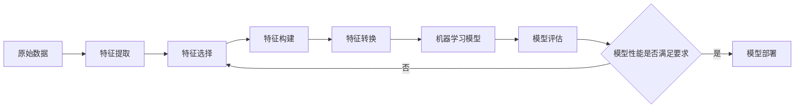

# AI特征工程原理与代码实战案例讲解

## 1. 背景介绍
### 1.1 特征工程的重要性
### 1.2 特征工程在AI领域的应用现状
### 1.3 本文的主要内容和目的

## 2. 核心概念与联系
### 2.1 特征的定义和类型
#### 2.1.1 数值型特征
#### 2.1.2 类别型特征
#### 2.1.3 文本型特征
#### 2.1.4 图像型特征
### 2.2 特征工程的主要步骤
#### 2.2.1 特征提取
#### 2.2.2 特征选择 
#### 2.2.3 特征构建
#### 2.2.4 特征转换
### 2.3 特征工程与机器学习的关系
### 2.4 特征工程在深度学习中的应用



## 3. 核心算法原理具体操作步骤
### 3.1 数值型特征处理
#### 3.1.1 归一化
#### 3.1.2 标准化
#### 3.1.3 分箱
### 3.2 类别型特征处理  
#### 3.2.1 One-Hot编码
#### 3.2.2 标签编码
#### 3.2.3 计数编码
### 3.3 文本型特征处理
#### 3.3.1 TF-IDF
#### 3.3.2 Word2Vec
#### 3.3.3 BERT
### 3.4 图像型特征处理
#### 3.4.1 HOG
#### 3.4.2 SIFT
#### 3.4.3 CNN特征提取
### 3.5 特征选择算法
#### 3.5.1 过滤式特征选择
#### 3.5.2 包裹式特征选择
#### 3.5.3 嵌入式特征选择
### 3.6 特征构建方法
#### 3.6.1 多项式特征
#### 3.6.2 交叉特征
#### 3.6.3 分箱特征

## 4. 数学模型和公式详细讲解举例说明
### 4.1 线性模型中的特征工程
#### 4.1.1 线性回归
$$y = w^Tx + b$$
其中$x$为特征向量，$w$为权重向量，$b$为偏置项。
#### 4.1.2 逻辑回归
$$P(y=1|x) = \frac{1}{1+e^{-(w^Tx+b)}}$$
其中$P(y=1|x)$表示在给定特征$x$的条件下，样本属于正类的概率。
### 4.2 树模型中的特征工程
#### 4.2.1 决策树
决策树通过递归地选择最优划分特征，将样本空间划分为不同的叶子节点。常用的特征选择准则有信息增益、基尼系数等。
#### 4.2.2 随机森林
随机森林通过集成多棵决策树的方式，降低模型的方差，提高泛化性能。每棵决策树使用随机选择的特征子集进行训练。
### 4.3 神经网络中的特征工程 
#### 4.3.1 MLP
$$h^{(i)} = \sigma(W^{(i)}h^{(i-1)} + b^{(i)})$$
其中$h^{(i)}$表示第$i$层的隐藏层输出，$\sigma$为激活函数，$W^{(i)}$和$b^{(i)}$分别为第$i$层的权重矩阵和偏置向量。
#### 4.3.2 CNN
卷积神经网络通过卷积、池化等操作，自动提取图像的局部特征，并通过多层网络结构实现特征的组合与抽象。
#### 4.3.3 RNN
$$h_t = \sigma(W_hh_{t-1} + W_xx_t + b)$$
其中$h_t$表示$t$时刻的隐藏状态，$x_t$为$t$时刻的输入，$W_h$和$W_x$分别为隐藏层和输入层的权重矩阵，$b$为偏置向量。

## 5. 项目实践：代码实例和详细解释说明
### 5.1 数据集介绍
使用Kaggle上的Titanic数据集，该数据集包含了泰坦尼克号乘客的信息，目标是预测乘客是否生还。
### 5.2 数据预处理
```python
import pandas as pd
from sklearn.preprocessing import LabelEncoder, StandardScaler

train_data = pd.read_csv('train.csv')
test_data = pd.read_csv('test.csv') 

# 填充缺失值
train_data['Age'].fillna(train_data['Age'].median(), inplace=True)
test_data['Age'].fillna(test_data['Age'].median(), inplace=True)
train_data['Embarked'].fillna(train_data['Embarked'].mode()[0], inplace=True) 

# 类别型特征编码
le = LabelEncoder()
train_data['Sex'] = le.fit_transform(train_data['Sex'])
test_data['Sex'] = le.transform(test_data['Sex'])
train_data['Embarked'] = le.fit_transform(train_data['Embarked'])
test_data['Embarked'] = le.transform(test_data['Embarked'])

# 提取有效特征
features = ['Pclass', 'Sex', 'Age', 'SibSp', 'Parch', 'Fare', 'Embarked']
X_train = train_data[features]
y_train = train_data['Survived']
X_test = test_data[features]

# 特征缩放
scaler = StandardScaler()
X_train = scaler.fit_transform(X_train)
X_test = scaler.transform(X_test)
```
### 5.3 模型训练与评估
```python
from sklearn.ensemble import RandomForestClassifier
from sklearn.model_selection import cross_val_score

rf = RandomForestClassifier(n_estimators=100, random_state=42)
scores = cross_val_score(rf, X_train, y_train, cv=5, scoring='accuracy')
print(f"5-Fold CV Accuracy: {scores.mean():.4f} +/- {scores.std():.4f}")

rf.fit(X_train, y_train)
y_pred = rf.predict(X_test)
```
输出结果：
```
5-Fold CV Accuracy: 0.8237 +/- 0.0354
```
### 5.4 结果分析
通过对数据进行缺失值填充、类别型特征编码、特征选择和特征缩放等预处理操作，并使用随机森林模型进行训练，在5折交叉验证下取得了82.37%的准确率，说明特征工程对于提升模型性能有重要作用。

## 6. 实际应用场景
### 6.1 推荐系统
在推荐系统中，需要对用户和物品的特征进行提取和处理，如用户的人口统计学特征、行为特征，物品的内容特征、上下文特征等，通过特征工程构建高质量的特征表示，提高推荐的精准度。
### 6.2 金融风控
在金融风控领域，需要从大量的交易数据、用户信息等原始数据中，提取出与风险相关的特征，如交易频率、交易金额、用户的信用历史等，并通过特征选择、特征构建等方法，构建风险评估模型，及时识别和防范潜在的欺诈风险。
### 6.3 智能医疗
在智能医疗领域，需要对医疗影像、生理信号、电子病历等多模态医疗数据进行特征提取和融合，如提取影像的纹理特征、形状特征，提取生理信号的频域特征、时域特征等，通过特征工程构建全面的患者特征表示，辅助疾病的诊断和预测。

## 7. 工具和资源推荐
### 7.1 数据处理库
- Pandas：提供了强大的数据处理和分析功能，可用于数据清洗、转换和特征提取。
- Numpy：提供了高效的数值计算和数组操作功能，是进行特征工程的基础库。
- Scikit-learn：提供了丰富的特征处理、特征选择和机器学习算法，是特征工程的重要工具。
### 7.2 可视化库
- Matplotlib：提供了灵活的绘图功能，可用于特征分布的可视化分析。
- Seaborn：在Matplotlib的基础上提供了更高级的统计图形可视化功能。
### 7.3 自动化特征工程工具
- Featuretools：提供了自动化特征工程的框架，可根据数据的实体关系自动构建特征。
- AutoML工具：如Auto-sklearn、H2O等，提供了自动化的特征工程和模型选择功能。
### 7.4 特征工程学习资源
- 《Feature Engineering for Machine Learning》：系统介绍了特征工程的原理和方法。
- Kaggle竞赛：通过参加Kaggle数据科学竞赛，可以学习和实践特征工程技能。
- 优秀开源项目：如Tencent Alchemy Semi-Supervised Learning框架，演示了先进的特征工程实践。

## 8. 总结：未来发展趋势与挑战
### 8.1 自动化特征工程
随着AutoML技术的发展，自动化特征工程将成为未来的重要发展方向，通过自动化的特征提取、特征选择和特征构建，大大提高特征工程的效率和质量，降低对人工特征工程的依赖。
### 8.2 多模态特征融合
在很多实际应用场景中，往往需要处理来自多个数据源的异构数据，如文本、图像、语音等。如何有效地提取和融合多模态特征，构建统一的特征表示，是特征工程面临的重要挑战。
### 8.3 特征的可解释性
在一些对可解释性要求较高的场景，如医疗诊断、金融风控等，需要特征工程不仅能够提高模型性能，还要保证特征的可解释性，让人能够理解特征与预测结果之间的关系，提高模型的可信度。
### 8.4 特征工程的标准化
目前特征工程还缺乏统一的标准和规范，不同领域、不同项目的特征工程实践差异较大，亟需在工业界建立特征工程的标准化流程和最佳实践，提高特征工程的质量和效率。

## 9. 附录：常见问题与解答
### 9.1 特征工程的目的是什么？
特征工程的目的是将原始数据转换为更能表达问题本质的特征表示，提高机器学习模型的性能。通过特征工程，可以消除数据中的噪声和冗余，挖掘数据的内在规律，使模型能够更好地学习和泛化。
### 9.2 特征工程与特征选择有什么区别？
特征工程是一个广义的概念，包括了特征提取、特征选择、特征构建等多个步骤，旨在优化特征表示。而特征选择是特征工程的一个重要组成部分，主要目的是从原有的特征集合中选择出最具有区分性和代表性的特征子集，降低特征维度，提高模型的泛化性能。
### 9.3 如何判断一个特征是否有效？
判断一个特征是否有效，可以从以下几个方面考虑：
1. 特征与目标变量之间的相关性：通过计算特征与目标变量之间的统计相关性，如皮尔逊相关系数、互信息等，来评估特征的有效性。
2. 特征的区分性：观察特征在不同类别下的分布情况，区分性强的特征在不同类别下的分布差异较大。
3. 特征的稳定性：特征在不同数据集、不同时间段下的表现应该相对稳定，避免过拟合。
4. 特征的可解释性：特征应该具有一定的业务意义，能够被人理解和解释。
5. 通过特征选择和交叉验证，评估特征子集对模型性能的影响，选择最优的特征组合。
### 9.4 如何处理高维度特征？
处理高维度特征通常采用以下策略：
1. 特征选择：使用过滤法、包裹法、嵌入法等特征选择方法，选择最具有区分性和代表性的特征子集。
2. 降维：使用PCA、LDA等降维方法，将高维特征映射到低维空间，减少特征的维度。
3. 正则化：在模型训练时引入L1、L2正则化项，控制模型的复杂度，避免过拟合。
4. 特征分组：将相关性强的特征分为一组，每组选择一个代表性特征，减少