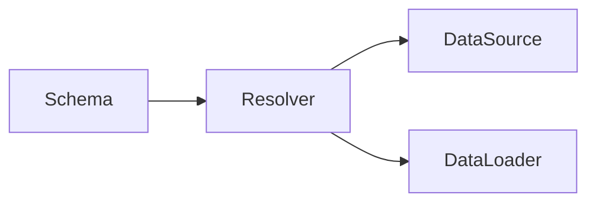
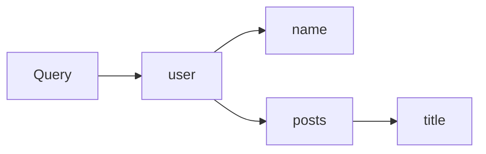

# AI系统GraphQL原理与代码实战案例讲解

## 1. 背景介绍

### 1.1 GraphQL的诞生

GraphQL是由Facebook于2012年开发的一种用于API的查询语言。它最初是为了解决Facebook移动应用面临的一些问题而设计的，例如需要减少移动应用的数据使用量以及提高数据获取效率。

### 1.2 GraphQL的发展历程

- 2015年，Facebook将GraphQL开源。
- 2018年，GraphQL正式发布了1.0版本的规范。
- 2019年，GraphQL基金会成立，负责GraphQL规范的发展和维护。
- 目前，GraphQL已经被众多大型科技公司采用，如GitHub、Twitter、Airbnb等。

### 1.3 GraphQL在AI系统中的应用价值

GraphQL具有灵活性强、效率高、类型安全等特点，非常适合用于构建AI系统的API层。通过GraphQL，可以更高效地获取AI系统所需的数据，提高开发效率和系统性能。同时，GraphQL强大的类型系统也有助于提高AI系统的健壮性和可维护性。

## 2. 核心概念与联系

### 2.1 Schema（类型系统）

- Object Type：定义一个对象类型及其字段。
- Query Type：定义查询操作，即可以查询哪些数据。
- Mutation Type：定义变更操作，即可以如何修改数据。

### 2.2 Resolver（解析器）

Resolver是一个函数，用于解析Schema中定义的字段，从数据源获取数据并返回。每个字段都需要有对应的Resolver。

### 2.3 DataLoader（数据加载器）

DataLoader用于优化Resolver中的数据加载，可以批量加载数据，避免N+1查询问题，提高查询效率。

### 2.4 核心概念之间的关系



Schema定义了数据的类型和结构，Resolver负责根据Schema获取具体的数据。在获取数据的过程中，Resolver可以直接访问数据源，也可以通过DataLoader来优化数据加载。

## 3. 核心算法原理具体操作步骤

### 3.1 Schema定义

1. 使用 GraphQL schema language 定义Object Type、Query Type、Mutation Type。
2. 使用 GraphQL 内置的标量类型和自定义标量类型。
3. 使用参数、指令等特性来丰富Schema的功能。

### 3.2 Resolver实现

1. 定义与Schema对应的Resolver函数。
2. 在Resolver中访问数据源获取数据。
3. 处理复杂数据加载逻辑，如缓存、权限校验等。

### 3.3 DataLoader使用

1. 定义DataLoader批量加载函数。
2. 在Resolver中使用DataLoader加载数据。
3. 优化DataLoader缓存策略提高效率。

### 3.4 查询执行

1. 解析GraphQL查询语句，生成抽象语法树AST。
2. 根据AST，执行相应的Resolver函数获取数据。
3. 将获取到的数据按照查询语句要求的格式进行组装并返回。

## 4. 数学模型和公式详细讲解举例说明

GraphQL的数学模型可以使用图论来表示。一个GraphQL查询可以被看作是一个有向无环图（DAG）。

例如，考虑以下查询：

```graphql
query {
  user(id: 1) {
    name
    posts {
      title
    }
  }
}
```

该查询可以表示为如下的DAG：



在该DAG中，每个节点表示一个字段，边表示字段之间的关系。GraphQL查询引擎会按照DAG的拓扑顺序来执行查询，即先查询user，再查询name和posts，最后查询title。

这种基于DAG的执行模型可以用下面的公式来表示：

$$
R = \bigcup_{i=1}^{n} resolve(N_i, R_{p(N_i)})
$$

其中，$R$表示查询结果，$N_i$表示DAG中的第$i$个节点，$p(N_i)$表示$N_i$的父节点集合，$resolve$表示该节点对应的Resolver函数，$R_{p(N_i)}$表示父节点的查询结果。

这个公式表明，一个节点的查询结果是由其Resolver函数基于父节点的查询结果计算得到的。GraphQL引擎会将所有节点的查询结果按照查询语句要求的格式组合在一起，得到最终的查询结果$R$。

## 5. 项目实践：代码实例和详细解释说明

下面是一个简单的GraphQL服务器示例，使用Node.js和Apollo Server实现。

首先定义Schema：

```js
const typeDefs = gql`
  type User {
    id: ID!
    name: String!
    posts: [Post!]!
  }

  type Post {
    id: ID!
    title: String!
    author: User!
  }

  type Query {
    user(id: ID!): User
    posts: [Post!]!
  }
`;
```

然后实现Resolver：

```js
const resolvers = {
  Query: {
    user(_, { id }) {
      return users.find(user => user.id === id);
    },
    posts() {
      return posts;
    }
  },
  User: {
    posts(user) {
      return posts.filter(post => post.authorId === user.id);
    }
  },
  Post: {
    author(post) {
      return users.find(user => user.id === post.authorId);
    }
  }
};
```

最后创建服务器：

```js
const server = new ApolloServer({ typeDefs, resolvers });

server.listen().then(({ url }) => {
  console.log(`Server ready at ${url}`);
});
```

在这个例子中：

1. 我们定义了User和Post两个Object Type，以及一个Query Type。
2. 在Resolver中，我们分别实现了Query、User、Post三个类型的解析逻辑。
3. Query.user根据id查询单个用户，Query.posts查询所有文章。
4. User.posts根据用户id查询其所写的文章，Post.author根据文章的authorId查询文章作者。

这个示例展示了如何定义Schema和Resolver，以及它们是如何配合工作的。在实际项目中，我们还需要连接真实的数据源，并且可能需要更复杂的查询和变更逻辑。

## 6. 实际应用场景

GraphQL在很多场景下都有广泛的应用，下面是几个常见的应用场景：

### 6.1 微服务架构

在微服务架构中，GraphQL可以作为一个API网关，将多个后端服务的API统一起来，提供一个统一的GraphQL接口给客户端调用。这样可以简化客户端的开发，同时也可以提高后端服务的独立性和可维护性。

### 6.2 移动应用开发

移动应用通常需要从服务器获取数据，但是受限于网络带宽和设备性能，我们希望尽可能减少数据传输量。使用GraphQL，可以让客户端精确地指定需要获取的数据，避免了获取冗余数据的问题，从而显著提升了移动应用的性能和用户体验。

### 6.3 前后端分离

在前后端分离的架构中，前端和后端通过API进行通信。使用GraphQL可以让前端更加灵活地定制所需的数据，后端只需要按需提供数据，减少了前后端的耦合度。同时，GraphQL提供了一套类型系统和校验机制，可以让前后端更好地协作，提高开发效率和代码质量。

### 6.4 AI系统

AI系统通常需要处理大量的数据，并且数据格式和结构可能非常复杂。使用GraphQL可以提供一个灵活且高效的数据查询和变更接口，让AI系统可以更方便地获取和操作所需的数据。同时，GraphQL的类型系统也可以帮助我们更好地组织和管理AI系统的数据模型。

## 7. 工具和资源推荐

### 7.1 GraphQL服务器实现

- Apollo Server：基于Node.js的GraphQL服务器实现，支持多种Web框架。
- graphql-go：Go语言的GraphQL实现。
- Sangria：Scala语言的GraphQL实现。

### 7.2 GraphQL客户端实现

- Apollo Client：支持多种前端框架的GraphQL客户端实现，提供了缓存、性能优化等功能。
- Relay：Facebook官方的GraphQL客户端框架。
- urql：轻量级的GraphQL客户端实现。

### 7.3 学习资源

- 官方文档：https://graphql.org
- How to GraphQL：https://www.howtographql.com
- Apollo Blog：https://www.apollographql.com/blog

## 8. 总结：未来发展趋势与挑战

GraphQL自诞生以来，已经得到了广泛的应用和认可。未来GraphQL还将在以下几个方面持续发展：

1. 工具链的完善：GraphQL的工具链还在不断完善中，未来会有更多成熟、易用的工具出现，进一步提高开发效率。
2. 与新技术的结合：GraphQL将与AI、机器学习、大数据等新技术深度结合，为这些领域提供更好的数据处理方案。
3. 性能优化：随着GraphQL应用规模的增大，性能问题将成为一个重要的挑战。如何优化GraphQL的查询效率，如何处理缓存和批量查询等问题，都需要进一步研究。
4. 标准化：目前GraphQL的规范还在不断发展中，未来可能会出现更多的标准和最佳实践，以规范GraphQL的使用。

总的来说，GraphQL作为一种灵活、高效的数据查询语言，在未来还有很大的发展空间。特别是在AI系统中，GraphQL可以发挥其独特的优势，成为连接AI算法和数据的重要桥梁。

## 9. 附录：常见问题与解答

### 9.1 GraphQL与RESTful API的区别是什么？

与RESTful API相比，GraphQL的主要区别在于：

1. GraphQL是一种查询语言，而RESTful API是一种架构风格。
2. GraphQL通过一个端点提供所有数据，而RESTful API通常有多个端点。
3. GraphQL让客户端来决定获取什么数据，而RESTful API返回的数据格式是固定的。
4. GraphQL有类型系统，而RESTful API没有。

### 9.2 GraphQL的N+1查询问题是什么？如何解决？

N+1查询问题指的是，如果一个查询需要获取N个对象，并且每个对象都需要再进行一次查询，那么总共就需要进行N+1次查询。这会显著降低查询效率。

解决N+1查询问题的常见方法有：

1. 使用DataLoader进行批量查询。
2. 在Schema中使用嵌套查询，一次性获取所有数据。
3. 在Resolver中使用缓存，避免重复查询。

### 9.3 GraphQL如何处理错误？

在GraphQL中，错误处理主要有两种方式：

1. 使用GraphQL的错误响应格式，返回错误信息。
2. 在Resolver中抛出异常，由GraphQL服务器捕获并返回错误信息。

通常，我们会在Schema中定义错误类型，并在Resolver中根据不同的错误情况返回相应的错误信息。客户端可以根据错误信息来进行相应的处理。

---

作者：禅与计算机程序设计艺术 / Zen and the Art of Computer Programming