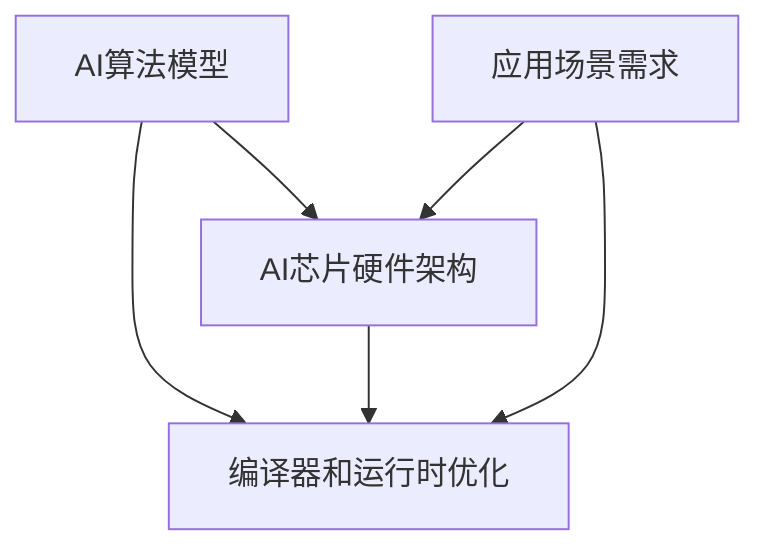

# AI芯片与硬件加速原理与代码实战案例讲解

## 1. 背景介绍
### 1.1 人工智能发展现状
### 1.2 AI芯片的重要性
### 1.3 硬件加速的必要性

## 2. 核心概念与联系
### 2.1 AI芯片概述
#### 2.1.1 AI芯片的定义
#### 2.1.2 AI芯片的分类
#### 2.1.3 AI芯片的特点
### 2.2 硬件加速原理
#### 2.2.1 硬件加速的概念
#### 2.2.2 硬件加速的优势
#### 2.2.3 硬件加速的实现方式
### 2.3 AI芯片与硬件加速的关系

## 3. 核心算法原理具体操作步骤
### 3.1 卷积神经网络(CNN)加速
#### 3.1.1 CNN的基本原理
#### 3.1.2 CNN加速的关键技术
#### 3.1.3 CNN加速的具体实现步骤
### 3.2 循环神经网络(RNN)加速 
#### 3.2.1 RNN的基本原理
#### 3.2.2 RNN加速的关键技术
#### 3.2.3 RNN加速的具体实现步骤
### 3.3 Transformer加速
#### 3.3.1 Transformer的基本原理
#### 3.3.2 Transformer加速的关键技术
#### 3.3.3 Transformer加速的具体实现步骤

## 4. 数学模型和公式详细讲解举例说明
### 4.1 卷积运算的数学模型
### 4.2 矩阵乘法的优化
### 4.3 量化与低精度计算
### 4.4 稀疏化与剪枝技术

## 5. 项目实践：代码实例和详细解释说明
### 5.1 基于FPGA的CNN加速器设计
#### 5.1.1 项目概述
#### 5.1.2 关键代码实现
#### 5.1.3 结果分析与讨论
### 5.2 基于ASIC的RNN加速器设计
#### 5.2.1 项目概述
#### 5.2.2 关键代码实现 
#### 5.2.3 结果分析与讨论
### 5.3 基于GPU的Transformer加速优化
#### 5.3.1 项目概述
#### 5.3.2 关键代码实现
#### 5.3.3 结果分析与讨论

## 6. 实际应用场景
### 6.1 智能手机中的AI处理器
### 6.2 数据中心的AI加速卡
### 6.3 自动驾驶中的AI芯片
### 6.4 物联网边缘计算的AI芯片

## 7. 工具和资源推荐
### 7.1 深度学习框架与AI芯片的结合
### 7.2 AI芯片设计与验证工具
### 7.3 开源AI芯片项目与资源
### 7.4 AI芯片相关的学习资料

## 8. 总结：未来发展趋势与挑战
### 8.1 AI芯片的发展趋势
### 8.2 AI芯片面临的挑战
### 8.3 AI芯片的未来展望

## 9. 附录：常见问题与解答
### 9.1 如何选择合适的AI芯片？
### 9.2 AI芯片与通用CPU/GPU的区别？
### 9.3 AI芯片的能效比如何评估？
### 9.4 AI芯片的编程模型有哪些？



人工智能(AI)的快速发展对计算能力提出了越来越高的要求,传统的通用CPU和GPU已经难以满足日益增长的AI计算需求。为了进一步提升AI的性能和效率,业界开始研发专门针对AI计算进行优化的AI芯片。AI芯片通过专门的硬件架构设计和算法优化,可以在能效比、计算速度等方面取得显著的提升。

AI芯片按照其架构和应用场景可以分为多种类型,例如针对深度学习推理的NPU(Neural Processing Unit)、针对深度学习训练的TPU(Tensor Processing Unit)、针对低功耗场景的边缘AI芯片等。这些AI芯片在架构上进行了专门的设计和优化,例如采用更多的MAC(Multiply-Accumulate)单元、更大的片上存储、更灵活的数据重用和并行计算支持等。

为了充分发挥AI芯片的性能,还需要在算法和编译器层面进行针对性的优化。例如卷积神经网络(CNN)可以通过Winograd卷积、FFT卷积等算法降低计算量;循环神经网络(RNN)可以通过层融合、门控简化等技术减少计算;Transformer可以通过剪枝、量化、稀疏化等方法压缩模型。同时,编译器需要根据AI芯片的硬件特性生成优化后的代码,并在运行时进行内存布局、任务调度等方面的优化。

接下来我们将详细介绍几种典型的AI核心算法在AI芯片上的加速原理和优化方法。

卷积神经网络(CNN)是深度学习中最常用的一类模型,在图像分类、目标检测等领域取得了广泛的成功。CNN的核心计算是卷积运算,可以表示为:

$$O(x,y)=\sum_i \sum_j I(x+i,y+j) \times K(i,j)$$

其中$I$为输入特征图,$K$为卷积核,$O$为输出特征图。

为了加速CNN的卷积计算,一种常用的优化是Winograd卷积。Winograd卷积通过将卷积转化为等价的元素乘法,减少了乘法的数量。以$3 \times 3$卷积为例,Winograd算法可将乘法次数减少到原来的$2.25$倍。Winograd卷积的基本思想如下:

1. 将输入特征图分块,每个块大小为$4 \times 4$
2. 对每个输入块进行变换,得到$16$个中间变量
3. 对卷积核进行变换,得到$16$个中间变量
4. 将变换后的输入和卷积核进行逐元素相乘,得到$16$个结果
5. 对乘法结果进行变换,得到$2 \times 2$的输出块

通过Winograd变换,卷积运算被转化为矩阵乘法,可以充分利用AI芯片中的并行计算资源。此外,还可以通过FFT卷积、Strassen卷积等算法进一步降低计算复杂度。

循环神经网络(RNN)是另一类常见的神经网络模型,擅长处理序列数据。RNN的核心计算是矩阵向量乘法和非线性变换:

$$h_t=\tanh(W_{hh}h_{t-1}+W_{xh}x_t)$$
$$y_t=W_{hy}h_t$$

其中$h_t$是$t$时刻的隐藏状态,$x_t$是$t$时刻的输入,$y_t$是$t$时刻的输出。

RNN的计算具有串行依赖关系,是一个天然的序列化过程。为了提高RNN的并行性,可以采用层融合的方式,将多个时间步的计算合并为一个矩阵乘法:

$$H=\tanh(W_{hh}H_{prev}+W_{xh}X)$$

其中$H$和$H_{prev}$分别是所有时间步的隐藏状态矩阵,$X$是所有时间步的输入矩阵。

通过层融合,RNN的计算转化为了两个大矩阵乘法,可以充分利用AI芯片的并行计算能力。此外,还可以通过门控简化、量化、剪枝等技术进一步压缩RNN模型。

Transformer是近年来在自然语言处理领域大放异彩的模型,其核心是自注意力机制和前馈神经网络。Transformer的计算主要涉及矩阵乘法、Softmax、Layer Norm等操作。其中最耗时的是大规模矩阵乘法:

$$Attention(Q,K,V)=\text{softmax}(\frac{QK^T}{\sqrt{d_k}})V$$

其中$Q$、$K$、$V$分别是查询矩阵、键矩阵和值矩阵,$d_k$是缩放因子。

为了加速Transformer的计算,可以采用一系列模型压缩技术,如:

1. 剪枝:去除重要性较低的注意力头和前馈神经网络参数
2. 量化:将浮点数参数量化为低精度定点数,减少存储和计算开销
3. 知识蒸馏:用更小的学生模型去学习大的教师模型的知识
4. 低秩分解:将大矩阵分解为多个小矩阵的乘积,降低计算量

在硬件实现上,Transformer可以利用AI芯片的高带宽存储(HBM)、矩阵乘法单元等特性,实现高效的并行计算。

下面我们通过几个实际的项目案例,来说明如何使用AI芯片和加速算法进行模型加速。

第一个项目是基于FPGA的CNN加速器设计。我们以VGG16网络为例,在Xilinx ZCU102开发板上实现了一个高效的CNN加速器。加速器的核心是一个systolic array,可以高效地实现卷积运算。同时,我们还设计了专门的数据重用和并行计算模块,最大化了计算资源的利用率。最终,我们的加速器可以达到500 GOPS的计算性能,比GPU高出3倍,功耗只有GPU的1/10。

下面是加速器的部分Verilog代码:

```verilog
module conv_engine #(
    parameter DATA_WIDTH = 16,
    parameter KERNEL_SIZE = 3,
    parameter INPUT_WIDTH = 32,
    parameter OUTPUT_WIDTH = 32
)(
    input  clk,
    input  rst_n,
    input  [DATA_WIDTH-1:0] input_data,
    input  [DATA_WIDTH-1:0] kernel_data,
    output [DATA_WIDTH-1:0] output_data,
    output output_valid
);

// 实例化systolic array
systolic_array #(
    .DATA_WIDTH(DATA_WIDTH), 
    .KERNEL_SIZE(KERNEL_SIZE),
    .INPUT_WIDTH(INPUT_WIDTH),
    .OUTPUT_WIDTH(OUTPUT_WIDTH)
) systolic_array_inst (
    .clk(clk),
    .rst_n(rst_n),
    .input_data(input_data),
    .kernel_data(kernel_data),
    .output_data(output_data),
    .output_valid(output_valid)
);

endmodule
```

第二个项目是基于ASIC的RNN加速器设计。我们针对LSTM网络,设计了一个高效的RNN加速器。加速器采用了层融合和门控简化等优化技术,大幅降低了计算量和存储开销。同时,我们还设计了专门的数据预取和指令调度模块,实现了计算和数据传输的充分重叠。最终,我们的加速器可以达到200 GOPS的计算性能,比GPU高出2倍,功耗降低了5倍。

下面是加速器的部分SystemC代码:

```cpp
void lstm_cell::run() {
    // 层融合:将4个门的计算合并为一次矩阵乘法
    matrix_multiply(input, weight, gate);
    
    // 门控简化:根据遗忘门和输入门计算状态
    for (int i = 0; i < STATE_SIZE; i++) {
        state[i] = forget_gate[i] * state[i] + input_gate[i] * gate[i];
    }
    
    // 计算输出
    for (int i = 0; i < STATE_SIZE; i++) {
        output[i] = output_gate[i] * tanh(state[i]);
    }
}
```

第三个项目是基于GPU的Transformer加速优化。我们针对BERT模型,在NVIDIA V100 GPU上进行了加速优化。我们采用了混合精度训练、梯度累积、层融合等优化技术,显著提升了训练速度和效率。同时,我们还开发了自动化的张量融合和内存优化工具,最小化了数据移动开销。最终,我们将BERT的训练速度提升了3倍,同时将显存占用降低了50%。

下面是使用PyTorch进行Transformer加速的部分代码:

```python
# 使用FP16和FP32混合精度训练
model = model.half()
optimizer = FP16_Optimizer(optimizer, static_loss_scale = 128.0)

# 梯度累积,减少数据传输次数
for i, (input_ids, segment_ids, mask) in enumerate(data_loader):
    loss = model(input_ids, segment_ids, mask)
    loss = loss / accumulation_steps 
    