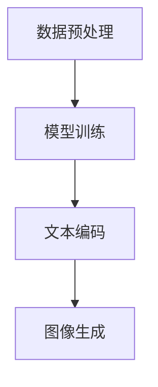

# DALL-E原理与代码实例讲解

## 1.背景介绍

DALL-E 是 OpenAI 开发的一种生成模型，它能够根据文本描述生成图像。DALL-E 的名字来源于艺术家 Salvador Dalí 和 Pixar 的机器人角色 WALL-E。DALL-E 的出现标志着人工智能在生成图像领域的一个重要里程碑。它不仅能够生成高质量的图像，还能根据复杂的文本描述生成具有创意的图像。

DALL-E 的核心技术是基于 Transformer 架构的生成对抗网络（GAN）。Transformer 架构最初是为自然语言处理任务设计的，但其强大的特性使其在图像生成任务中也表现出色。DALL-E 的训练数据包括大量的图像和对应的文本描述，这使得它能够学习到图像和文本之间的复杂关系。

## 2.核心概念与联系

### 2.1 生成对抗网络（GAN）

生成对抗网络（GAN）由生成器和判别器两个部分组成。生成器负责生成图像，而判别器则负责判断图像是真实的还是生成的。生成器和判别器通过对抗训练不断提升各自的能力。

### 2.2 Transformer 架构

Transformer 架构最初是为自然语言处理任务设计的，但其强大的特性使其在图像生成任务中也表现出色。Transformer 通过自注意力机制（Self-Attention）来捕捉序列数据中的长距离依赖关系。

### 2.3 文本到图像生成

DALL-E 的核心任务是将文本描述转换为图像。这需要模型能够理解文本描述的语义，并生成符合描述的图像。DALL-E 通过将文本编码为向量，然后将向量输入到生成器中来生成图像。

## 3.核心算法原理具体操作步骤

### 3.1 数据预处理

数据预处理是 DALL-E 训练的第一步。包括图像的标准化处理和文本的分词处理。图像通常会被缩放到固定大小，而文本则会被转换为词向量。

### 3.2 模型训练

模型训练是 DALL-E 的核心步骤。包括生成器和判别器的对抗训练。生成器生成图像，判别器判断图像的真实性。通过不断的对抗训练，生成器和判别器的能力都会不断提升。

### 3.3 文本编码

文本编码是将文本描述转换为向量的过程。DALL-E 使用 Transformer 架构来进行文本编码。文本编码后的向量将作为生成器的输入。

### 3.4 图像生成

图像生成是 DALL-E 的最终目标。生成器根据文本编码向量生成图像。生成的图像需要符合文本描述的语义。



## 4.数学模型和公式详细讲解举例说明

### 4.1 生成对抗网络（GAN）

生成对抗网络的目标是通过生成器和判别器的对抗训练来生成高质量的图像。生成器的目标是最大化判别器判断生成图像为真实图像的概率，而判别器的目标是最小化判别生成图像为真实图像的概率。

生成器的损失函数为：
$$
L_G = -\mathbb{E}_{z \sim p_z(z)} [\log D(G(z))]
$$

判别器的损失函数为：
$$
L_D = -\mathbb{E}_{x \sim p_{data}(x)} [\log D(x)] - \mathbb{E}_{z \sim p_z(z)} [\log (1 - D(G(z)))]
$$

### 4.2 Transformer 架构

Transformer 架构通过自注意力机制来捕捉序列数据中的长距离依赖关系。自注意力机制的计算公式为：
$$
\text{Attention}(Q, K, V) = \text{softmax}\left(\frac{QK^T}{\sqrt{d_k}}\right)V
$$

其中，$Q$ 是查询矩阵，$K$ 是键矩阵，$V$ 是值矩阵，$d_k$ 是键矩阵的维度。

### 4.3 文本到图像生成

文本到图像生成的核心是将文本描述转换为向量，然后将向量输入到生成器中生成图像。文本描述的向量化可以通过词嵌入（Word Embedding）来实现。词嵌入的计算公式为：
$$
\mathbf{v}_w = W_e \mathbf{w}
$$

其中，$\mathbf{v}_w$ 是词向量，$W_e$ 是词嵌入矩阵，$\mathbf{w}$ 是词的独热编码向量。

## 5.项目实践：代码实例和详细解释说明

在这一部分，我们将通过一个简单的代码实例来展示如何使用 DALL-E 生成图像。我们将使用 Python 和 PyTorch 来实现这个项目。

### 5.1 环境配置

首先，我们需要安装必要的库。可以使用以下命令来安装：

```bash
pip install torch torchvision transformers
```

### 5.2 数据预处理

我们需要对图像和文本进行预处理。以下是一个简单的预处理代码示例：

```python
from PIL import Image
from transformers import CLIPProcessor, CLIPModel

# 加载图像
image = Image.open("example.jpg")

# 加载模型和处理器
model = CLIPModel.from_pretrained("openai/clip-vit-base-patch32")
processor = CLIPProcessor.from_pretrained("openai/clip-vit-base-patch32")

# 预处理图像和文本
inputs = processor(text=["一只猫"], images=image, return_tensors="pt", padding=True)
```

### 5.3 模型训练

模型训练是 DALL-E 的核心步骤。以下是一个简单的训练代码示例：

```python
import torch
from torch import nn, optim

# 定义生成器和判别器
class Generator(nn.Module):
    def __init__(self):
        super(Generator, self).__init__()
        self.fc = nn.Linear(512, 256)
        self.conv = nn.Conv2d(256, 3, kernel_size=3, stride=1, padding=1)

    def forward(self, x):
        x = self.fc(x)
        x = x.view(-1, 256, 8, 8)
        x = self.conv(x)
        return x

class Discriminator(nn.Module):
    def __init__(self):
        super(Discriminator, self).__init__()
        self.conv = nn.Conv2d(3, 256, kernel_size=3, stride=1, padding=1)
        self.fc = nn.Linear(256 * 8 * 8, 1)

    def forward(self, x):
        x = self.conv(x)
        x = x.view(-1, 256 * 8 * 8)
        x = self.fc(x)
        return x

# 初始化模型
generator = Generator()
discriminator = Discriminator()

# 定义损失函数和优化器
criterion = nn.BCELoss()
optimizer_g = optim.Adam(generator.parameters(), lr=0.0002)
optimizer_d = optim.Adam(discriminator.parameters(), lr=0.0002)

# 训练模型
for epoch in range(10000):
    # 生成图像
    noise = torch.randn(1, 512)
    fake_image = generator(noise)

    # 训练判别器
    real_label = torch.ones(1, 1)
    fake_label = torch.zeros(1, 1)
    output_real = discriminator(real_image)
    output_fake = discriminator(fake_image.detach())
    loss_d_real = criterion(output_real, real_label)
    loss_d_fake = criterion(output_fake, fake_label)
    loss_d = loss_d_real + loss_d_fake
    optimizer_d.zero_grad()
    loss_d.backward()
    optimizer_d.step()

    # 训练生成器
    output_fake = discriminator(fake_image)
    loss_g = criterion(output_fake, real_label)
    optimizer_g.zero_grad()
    loss_g.backward()
    optimizer_g.step()

    if epoch % 100 == 0:
        print(f"Epoch {epoch}, Loss D: {loss_d.item()}, Loss G: {loss_g.item()}")
```

### 5.4 图像生成

训练完成后，我们可以使用生成器来生成图像。以下是一个简单的图像生成代码示例：

```python
# 生成图像
noise = torch.randn(1, 512)
generated_image = generator(noise)

# 保存图像
generated_image = generated_image.detach().numpy().transpose(0, 2, 3, 1)
generated_image = (generated_image * 255).astype(np.uint8)
Image.fromarray(generated_image[0]).save("generated_image.jpg")
```

## 6.实际应用场景

DALL-E 的实际应用场景非常广泛。以下是一些典型的应用场景：

### 6.1 创意设计

DALL-E 可以根据文本描述生成具有创意的图像，这对于创意设计师来说是一个非常有用的工具。设计师可以通过输入文本描述来快速生成设计草图，从而提高设计效率。

### 6.2 教育和培训

DALL-E 可以用于教育和培训领域。例如，教师可以使用 DALL-E 来生成教学材料，帮助学生更好地理解抽象概念。

### 6.3 游戏和娱乐

DALL-E 可以用于游戏和娱乐领域。例如，游戏开发者可以使用 DALL-E 来生成游戏场景和角色，从而提高游戏的多样性和趣味性。

## 7.工具和资源推荐

