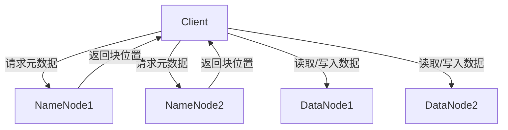

# HDFS联邦机制：扩展NameNode，提升集群规模

## 1.背景介绍

随着大数据技术的迅猛发展，Hadoop分布式文件系统（HDFS）成为了处理海量数据的核心组件。然而，传统的HDFS架构中，单一NameNode的设计限制了系统的扩展性和可靠性。为了应对这一挑战，HDFS引入了联邦机制（Federation），通过扩展NameNode来提升集群规模和性能。

## 2.核心概念与联系

### 2.1 HDFS架构概述

HDFS由NameNode和DataNode组成。NameNode负责管理文件系统的元数据，而DataNode负责存储实际的数据块。传统HDFS架构中，只有一个NameNode，这导致了单点故障和扩展性问题。

### 2.2 联邦机制的引入

HDFS联邦机制通过引入多个NameNode，每个NameNode管理一个独立的命名空间（Namespace），从而解决了单点故障和扩展性问题。每个命名空间可以独立扩展，互不干扰。

### 2.3 联邦机制的工作原理

在联邦机制中，多个NameNode共享底层的DataNode。每个NameNode管理自己的命名空间和块池（Block Pool），DataNode则负责存储来自不同NameNode的块数据。

## 3.核心算法原理具体操作步骤

### 3.1 NameNode的扩展

在联邦机制中，添加新的NameNode非常简单。只需在配置文件中添加新的NameNode配置，并启动新的NameNode进程即可。

### 3.2 命名空间的管理

每个NameNode管理一个独立的命名空间。命名空间之间互不干扰，可以独立扩展和管理。

### 3.3 数据块的存储

DataNode负责存储来自不同NameNode的块数据。每个块数据都有一个唯一的块ID和所属的块池ID。

### 3.4 数据访问流程

当客户端访问数据时，会首先与对应的NameNode通信，获取数据块的位置信息。然后，客户端直接与DataNode通信，读取或写入数据块。



## 4.数学模型和公式详细讲解举例说明

### 4.1 命名空间和块池的数学模型

设 $N$ 为NameNode的数量，$D$ 为DataNode的数量，$B$ 为数据块的数量。每个NameNode管理一个独立的命名空间 $NS_i$，其中 $i \in [1, N]$。每个命名空间包含一个块池 $BP_i$，其中 $i \in [1, N]$。

### 4.2 数据块的分布

数据块 $B_j$ 存储在DataNode $D_k$ 上，其中 $j \in [1, B]$，$k \in [1, D]$。每个数据块都有一个唯一的块ID $ID_j$ 和所属的块池ID $BP_i$。

### 4.3 数据访问的数学模型

客户端请求数据块 $B_j$ 时，首先与NameNode $NS_i$ 通信，获取数据块 $B_j$ 的位置信息。然后，客户端直接与DataNode $D_k$ 通信，读取或写入数据块 $B_j$。

$$
\text{Client} \xrightarrow{\text{请求元数据}} \text{NameNode}_{NS_i} \xrightarrow{\text{返回块位置}} \text{Client} \xrightarrow{\text{读取/写入数据}} \text{DataNode}_{D_k}
$$

## 5.项目实践：代码实例和详细解释说明

### 5.1 配置文件示例

在HDFS联邦机制中，配置文件需要定义多个NameNode和对应的命名空间。以下是一个示例配置文件：

```xml
<configuration>
    <property>
        <name>dfs.nameservices</name>
        <value>ns1,ns2</value>
    </property>
    <property>
        <name>dfs.ha.namenodes.ns1</name>
        <value>nn1,nn2</value>
    </property>
    <property>
        <name>dfs.ha.namenodes.ns2</name>
        <value>nn3,nn4</value>
    </property>
    <property>
        <name>dfs.namenode.rpc-address.ns1.nn1</name>
        <value>namenode1:8020</value>
    </property>
    <property>
        <name>dfs.namenode.rpc-address.ns1.nn2</name>
        <value>namenode2:8020</value>
    </property>
    <property>
        <name>dfs.namenode.rpc-address.ns2.nn3</name>
        <value>namenode3:8020</value>
    </property>
    <property>
        <name>dfs.namenode.rpc-address.ns2.nn4</name>
        <value>namenode4:8020</value>
    </property>
</configuration>
```

### 5.2 启动NameNode和DataNode

在配置文件中定义好NameNode和DataNode后，可以使用以下命令启动NameNode和DataNode：

```bash
$ hdfs namenode -format
$ start-dfs.sh
```

### 5.3 数据访问示例

以下是一个简单的Java代码示例，展示了如何在HDFS联邦机制中访问数据：

```java
import org.apache.hadoop.conf.Configuration;
import org.apache.hadoop.fs.FileSystem;
import org.apache.hadoop.fs.Path;

public class HDFSClient {
    public static void main(String[] args) throws Exception {
        Configuration conf = new Configuration();
        conf.set("fs.defaultFS", "hdfs://ns1");
        FileSystem fs = FileSystem.get(conf);

        Path path = new Path("/user/hadoop/test.txt");
        if (fs.exists(path)) {
            System.out.println("File exists");
        } else {
            System.out.println("File does not exist");
        }
    }
}
```

## 6.实际应用场景

### 6.1 大数据分析

在大数据分析场景中，数据量巨大，单一NameNode无法满足需求。通过引入HDFS联邦机制，可以扩展NameNode，提升系统的扩展性和性能。

### 6.2 云计算平台

在云计算平台中，多个租户共享同一个HDFS集群。通过HDFS联邦机制，可以为每个租户分配独立的命名空间，提升系统的隔离性和安全性。

### 6.3 数据湖

在数据湖场景中，数据种类繁多，存储需求多样。通过HDFS联邦机制，可以为不同类型的数据分配独立的命名空间，提升系统的管理和扩展能力。

## 7.工具和资源推荐

### 7.1 Hadoop官方文档

Hadoop官方文档提供了详细的HDFS联邦机制介绍和配置指南，是学习和使用HDFS联邦机制的重要资源。

### 7.2 HDFS联邦机制教程

网上有许多HDFS联邦机制的教程和博客文章，可以帮助读者更好地理解和使用HDFS联邦机制。

### 7.3 开源工具

许多开源工具可以帮助管理和监控HDFS联邦机制，例如Apache Ambari、Cloudera Manager等。

## 8.总结：未来发展趋势与挑战

HDFS联邦机制通过引入多个NameNode，解决了传统HDFS架构中的单点故障和扩展性问题。然而，随着数据量的不断增长和应用场景的不断变化，HDFS联邦机制也面临着新的挑战。例如，如何更好地管理和监控多个NameNode，如何提升系统的可靠性和性能等。未来，HDFS联邦机制将继续发展和完善，为大数据处理提供更加高效和可靠的解决方案。

## 9.附录：常见问题与解答

### 9.1 HDFS联邦机制与传统HDFS架构的区别是什么？

HDFS联邦机制通过引入多个NameNode，每个NameNode管理一个独立的命名空间，从而解决了传统HDFS架构中的单点故障和扩展性问题。

### 9.2 如何配置和启动HDFS联邦机制？

在配置文件中定义多个NameNode和对应的命名空间，然后使用命令启动NameNode和DataNode。

### 9.3 HDFS联邦机制的实际应用场景有哪些？

HDFS联邦机制适用于大数据分析、云计算平台和数据湖等场景，可以提升系统的扩展性、隔离性和管理能力。

### 9.4 HDFS联邦机制的未来发展趋势是什么？

未来，HDFS联邦机制将继续发展和完善，解决管理和监控多个NameNode、提升系统可靠性和性能等问题，为大数据处理提供更加高效和可靠的解决方案。

---

作者：禅与计算机程序设计艺术 / Zen and the Art of Computer Programming