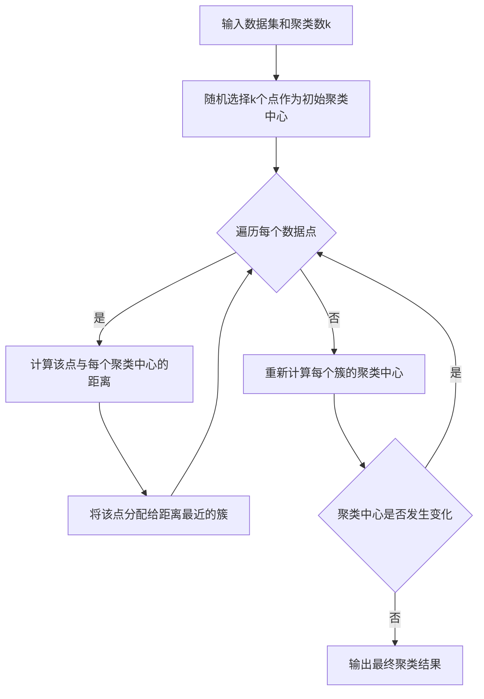

# K-Means聚类的可解释AI:让聚类结果更加透明可信

## 1.背景介绍
### 1.1 聚类分析概述
聚类分析是一种无监督学习方法,旨在将相似的数据点分组到同一个簇中,而不同的数据点分到不同的簇中。它在数据挖掘、模式识别、图像分割等领域有广泛应用。

### 1.2 K-Means聚类算法
K-Means是最常用、最经典的聚类算法之一。它以k为参数,把n个数据对象划分为k个聚类,使得每个聚类内的数据对象相似度较高,而不同聚类间的数据对象相似度较低。

### 1.3 可解释AI的重要性
随着AI和机器学习的快速发展,模型的复杂度和黑盒特性日益增加。为了让用户信任并采纳AI的决策,我们需要赋予模型以可解释性,让其内部逻辑和推理过程透明可查,这就是可解释AI。

## 2.核心概念与联系
### 2.1 聚类 Clustering
聚类就是将物理或抽象对象的集合组织成为类似的对象组成的多个类的过程。组成聚类的类称为簇。

### 2.2 K-Means
K-Means通过迭代寻找k个聚类的一种划分方案,使得用于度量聚类效果的代价函数最小。

### 2.3 可解释性 Interpretability
可解释性指让人理解决策是如何做出的,并解释决策背后的逻辑。它回答了为什么这样做出决定的问题。

### 2.4 概念之间的联系
通过引入可解释性,我们可以更好地理解K-Means聚类的结果。不仅告诉我们数据点属于哪个簇,还能解释这种划分的原因。这大大提高了聚类结果的可信度。

## 3.核心算法原理具体操作步骤
K-Means聚类算法按照如下步骤进行:
1. 随机选择k个对象作为初始聚类中心 
2. 对剩余的每个对象,根据其与聚类中心的距离,将它赋给最近的簇
3. 重新计算每个簇的聚类中心
4. 重复第2、3步,直到聚类中心不再发生变化

可以用下面的Mermaid流程图来表示:


## 4.数学模型和公式详细讲解举例说明
### 4.1 相似度度量
K-Means使用欧氏距离作为相似度的度量。两个n维数据点 $x_i=(x_{i1},x_{i2},...,x_{in})$ 和 $x_j=(x_{j1},x_{j2},...,x_{jn})$ 之间的欧氏距离定义为:

$$
d(x_i,x_j)=\sqrt{\sum_{k=1}^n (x_{ik}-x_{jk})^2}
$$

### 4.2 代价函数
K-Means的代价函数定义为每个点到其所属簇的中心点的距离平方和:

$$
J=\sum_{i=1}^k \sum_{x\in C_i} ||x-\mu_i||^2
$$

其中 $\mu_i$ 是簇 $C_i$ 的中心点。K-Means的目标就是最小化这个代价函数。

### 4.3 聚类中心的计算
簇 $C_i$ 的聚类中心 $\mu_i$ 的计算公式为:

$$
\mu_i=\frac{1}{|C_i|} \sum_{x\in C_i} x
$$

即簇内所有点的均值向量。

举例说明:假设我们有4个二维数据点(1,1),(1,2),(4,1),(5,1),令k=2。如果初始聚类中心为(1,1)和(4,1),那么(1,2)会被分到第一个簇,(5,1)会被分到第二个簇。然后重新计算聚类中心,第一个簇的新中心为(1,1.5),第二个簇的新中心为(4.5,1)。如此迭代直到聚类中心不再改变。

## 5.项目实践:代码实例和详细解释说明
下面是用Python实现K-Means聚类的代码示例:

```python
import numpy as np

class KMeans:
    def __init__(self, k=2, max_iter=300):
        self.k = k
        self.max_iter = max_iter
        
    def fit(self, X):
        # 随机选择k个点作为初始聚类中心
        self.centroids = X[np.random.choice(range(len(X)), self.k, replace=False)]
        
        for i in range(self.max_iter):
            # 计算每个点到聚类中心的距离
            distances = np.sqrt(((X - self.centroids[:, np.newaxis])**2).sum(axis=2))
            
            # 将每个点分配到最近的簇
            self.labels = np.argmin(distances, axis=0)
            
            # 更新聚类中心
            new_centroids = np.array([X[self.labels==j].mean(axis=0) for j in range(self.k)])
            
            # 如果聚类中心不再变化,则停止迭代
            if np.all(self.centroids == new_centroids):
                break
                
            self.centroids = new_centroids
        
        return self
        
    def predict(self, X):
        distances = np.sqrt(((X - self.centroids[:, np.newaxis])**2).sum(axis=2))
        return np.argmin(distances, axis=0)
```

代码解释:
- `__init__`方法初始化了聚类数k和最大迭代次数
- `fit`方法训练模型,执行K-Means聚类
  - 首先随机选择k个点作为初始聚类中心
  - 然后进入迭代,每次迭代:
    - 计算每个数据点到聚类中心的距离
    - 将每个点分配到距离最近的簇
    - 更新每个簇的聚类中心为簇内所有点的均值
  - 如果聚类中心不再变化,则停止迭代
- `predict`方法对新的数据点进行聚类

## 6.实际应用场景
K-Means聚类在很多领域都有应用,例如:
- 客户细分:根据客户属性(如年龄、收入等)将客户划分为不同的群体,制定针对性营销策略
- 图像分割:将图像划分为不同的区域,如前景和背景
- 异常检测:检测数据中的异常点,如欺诈交易、网络入侵等
- 推荐系统:将用户或物品聚类,基于聚类结果进行推荐

## 7.工具和资源推荐
- scikit-learn:Python机器学习库,提供了易用的K-Means接口
- Apache Spark MLlib:Spark机器学习库,支持分布式K-Means聚类
- Weka:基于Java的机器学习工具,有图形界面,易于使用
- Stanford CS221:斯坦福大学的AI原理课程,对K-Means有深入讲解

## 8.总结:未来发展趋势与挑战
### 8.1 算法优化
K-Means的一个局限是需要预先指定聚类数k。未来的一个发展方向是研究如何自适应地确定最优聚类数。此外,K-Means对初始聚类中心敏感,选择不当可能得到次优结果。因此,如何选择更好的初始聚类中心也是优化的重点。

### 8.2 可解释性增强
目前关于K-Means聚类结果的解释还比较初步,主要停留在通过可视化或统计聚类中心等方式。未来需要研究如何从特征层面解释一个聚类结果,找出每个簇的关键特征。此外,还需要探索更加人性化的解释方式,如自然语言描述等。

### 8.3 与其他技术结合
K-Means作为一种基本的聚类算法,可以与很多其他技术结合,发挥更大的威力。比如与深度学习结合,实现端到端的聚类学习;与因果推断结合,探索聚类结果背后的因果机制;与推荐系统结合,提供更加个性化的推荐服务。

## 9.附录:常见问题与解答
### 9.1 K-Means适用于什么类型的数据?
K-Means适用于数值型数据。如果是类别型数据,需要先进行编码转换。此外,K-Means假设数据集是凸的,且各个簇的方差相近。

### 9.2 如何评估K-Means的聚类效果?  
常用的评估指标有:
- 轮廓系数(Silhouette Coefficient):衡量一个样本与其所在簇的相似度与其与其他簇的不相似度之间的差距
- Calinski-Harabasz指数:类间离散度与类内离散度之比
- Davies-Bouldin指数:计算每个簇 $C_i$ 与其他簇 $C_j$ 的相似度

值得注意的是,由于K-Means是无监督学习,没有客观的标准答案,所以评估指标只能作为参考,还需要结合具体应用场景和领域知识进行分析。

### 9.3 K-Means容易陷入局部最优怎么办?
为了尽可能得到全局最优的聚类结果,可以采取以下策略:
- 多次运行:用不同的初始聚类中心多次运行K-Means,选择代价函数最小的结果
- K-Means++:一种聚类中心的初始化策略,使初始聚类中心尽可能分散
- 模拟退火:在迭代过程中以一定概率接受代价函数值变大的聚类结果,跳出局部最优

### 9.4 K-Means如何处理高维数据?
当数据维度很高时,K-Means可能面临维度灾难问题。一般的处理方法有:
- 特征选择:选择最相关、最有区分度的特征子集
- 降维:如PCA、t-SNE等,将数据映射到低维空间
- 子空间聚类:在不同的特征子空间里同时进行聚类

### 9.5 K-Means能发现非球形的聚类吗?
传统的K-Means由于使用欧氏距离,更倾向于发现球形的聚类。为了发现任意形状的聚类,可以考虑:
- 核K-Means:引入核函数,将数据映射到高维空间,使聚类在高维空间中线性可分
- DBSCAN:一种基于密度的聚类算法,能发现任意形状的聚类
- 谱聚类:利用数据的拉普拉斯矩阵的特征值进行聚类,能发现非凸的聚类

作者:禅与计算机程序设计艺术 / Zen and the Art of Computer Programming