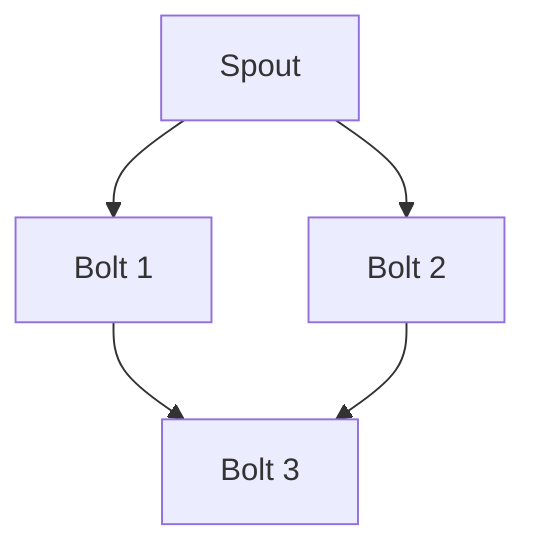

# Storm原理与代码实例讲解

## 1.背景介绍

在大数据时代，实时数据处理变得越来越重要。传统的批处理系统如Hadoop虽然强大，但在处理实时数据时显得力不从心。Apache Storm作为一个分布式实时计算系统，能够以低延迟处理大量数据流，成为了许多企业的首选。本文将深入探讨Storm的核心原理、算法、数学模型，并通过代码实例展示其实际应用。

## 2.核心概念与联系

### 2.1 拓扑结构

Storm的核心是其拓扑结构（Topology），它定义了数据流的处理逻辑。一个拓扑由多个Spout和Bolt组成：

- **Spout**：数据源，负责从外部系统读取数据并发射到拓扑中。
- **Bolt**：数据处理单元，负责处理从Spout或其他Bolt接收到的数据。

### 2.2 数据流

数据在拓扑中以流（Stream）的形式传递。每个流由一系列元组（Tuple）组成，元组是一个有序的键值对集合。

### 2.3 可靠性

Storm保证数据处理的可靠性，即每个元组都会被处理一次且仅处理一次。通过ACK机制，Storm可以追踪每个元组的处理状态。

### 2.4 并行度

Storm允许用户为每个Spout和Bolt设置并行度，以便在多台机器上分布式执行。

## 3.核心算法原理具体操作步骤

### 3.1 数据流处理

Storm的核心算法是数据流处理。数据从Spout进入拓扑，经过多个Bolt的处理，最终输出结果。每个Bolt可以执行过滤、聚合、转换等操作。

### 3.2 可靠性机制

Storm通过ACK机制保证数据处理的可靠性。每个元组在进入拓扑时会被分配一个唯一的ID，Spout会记录这个ID。当元组被处理完毕时，Bolt会发送ACK消息给Spout，Spout收到所有ACK后认为元组处理成功。

### 3.3 并行处理

Storm通过分区（Partitioning）和分组（Grouping）机制实现并行处理。分区将数据分配到不同的任务（Task），分组决定数据如何在任务之间传递。



## 4.数学模型和公式详细讲解举例说明

### 4.1 数据流模型

Storm的数据流模型可以用有向无环图（DAG）表示。每个节点表示一个Spout或Bolt，边表示数据流。

### 4.2 可靠性模型

Storm的可靠性模型基于ACK机制。假设元组 $T$ 进入拓扑，经过 $n$ 个Bolt处理，处理成功的概率为 $P$，则整体成功概率为 $P^n$。

### 4.3 并行度模型

假设一个Bolt的处理时间为 $t$，并行度为 $p$，则总处理时间为 $t/p$。通过增加并行度，可以显著降低处理时间。

## 5.项目实践：代码实例和详细解释说明

### 5.1 环境配置

首先，确保已经安装了Java和Maven。然后，下载并解压Storm。

```bash
wget http://www.apache.org/dyn/closer.cgi/storm/apache-storm-2.2.0/apache-storm-2.2.0.tar.gz
tar -xzf apache-storm-2.2.0.tar.gz
cd apache-storm-2.2.0
```

### 5.2 创建拓扑

创建一个简单的拓扑，包括一个Spout和两个Bolt。

```java
import org.apache.storm.Config;
import org.apache.storm.LocalCluster;
import org.apache.storm.topology.TopologyBuilder;
import org.apache.storm.tuple.Fields;
import org.apache.storm.tuple.Values;
import org.apache.storm.spout.SpoutOutputCollector;
import org.apache.storm.spout.ISpout;
import org.apache.storm.task.OutputCollector;
import org.apache.storm.task.TopologyContext;
import org.apache.storm.topology.IRichBolt;
import org.apache.storm.topology.OutputFieldsDeclarer;
import org.apache.storm.topology.base.BaseRichSpout;
import org.apache.storm.topology.base.BaseRichBolt;

import java.util.Map;

public class StormExample {

    public static class RandomSpout extends BaseRichSpout {
        private SpoutOutputCollector collector;

        @Override
        public void open(Map conf, TopologyContext context, SpoutOutputCollector collector) {
            this.collector = collector;
        }

        @Override
        public void nextTuple() {
            collector.emit(new Values("Hello, World!"));
        }

        @Override
        public void declareOutputFields(OutputFieldsDeclarer declarer) {
            declarer.declare(new Fields("word"));
        }
    }

    public static class PrintBolt extends BaseRichBolt {
        private OutputCollector collector;

        @Override
        public void prepare(Map conf, TopologyContext context, OutputCollector collector) {
            this.collector = collector;
        }

        @Override
        public void execute(org.apache.storm.tuple.Tuple tuple) {
            System.out.println(tuple.getStringByField("word"));
            collector.ack(tuple);
        }

        @Override
        public void declareOutputFields(OutputFieldsDeclarer declarer) {
        }
    }

    public static void main(String[] args) {
        TopologyBuilder builder = new TopologyBuilder();
        builder.setSpout("spout", new RandomSpout());
        builder.setBolt("print", new PrintBolt()).shuffleGrouping("spout");

        Config conf = new Config();
        LocalCluster cluster = new LocalCluster();
        cluster.submitTopology("example", conf, builder.createTopology());
    }
}
```

### 5.3 运行拓扑

编译并运行上述代码，观察控制台输出。

```bash
mvn clean package
java -cp target/your-jar-file.jar StormExample
```

## 6.实际应用场景

### 6.1 实时数据分析

Storm可以用于实时数据分析，如金融交易监控、社交媒体数据分析等。

### 6.2 实时推荐系统

通过Storm处理用户行为数据，可以实现实时推荐系统，如电商网站的商品推荐。

### 6.3 物联网数据处理

Storm可以处理来自物联网设备的实时数据，如传感器数据、设备状态监控等。

## 7.工具和资源推荐

### 7.1 开发工具

- **IntelliJ IDEA**：强大的Java开发工具。
- **Maven**：项目构建和依赖管理工具。

### 7.2 资源推荐

- **Apache Storm官网**：提供详细的文档和教程。
- **GitHub**：查找开源的Storm项目，学习最佳实践。

## 8.总结：未来发展趋势与挑战

Storm作为一个成熟的实时计算系统，已经在许多领域得到了广泛应用。未来，随着大数据和物联网的发展，Storm的应用场景将更加广泛。然而，Storm也面临一些挑战，如处理复杂的流数据、提高系统的可扩展性和容错性等。通过不断优化和改进，Storm有望在未来继续保持其领先地位。

## 9.附录：常见问题与解答

### 9.1 如何处理数据丢失问题？

Storm通过ACK机制保证数据处理的可靠性。如果某个元组处理失败，Storm会重新发送该元组。

### 9.2 如何提高Storm的性能？

可以通过增加并行度、优化拓扑结构、使用高效的序列化机制等方法提高Storm的性能。

### 9.3 如何监控Storm的运行状态？

可以使用Storm自带的UI界面或第三方监控工具（如Grafana、Prometheus）监控Storm的运行状态。

---

作者：禅与计算机程序设计艺术 / Zen and the Art of Computer Programming