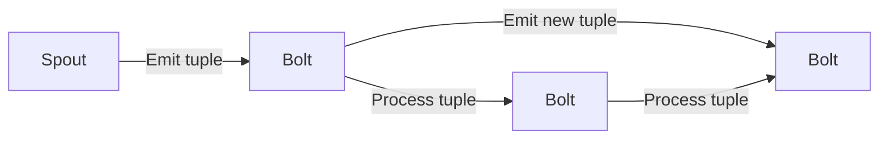

## 1.背景介绍

在大数据时代，实时数据处理已经成为技术发展的重要方向。Storm框架作为一种主流的实时流处理框架，因其高可用、可扩展性和容错性等特点，在大数据处理领域得到了广泛应用。本文将深入剖析Storm框架的原理，并通过实例讲解Storm的应用。

## 2.核心概念与联系

### 2.1 Storm框架的核心概念

Storm框架主要由三个核心组件构成：Spout、Bolt、Topology。

- Spout：数据源，负责数据的输入。它从数据源获取数据，并将数据封装成tuple，发送给Bolt进行处理。

- Bolt：数据处理单元，负责数据的处理和转发。它接收Spout或其他Bolt发送的tuple，对数据进行处理后，可能会生成新的tuple，发送给下一个Bolt。

- Topology：Storm的运行逻辑，由一系列Spout和Bolt组成的有向无环图（DAG）。Spout和Bolt之间的连接关系，决定了数据处理的流向。

### 2.2 Storm框架的运行机制

Storm框架的运行机制可以用以下的Mermaid流程图进行描述：



在Storm框架中，Spout首先生成tuple，然后将tuple发送给Bolt进行处理。Bolt在处理完数据后，可能会生成新的tuple，然后将新的tuple发送给下一个Bolt。这样，数据就按照Topology的流向，从Spout流向Bolt，再从Bolt流向下一个Bolt，形成了一个数据处理的流水线。

## 3.核心算法原理具体操作步骤

Storm框架的核心算法原理主要包括两部分：数据处理和数据流转。

### 3.1 数据处理

数据处理是Storm框架的核心功能。在Storm框架中，数据处理主要由Bolt完成。Bolt接收来自Spout或其他Bolt的tuple，对tuple进行处理，然后可能会生成新的tuple，发送给下一个Bolt。

数据处理的具体步骤如下：

1. Bolt接收tuple：Bolt从其输入流中接收tuple。
2. Bolt处理tuple：Bolt对接收到的tuple进行处理。处理过程可能包括数据清洗、数据转换、数据聚合等操作。
3. Bolt生成新的tuple：如果需要，Bolt可以根据处理结果生成新的tuple。
4. Bolt发送新的tuple：Bolt将生成的新tuple发送给下一个Bolt。

### 3.2 数据流转

数据流转是Storm框架的另一个核心功能。在Storm框架中，数据流转主要通过Topology实现。Topology是由一系列Spout和Bolt组成的有向无环图（DAG），决定了数据处理的流向。

数据流转的具体步骤如下：

1. Spout生成tuple：Spout从数据源获取数据，将数据封装成tuple。
2. Spout发送tuple：Spout将生成的tuple发送给Bolt。
3. Bolt接收tuple：Bolt从其输入流中接收tuple。
4. Bolt发送tuple：Bolt将处理后生成的新tuple发送给下一个Bolt。

## 4.数学模型和公式详细讲解举例说明

在Storm框架中，数据处理的速度和效率是非常重要的。我们可以通过数学模型和公式来描述和优化数据处理的过程。

假设一个Bolt的处理速度为$v$，单位为tuple/秒，一个Spout生成数据的速度为$s$，单位为tuple/秒。那么，当$s \leq v$时，Bolt可以实时处理所有的数据；当$s > v$时，Bolt无法实时处理所有的数据，会产生数据积压。

我们可以通过调整Bolt的数量$n$，来提高系统的处理速度。假设系统中有$n$个Bolt，那么，系统的总处理速度为$nv$。当$nv \geq s$时，系统可以实时处理所有的数据。

这个关系可以用以下的公式表示：

$$
nv \geq s
$$

这个公式告诉我们，要使系统能够实时处理所有的数据，我们需要保证系统的总处理速度（Bolt的数量乘以每个Bolt的处理速度）不小于数据的生成速度。

## 5.项目实践：代码实例和详细解释说明

下面我们通过一个简单的项目实践，来演示如何使用Storm框架进行实时数据处理。这个项目的目标是实时统计Twitter上的热门话题。

首先，我们需要创建一个Spout，用于从Twitter获取数据。

```java
public class TwitterSpout extends BaseRichSpout {
    // ...
    public void nextTuple() {
        Status status = queue.poll();
        if (status == null) {
            Utils.sleep(50);
        } else {
            collector.emit(new Values(status));
        }
    }
    // ...
}
```

然后，我们需要创建一个Bolt，用于处理Spout发送过来的数据。

```java
public class HashtagCountBolt extends BaseRichBolt {
    // ...
    public void execute(Tuple tuple) {
        Status status = (Status) tuple.getValue(0);
        for (HashtagEntity hashtag : status.getHashtagEntities()) {
            counts.put(hashtag.getText(), counts.getOrDefault(hashtag.getText(), 0) + 1);
        }
    }
    // ...
}
```

最后，我们需要创建一个Topology，将Spout和Bolt连接起来。

```java
public class Topology {
    public static void main(String[] args) {
        TopologyBuilder builder = new TopologyBuilder();
        builder.setSpout("twitter-spout", new TwitterSpout());
        builder.setBolt("hashtag-count-bolt", new HashtagCountBolt()).shuffleGrouping("twitter-spout");
        // ...
    }
}
```

运行这个项目，我们就可以实时统计Twitter上的热门话题了。

## 6.实际应用场景

Storm框架在许多实际应用场景中都得到了广泛的应用。例如：

- 实时日志处理：使用Storm框架，可以实时处理和分析网站的访问日志，实时监控网站的访问情况，及时发现并处理问题。

- 实时数据分析：使用Storm框架，可以实时分析社交网络上的数据，实时发现热门话题和突发事件。

- 实时机器学习：使用Storm框架，可以实时处理和分析数据，实时训练和更新机器学习模型。

## 7.工具和资源推荐

- Apache Storm：Storm框架的官方网站，提供了详细的文档和教程。

- Storm Starter：Storm的入门项目，提供了许多示例代码，是学习Storm的好资源。

- Twitter4J：一个开源的Java库，用于访问Twitter API。

## 8.总结：未来发展趋势与挑战

随着大数据和实时数据处理技术的发展，Storm框架的应用将更加广泛。但同时，Storm框架也面临着一些挑战，例如如何处理大规模的数据，如何提高数据处理的速度和效率，如何保证数据处理的准确性和可靠性等。

## 9.附录：常见问题与解答

- 问题：Storm框架如何保证数据的可靠性？
- 答案：Storm框架通过Ack机制来保证数据的可靠性。当一个tuple被完全处理后，Storm框架会发送一个Ack消息，如果没有收到Ack消息，Storm框架会重新发送这个tuple。

- 问题：Storm框架如何处理大规模的数据？
- 答案：Storm框架通过分布式计算来处理大规模的数据。Storm框架可以在多个节点上并行运行，通过增加节点的数量，可以提高数据处理的速度和效率。

作者：禅与计算机程序设计艺术 / Zen and the Art of Computer Programming