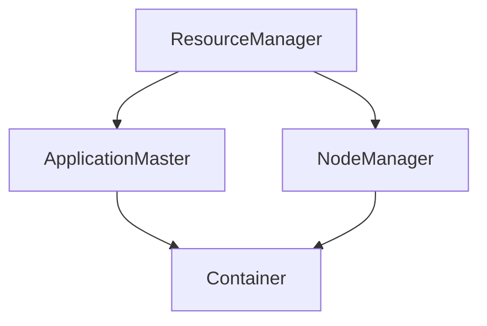

## 1. 背景介绍

随着大数据技术的发展，Hadoop成为了处理海量数据的重要工具。然而，Hadoop的MapReduce框架存在一些问题，例如任务调度效率低下、资源利用率不高等。为了解决这些问题，Yarn（Yet Another Resource Negotiator）应运而生。Yarn是Hadoop的第二代资源管理框架，它将资源管理和任务调度分离，提高了资源利用率和任务调度效率。

本文将介绍Yarn的核心概念、算法原理、数学模型和公式、项目实践、实际应用场景、工具和资源推荐、未来发展趋势与挑战以及常见问题与解答。

## 2. 核心概念与联系

Yarn的核心概念包括ResourceManager、NodeManager、ApplicationMaster和Container。

- ResourceManager：负责整个集群的资源管理和任务调度。它接收客户端的请求，分配资源给ApplicationMaster，并监控资源的使用情况。
- NodeManager：负责单个节点的资源管理和任务执行。它接收ResourceManager的指令，启动和停止Container，并监控Container的运行情况。
- ApplicationMaster：负责单个应用程序的资源管理和任务调度。它向ResourceManager请求资源，分配任务给Container，并监控任务的执行情况。
- Container：是一个封装了资源（CPU、内存、磁盘等）和任务的运行环境。它由NodeManager启动和停止，由ApplicationMaster分配任务。

Yarn的核心联系如下图所示：



## 3. 核心算法原理具体操作步骤

Yarn的核心算法原理包括资源分配算法和任务调度算法。

### 资源分配算法

Yarn的资源分配算法主要有两种：容器级别的资源分配和队列级别的资源分配。

容器级别的资源分配是指ResourceManager将资源分配给Container。它的核心思想是将资源分配给最需要的Container，以提高资源利用率和任务执行效率。具体操作步骤如下：

1. ResourceManager接收到客户端的请求，根据请求的资源需求和当前集群的资源情况，计算出可用的资源。
2. ResourceManager将可用的资源按照一定的规则（例如FIFO、Fair等）分配给需要资源的ApplicationMaster。
3. ApplicationMaster将可用的资源按照一定的规则（例如优先级、资源需求等）分配给需要资源的Container。

队列级别的资源分配是指ResourceManager将资源分配给队列。它的核心思想是将资源分配给最需要的队列，以提高资源利用率和任务执行效率。具体操作步骤如下：

1. ResourceManager将集群的资源按照一定的规则（例如FIFO、Fair等）分配给不同的队列。
2. 每个队列都有一个最大资源限制和一个最小资源限制，ResourceManager根据队列的资源需求和当前集群的资源情况，计算出可用的资源。
3. ResourceManager将可用的资源按照一定的规则（例如FIFO、Fair等）分配给需要资源的ApplicationMaster。
4. ApplicationMaster将可用的资源按照一定的规则（例如优先级、资源需求等）分配给需要资源的Container。

### 任务调度算法

Yarn的任务调度算法主要有两种：容器级别的任务调度和队列级别的任务调度。

容器级别的任务调度是指ApplicationMaster将任务分配给Container。它的核心思想是将任务分配给最适合的Container，以提高任务执行效率。具体操作步骤如下：

1. ApplicationMaster根据任务的资源需求和当前可用的Container，选择最适合的Container。
2. ApplicationMaster向选择的Container发送任务信息。
3. Container接收到任务信息后，启动任务并向ApplicationMaster汇报任务执行情况。

队列级别的任务调度是指ApplicationMaster将任务分配给队列。它的核心思想是将任务分配给最适合的队列，以提高任务执行效率。具体操作步骤如下：

1. ApplicationMaster将任务分配给最适合的队列。
2. 队列根据任务的资源需求和当前可用的Container，选择最适合的Container。
3. ApplicationMaster向选择的Container发送任务信息。
4. Container接收到任务信息后，启动任务并向ApplicationMaster汇报任务执行情况。

## 4. 数学模型和公式详细讲解举例说明

Yarn的数学模型和公式主要涉及资源分配和任务调度两个方面。

### 资源分配

Yarn的资源分配模型可以用以下公式表示：

$$
R = \sum_{i=1}^{n} r_i
$$

其中，$R$表示可用的资源，$r_i$表示第$i$个节点的资源。

### 任务调度

Yarn的任务调度模型可以用以下公式表示：

$$
T = \sum_{i=1}^{n} t_i
$$

其中，$T$表示任务的执行时间，$t_i$表示第$i$个任务的执行时间。

## 5. 项目实践：代码实例和详细解释说明

Yarn的项目实践可以分为以下几个步骤：

1. 安装Hadoop和Yarn。
2. 编写MapReduce程序。
3. 打包MapReduce程序。
4. 提交MapReduce程序到Yarn集群。
5. 监控MapReduce程序的执行情况。

以下是一个简单的WordCount程序的代码实例和详细解释说明：

```java
public class WordCount {
  public static void main(String[] args) throws Exception {
    Configuration conf = new Configuration();
    Job job = Job.getInstance(conf, "word count");
    job.setJarByClass(WordCount.class);
    job.setMapperClass(TokenizerMapper.class);
    job.setCombinerClass(IntSumReducer.class);
    job.setReducerClass(IntSumReducer.class);
    job.setOutputKeyClass(Text.class);
    job.setOutputValueClass(IntWritable.class);
    FileInputFormat.addInputPath(job, new Path(args[0]));
    FileOutputFormat.setOutputPath(job, new Path(args[1]));
    System.exit(job.waitForCompletion(true) ? 0 : 1);
  }
}

public class TokenizerMapper extends Mapper<Object, Text, Text, IntWritable>{
  private final static IntWritable one = new IntWritable(1);
  private Text word = new Text();
  public void map(Object key, Text value, Context context) throws IOException, InterruptedException {
    StringTokenizer itr = new StringTokenizer(value.toString());
    while (itr.hasMoreTokens()) {
      word.set(itr.nextToken());
      context.write(word, one);
    }
  }
}

public class IntSumReducer extends Reducer<Text,IntWritable,Text,IntWritable> {
  private IntWritable result = new IntWritable();
  public void reduce(Text key, Iterable<IntWritable> values, Context context) throws IOException, InterruptedException {
    int sum = 0;
    for (IntWritable val : values) {
      sum += val.get();
    }
    result.set(sum);
    context.write(key, result);
  }
}
```

以上代码实现了一个简单的WordCount程序，它的功能是统计输入文件中每个单词出现的次数。具体实现步骤如下：

1. 在main函数中，创建一个Job对象，并设置相关参数，例如输入路径、输出路径、Mapper类、Reducer类等。
2. 在Mapper类中，实现map函数，将输入的文本分割成单词，并将每个单词输出为一个键值对，其中键为单词，值为1。
3. 在Reducer类中，实现reduce函数，将相同键的值相加，得到每个单词出现的次数。
4. 将程序打包成jar包，并提交到Yarn集群。
5. 监控程序的执行情况，查看输出结果。

## 6. 实际应用场景

Yarn的实际应用场景包括大数据处理、机器学习、图像处理等领域。以下是一些实际应用场景的举例说明：

- 大数据处理：Yarn可以用于处理海量数据，例如日志分析、数据挖掘等。
- 机器学习：Yarn可以用于训练机器学习模型，例如深度学习、强化学习等。
- 图像处理：Yarn可以用于处理图像数据，例如图像识别、图像分割等。

## 7. 工具和资源推荐

Yarn的工具和资源推荐包括以下几个方面：

- Hadoop：Yarn是Hadoop的一部分，因此需要安装Hadoop才能使用Yarn。
- Yarn官方文档：Yarn官方文档提供了详细的使用说明和API文档。
- Yarn应用程序示例：Yarn应用程序示例提供了一些常见的应用程序示例，例如WordCount、PageRank等。
- Yarn监控工具：Yarn监控工具可以用于监控Yarn集群的资源使用情况和任务执行情况。

## 8. 总结：未来发展趋势与挑战

Yarn作为Hadoop的第二代资源管理框架，已经成为大数据处理的重要工具。未来，Yarn将面临以下几个发展趋势和挑战：

- 大规模集群：随着数据规模的不断增大，Yarn将面临更大规模的集群管理和任务调度。
- 多租户支持：Yarn将需要支持多租户，以满足不同用户的需求。
- 容器化支持：Yarn将需要支持容器化，以提高资源利用率和任务执行效率。
- 安全性和稳定性：Yarn将需要提高安全性和稳定性，以保障数据的安全和稳定性。

## 9. 附录：常见问题与解答

Q: Yarn和MapReduce有什么区别？

A: Yarn是Hadoop的第二代资源管理框架，它将资源管理和任务调度分离，提高了资源利用率和任务调度效率。MapReduce是Hadoop的第一代计算框架，它将计算和存储分离，提高了计算效率和数据可靠性。

Q: Yarn如何保证任务的执行顺序？

A: Yarn通过ApplicationMaster来保证任务的执行顺序。ApplicationMaster会按照一定的规则（例如优先级、资源需求等）分配任务给Container，以保证任务的执行顺序。

Q: Yarn如何处理任务失败？

A: Yarn会自动重新启动失败的任务，直到任务成功执行或达到最大重试次数。如果任务多次失败，Yarn会将任务标记为失败，并通知ApplicationMaster。

Q: Yarn如何处理资源的竞争？

A: Yarn通过ResourceManager来处理资源的竞争。ResourceManager会按照一定的规则（例如FIFO、Fair等）分配资源给ApplicationMaster，以保证资源的公平分配。