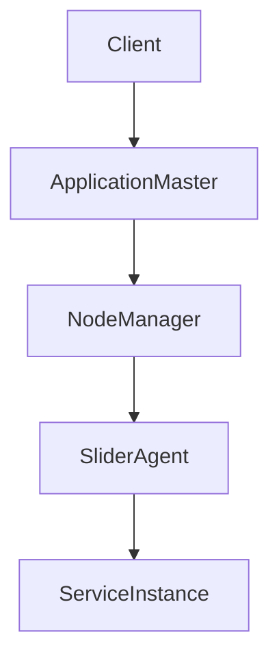

# Yarn的轻量级服务框架：Slider解析

## 1.背景介绍

在大数据处理领域，Apache Hadoop已经成为了一个不可或缺的工具。Hadoop的核心组件之一Yarn（Yet Another Resource Negotiator）作为资源管理和作业调度的框架，极大地提升了集群资源的利用率。然而，随着大数据应用的多样化，特别是对于长时间运行的服务（如HBase、Storm等）的需求，Yarn的原生功能显得有些不足。为了解决这一问题，Apache Slider应运而生。

Slider是一个基于Yarn的轻量级服务框架，旨在简化在Yarn上部署和管理长时间运行的服务。它不仅提供了服务的生命周期管理，还支持动态扩展和缩减服务实例的能力。本文将深入解析Slider的核心概念、算法原理、数学模型、项目实践、实际应用场景、工具和资源推荐，并探讨其未来发展趋势与挑战。

## 2.核心概念与联系

### 2.1 Slider的基本概念

Slider的核心概念包括以下几个方面：

- **应用定义（Application Definition）**：描述服务的配置和依赖关系的元数据。
- **应用实例（Application Instance）**：具体运行的服务实例，包含配置、状态等信息。
- **应用包（Application Package）**：包含应用定义和相关资源的打包文件。
- **Slider Agent**：在每个节点上运行的代理程序，负责启动和管理服务进程。

### 2.2 Slider与Yarn的关系

Slider是构建在Yarn之上的一个框架，利用Yarn的资源管理和调度功能来管理长时间运行的服务。具体来说，Slider通过Yarn的Application Master来管理服务的生命周期，并通过Yarn的Node Manager来分配和监控资源。

### 2.3 Slider的架构

Slider的架构可以分为以下几个部分：

- **客户端（Client）**：用户与Slider交互的接口，用于提交、管理和监控应用实例。
- **应用管理器（Application Master）**：负责管理应用实例的生命周期，包括启动、停止、扩展和缩减。
- **Slider Agent**：在每个节点上运行的代理程序，负责启动和管理服务进程。

以下是Slider架构的Mermaid流程图：



## 3.核心算法原理具体操作步骤

### 3.1 应用定义与部署

Slider的应用定义是一个JSON或XML文件，描述了服务的配置和依赖关系。用户通过Slider客户端提交应用定义，Slider会根据定义在Yarn上启动相应的服务实例。

### 3.2 资源分配与调度

Slider利用Yarn的资源管理和调度功能来分配和管理服务实例的资源。具体步骤如下：

1. **资源请求**：Slider客户端向Yarn的Resource Manager提交资源请求。
2. **资源分配**：Resource Manager根据集群的资源情况分配资源，并通知Slider的Application Master。
3. **服务启动**：Application Master通过Node Manager启动Slider Agent，Slider Agent再启动具体的服务进程。

### 3.3 动态扩展与缩减

Slider支持动态扩展和缩减服务实例的能力。用户可以通过Slider客户端发送扩展或缩减请求，Slider的Application Master会根据请求调整服务实例的数量。

### 3.4 故障恢复

Slider具有自动故障恢复的能力。当服务实例发生故障时，Slider的Application Master会自动重新启动故障实例，确保服务的高可用性。

## 4.数学模型和公式详细讲解举例说明

### 4.1 资源分配模型

Slider的资源分配模型基于Yarn的资源调度算法。假设集群中有 $N$ 个节点，每个节点的资源容量为 $C_i$，服务实例的资源需求为 $R_j$，则资源分配的目标是最大化资源利用率，同时满足服务实例的资源需求。

资源分配的数学模型可以表示为：

$$
\text{Maximize} \sum_{i=1}^{N} \sum_{j=1}^{M} x_{ij} R_j
$$

其中，$x_{ij}$ 表示节点 $i$ 是否分配给服务实例 $j$，$M$ 为服务实例的数量。

### 4.2 动态扩展与缩减模型

动态扩展与缩减的数学模型可以表示为：

$$
\text{Minimize} \sum_{j=1}^{M} |R_j - R_j'|
$$

其中，$R_j'$ 表示扩展或缩减后的资源需求。

### 4.3 故障恢复模型

故障恢复的数学模型可以表示为：

$$
\text{Minimize} \sum_{j=1}^{M} T_j
$$

其中，$T_j$ 表示服务实例 $j$ 的恢复时间。

## 5.项目实践：代码实例和详细解释说明

### 5.1 环境准备

在开始项目实践之前，需要准备好以下环境：

- Hadoop集群
- Slider安装包
- 配置好的Yarn

### 5.2 应用定义文件

以下是一个简单的应用定义文件示例：

```json
{
  "name": "example-app",
  "type": "HBase",
  "components": [
    {
      "name": "HBaseMaster",
      "number_of_instances": 1,
      "artifact": {
        "id": "hbase",
        "version": "2.2.3"
      }
    },
    {
      "name": "HBaseRegionServer",
      "number_of_instances": 3,
      "artifact": {
        "id": "hbase",
        "version": "2.2.3"
      }
    }
  ]
}
```

### 5.3 部署应用

使用Slider客户端部署应用：

```bash
slider create example-app --template appConfig.json --resources resources.json
```

### 5.4 动态扩展与缩减

扩展服务实例：

```bash
slider flex example-app --component HBaseRegionServer --number_of_instances 5
```

缩减服务实例：

```bash
slider flex example-app --component HBaseRegionServer --number_of_instances 2
```

### 5.5 故障恢复

Slider会自动监控服务实例的状态，并在发生故障时自动重新启动故障实例。用户可以通过Slider客户端查看服务实例的状态：

```bash
slider status example-app
```

## 6.实际应用场景

### 6.1 大数据处理

Slider可以用于在Yarn上部署和管理大数据处理服务，如HBase、Storm、Kafka等。这些服务通常需要长时间运行，并且需要动态扩展和缩减实例数量以应对负载变化。

### 6.2 数据分析

Slider可以用于在Yarn上部署和管理数据分析服务，如Spark、Flink等。这些服务通常需要高性能的计算资源，并且需要动态调整资源分配以提高计算效率。

### 6.3 机器学习

Slider可以用于在Yarn上部署和管理机器学习服务，如TensorFlow、PyTorch等。这些服务通常需要大量的计算资源，并且需要动态调整资源分配以提高训练效率。

## 7.工具和资源推荐

### 7.1 Slider官方文档

Slider的官方文档是了解Slider的最佳资源，包含了详细的使用指南和API文档。

### 7.2 Hadoop官方文档

Hadoop的官方文档包含了Yarn的详细介绍和使用指南，对于理解Slider的工作原理非常有帮助。

### 7.3 开源项目

以下是一些基于Slider的开源项目，可以作为学习和参考的资源：

- [Apache HBase](https://hbase.apache.org/)
- [Apache Storm](https://storm.apache.org/)
- [Apache Kafka](https://kafka.apache.org/)

## 8.总结：未来发展趋势与挑战

Slider作为一个基于Yarn的轻量级服务框架，极大地简化了在Yarn上部署和管理长时间运行的服务。然而，随着大