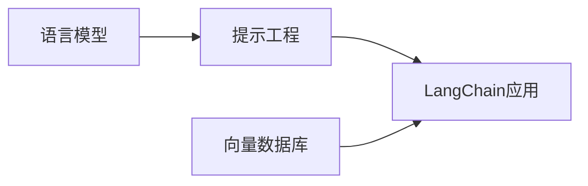

# 【LangChain编程：从入门到实践】需求思考与设计

## 1. 背景介绍
### 1.1 LangChain的兴起
近年来,随着人工智能技术的飞速发展,特别是大语言模型(LLM)的出现和成熟,自然语言处理(NLP)领域迎来了新的突破。LangChain作为一个专注于将LLM与外部知识和计算相结合的开发框架,应运而生。它为开发者提供了一套全面的工具和组件,用于构建由语言模型驱动的应用程序。

### 1.2 LangChain的优势
LangChain的主要优势在于它能够将强大的语言模型与外部数据源、API和自定义代码无缝集成。这使得开发者能够创建更加智能、个性化和实用的对话式AI应用。通过LangChain,我们可以实现诸如智能问答系统、个性化推荐引擎、自动化文档处理等功能,大大提升了人机交互的效率和体验。

### 1.3 LangChain的应用前景
随着LangChain生态系统的不断完善和社区的持续壮大,越来越多的企业和开发者开始关注并尝试使用这一框架。LangChain在客户服务、教育培训、金融分析、医疗健康等领域都具有广阔的应用前景。掌握LangChain编程技能,不仅能够帮助开发者快速构建创新性的AI应用,也为企业数字化转型和业务创新提供了新的思路和动力。

## 2. 核心概念与联系
### 2.1 语言模型(Language Models) 
- 定义:语言模型是一种基于概率统计的模型,用于预测给定上下文中下一个词或字符的概率分布。
- 作用:语言模型是NLP领域的基础,广泛应用于机器翻译、文本生成、情感分析等任务。
- 主流模型:GPT系列、BERT、XLNet等。

### 2.2 提示工程(Prompt Engineering)
- 定义:提示工程是一种通过设计优化输入文本(即提示)来引导语言模型生成期望输出的技术。
- 作用:通过精心设计的提示,我们可以控制语言模型的行为,生成更加符合特定任务需求的文本。
- 技巧:包括上下文学习、少样本学习、任务分解等。

### 2.3 向量数据库(Vector Databases)
- 定义:向量数据库是一种专门用于存储和检索高维向量的数据库。
- 作用:在LangChain中,向量数据库常用于存储文本嵌入向量,实现高效的相似度搜索和检索。
- 常见数据库:Faiss、Pinecone、Weaviate等。

### 2.4 Mermaid流程图
下面是LangChain核心概念之间关系的Mermaid流程图:


## 3. 核心算法原理具体操作步骤
### 3.1 文本嵌入(Text Embedding)
1. 对输入文本进行预处理,如分词、去除停用词等。
2. 将预处理后的文本输入预训练的语言模型,如BERT、RoBERTa等。
3. 提取语言模型的中间层输出作为文本的嵌入向量表示。
4. 将嵌入向量存储到向量数据库中,用于后续的相似度搜索和检索。

### 3.2 相似度搜索(Similarity Search) 
1. 将查询文本转换为嵌入向量表示。
2. 使用向量数据库的相似度搜索功能,如点积、欧氏距离等,找到与查询向量最相似的文本。
3. 返回相似度最高的文本作为查询结果。

### 3.3 知识库问答(Knowledge Base Question Answering)
1. 将大量的背景知识文本存储到向量数据库中。
2. 对用户的问题进行嵌入向量表示。
3. 使用相似度搜索找到与问题最相关的背景知识片段。
4. 将问题和相关背景知识作为提示输入语言模型。
5. 语言模型根据提示生成自然语言答案。

## 4. 数学模型和公式详细讲解举例说明
### 4.1 文本嵌入模型
文本嵌入模型的目标是将高维的文本数据映射到低维的连续向量空间。以BERT为例,其嵌入过程可以表示为:

$$E = BERT(T)$$

其中,$T$表示输入的文本,$E$表示输出的嵌入向量。

BERT使用Transformer编码器结构,通过自注意力机制和前向神经网络学习文本的上下文表示:

$$Attention(Q,K,V) = softmax(\frac{QK^T}{\sqrt{d_k}})V$$

$$FFN(x) = max(0, xW_1 + b_1)W_2 + b_2$$

其中,$Q$,$K$,$V$分别表示查询、键、值向量,$d_k$为向量维度。$W_1$,$W_2$,$b_1$,$b_2$为前向神经网络的权重和偏置。

### 4.2 相似度计算
常见的相似度计算方法包括余弦相似度和欧氏距离。

余弦相似度计算两个向量之间的夹角余弦值:

$$similarity(u,v) = \frac{u \cdot v}{||u|| \times ||v||}$$

欧氏距离计算两个向量之间的直线距离:

$$distance(u,v) = \sqrt{\sum_{i=1}^{n} (u_i - v_i)^2}$$

其中,$u$,$v$为两个$n$维向量。

## 5. 项目实践：代码实例和详细解释说明
下面是一个使用LangChain实现知识库问答的简单示例:

```python
from langchain.embeddings import OpenAIEmbeddings
from langchain.vectorstores import FAISS
from langchain.chains import RetrievalQA
from langchain.llms import OpenAI

# 加载嵌入模型和向量数据库
embeddings = OpenAIEmbeddings()
db = FAISS.from_texts(texts, embeddings)

# 创建问答链
qa = RetrievalQA.from_chain_type(
    llm=OpenAI(), 
    chain_type="stuff", 
    retriever=db.as_retriever()
)

# 执行问答
query = "What is the capital of France?"
result = qa.run(query)
print(result)
```

代码解释:
1. 首先加载OpenAI的嵌入模型和FAISS向量数据库。
2. 使用`from_texts`方法将背景知识文本转换为嵌入向量并存储到FAISS中。
3. 创建一个问答链`RetrievalQA`,指定使用OpenAI语言模型和FAISS检索器。
4. 调用`run`方法,输入问题,问答链会自动检索相关知识并生成答案。

## 6. 实际应用场景
LangChain可以应用于以下场景:
- 智能客服:利用LangChain构建基于知识库的智能客服系统,自动回答客户问题。
- 个性化推荐:通过分析用户行为和偏好,使用LangChain生成个性化的商品或内容推荐。  
- 文档智能处理:利用LangChain对大量文档进行自动分类、摘要、关键词提取等。
- 智能教学助手:基于LangChain构建智能教学助手,为学生提供个性化的学习指导和答疑服务。

## 7. 工具和资源推荐
- 官方文档:https://docs.langchain.com/
- GitHub仓库:https://github.com/hwchase17/langchain
- LangChain社区:https://community.langchain.com/
- OpenAI API:https://openai.com/api/
- Hugging Face Models:https://huggingface.co/models

## 8. 总结：未来发展趋势与挑战
LangChain正处于快速发展的早期阶段,未来的发展趋势包括:
- 与更多LLM和数据源的集成,提供更加丰富的功能。
- 提升框架的易用性和可扩展性,降低开发门槛。
- 探索few-shot learning等高级提示工程技术,提高语言模型的泛化能力。
- 在垂直领域建立基于LangChain的行业解决方案。

同时,LangChain也面临一些挑战:
- 语言模型的推理能力和常识知识仍有局限性。
- 对于复杂任务,如何设计最优的提示和链式调用策略仍需进一步研究。
- 在实际应用中,如何权衡语言模型的性能和计算成本是一个需要平衡的问题。

## 9. 附录：常见问题与解答
### 9.1 LangChain支持哪些语言模型?
LangChain支持OpenAI GPT、Anthropic Claude、Cohere、Hugging Face等主流语言模型。

### 9.2 LangChain能否与自定义数据源集成?
可以,LangChain提供了灵活的接口,支持与各种数据库、API、本地文件等数据源集成。

### 9.3 使用LangChain需要哪些前置知识?
使用LangChain需要具备Python编程、NLP和机器学习的基础知识。熟悉Transformer等语言模型的原理也会有所帮助。

### 9.4 LangChain的性能如何?
LangChain本身是一个轻量级的框架,性能主要取决于所使用的语言模型和数据源。选择合适的模型和优化提示可以显著提升性能。

作者：禅与计算机程序设计艺术 / Zen and the Art of Computer Programming