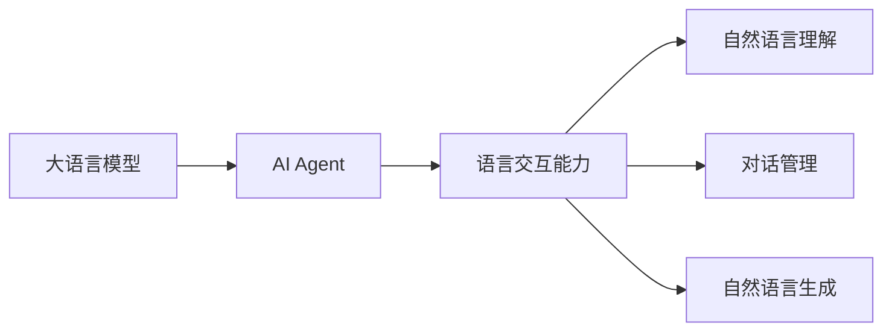

# 【大模型应用开发 动手做AI Agent】语言交互能力

## 1. 背景介绍
### 1.1 人工智能的发展历程
#### 1.1.1 早期人工智能
#### 1.1.2 机器学习时代 
#### 1.1.3 深度学习的崛起

### 1.2 自然语言处理技术进展
#### 1.2.1 基于规则的方法
#### 1.2.2 统计学习方法
#### 1.2.3 深度学习方法

### 1.3 大语言模型的出现
#### 1.3.1 Transformer架构
#### 1.3.2 GPT系列模型
#### 1.3.3 大模型的应用前景

## 2. 核心概念与联系
### 2.1 大语言模型
#### 2.1.1 定义与特点
#### 2.1.2 训练数据与方法
#### 2.1.3 评估指标

### 2.2 AI Agent
#### 2.2.1 定义与分类
#### 2.2.2 基于大模型的AI Agent
#### 2.2.3 AI Agent的应用场景

### 2.3 语言交互能力
#### 2.3.1 自然语言理解
#### 2.3.2 对话管理
#### 2.3.3 自然语言生成



## 3. 核心算法原理具体操作步骤
### 3.1 Transformer架构
#### 3.1.1 自注意力机制
#### 3.1.2 多头注意力
#### 3.1.3 前馈神经网络

### 3.2 预训练与微调
#### 3.2.1 无监督预训练
#### 3.2.2 有监督微调
#### 3.2.3 零样本学习

### 3.3 对话管理策略
#### 3.3.1 基于规则的方法
#### 3.3.2 基于机器学习的方法 
#### 3.3.3 基于强化学习的方法

## 4. 数学模型和公式详细讲解举例说明
### 4.1 Transformer的数学表示
#### 4.1.1 自注意力机制
给定一个输入序列 $X=(x_1,\dots,x_n)$，自注意力机制可以表示为：

$$
\text{Attention}(Q,K,V) = \text{softmax}(\frac{QK^T}{\sqrt{d_k}})V
$$

其中，$Q,K,V$ 分别表示查询、键、值矩阵，$d_k$ 为键向量的维度。

#### 4.1.2 多头注意力
多头注意力可以看作是 $h$ 个自注意力的并行计算：

$$
\text{MultiHead}(Q,K,V) = \text{Concat}(\text{head}_1,\dots,\text{head}_h)W^O \\
\text{head}_i = \text{Attention}(QW_i^Q, KW_i^K, VW_i^V)
$$

其中，$W_i^Q, W_i^K, W_i^V$ 为线性变换矩阵，$W^O$ 为输出线性变换矩阵。

### 4.2 语言模型的概率计算
给定一个单词序列 $w_1,\dots,w_n$，语言模型的目标是计算该序列的概率：

$$
P(w_1,\dots,w_n) = \prod_{i=1}^n P(w_i|w_1,\dots,w_{i-1})
$$

其中，$P(w_i|w_1,\dots,w_{i-1})$ 表示在给定前 $i-1$ 个单词的情况下，第 $i$ 个单词为 $w_i$ 的条件概率。

## 5. 项目实践：代码实例和详细解释说明
### 5.1 使用Hugging Face的Transformers库
```python
from transformers import AutoTokenizer, AutoModelForCausalLM

tokenizer = AutoTokenizer.from_pretrained("gpt2")
model = AutoModelForCausalLM.from_pretrained("gpt2")

input_text = "Hello, how are you?"
input_ids = tokenizer.encode(input_text, return_tensors="pt")

output = model.generate(input_ids, max_length=50, num_return_sequences=1)
print(tokenizer.decode(output[0], skip_special_tokens=True))
```

上述代码使用了Hugging Face的Transformers库，加载了预训练的GPT-2模型和对应的分词器。然后，将输入文本转换为模型可以处理的格式，并使用`generate`方法生成响应。最后，将生成的输出解码并打印出来。

### 5.2 使用ParlAI构建对话系统
```python
from parlai.core.agents import register_agent, Agent

@register_agent("my_agent")
class MyAgent(Agent):
    def __init__(self, opt):
        super().__init__(opt)
        self.id = 'MyAgent'
        
    def observe(self, observation):
        self.observation = observation
        
    def act(self):
        # 在此处实现对话策略
        response = {'text': 'Hello, how can I assist you today?'}
        return response

```

上述代码使用了ParlAI框架，定义了一个名为`MyAgent`的对话代理。在`observe`方法中接收用户输入，在`act`方法中实现对话策略并生成响应。可以在`act`方法中调用大语言模型，根据用户输入生成合适的回复。

## 6. 实际应用场景
### 6.1 客服聊天机器人
利用大语言模型构建的AI Agent可以应用于客服场景，提供24小时不间断的服务。通过理解用户问题并给出相关回答，减轻人工客服的工作量，提高响应效率。

### 6.2 智能助手
基于大模型的AI Agent可以作为智能助手，协助用户完成日常任务，如日程管理、信息查询、提醒事项等。通过自然语言交互，让用户以更加便捷的方式获取所需服务。

### 6.3 教育与培训
AI Agent可以应用于教育与培训领域，为学生提供个性化的学习支持。通过对话交互，解答学生疑问，提供针对性的学习建议和资源推荐，促进学习效果的提升。

## 7. 工具和资源推荐
### 7.1 开源框架
- Hugging Face Transformers: 提供了多种预训练语言模型及其应用的Python库。
- ParlAI: 一个用于构建对话系统的开源框架，支持多种数据集和模型。
- OpenAI GPT-3: OpenAI提供的大型语言模型API，可用于构建各种AI应用。

### 7.2 数据集
- MultiWOZ: 一个多领域的任务型对话数据集，包含酒店、餐厅、出租车等领域。
- PersonaChat: 一个开放领域的对话数据集，包含不同人物角色之间的对话。
- DailyDialog: 一个日常对话数据集，涵盖多种日常交互场景。

### 7.3 学习资源
- CS224n: 斯坦福大学的自然语言处理课程，介绍了深度学习在NLP中的应用。
- Coursera Deep Learning Specialization: 由吴恩达教授主讲的深度学习系列课程。
- FastAI Natural Language Processing Course: FastAI提供的自然语言处理实践课程。

## 8. 总结：未来发展趋势与挑战
### 8.1 大模型的发展趋势
随着计算能力的提升和数据规模的增长，大语言模型将继续向更大规模、更高性能的方向发展。未来的模型将具备更强的语言理解和生成能力，能够应对更加复杂多样的任务。

### 8.2 AI Agent的应用前景
基于大模型的AI Agent将在各个领域得到广泛应用，如客服、教育、金融、医疗等。通过自然语言交互，AI Agent将为人们提供更加智能、高效、个性化的服务，极大地提升用户体验。

### 8.3 面临的挑战
尽管大模型取得了显著进展，但仍然面临一些挑战：
- 可解释性：大模型的决策过程通常是黑盒的，缺乏可解释性，这可能限制其在某些领域的应用。
- 数据偏差：训练数据中的偏差可能导致模型产生不公平或有偏见的输出结果。
- 伦理与安全：需要关注大模型应用中的伦理问题，如隐私保护、防止误用等，确保其安全、负责任地使用。

## 9. 附录：常见问题与解答
### 9.1 如何选择合适的预训练模型？
选择预训练模型需要考虑任务类型、数据规模、计算资源等因素。一般来说，在小数据集上微调大模型通常优于从头训练小模型。可以根据任务的特点，选择适合的模型架构和规模。

### 9.2 如何处理长文本输入？
处理长文本输入可以采用以下策略：
- 截断：将超过最大长度的部分截断，只保留前面的内容。
- 分块：将长文本划分为多个固定长度的块，分别输入模型，再将结果拼接起来。
- 层次化处理：先用较小的模型对长文本进行压缩，提取关键信息，再输入主模型进行处理。

### 9.3 如何评估生成文本的质量？
评估生成文本的质量可以考虑以下几个方面：
- 流畅性：生成的文本是否通顺、符合语法规范。
- 相关性：生成的文本是否与输入相关、符合主题。
- 信息量：生成的文本是否包含足够的信息，避免过于简单或重复。
- 多样性：生成的文本是否具有一定的多样性，避免过于单一或生硬。

可以使用人工评估或自动评估指标（如BLEU、ROUGE、Perplexity等）来衡量生成文本的质量。

作者：禅与计算机程序设计艺术 / Zen and the Art of Computer Programming