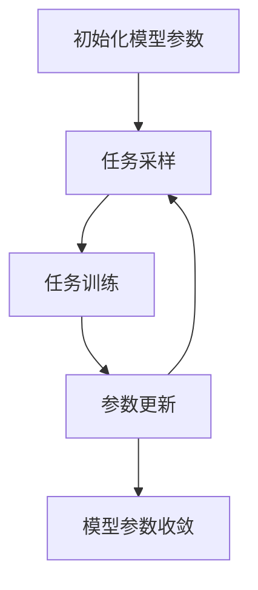

# 一切皆是映射：利用Reptile算法快速优化神经网络

## 1.背景介绍

在深度学习领域，模型的训练和优化一直是一个重要的研究方向。传统的优化算法如SGD（随机梯度下降）和Adam在处理大规模数据集和复杂模型时，虽然表现出色，但仍然存在一些局限性。近年来，元学习（Meta-Learning）作为一种新兴的研究方向，逐渐受到关注。元学习的核心思想是通过学习如何学习，从而提高模型在新任务上的适应能力。Reptile算法作为元学习中的一种重要方法，因其简单高效的特点，逐渐被广泛应用于神经网络的优化中。

## 2.核心概念与联系

### 2.1 元学习

元学习（Meta-Learning）是一种通过学习多个任务来提高模型在新任务上的表现的技术。其核心思想是通过在多个任务上的训练，学习到一种通用的初始化参数，使得模型在面对新任务时能够快速适应。

### 2.2 Reptile算法

Reptile算法是一种基于梯度下降的元学习算法。与MAML（Model-Agnostic Meta-Learning）不同，Reptile不需要计算二阶导数，从而大大简化了计算复杂度。Reptile的核心思想是通过在多个任务上的训练，找到一种初始化参数，使得模型在面对新任务时能够快速收敛。

### 2.3 神经网络优化

神经网络优化是指通过调整模型参数，使得模型在给定任务上的表现达到最优。传统的优化算法如SGD和Adam在处理大规模数据集和复杂模型时，虽然表现出色，但仍然存在一些局限性。Reptile算法通过元学习的方式，能够在多个任务上找到一种通用的初始化参数，从而提高模型在新任务上的适应能力。

## 3.核心算法原理具体操作步骤

Reptile算法的核心思想是通过在多个任务上的训练，找到一种通用的初始化参数，使得模型在面对新任务时能够快速收敛。其具体操作步骤如下：

### 3.1 初始化

首先，随机初始化模型参数 $\theta$。

### 3.2 任务采样

从任务分布 $p(T)$ 中随机采样一个任务 $T_i$。

### 3.3 任务训练

在任务 $T_i$ 上使用梯度下降法训练模型，得到更新后的参数 $\theta_i$。

### 3.4 参数更新

将模型参数更新为 $\theta \leftarrow \theta + \epsilon (\theta_i - \theta)$，其中 $\epsilon$ 为学习率。

### 3.5 重复迭代

重复步骤2到步骤4，直到模型参数收敛。

以下是Reptile算法的Mermaid流程图：



## 4.数学模型和公式详细讲解举例说明

### 4.1 任务训练

在任务 $T_i$ 上，使用梯度下降法训练模型，更新后的参数 $\theta_i$ 可以表示为：

$$
\theta_i = \theta - \alpha \nabla_{\theta} L_{T_i}(\theta)
$$

其中，$\alpha$ 为学习率，$L_{T_i}(\theta)$ 为任务 $T_i$ 上的损失函数。

### 4.2 参数更新

将模型参数更新为：

$$
\theta \leftarrow \theta + \epsilon (\theta_i - \theta)
$$

其中，$\epsilon$ 为学习率。

### 4.3 举例说明

假设我们有两个任务 $T_1$ 和 $T_2$，其损失函数分别为 $L_{T_1}(\theta)$ 和 $L_{T_2}(\theta)$。在任务 $T_1$ 上训练模型，得到更新后的参数 $\theta_1$：

$$
\theta_1 = \theta - \alpha \nabla_{\theta} L_{T_1}(\theta)
$$

在任务 $T_2$ 上训练模型，得到更新后的参数 $\theta_2$：

$$
\theta_2 = \theta - \alpha \nabla_{\theta} L_{T_2}(\theta)
$$

将模型参数更新为：

$$
\theta \leftarrow \theta + \epsilon (\theta_1 - \theta)
$$

$$
\theta \leftarrow \theta + \epsilon (\theta_2 - \theta)
$$

通过在多个任务上的训练，Reptile算法能够找到一种通用的初始化参数，使得模型在面对新任务时能够快速收敛。

## 5.项目实践：代码实例和详细解释说明

### 5.1 环境配置

首先，确保你的环境中安装了必要的库，如TensorFlow或PyTorch。以下示例将使用PyTorch。

```python
import torch
import torch.nn as nn
import torch.optim as optim
from torch.utils.data import DataLoader, TensorDataset
```

### 5.2 数据准备

假设我们有两个任务的数据集，分别为task1_data和task2_data。

```python
task1_data = TensorDataset(torch.randn(100, 10), torch.randint(0, 2, (100,)))
task2_data = TensorDataset(torch.randn(100, 10), torch.randint(0, 2, (100,)))
task1_loader = DataLoader(task1_data, batch_size=32, shuffle=True)
task2_loader = DataLoader(task2_data, batch_size=32, shuffle=True)
```

### 5.3 模型定义

定义一个简单的神经网络模型。

```python
class SimpleNN(nn.Module):
    def __init__(self):
        super(SimpleNN, self).__init__()
        self.fc1 = nn.Linear(10, 50)
        self.fc2 = nn.Linear(50, 2)
    
    def forward(self, x):
        x = torch.relu(self.fc1(x))
        x = self.fc2(x)
        return x

model = SimpleNN()
```

### 5.4 任务训练函数

定义一个在单个任务上训练模型的函数。

```python
def train_on_task(model, data_loader, criterion, optimizer):
    model.train()
    for data, target in data_loader:
        optimizer.zero_grad()
        output = model(data)
        loss = criterion(output, target)
        loss.backward()
        optimizer.step()
    return model.state_dict()
```

### 5.5 Reptile算法实现

实现Reptile算法的核心步骤。

```python
def reptile_step(model, task_loaders, criterion, inner_lr, outer_lr):
    initial_state = model.state_dict()
    for task_loader in task_loaders:
        optimizer = optim.SGD(model.parameters(), lr=inner_lr)
        trained_state = train_on_task(model, task_loader, criterion, optimizer)
        for param in model.state_dict():
            initial_state[param] += outer_lr * (trained_state[param] - initial_state[param])
    model.load_state_dict(initial_state)
```

### 5.6 训练模型

使用Reptile算法训练模型。

```python
criterion = nn.CrossEntropyLoss()
task_loaders = [task1_loader, task2_loader]
for epoch in range(100):
    reptile_step(model, task_loaders, criterion, inner_lr=0.01, outer_lr=0.001)
```

通过上述代码示例，我们可以看到如何使用Reptile算法在多个任务上训练模型，从而找到一种通用的初始化参数，使得模型在面对新任务时能够快速收敛。

## 6.实际应用场景

### 6.1 图像分类

在图像分类任务中，Reptile算法可以通过在多个图像分类任务上训练模型，找到一种通用的初始化参数，从而提高模型在新图像分类任务上的适应能力。

### 6.2 自然语言处理

在自然语言处理任务中，Reptile算法可以通过在多个文本分类任务上训练模型，找到一种通用的初始化参数，从而提高模型在新文本分类任务上的适应能力。

### 6.3 强化学习

在强化学习任务中，Reptile算法可以通过在多个强化学习任务上训练模型，找到一种通用的初始化参数，从而提高模型在新强化学习任务上的适应能力。

## 7.工具和资源推荐

### 7.1 开源库

- [PyTorch](https://pytorch.org/): 一个开源的深度学习框架，支持动态计算图，适合实现Reptile算法。
- [TensorFlow](https://www.tensorflow.org/): 一个开源的深度学习框架，支持静态计算图，适合实现Reptile算法。

### 7.2 研究论文

- [Reptile: A Scalable Meta-Learning Algorithm](https://arxiv.org/abs/1803.02999): Reptile算法的原始论文，详细介绍了算法的原理和实验结果。
- [Model-Agnostic Meta-Learning for Fast Adaptation of Deep Networks](https://arxiv.org/abs/1703.03400): MAML算法的原始论文，详细介绍了元学习的基本概念和应用。

### 7.3 在线课程

- [Deep Learning Specialization](https://www.coursera.org/specializations/deep-learning): 由Andrew Ng教授主讲的深度学习课程，涵盖了深度学习的基本概念和应用。
- [Meta-Learning: Learning to Learn](https://www.udacity.com/course/meta-learning--ud501): Udacity上的元学习课程，详细介绍了元学习的基本概念和应用。

## 8.总结：未来发展趋势与挑战

### 8.1 未来发展趋势

随着深度学习技术的不断发展，元学习作为一种新兴的研究方向，逐渐受到关注。Reptile算法作为元学习中的一种重要方法，因其简单高效的特点，逐渐被广泛应用于神经网络的优化中。未来，随着更多研究的开展，Reptile算法有望在更多实际应用场景中发挥重要作用。

### 8.2 挑战

尽管Reptile算法在多个任务上的表现优异，但仍然存在一些挑战。首先，如何选择合适的任务分布 $p(T)$ 是一个关键问题。其次，如何在大规模数据集和复杂模型上高效地实现Reptile算法，也是一个需要解决的问题。最后，如何在实际应用中平衡模型的泛化能力和适应能力，也是一个重要的研究方向。

## 9.附录：常见问题与解答

### 9.1 Reptile算法与MAML算法的区别是什么？

Reptile算法与MAML算法的主要区别在于计算复杂度。MAML算法需要计算二阶导数，而Reptile算法只需要计算一阶导数，从而大大简化了计算复杂度。

### 9.2 Reptile算法适用于哪些应用场景？

Reptile算法适用于多个任务的训练，如图像分类、自然语言处理和强化学习等。通过在多个任务上的训练，Reptile算法能够找到一种通用的初始化参数，从而提高模型在新任务上的适应能力。

### 9.3 如何选择合适的学习率？

学习率的选择是一个关键问题。一般来说，内层学习率 $\alpha$ 应该较大，以便在单个任务上快速收敛；外层学习率 $\epsilon$ 应该较小，以便在多个任务上逐