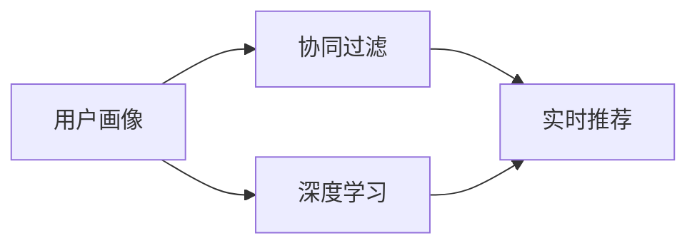

## 1.背景介绍

在数字化时代，音乐作为一种重要的艺术形式，已经深入到人们生活的各个角落。随着音乐产业的快速发展，音乐的数量也呈现出爆炸性的增长，这使得用户在寻找自己喜欢的音乐时面临着巨大的挑战。因此，音乐推荐系统应运而生，它能够根据用户的个性化需求和行为特征，推荐出用户可能感兴趣的音乐，大大提升了用户的听音乐体验。

## 2.核心概念与联系

音乐推荐系统主要涉及到以下几个核心概念：

- **用户画像**：用户画像是对用户行为数据进行分析和挖掘，形成的用户兴趣偏好模型，它是推荐系统进行个性化推荐的基础。

- **协同过滤**：协同过滤是一种基于用户行为分析的推荐算法，主要分为用户基于协同过滤和物品基于协同过滤。

- **深度学习**：深度学习是一种基于神经网络的机器学习方法，能够从大量数据中学习到有用的特征，用于推荐系统中，能够提升推荐的准确性。

- **实时推荐**：实时推荐是指系统能够根据用户实时的行为变化，动态调整推荐结果。

这些核心概念之间的联系主要体现在，用户画像是推荐系统的基础，协同过滤和深度学习是实现推荐的主要技术，而实时推荐是推荐系统的一个重要特性。



## 3.核心算法原理具体操作步骤

音乐推荐系统的设计主要包括以下几个步骤：

1. **数据收集**：首先需要收集用户的行为数据，包括用户的历史听歌记录、搜索记录等。

2. **用户画像构建**：根据用户行为数据，构建用户的兴趣模型，这是推荐系统进行个性化推荐的基础。

3. **推荐算法设计**：设计推荐算法，根据用户画像和音乐库，生成推荐列表。常用的推荐算法有协同过滤、基于内容的推荐等。

4. **实时推荐**：根据用户实时的行为变化，动态调整推荐列表。

5. **推荐效果评估**：通过一些指标，如准确率、召回率等，评估推荐的效果。

## 4.数学模型和公式详细讲解举例说明

在推荐系统中，常用的数学模型有协同过滤模型和深度学习模型。

### 4.1 协同过滤模型

协同过滤模型主要分为用户基于协同过滤和物品基于协同过滤。用户基于协同过滤是通过找到和目标用户兴趣相似的用户，然后推荐他们喜欢的物品给目标用户。物品基于协同过滤是通过找到目标用户喜欢的物品，然后找到和这些物品相似的物品推荐给目标用户。

假设我们有用户对物品的评分矩阵$R$，其中$r_{ui}$表示用户$u$对物品$i$的评分，我们的目标是预测用户$u$对物品$j$的评分$\hat{r}_{uj}$。

用户基于协同过滤的预测公式为：

$$
\hat{r}_{uj} = \frac{\sum_{v \in N(u)} sim(u, v) \cdot r_{vj}}{\sum_{v \in N(u)} sim(u, v)}
$$

其中，$N(u)$表示和用户$u$兴趣相似的用户集合，$sim(u, v)$表示用户$u$和用户$v$的相似度。

物品基于协同过滤的预测公式为：

$$
\hat{r}_{uj} = \frac{\sum_{i \in N(j)} sim(j, i) \cdot r_{ui}}{\sum_{i \in N(j)} sim(j, i)}
$$

其中，$N(j)$表示和物品$j$相似的物品集合，$sim(j, i)$表示物品$j$和物品$i$的相似度。

### 4.2 深度学习模型

在深度学习模型中，我们通常使用神经网络来学习用户和物品的嵌入向量，然后通过计算嵌入向量的点积来预测用户对物品的评分。

假设我们的神经网络模型为$f$，用户$u$的嵌入向量为$u_{emb}$，物品$i$的嵌入向量为$i_{emb}$，我们的预测公式为：

$$
\hat{r}_{ui} = f(u_{emb}, i_{emb})
$$

其中，$f$通常是一个多层感知机。

## 5.项目实践：代码实例和详细解释说明

为了实现音乐推荐系统，我们需要进行以下几个步骤：

1. **数据处理**：首先，我们需要处理用户的行为数据，包括清洗数据、构建用户画像等。

```python
# 加载数据
df = pd.read_csv('user_behavior.csv')

# 清洗数据
df = df.dropna()

# 构建用户画像
user_profile = df.groupby('user_id').agg({
    'song_id': lambda x: list(set(x)),
    'play_time': 'sum',
    'like': 'sum'
})
```

2. **设计推荐算法**：然后，我们需要设计推荐算法，这里我们以协同过滤为例。

```python
# 计算用户相似度
user_similarity = cosine_similarity(user_profile)

# 生成推荐列表
recommend_list = {}
for user in user_profile.index:
    similar_users = user_similarity[user].argsort()[-10:]
    recommend_songs = []
    for similar_user in similar_users:
        recommend_songs.extend(user_profile.loc[similar_user, 'song_id'])
    recommend_list[user] = recommend_songs
```

3. **实现实时推荐**：最后，我们需要实现实时推荐，这通常需要使用到一些实时计算框架，如Spark Streaming等。

由于篇幅限制，这里就不再详细介绍实现实时推荐的代码了。

## 6.实际应用场景

音乐推荐系统在实际中有很多应用场景，例如：

- **在线音乐平台**：像网易云音乐、QQ音乐等在线音乐平台，都使用了音乐推荐系统，为用户推荐他们可能感兴趣的音乐。

- **智能音箱**：像小米AI音箱、亚马逊Echo等智能音箱，也使用了音乐推荐系统，用户可以通过语音命令，让音箱为他们播放推荐的音乐。

- **智能电视**：一些智能电视也集成了音乐推荐系统，用户可以在观看电视的同时，听到推荐的音乐。

## 7.工具和资源推荐

以下是一些在设计和实现音乐推荐系统时可能会用到的工具和资源：

- **数据处理**：Pandas是一个强大的数据处理库，可以方便地进行数据清洗和处理。

- **推荐算法**：Scikit-learn是一个包含了各种机器学习算法的库，其中包括了协同过滤等推荐算法。

- **深度学习**：Tensorflow和PyTorch是目前最流行的深度学习框架，可以用来设计和实现深度学习模型。

- **实时计算**：Spark Streaming和Flink是两个流行的实时计算框架，可以用来实现实时推荐。

## 8.总结：未来发展趋势与挑战

音乐推荐系统作为推荐系统的一个重要应用，其发展趋势和面临的挑战主要有以下几点：

- **更精准的推荐**：随着深度学习等技术的发展，推荐系统的推荐精度将会越来越高。

- **更实时的推荐**：随着实时计算技术的发展，推荐系统将能够更快地响应用户的行为变化。

- **更多元的推荐**：随着用户需求的多样化，推荐系统将不仅仅局限于推荐音乐，还将包括推荐歌单、推荐演唱会等。

- **隐私保护**：随着用户对隐私保护意识的提高，如何在保护用户隐私的同时，提供个性化推荐，将成为推荐系统面临的一个重要挑战。

## 9.附录：常见问题与解答

1. **问：音乐推荐系统如何处理新用户和新音乐？**

答：对于新用户，我们可以采用基于内容的推荐，根据用户的注册信息和初次行为，推荐一些可能感兴趣的音乐。对于新音乐，我们可以采用基于内容的推荐，根据音乐的元数据和内容，推荐给可能感兴趣的用户。

2. **问：音乐推荐系统如何评估推荐效果？**

答：我们可以通过一些指标，如准确率、召回率、覆盖率、新颖度等，来评估推荐的效果。同时，我们还可以通过在线A/B测试，直接观察不同推荐策略对用户行为的影响。

3. **问：音乐推荐系统如何处理用户的多样化需求？**

答：我们可以在推荐列表中，包含不同类型和风格的音乐，以满足用户的多样化需求。同时，我们还可以通过学习用户的长期和短期兴趣，来动态调整推荐策略。

作者：禅与计算机程序设计艺术 / Zen and the Art of Computer Programming