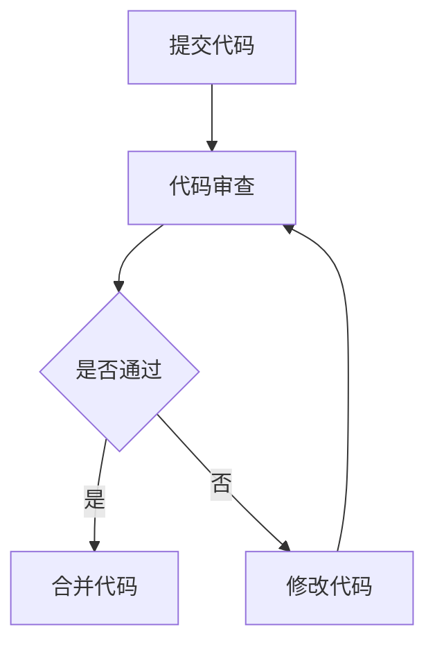

# 团队研发文化和价值观建设与传承

## 1.背景介绍

在现代软件开发中，技术的进步和工具的更新固然重要，但团队的研发文化和价值观同样不可忽视。一个高效的团队不仅需要技术上的卓越，还需要在文化和价值观上有一致的认同和传承。本文将深入探讨如何在团队中建立和传承研发文化和价值观，帮助团队在技术和文化上共同进步。

## 2.核心概念与联系

### 2.1 研发文化

研发文化是指团队在软件开发过程中所遵循的行为准则、工作习惯和价值观。它包括团队成员之间的沟通方式、问题解决的策略、代码质量的标准等。

### 2.2 价值观

价值观是团队成员在工作中所坚持的基本信念和原则。它决定了团队在面对挑战和决策时的行为方式。例如，代码质量优先、用户体验至上、持续学习和改进等。

### 2.3 文化与价值观的联系

研发文化和价值观是相辅相成的。价值观是文化的核心，文化是价值观的外在表现。一个团队的研发文化如果没有坚实的价值观支撑，就会变得空洞和无力。

## 3.核心算法原理具体操作步骤

### 3.1 文化建设的步骤

1. **定义核心价值观**：明确团队的核心价值观，如代码质量、用户体验、创新等。
2. **制定行为准则**：根据核心价值观，制定具体的行为准则和工作流程。
3. **培训和传达**：通过培训和沟通，让每个团队成员理解和认同这些价值观和行为准则。
4. **实践和反馈**：在实际工作中践行这些价值观，并通过定期反馈和评估不断改进。

### 3.2 价值观传承的步骤

1. **领导示范**：团队领导要以身作则，践行团队的核心价值观。
2. **文化融入**：将价值观融入到招聘、培训、绩效评估等各个环节。
3. **持续改进**：通过定期的团队活动和反馈机制，不断强化和改进团队的价值观。

## 4.数学模型和公式详细讲解举例说明

在团队研发文化和价值观建设中，虽然不涉及复杂的数学模型，但我们可以借用一些管理学中的模型来帮助理解和实施。

### 4.1 文化建设的PDCA循环

PDCA循环（Plan-Do-Check-Act）是一个常用的管理工具，可以帮助团队在文化建设中不断改进。

$$
\text{PDCA} = \left\{
\begin{array}{ll}
\text{Plan} & \text{制定计划，明确目标和步骤} \\
\text{Do} & \text{执行计划，落实具体行动} \\
\text{Check} & \text{检查结果，评估效果} \\
\text{Act} & \text{改进措施，持续优化}
\end{array}
\right.
$$

### 4.2 价值观传承的KPI模型

关键绩效指标（KPI）是衡量团队成员是否践行核心价值观的有效工具。通过设定具体的KPI，可以量化和评估团队成员的表现。

$$
\text{KPI} = \frac{\text{实际表现}}{\text{预期目标}} \times 100\%
$$

## 5.项目实践：代码实例和详细解释说明

### 5.1 代码质量的价值观

在代码质量方面，团队可以通过代码审查（Code Review）来践行高质量代码的价值观。以下是一个简单的代码审查流程示例：



### 5.2 实践示例

假设我们有一个团队价值观是“代码质量优先”，以下是一个Python代码审查的示例：

```python
def add(a, b):
    """
    Adds two numbers and returns the result.
    """
    if not isinstance(a, (int, float)) or not isinstance(b, (int, float)):
        raise ValueError("Both arguments must be numbers")
    return a + b

# 代码审查意见
# 1. 添加类型检查，确保输入参数为数字
# 2. 添加文档字符串，说明函数的功能
```

通过代码审查，团队成员可以互相学习和提高，确保代码质量符合团队的价值观。

## 6.实际应用场景

### 6.1 初创团队

在初创团队中，研发文化和价值观的建设尤为重要。初创团队通常资源有限，但通过建立良好的研发文化，可以提高团队的凝聚力和工作效率。

### 6.2 大型企业

在大型企业中，研发文化和价值观的传承需要更多的制度和流程支持。例如，通过定期的培训和团队活动，确保新老员工都能理解和认同公司的核心价值观。

### 6.3 分布式团队

对于分布式团队，沟通和协作是最大的挑战。通过建立统一的研发文化和价值观，可以减少沟通成本，提高协作效率。

## 7.工具和资源推荐

### 7.1 工具推荐

1. **JIRA**：用于项目管理和任务跟踪，帮助团队成员了解项目进展和任务分配。
2. **Confluence**：用于文档管理和知识共享，帮助团队成员记录和传承研发文化和价值观。
3. **Slack**：用于团队沟通和协作，帮助团队成员保持高效的沟通。

### 7.2 资源推荐

1. **《人月神话》**：经典的软件工程书籍，探讨了团队管理和研发文化的重要性。
2. **《持续交付》**：介绍了如何通过持续交付提高软件开发效率和质量。
3. **《精益创业》**：介绍了如何在初创团队中建立高效的研发文化。

## 8.总结：未来发展趋势与挑战

### 8.1 未来发展趋势

1. **远程办公的普及**：随着远程办公的普及，团队研发文化和价值观的建设将面临新的挑战和机遇。
2. **人工智能的应用**：人工智能技术的发展将为团队研发文化和价值观的建设提供新的工具和方法。
3. **多元化和包容性**：未来的团队将更加多元化，如何在多元化的团队中建立和传承共同的价值观将成为一个重要课题。

### 8.2 挑战

1. **文化冲突**：在多元化的团队中，不同文化背景的成员可能会有不同的价值观，如何协调和统一这些价值观将是一个挑战。
2. **技术变革**：技术的快速变革可能会对团队的研发文化和价值观产生影响，如何在技术变革中保持文化和价值观的稳定性将是一个挑战。

## 9.附录：常见问题与解答

### 9.1 如何在团队中推广新的研发文化和价值观？

推广新的研发文化和价值观需要从领导层开始，通过培训、沟通和实际行动来影响团队成员。同时，可以通过设定具体的KPI和反馈机制来评估和改进。

### 9.2 如何处理团队成员之间的文化冲突？

处理文化冲突需要通过沟通和协调来解决。可以通过团队活动和培训来增进团队成员之间的理解和信任。同时，制定明确的行为准则和价值观，帮助团队成员在工作中遵循共同的标准。

### 9.3 如何在远程团队中建立和传承研发文化和价值观？

在远程团队中建立和传承研发文化和价值观需要更多的沟通和协作工具支持。可以通过定期的线上会议、培训和团队活动来增进团队成员之间的联系和理解。同时，使用文档管理和知识共享工具，确保团队成员能够随时了解和遵循团队的价值观和行为准则。

---

作者：禅与计算机程序设计艺术 / Zen and the Art of Computer Programming