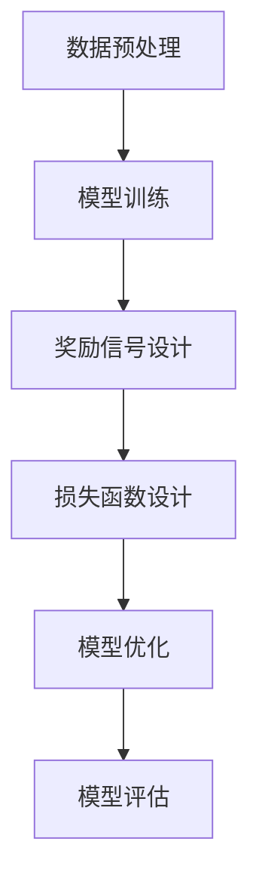

# 大语言模型原理与工程实践：奖励模型损失函数分析

## 1.背景介绍

大语言模型（Large Language Models, LLMs）近年来在自然语言处理（NLP）领域取得了显著的进展。它们在各种任务中表现出色，如机器翻译、文本生成和问答系统等。奖励模型（Reward Model, RM）作为大语言模型的重要组成部分，主要用于优化模型的生成质量。本文将深入探讨奖励模型的损失函数，分析其原理与工程实践。

## 2.核心概念与联系

### 2.1 大语言模型

大语言模型是基于深度学习的模型，通常使用大量的文本数据进行训练。其核心在于通过自回归或自编码的方式，学习文本的统计特性和语义关系。

### 2.2 奖励模型

奖励模型用于评估生成文本的质量。它通过给定的奖励信号，指导大语言模型生成更符合预期的文本。奖励信号可以是人工设计的规则，也可以是从数据中学习得到的。

### 2.3 损失函数

损失函数是机器学习模型优化的核心。对于奖励模型，损失函数用于衡量生成文本与目标文本之间的差异，并指导模型参数的更新。

### 2.4 核心联系

大语言模型通过损失函数进行优化，而奖励模型的损失函数则直接影响生成文本的质量。理解和设计有效的损失函数是提升大语言模型性能的关键。

## 3.核心算法原理具体操作步骤

### 3.1 数据预处理

数据预处理是训练大语言模型的第一步。包括文本清洗、分词、词向量表示等。

### 3.2 模型训练

使用预处理后的数据训练大语言模型。常见的训练方法包括自回归模型（如GPT）和自编码模型（如BERT）。

### 3.3 奖励信号设计

设计奖励信号是奖励模型的核心。可以基于人工规则、用户反馈或从数据中学习得到。

### 3.4 损失函数设计

设计损失函数用于衡量生成文本的质量。常见的损失函数包括交叉熵损失、KL散度等。

### 3.5 模型优化

使用梯度下降等优化算法，基于损失函数更新模型参数。

### 3.6 模型评估

使用验证集评估模型性能，调整模型参数和损失函数设计。



## 4.数学模型和公式详细讲解举例说明

### 4.1 交叉熵损失

交叉熵损失是最常用的损失函数之一，用于衡量预测分布与真实分布之间的差异。其公式为：

$$
L_{CE} = -\sum_{i} y_i \log(\hat{y}_i)
$$

其中，$y_i$ 是真实标签，$\hat{y}_i$ 是预测概率。

### 4.2 KL散度

KL散度用于衡量两个概率分布之间的差异。其公式为：

$$
D_{KL}(P||Q) = \sum_{i} P(i) \log\left(\frac{P(i)}{Q(i)}\right)
$$

其中，$P$ 和 $Q$ 分别是两个概率分布。

### 4.3 奖励模型损失函数

奖励模型的损失函数可以基于生成文本的奖励信号设计。假设 $R$ 是奖励信号，$G$ 是生成文本，损失函数可以表示为：

$$
L_{RM} = -R(G)
$$

通过最大化奖励信号，优化生成文本的质量。

## 5.项目实践：代码实例和详细解释说明

### 5.1 数据预处理

```python
import nltk
from nltk.tokenize import word_tokenize

# 下载必要的资源
nltk.download('punkt')

# 文本清洗和分词
def preprocess_text(text):
    tokens = word_tokenize(text.lower())
    return tokens

text = "Hello, world! This is a test."
tokens = preprocess_text(text)
print(tokens)
```

### 5.2 模型训练

```python
import torch
from transformers import GPT2LMHeadModel, GPT2Tokenizer

# 加载预训练模型和分词器
model_name = 'gpt2'
model = GPT2LMHeadModel.from_pretrained(model_name)
tokenizer = GPT2Tokenizer.from_pretrained(model_name)

# 文本编码
inputs = tokenizer("Hello, world!", return_tensors="pt")

# 模型前向传播
outputs = model(**inputs, labels=inputs["input_ids"])
loss = outputs.loss
print(loss)
```

### 5.3 奖励信号设计

```python
def reward_function(text):
    # 简单的奖励信号示例：文本长度
    return len(text)

generated_text = "This is a generated text."
reward = reward_function(generated_text)
print(reward)
```

### 5.4 损失函数设计

```python
def loss_function(reward):
    # 简单的损失函数示例：负奖励
    return -reward

loss = loss_function(reward)
print(loss)
```

### 5.5 模型优化

```python
from torch.optim import Adam

# 优化器
optimizer = Adam(model.parameters(), lr=1e-5)

# 反向传播和参数更新
loss.backward()
optimizer.step()
```

### 5.6 模型评估

```python
# 使用验证集评估模型性能
def evaluate_model(model, tokenizer, text):
    inputs = tokenizer(text, return_tensors="pt")
    outputs = model(**inputs, labels=inputs["input_ids"])
    loss = outputs.loss
    return loss.item()

validation_text = "This is a validation text."
validation_loss = evaluate_model(model, tokenizer, validation_text)
print(validation_loss)
```

## 6.实际应用场景

### 6.1 机器翻译

大语言模型在机器翻译中表现出色。通过设计合适的奖励信号和损失函数，可以提升翻译质量。

### 6.2 文本生成

在文本生成任务中，奖励模型可以用于优化生成文本的连贯性和可读性。

### 6.3 问答系统

奖励模型在问答系统中用于优化回答的准确性和相关性。

### 6.4 情感分析

通过设计情感相关的奖励信号，奖励模型可以用于优化情感分析任务。

## 7.工具和资源推荐

### 7.1 工具

- **Transformers**：Hugging Face 提供的预训练模型库，支持多种大语言模型。
- **NLTK**：自然语言处理工具包，提供丰富的文本处理功能。
- **PyTorch**：深度学习框架，支持大语言模型的训练和优化。

### 7.2 资源

- **论文**：阅读最新的研究论文，了解大语言模型和奖励模型的前沿进展。
- **教程**：在线教程和文档，帮助快速上手大语言模型的使用和开发。
- **社区**：参与相关的技术社区，交流经验和问题。

## 8.总结：未来发展趋势与挑战

大语言模型和奖励模型在NLP领域展现了巨大的潜力。然而，仍然存在一些挑战，如模型的可解释性、训练效率和数据隐私等。未来的发展趋势包括：

- **模型压缩**：通过模型压缩技术，提升大语言模型的运行效率。
- **多模态学习**：结合多种数据模态，提升模型的泛化能力。
- **可解释性**：提升模型的可解释性，增强用户信任。
- **隐私保护**：在保证数据隐私的前提下，提升模型性能。

## 9.附录：常见问题与解答

### 9.1 如何选择合适的奖励信号？

选择合适的奖励信号需要结合具体任务和目标。可以基于人工规则、用户反馈或从数据中学习得到。

### 9.2 如何设计有效的损失函数？

设计有效的损失函数需要考虑生成文本的质量和目标。常见的方法包括交叉熵损失、KL散度等。

### 9.3 如何提升模型的训练效率？

提升模型的训练效率可以通过模型压缩、分布式训练和优化算法等方法实现。

### 9.4 如何评估模型性能？

评估模型性能可以使用验证集，通过计算损失函数值和其他评价指标（如BLEU、ROUGE等）进行评估。

### 9.5 如何处理数据隐私问题？

处理数据隐私问题可以通过数据匿名化、差分隐私等技术手段实现。

---

作者：禅与计算机程序设计艺术 / Zen and the Art of Computer Programming