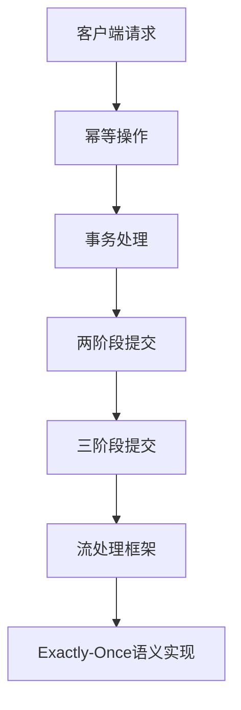

# 容错机制与语义保证:Exactly-Once语义及其实现

## 1.背景介绍

在分布式系统中，消息传递和任务执行的可靠性是至关重要的。无论是金融交易、物联网数据处理，还是大规模数据分析，确保每个操作只执行一次（Exactly-Once）是系统设计的关键挑战之一。Exactly-Once语义（EOS）不仅要求消息不丢失、不重复，还要确保每个操作在系统中只执行一次。这种语义保证在高可用性和高可靠性系统中尤为重要。

## 2.核心概念与联系

### 2.1 容错机制

容错机制是指系统在出现故障时，仍能继续运行并保持数据一致性和服务可用性的方法。常见的容错机制包括数据冗余、事务处理、检查点和回滚等。

### 2.2 语义保证

语义保证是指系统在执行操作时，能够确保操作的预期效果。常见的语义保证包括至少一次（At-Least-Once）、至多一次（At-Most-Once）和恰好一次（Exactly-Once）。

### 2.3 Exactly-Once语义

Exactly-Once语义是指每个操作在系统中只执行一次且仅执行一次。这种语义保证在分布式系统中实现难度较大，但对于确保数据一致性和系统可靠性至关重要。

### 2.4 核心联系

容错机制和语义保证是分布式系统设计中的两个重要方面。通过合理的容错机制，可以实现不同级别的语义保证。Exactly-Once语义是最高级别的语义保证，需要结合多种容错机制来实现。

## 3.核心算法原理具体操作步骤

### 3.1 幂等性

幂等性是实现Exactly-Once语义的基础。幂等操作是指无论执行多少次，结果都相同的操作。通过设计幂等操作，可以简化Exactly-Once语义的实现。

### 3.2 事务处理

事务处理是实现Exactly-Once语义的关键技术之一。通过事务处理，可以确保一组操作要么全部成功，要么全部失败，从而保证数据一致性。

### 3.3 两阶段提交

两阶段提交（2PC）是分布式系统中常用的事务处理协议。它分为准备阶段和提交阶段，通过协调多个节点的操作，确保事务的一致性。

### 3.4 三阶段提交

三阶段提交（3PC）是对两阶段提交的改进，增加了一个准备提交阶段，进一步提高了系统的容错能力。

### 3.5 流处理框架

流处理框架（如Apache Kafka、Apache Flink）提供了内置的Exactly-Once语义支持，通过检查点和状态管理等机制，实现高效的Exactly-Once语义。



## 4.数学模型和公式详细讲解举例说明

### 4.1 幂等性数学模型

幂等操作可以用数学函数表示：设 $f(x)$ 为一个操作，如果对于任意的 $x$，有 $f(f(x)) = f(x)$，则 $f(x)$ 是幂等的。

### 4.2 事务处理数学模型

事务处理可以用集合论表示：设 $T$ 为一个事务，$O$ 为操作集合，$S$ 为系统状态集合。如果 $T$ 满足 $T: S \rightarrow S$，且 $T(O) = \{O_1, O_2, ..., O_n\}$，则 $T$ 是一个事务。

### 4.3 两阶段提交数学模型

两阶段提交可以用状态机表示：设 $P$ 为准备阶段，$C$ 为提交阶段，$A$ 为事务的所有参与者，$S$ 为系统状态集合。如果 $P: S \rightarrow S$ 和 $C: S \rightarrow S$，且 $P \cup C = A$，则两阶段提交成功。

### 4.4 三阶段提交数学模型

三阶段提交在两阶段提交的基础上增加了一个准备提交阶段：设 $P$ 为准备阶段，$PC$ 为准备提交阶段，$C$ 为提交阶段，$A$ 为事务的所有参与者，$S$ 为系统状态集合。如果 $P: S \rightarrow S$，$PC: S \rightarrow S$ 和 $C: S \rightarrow S$，且 $P \cup PC \cup C = A$，则三阶段提交成功。

### 4.5 流处理框架数学模型

流处理框架可以用有向无环图（DAG）表示：设 $G = (V, E)$ 为一个有向无环图，$V$ 为节点集合，$E$ 为边集合。如果 $G$ 满足 $V = \{v_1, v_2, ..., v_n\}$ 和 $E = \{e_1, e_2, ..., e_m\}$，则流处理框架可以实现Exactly-Once语义。

## 5.项目实践：代码实例和详细解释说明

### 5.1 幂等性实现

```python
class IdempotentOperation:
    def __init__(self):
        self.executed_operations = set()

    def execute(self, operation_id, operation):
        if operation_id in self.executed_operations:
            return "Operation already executed"
        else:
            result = operation()
            self.executed_operations.add(operation_id)
            return result

# 示例操作
def sample_operation():
    return "Operation executed"

# 实例化幂等操作类
idempotent_op = IdempotentOperation()

# 执行操作
print(idempotent_op.execute(1, sample_operation))  # 输出: Operation executed
print(idempotent_op.execute(1, sample_operation))  # 输出: Operation already executed
```

### 5.2 事务处理实现

```python
import sqlite3

def execute_transaction(operations):
    conn = sqlite3.connect('example.db')
    cursor = conn.cursor()
    try:
        for operation in operations:
            cursor.execute(operation)
        conn.commit()
    except Exception as e:
        conn.rollback()
        print(f"Transaction failed: {e}")
    finally:
        conn.close()

# 示例操作
operations = [
    "INSERT INTO users (name, age) VALUES ('Alice', 30)",
    "INSERT INTO users (name, age) VALUES ('Bob', 25)"
]

# 执行事务
execute_transaction(operations)
```

### 5.3 两阶段提交实现

```python
class TwoPhaseCommit:
    def __init__(self, participants):
        self.participants = participants

    def prepare(self):
        for participant in self.participants:
            if not participant.prepare():
                return False
        return True

    def commit(self):
        for participant in self.participants:
            participant.commit()

    def rollback(self):
        for participant in self.participants:
            participant.rollback()

# 示例参与者
class Participant:
    def prepare(self):
        # 准备阶段逻辑
        return True

    def commit(self):
        # 提交阶段逻辑
        pass

    def rollback(self):
        # 回滚阶段逻辑
        pass

# 实例化两阶段提交类
participants = [Participant(), Participant()]
two_phase_commit = TwoPhaseCommit(participants)

# 执行两阶段提交
if two_phase_commit.prepare():
    two_phase_commit.commit()
else:
    two_phase_commit.rollback()
```

### 5.4 流处理框架实现

```python
from kafka import KafkaProducer, KafkaConsumer
from kafka.errors import KafkaError

# 生产者
producer = KafkaProducer(bootstrap_servers=['localhost:9092'])

# 发送消息
future = producer.send('my-topic', b'Hello, World!')

# 检查发送结果
try:
    record_metadata = future.get(timeout=10)
except KafkaError as e:
    print(f"Message send failed: {e}")

# 消费者
consumer = KafkaConsumer('my-topic', bootstrap_servers=['localhost:9092'])

# 接收消息
for message in consumer:
    print(f"Received message: {message.value}")
```

## 6.实际应用场景

### 6.1 金融交易系统

在金融交易系统中，确保每笔交易只执行一次是至关重要的。通过Exactly-Once语义，可以避免重复交易和数据不一致的问题。

### 6.2 物联网数据处理

在物联网数据处理系统中，传感器数据的可靠传输和处理是关键。通过Exactly-Once语义，可以确保每个传感器数据只处理一次，避免数据丢失和重复处理。

### 6.3 大规模数据分析

在大规模数据分析系统中，数据的准确性和一致性是分析结果的基础。通过Exactly-Once语义，可以确保每个数据只处理一次，保证分析结果的准确性。

## 7.工具和资源推荐

### 7.1 Apache Kafka

Apache Kafka是一个分布式流处理平台，提供了内置的Exactly-Once语义支持。通过Kafka Streams API，可以实现高效的流处理和Exactly-Once语义。

### 7.2 Apache Flink

Apache Flink是一个分布式流处理框架，提供了强大的状态管理和检查点机制，支持Exactly-Once语义。通过Flink的DataStream API，可以实现复杂的流处理任务。

### 7.3 Google Cloud Pub/Sub

Google Cloud Pub/Sub是一个分布式消息传递服务，提供了Exactly-Once语义支持。通过Pub/Sub的API，可以实现高可靠的消息传递和处理。

## 8.总结：未来发展趋势与挑战

Exactly-Once语义在分布式系统中的实现是一个复杂而重要的课题。随着技术的发展，越来越多的工具和框架提供了内置的Exactly-Once语义支持。然而，实现Exactly-Once语义仍然面临许多挑战，如网络分区、节点故障和数据一致性等问题。未来，随着分布式系统技术的不断进步，Exactly-Once语义的实现将变得更加高效和可靠。

## 9.附录：常见问题与解答

### 9.1 什么是Exactly-Once语义？

Exactly-Once语义是指每个操作在系统中只执行一次且仅执行一次的语义保证。

### 9.2 为什么Exactly-Once语义难以实现？

Exactly-Once语义难以实现的原因在于分布式系统中的网络分区、节点故障和数据一致性等问题。

### 9.3 如何实现幂等操作？

幂等操作是指无论执行多少次，结果都相同的操作。可以