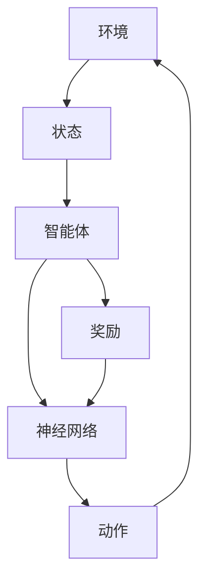

# 强化学习与神经网络:智能决策的终极组合

## 1.背景介绍

在人工智能领域，强化学习（Reinforcement Learning, RL）和神经网络（Neural Networks, NN）是两个重要的研究方向。强化学习是一种通过与环境交互来学习策略的机器学习方法，而神经网络则是模拟人脑结构和功能的计算模型。近年来，这两者的结合在智能决策系统中展现出了巨大的潜力，成为了智能决策的终极组合。

### 1.1 强化学习的起源与发展

强化学习的概念最早可以追溯到20世纪50年代的行为心理学。其核心思想是通过奖励和惩罚来引导行为。随着计算机科学的发展，强化学习逐渐成为机器学习的一个重要分支。经典的强化学习算法包括Q学习、SARSA等。

### 1.2 神经网络的演变

神经网络的研究始于20世纪40年代，最初的模型是简单的感知器。随着计算能力的提升和算法的改进，神经网络逐渐发展出多层感知器、卷积神经网络（CNN）、循环神经网络（RNN）等复杂结构。深度学习的兴起更是将神经网络推向了新的高度。

### 1.3 强化学习与神经网络的结合

在20世纪末，研究人员开始尝试将神经网络应用于强化学习中，以解决高维状态空间和动作空间的问题。深度强化学习（Deep Reinforcement Learning, DRL）由此诞生，成为了当前人工智能研究的热点。

## 2.核心概念与联系

### 2.1 强化学习的基本概念

强化学习的基本概念包括状态（State）、动作（Action）、奖励（Reward）和策略（Policy）。智能体（Agent）通过在不同状态下选择动作，从环境中获得奖励，并不断调整策略以最大化累积奖励。

### 2.2 神经网络的基本结构

神经网络由输入层、隐藏层和输出层组成。每一层由若干神经元构成，神经元之间通过权重连接。神经网络通过调整权重来学习输入与输出之间的映射关系。

### 2.3 强化学习与神经网络的结合点

在深度强化学习中，神经网络被用来近似强化学习中的价值函数或策略函数。通过神经网络的强大表达能力，智能体可以在高维状态空间中进行有效的决策。

### 2.4 核心联系的Mermaid流程图



## 3.核心算法原理具体操作步骤

### 3.1 Q学习算法

Q学习是一种无模型的强化学习算法，通过学习状态-动作对的价值来指导智能体的行为。其核心公式为：

$$
Q(s, a) \leftarrow Q(s, a) + \alpha [r + \gamma \max_{a'} Q(s', a') - Q(s, a)]
$$

### 3.2 深度Q网络（DQN）

深度Q网络是将Q学习与神经网络结合的算法。其基本步骤如下：

1. 初始化经验回放池和Q网络。
2. 在每个时间步，从环境中获取当前状态。
3. 使用Q网络选择动作。
4. 执行动作，获得奖励和下一个状态。
5. 将经验存储到回放池中。
6. 从回放池中随机抽取小批量样本，更新Q网络。

### 3.3 策略梯度方法

策略梯度方法直接优化策略函数，通过梯度上升法来最大化累积奖励。其核心公式为：

$$
\nabla J(\theta) = \mathbb{E}_{\pi_\theta} \left[ \nabla_\theta \log \pi_\theta(a|s) Q^\pi(s, a) \right]
$$

### 3.4 近端策略优化（PPO）

PPO是一种改进的策略梯度方法，通过限制策略更新的幅度来提高训练的稳定性。其核心公式为：

$$
L^{CLIP}(\theta) = \hat{\mathbb{E}}_t \left[ \min \left( r_t(\theta) \hat{A}_t, \text{clip}(r_t(\theta), 1 - \epsilon, 1 + \epsilon) \hat{A}_t \right) \right]
$$

## 4.数学模型和公式详细讲解举例说明

### 4.1 马尔可夫决策过程（MDP）

强化学习问题通常被建模为马尔可夫决策过程。MDP由五元组 $(S, A, P, R, \gamma)$ 组成，其中：

- $S$ 是状态空间
- $A$ 是动作空间
- $P$ 是状态转移概率
- $R$ 是奖励函数
- $\gamma$ 是折扣因子

### 4.2 贝尔曼方程

贝尔曼方程是强化学习中的核心公式，用于描述状态价值函数和动作价值函数。状态价值函数的贝尔曼方程为：

$$
V(s) = \max_a \left[ R(s, a) + \gamma \sum_{s'} P(s'|s, a) V(s') \right]
$$

动作价值函数的贝尔曼方程为：

$$
Q(s, a) = R(s, a) + \gamma \sum_{s'} P(s'|s, a) \max_{a'} Q(s', a')
```

### 4.3 神经网络的反向传播算法

神经网络通过反向传播算法来更新权重。其核心步骤包括：

1. 前向传播计算输出。
2. 计算损失函数。
3. 反向传播计算梯度。
4. 更新权重。

## 5.项目实践：代码实例和详细解释说明

### 5.1 环境搭建

首先，我们需要安装必要的库：

```bash
pip install tensorflow gym
```

### 5.2 DQN算法实现

以下是一个简单的DQN算法实现：

```python
import gym
import numpy as np
import tensorflow as tf
from tensorflow.keras import layers

# 创建环境
env = gym.make('CartPole-v1')

# 定义Q网络
def create_q_model():
    inputs = layers.Input(shape=(4,))
    layer1 = layers.Dense(24, activation='relu')(inputs)
    layer2 = layers.Dense(24, activation='relu')(layer1)
    action = layers.Dense(2, activation='linear')(layer2)
    return tf.keras.Model(inputs=inputs, outputs=action)

# 初始化Q网络和目标Q网络
q_model = create_q_model()
target_q_model = create_q_model()

# 编译模型
q_model.compile(optimizer=tf.keras.optimizers.Adam(learning_rate=0.001), loss='mse')

# 经验回放池
class ReplayBuffer:
    def __init__(self, size):
        self.buffer = []
        self.size = size

    def add(self, experience):
        if len(self.buffer) >= self.size:
            self.buffer.pop(0)
        self.buffer.append(experience)

    def sample(self, batch_size):
        return np.random.choice(self.buffer, batch_size)

# 初始化经验回放池
replay_buffer = ReplayBuffer(10000)

# 训练参数
gamma = 0.99
batch_size = 64
epsilon = 1.0
epsilon_min = 0.1
epsilon_decay = 0.995
target_update_freq = 10

# 训练过程
for episode in range(1000):
    state = env.reset()
    state = np.reshape(state, [1, 4])
    total_reward = 0

    for step in range(200):
        if np.random.rand() <= epsilon:
            action = np.random.choice(2)
        else:
            q_values = q_model.predict(state)
            action = np.argmax(q_values[0])

        next_state, reward, done, _ = env.step(action)
        next_state = np.reshape(next_state, [1, 4])
        replay_buffer.add((state, action, reward, next_state, done))

        state = next_state
        total_reward += reward

        if done:
            print(f"Episode: {episode}, Total Reward: {total_reward}")
            break

        if len(replay_buffer.buffer) >= batch_size:
            batch = replay_buffer.sample(batch_size)
            states, actions, rewards, next_states, dones = zip(*batch)

            states = np.vstack(states)
            next_states = np.vstack(next_states)

            q_values_next = target_q_model.predict(next_states)
            targets = rewards + gamma * np.amax(q_values_next, axis=1) * (1 - np.array(dones))

            q_values = q_model.predict(states)
            for i, action in enumerate(actions):
                q_values[i][action] = targets[i]

            q_model.fit(states, q_values, epochs=1, verbose=0)

    if epsilon > epsilon_min:
        epsilon *= epsilon_decay

    if episode % target_update_freq == 0:
        target_q_model.set_weights(q_model.get_weights())
```

### 5.3 代码解释

1. **环境创建**：使用Gym库创建CartPole环境。
2. **Q网络定义**：使用TensorFlow定义一个简单的Q网络。
3. **经验回放池**：定义一个经验回放池，用于存储和采样经验。
4. **训练过程**：在每个时间步，智能体选择动作、执行动作、存储经验，并使用小批量样本更新Q网络。

## 6.实际应用场景

### 6.1 游戏AI

深度强化学习在游戏AI中取得了显著成果。例如，DeepMind的AlphaGo通过深度强化学习击败了世界顶级围棋选手。

### 6.2 自动驾驶

在自动驾驶领域，深度强化学习被用于路径规划和决策控制。通过与模拟环境的交互，自动驾驶系统可以学习如何在复杂的交通环境中安全行驶。

### 6.3 机器人控制

深度强化学习在机器人控制中也有广泛应用。通过与物理环境的交互，机器人可以学习如何完成各种任务，如抓取物体、行走等。

### 6.4 金融交易

在金融领域，深度强化学习被用于自动化交易策略的开发。通过学习市场数据，智能体可以制定高效的交易策略，以最大化收益。

## 7.工具和资源推荐

### 7.1 开源库

- **TensorFlow**：一个广泛使用的深度学习框架，支持深度强化学习的实现。
- **PyTorch**：另一个流行的深度学习框架，具有灵活的动态计算图。
- **OpenAI Gym**：一个用于开发和比较强化学习算法的工具包。

### 7.2 在线课程

- **Coursera**：提供多门关于深度学习和强化学习的在线课程。
- **Udacity**：提供强化学习纳米学位课程，涵盖从基础到高级的内容。

### 7.3 书籍推荐

- **《深度强化学习》**：一本系统介绍深度强化学习的书籍，适合初学者和进阶