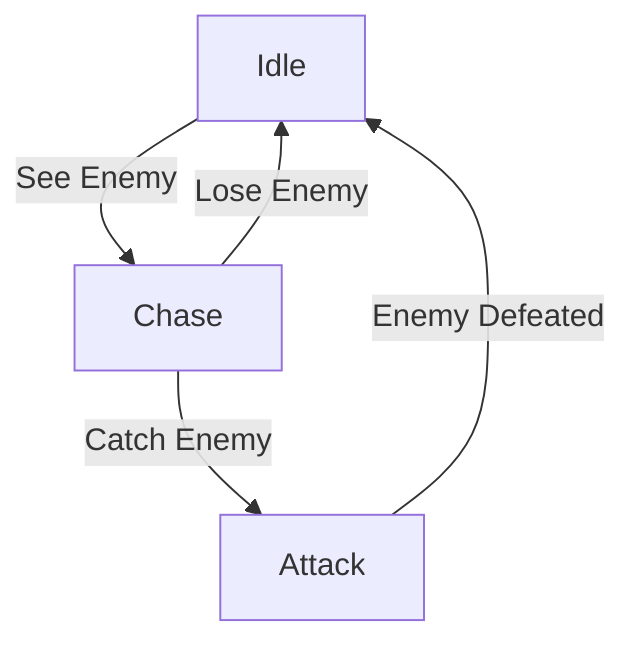
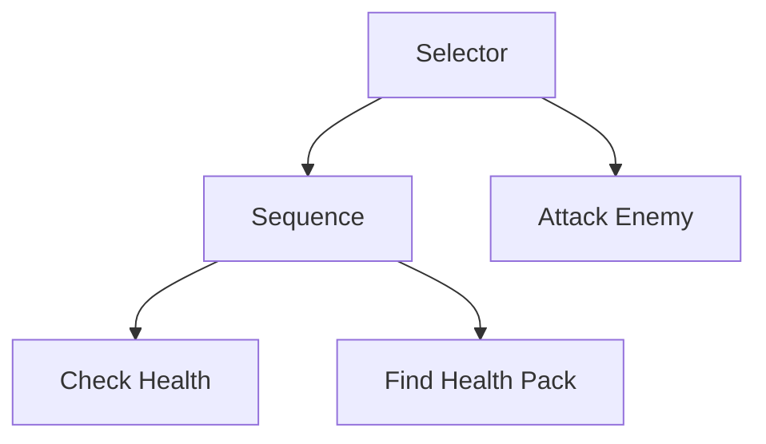
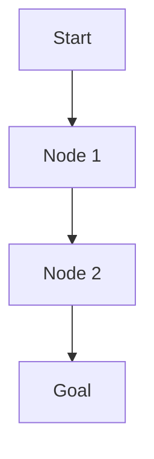

# 游戏AI(Game AI)原理与代码实战案例讲解

## 1.背景介绍

游戏人工智能（Game AI）是指在电子游戏中使用人工智能技术来模拟人类玩家的行为和决策过程。随着游戏产业的快速发展，游戏AI已经成为提升游戏体验和增加游戏深度的重要组成部分。从早期的简单规则系统到现代复杂的机器学习算法，游戏AI技术不断演进，推动了游戏设计和开发的创新。

## 2.核心概念与联系

### 2.1 游戏AI的定义与分类

游戏AI可以分为以下几类：

- **规则基础AI**：基于预定义的规则和条件进行决策。
- **有限状态机（FSM）**：通过状态和状态转换来控制AI行为。
- **行为树（Behavior Tree）**：使用树状结构来管理复杂的AI行为。
- **路径规划**：计算角色从一个点到另一个点的最优路径。
- **机器学习**：利用数据训练模型，使AI能够自适应和学习。

### 2.2 游戏AI与其他AI的区别

游戏AI与其他领域的AI有一些显著的区别：

- **实时性**：游戏AI需要在实时环境中做出快速决策。
- **可预测性**：游戏AI的行为需要在一定程度上可预测，以确保游戏的公平性和可玩性。
- **资源限制**：游戏AI需要在有限的计算资源下运行，不能影响游戏的整体性能。

## 3.核心算法原理具体操作步骤

### 3.1 有限状态机（FSM）

有限状态机是一种通过状态和状态转换来控制AI行为的模型。其基本操作步骤如下：

1. **定义状态**：确定AI可能的所有状态。
2. **定义转换条件**：确定状态之间的转换条件。
3. **实现状态逻辑**：为每个状态编写具体的行为逻辑。



### 3.2 行为树（Behavior Tree）

行为树是一种使用树状结构来管理复杂AI行为的模型。其基本操作步骤如下：

1. **定义节点**：确定行为树的各个节点，包括选择节点、序列节点和叶子节点。
2. **构建树结构**：将节点按照逻辑关系连接成树状结构。
3. **执行树**：从根节点开始执行，按照节点类型和条件进行行为选择。



### 3.3 路径规划

路径规划是计算角色从一个点到另一个点的最优路径的过程。常用的算法包括A*算法和Dijkstra算法。其基本操作步骤如下：

1. **定义地图**：将游戏地图表示为图或网格。
2. **定义起点和终点**：确定角色的起点和目标点。
3. **执行算法**：使用A*或Dijkstra算法计算最优路径。



## 4.数学模型和公式详细讲解举例说明

### 4.1 A*算法

A*算法是一种用于路径规划的启发式搜索算法。其核心公式为：

$$
f(n) = g(n) + h(n)
$$

其中，$f(n)$ 是节点 $n$ 的总估计成本，$g(n)$ 是从起点到节点 $n$ 的实际成本，$h(n)$ 是从节点 $n$ 到目标点的启发式估计成本。

### 4.2 Q学习

Q学习是一种强化学习算法，用于训练AI在特定环境中做出最优决策。其核心公式为：

$$
Q(s, a) = Q(s, a) + \alpha [r + \gamma \max_{a'} Q(s', a') - Q(s, a)]
$$

其中，$Q(s, a)$ 是状态 $s$ 下采取动作 $a$ 的价值，$\alpha$ 是学习率，$r$ 是即时奖励，$\gamma$ 是折扣因子，$s'$ 是下一个状态，$a'$ 是下一个动作。

## 5.项目实践：代码实例和详细解释说明

### 5.1 实现有限状态机

以下是一个简单的有限状态机实现示例：

```python
class State:
    def __init__(self, name):
        self.name = name

    def on_enter(self):
        pass

    def on_exit(self):
        pass

class FSM:
    def __init__(self):
        self.states = {}
        self.current_state = None

    def add_state(self, state):
        self.states[state.name] = state

    def set_state(self, state_name):
        if self.current_state:
            self.current_state.on_exit()
        self.current_state = self.states[state_name]
        self.current_state.on_enter()

    def update(self):
        if self.current_state:
            self.current_state.update()

class IdleState(State):
    def update(self):
        print("Idle...")

class ChaseState(State):
    def update(self):
        print("Chasing...")

fsm = FSM()
idle = IdleState("Idle")
chase = ChaseState("Chase")

fsm.add_state(idle)
fsm.add_state(chase)

fsm.set_state("Idle")
fsm.update()
fsm.set_state("Chase")
fsm.update()
```

### 5.2 实现行为树

以下是一个简单的行为树实现示例：

```python
class Node:
    def __init__(self):
        self.children = []

    def add_child(self, child):
        self.children.append(child)

    def execute(self):
        pass

class Selector(Node):
    def execute(self):
        for child in self.children:
            if child.execute():
                return True
        return False

class Sequence(Node):
    def execute(self):
        for child in self.children:
            if not child.execute():
                return False
        return True

class CheckHealth(Node):
    def execute(self):
        print("Checking health...")
        return True

class FindHealthPack(Node):
    def execute(self):
        print("Finding health pack...")
        return True

root = Selector()
sequence = Sequence()
check_health = CheckHealth()
find_health_pack = FindHealthPack()

sequence.add_child(check_health)
sequence.add_child(find_health_pack)
root.add_child(sequence)

root.execute()
```

## 6.实际应用场景

### 6.1 单人游戏

在单人游戏中，游戏AI可以用于控制敌人、盟友和NPC（非玩家角色）的行为。例如，在射击游戏中，AI可以控制敌人的巡逻、攻击和躲避行为。

### 6.2 多人游戏

在多人游戏中，游戏AI可以用于匹配玩家、平衡游戏难度和提供辅助角色。例如，在MOBA游戏中，AI可以用于匹配玩家的技能水平，并在玩家离线时接管其角色。

### 6.3 教育和训练

游戏AI还可以用于教育和训练。例如，在军事训练模拟器中，AI可以模拟敌人的战术和策略，帮助士兵进行实战训练。

## 7.工具和资源推荐

### 7.1 开发工具

- **Unity**：一款流行的游戏开发引擎，支持多种平台的游戏开发。
- **Unreal Engine**：另一款强大的游戏开发引擎，广泛用于高质量游戏的开发。

### 7.2 资源推荐

- **《Artificial Intelligence for Games》**：一本经典的游戏AI书籍，详细介绍了各种游戏AI技术。
- **AI and Games**：一个专注于游戏AI的在线社区，提供丰富的教程和资源。

## 8.总结：未来发展趋势与挑战

### 8.1 未来发展趋势

- **深度学习**：随着深度学习技术的发展，游戏AI将能够实现更复杂和智能的行为。
- **自适应AI**：未来的游戏AI将能够根据玩家的行为和偏好进行自适应调整，提供个性化的游戏体验。
- **多智能体系统**：多智能体系统将使游戏AI能够实现更复杂的协作和竞争行为。

### 8.2 挑战

- **计算资源限制**：游戏AI需要在有限的计算资源下运行，如何在保证性能的前提下实现智能行为是一个挑战。
- **公平性和可预测性**：游戏AI的行为需要在一定程度上可预测，以确保游戏的公平性和可玩性。
- **数据隐私**：在使用机器学习技术时，如何保护玩家的数据隐私是一个重要问题。

## 9.附录：常见问题与解答

### 9.1 游戏AI是否可以完全替代人类玩家？

目前的游戏AI还无法完全替代人类玩家，因为人类