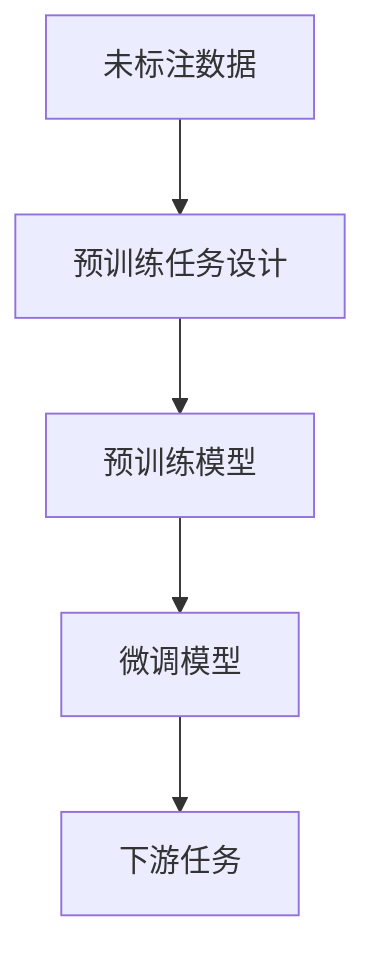

# 自监督学习原理与代码实战案例讲解

## 1.背景介绍

自监督学习（Self-Supervised Learning, SSL）是近年来机器学习领域的一个重要研究方向。它通过利用未标注数据中的内在结构信息来生成监督信号，从而减少对大量标注数据的依赖。自监督学习在计算机视觉、自然语言处理等领域取得了显著的成果，成为深度学习研究的热点之一。

在传统的监督学习中，模型的训练依赖于大量标注数据，这不仅成本高昂，而且在某些领域难以获得。而自监督学习通过设计预训练任务，使模型能够从未标注数据中学习有用的特征，从而在下游任务中表现出色。

## 2.核心概念与联系

### 2.1 自监督学习的定义

自监督学习是一种通过设计预训练任务，从未标注数据中自动生成监督信号的学习方法。其核心思想是利用数据本身的内在结构信息来构建标签，从而进行模型训练。

### 2.2 自监督学习与其他学习方法的联系

- **监督学习**：依赖于大量标注数据进行训练。
- **无监督学习**：不需要标注数据，直接从数据中学习特征。
- **半监督学习**：结合少量标注数据和大量未标注数据进行训练。
- **自监督学习**：通过设计预训练任务，从未标注数据中生成监督信号。

### 2.3 自监督学习的优势

- **减少对标注数据的依赖**：降低数据标注成本。
- **提高模型的泛化能力**：通过预训练任务学习到更丰富的特征。
- **适用于多种任务**：在计算机视觉、自然语言处理等领域均有广泛应用。

## 3.核心算法原理具体操作步骤

### 3.1 预训练任务设计

自监督学习的关键在于设计有效的预训练任务，使模型能够从未标注数据中学习到有用的特征。常见的预训练任务包括：

- **图像重建**：通过损坏图像的一部分，让模型重建原始图像。
- **图像旋转预测**：让模型预测图像被旋转的角度。
- **上下文预测**：让模型预测图像或文本的上下文信息。

### 3.2 预训练模型

通过设计好的预训练任务，使用未标注数据对模型进行预训练。预训练的目的是让模型学习到数据的内在结构信息。

### 3.3 微调模型

在预训练完成后，将预训练模型应用到具体的下游任务中，并使用少量标注数据对模型进行微调，以提高模型在特定任务上的表现。

以下是自监督学习的流程图：



## 4.数学模型和公式详细讲解举例说明

### 4.1 自监督学习的数学模型

自监督学习的数学模型可以表示为：

$$
\mathcal{L}_{SSL} = \mathbb{E}_{x \sim p(x)} \left[ \mathcal{L}_{pretrain}(f(x), g(x)) \right]
$$

其中，$x$ 表示未标注数据，$p(x)$ 表示数据分布，$f(x)$ 表示模型的预测结果，$g(x)$ 表示生成的监督信号，$\mathcal{L}_{pretrain}$ 表示预训练任务的损失函数。

### 4.2 预训练任务的损失函数

以图像重建任务为例，其损失函数可以表示为：

$$
\mathcal{L}_{reconstruction} = \| x - \hat{x} \|^2
$$

其中，$x$ 表示原始图像，$\hat{x}$ 表示模型重建的图像。

### 4.3 微调任务的损失函数

在微调阶段，使用少量标注数据进行训练，其损失函数可以表示为：

$$
\mathcal{L}_{finetune} = \mathbb{E}_{(x, y) \sim p(x, y)} \left[ \mathcal{L}_{task}(f(x), y) \right]
$$

其中，$(x, y)$ 表示标注数据，$\mathcal{L}_{task}$ 表示下游任务的损失函数。

## 5.项目实践：代码实例和详细解释说明

### 5.1 数据准备

首先，我们需要准备未标注数据集。以CIFAR-10数据集为例：

```python
import torchvision.transforms as transforms
import torchvision.datasets as datasets

transform = transforms.Compose([
    transforms.ToTensor(),
    transforms.Normalize((0.5, 0.5, 0.5), (0.5, 0.5, 0.5)),
])

train_dataset = datasets.CIFAR10(root='./data', train=True, download=True, transform=transform)
```

### 5.2 预训练任务设计

以图像重建任务为例，我们可以设计一个简单的自编码器：

```python
import torch
import torch.nn as nn
import torch.optim as optim

class Autoencoder(nn.Module):
    def __init__(self):
        super(Autoencoder, self).__init__()
        self.encoder = nn.Sequential(
            nn.Conv2d(3, 64, kernel_size=3, stride=1, padding=1),
            nn.ReLU(),
            nn.MaxPool2d(kernel_size=2, stride=2)
        )
        self.decoder = nn.Sequential(
            nn.ConvTranspose2d(64, 3, kernel_size=2, stride=2),
            nn.Sigmoid()
        )

    def forward(self, x):
        x = self.encoder(x)
        x = self.decoder(x)
        return x

model = Autoencoder()
criterion = nn.MSELoss()
optimizer = optim.Adam(model.parameters(), lr=0.001)
```

### 5.3 预训练模型

使用未标注数据进行预训练：

```python
from torch.utils.data import DataLoader

train_loader = DataLoader(train_dataset, batch_size=64, shuffle=True)

for epoch in range(10):
    for data in train_loader:
        inputs, _ = data
        optimizer.zero_grad()
        outputs = model(inputs)
        loss = criterion(outputs, inputs)
        loss.backward()
        optimizer.step()
    print(f'Epoch [{epoch+1}/10], Loss: {loss.item():.4f}')
```

### 5.4 微调模型

在预训练完成后，我们可以使用少量标注数据对模型进行微调。以图像分类任务为例：

```python
class Classifier(nn.Module):
    def __init__(self, autoencoder):
        super(Classifier, self).__init__()
        self.encoder = autoencoder.encoder
        self.fc = nn.Linear(64 * 16 * 16, 10)

    def forward(self, x):
        x = self.encoder(x)
        x = x.view(x.size(0), -1)
        x = self.fc(x)
        return x

classifier = Classifier(model)
criterion = nn.CrossEntropyLoss()
optimizer = optim.Adam(classifier.parameters(), lr=0.001)

# 使用少量标注数据进行微调
train_dataset = datasets.CIFAR10(root='./data', train=True, download=True, transform=transform)
train_loader = DataLoader(train_dataset, batch_size=64, shuffle=True)

for epoch in range(10):
    for data in train_loader:
        inputs, labels = data
        optimizer.zero_grad()
        outputs = classifier(inputs)
        loss = criterion(outputs, labels)
        loss.backward()
        optimizer.step()
    print(f'Epoch [{epoch+1}/10], Loss: {loss.item():.4f}')
```

## 6.实际应用场景

### 6.1 计算机视觉

自监督学习在计算机视觉领域有广泛的应用，例如图像分类、目标检测、图像分割等。通过设计预训练任务，模型可以从大量未标注图像中学习到有用的特征，从而在下游任务中表现出色。

### 6.2 自然语言处理

在自然语言处理领域，自监督学习同样取得了显著的成果。例如，BERT模型通过设计掩码语言模型任务，从大量未标注文本中学习到丰富的语义信息，从而在各种下游任务中表现优异。

### 6.3 语音处理

自监督学习在语音处理领域也有应用，例如语音识别、语音合成等。通过设计预训练任务，模型可以从大量未标注语音数据中学习到有用的特征，从而提高语音处理任务的性能。

## 7.工具和资源推荐

### 7.1 开源框架

- **PyTorch**：一个流行的深度学习框架，支持自监督学习的实现。
- **TensorFlow**：另一个流行的深度学习框架，同样支持自监督学习的实现。

### 7.2 数据集

- **CIFAR-10**：一个常用的图像分类数据集，适用于自监督学习的研究。
- **ImageNet**：一个大规模图像数据集，常用于自监督学习的预训练任务。

### 7.3 研究论文

- **BERT: Pre-training of Deep Bidirectional Transformers for Language Understanding**：介绍了BERT模型及其自监督学习方法。
- **SimCLR: A Simple Framework for Contrastive Learning of Visual Representations**：介绍了SimCLR模型及其自监督学习方法。

## 8.总结：未来发展趋势与挑战

自监督学习作为一种减少对标注数据依赖的学习方法，具有广阔的应用前景。然而，自监督学习也面临一些挑战，例如预训练任务的设计、计算资源的需求等。未来，随着研究的深入，自监督学习有望在更多领域取得突破，并推动人工智能技术的发展。

## 9.附录：常见问题与解答

### 9.1 自监督学习与无监督学习的区别是什么？

自监督学习通过设计预训练任务，从未标注数据中生成监督信号，而无监督学习直接从数据中学习特征，不需要生成监督信号。

### 9.2 自监督学习的预训练任务如何设计？

预训练任务的设计需要根据具体的应用场景和数据特点来确定。常见的预训练任务包括图像重建、图像旋转预测、上下文预测等。

### 9.3 自监督学习的优势是什么？

自监督学习的优势在于减少对标注数据的依赖，提高模型的泛化能力，并且适用于多种任务。

### 9.4 自监督学习的应用场景有哪些？

自监督学习在计算机视觉、自然语言处理、语音处理等领域有广泛的应用。

### 9.5 自监督学习的未来发展趋势是什么？

未来，自监督学习有望在更多领域取得突破，并推动人工智能技术的发展。然而，预训练任务的设计和计算资源的需求仍是需要解决的挑战。

---

作者：禅与计算机程序设计艺术 / Zen and the Art of Computer Programming