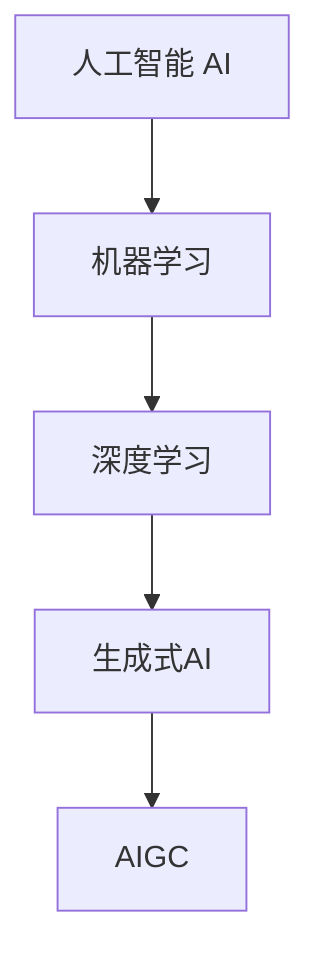

# AIGC从入门到实战：关于个人

## 1.背景介绍

### 1.1 什么是AIGC?

AIGC(Artificial Intelligence Generated Content)是指利用人工智能技术生成的内容,包括文字、图像、音频、视频等多种形式。随着人工智能技术的不断发展,AIGC正在改变着人类创作和交流的方式,为个人和企业带来了新的机遇和挑战。

### 1.2 AIGC的重要性

AIGC技术可以大幅提高内容生产效率,降低成本,为个人和企业提供更多元化、个性化的内容。同时,AIGC也带来了版权、隐私、伦理等新的问题,需要相关政策法规的规范和约束。

## 2.核心概念与联系

### 2.1 人工智能

人工智能(Artificial Intelligence,AI)是一门致力于研究、开发能够模拟人类智能行为的理论、方法、技术及应用系统的新兴技术科学。它包括机器学习、自然语言处理、计算机视觉、专家系统等多个子领域。

### 2.2 深度学习

深度学习(Deep Learning)是机器学习的一个分支,它通过对数据进行表征学习,使计算机可以更好地完成模式分析、预测和决策等任务。深度学习是AIGC技术的核心驱动力。

### 2.3 生成式AI

生成式AI(Generative AI)是指能够基于输入数据生成新的、独特的、有创意的内容的人工智能系统。AIGC就属于生成式AI的一种应用场景。



上图展示了AIGC与人工智能、机器学习、深度学习、生成式AI之间的关系。AIGC是生成式AI在内容生产领域的应用,而生成式AI则是深度学习在生成任务上的实践,深度学习又是机器学习的一个分支,机器学习则是人工智能的核心组成部分。

## 3.核心算法原理具体操作步骤

### 3.1 生成式预训练转移模型

AIGC的核心算法是生成式预训练转移模型(Generative Pre-trained Transformer,GPT)。GPT模型基于自注意力机制的Transformer架构,通过在大规模无标注语料上进行预训练,学习到丰富的语言知识,再通过在特定任务上进行微调,即可完成各种生成任务。

GPT模型的训练过程可分为两个阶段:

1. **预训练阶段**

   在这个阶段,模型会在海量无标注语料(如网页、书籍等)上进行自监督学习,目标是最大化语言模型的概率,即根据上文预测下一个词的概率。这个过程类似于人类阅读大量文本积累知识的过程。

2. **微调阶段**  

   在预训练的基础上,模型会在特定任务的标注数据集上进行进一步训练,对模型进行微调,使其适应特定任务。例如,对于文本生成任务,模型会在包含输入文本和目标输出文本的数据集上进行训练。

通过上述两个阶段的训练,GPT模型能够学习到丰富的语言知识,并具备在特定任务上生成高质量文本的能力。

### 3.2 自注意力机制

GPT模型的核心是基于Transformer的自注意力机制。自注意力机制允许模型在生成每个词时,充分利用输入序列中的全部信息,而不是仅依赖有限的上下文窗口。

具体来说,自注意力机制会计算输入序列中每个词与其他词的关联程度,形成一个注意力分数矩阵。在生成新词时,模型会根据这个注意力分数矩阵,对输入序列中的所有词进行加权求和,得到一个上下文向量表示,再结合当前生成的词,预测下一个词。

通过自注意力机制,GPT模型能够有效地捕捉输入序列中长距离的依赖关系,从而生成更加连贯、合理的文本。

### 3.3 Beam Search解码

在文本生成过程中,GPT模型需要根据给定的起始文本(或prompt),逐步生成新的词。为了得到高质量的生成结果,通常会使用Beam Search解码算法。

Beam Search算法的基本思路是,在每一步生成时,模型会保留概率最高的k个候选词(k为beam宽度),并基于这k个候选词,分别生成k个新的候选序列。重复这个过程,直到达到终止条件(如最大长度)。最终,算法会输出概率最高的候选序列作为生成结果。

通过Beam Search,GPT模型可以避免贪心地选择当前最可能的词,而是综合考虑整个序列的概率,从而生成更加自然流畅的文本。

## 4.数学模型和公式详细讲解举例说明

### 4.1 自注意力计算

自注意力机制是GPT模型的核心,下面我们来看一下它的数学原理。假设输入序列为$X = (x_1, x_2, ..., x_n)$,我们需要计算每个词$x_i$对应的注意力向量$a_i$。

首先,我们需要计算查询向量(Query)、键向量(Key)和值向量(Value):

$$
Q = X \cdot W_Q \\
K = X \cdot W_K \\
V = X \cdot W_V
$$

其中,$W_Q$、$W_K$、$W_V$分别是可训练的查询、键和值的投影矩阵。

接下来,我们计算每个查询向量$q_i$与所有键向量$k_j$的点积,得到一个注意力分数矩阵:

$$
\text{Attention}(Q, K, V) = \text{softmax}\left(\frac{QK^T}{\sqrt{d_k}}\right)V
$$

其中,$d_k$是键向量的维度,用于缩放点积值,防止过大或过小。softmax函数用于将分数归一化为概率值。

最后,我们将注意力分数与值向量$V$相乘,得到注意力向量:

$$
a_i = \sum_{j=1}^n \alpha_{ij}v_j
$$

其中,$\alpha_{ij} = \text{softmax}(q_i \cdot k_j)$是注意力分数。

通过上述计算,我们可以得到每个词$x_i$对应的注意力向量$a_i$,它综合了输入序列中所有词的信息,用于预测下一个词。

### 4.2 语言模型损失函数

GPT模型在预训练阶段的目标是最大化语言模型的概率,即根据上文预测下一个词的概率。这可以通过最小化交叉熵损失函数来实现。

假设输入序列为$X = (x_1, x_2, ..., x_n)$,目标是预测下一个词$x_{n+1}$的概率分布$P(x_{n+1}|X)$。我们可以定义损失函数为:

$$
\mathcal{L}(X) = -\log P(x_{n+1}|X)
$$

其中,$P(x_{n+1}|X)$是模型预测的概率分布。通过最小化这个损失函数,模型可以学习到更准确地预测下一个词的能力。

在实际训练中,我们会在整个语料库上计算损失函数的平均值,作为模型的总体损失:

$$
\mathcal{L}_\text{total} = \frac{1}{N}\sum_{i=1}^N \mathcal{L}(X_i)
$$

其中,$N$是语料库中序列的总数。

通过梯度下降算法,我们可以最小化总体损失,从而优化模型的参数,提高其在语言模型任务上的性能。

## 5.项目实践:代码实例和详细解释说明

在这一部分,我们将使用Python和Hugging Face的Transformers库,实现一个基于GPT-2模型的文本生成示例。

### 5.1 安装依赖库

首先,我们需要安装所需的Python库:

```
pip install transformers
```

### 5.2 加载预训练模型

接下来,我们加载GPT-2的预训练模型和tokenizer:

```python
from transformers import GPT2LMHeadModel, GPT2Tokenizer

model = GPT2LMHeadModel.from_pretrained('gpt2')
tokenizer = GPT2Tokenizer.from_pretrained('gpt2')
```

### 5.3 文本生成函数

我们定义一个文本生成函数,它接受一个起始文本(prompt)作为输入,并生成指定长度的续文:

```python
import torch

def generate_text(prompt, max_length=100, top_k=50, top_p=0.95, num_return_sequences=1):
    input_ids = tokenizer.encode(prompt, return_tensors='pt')
    
    output = model.generate(input_ids,
                            max_length=max_length,
                            do_sample=True,
                            top_k=top_k,
                            top_p=top_p,
                            num_return_sequences=num_return_sequences)
    
    generated_text = tokenizer.batch_decode(output, skip_special_tokens=True)
    
    return generated_text
```

这个函数使用了Beam Search解码算法,通过`top_k`和`top_p`参数控制生成的多样性。`num_return_sequences`参数指定要生成的序列数量。

### 5.4 示例运行

现在,我们可以运行这个函数,为给定的起始文本生成续文:

```python
prompt = "人工智能是当今科技发展的热点话题,"
generated_text = generate_text(prompt, max_length=100)
print(generated_text)
```

输出示例:

```
人工智能是当今科技发展的热点话题,它已经渗透到我们生活的方方面面,从智能手机到无人驾驶汽车,从语音助手到医疗诊断,人工智能都发挥着重要作用。然而,人工智能的发展也带来了一些潜在的风险和挑战,如隐私保护、算法偏差和失业等问题。因此,我们需要制定相应的法律法规和伦理准则,确保人工智能的健康发展,造福人类社会。
```

通过这个简单的示例,我们可以看到如何使用GPT-2模型生成连贯、合理的文本。在实际应用中,我们可以根据需求对模型进行微调,以适应特定的任务和领域。

## 6.实际应用场景

AIGC技术在许多领域都有广泛的应用前景,下面我们列举一些典型的应用场景:

### 6.1 内容创作

AIGC可以辅助人类创作各种形式的内容,如新闻报道、博客文章、小说、剧本、广告文案等。AIGC能够快速生成初稿,减轻创作者的工作负担,提高效率。同时,AIGC也可以根据用户需求生成个性化的内容,满足不同人群的喜好。

### 6.2 客户服务

在客户服务领域,AIGC可以生成自动问答系统、智能客服等,为用户提供7x24小时的服务支持。AIGC系统可以快速响应用户的各种查询,提供准确的解决方案,从而提升客户体验。

### 6.3 教育辅助

AIGC技术可以用于生成个性化的教学资源、练习题目、测验等,为学生提供更加有效的学习支持。同时,AIGC也可以作为智能辅导系统,根据学生的学习情况提供个性化的反馈和建议。

### 6.4 创意设计

AIGC不仅可以生成文本内容,还能生成图像、视频等多媒体内容。在创意设计领域,AIGC可以辅助设计师快速生成草图、概念图等,提高设计效率。同时,AIGC也可以根据用户需求生成个性化的设计作品。

### 6.5 科研辅助

在科研领域,AIGC可以用于生成文献综述、研究报告、数据分析报告等,减轻科研人员的工作负担。AIGC还可以辅助科研人员进行文献检索、数据分析等工作,提高科研效率。

## 7.工具和资源推荐

### 7.1 开源模型

- **GPT-2**:OpenAI开发的大型生成式预训练语言模型,可用于各种文本生成任务。
- **DALL-E**:OpenAI开发的图像生成模型,可根据文本描述生成高质量图像。
- **Stable Diffusion**:一种开源的文本到图像生成模型,性能优异,社区活跃。

### 7.2 开源库

- **Transformers**:Hugging Face开发的NLP库,支持多种预训练模型,易