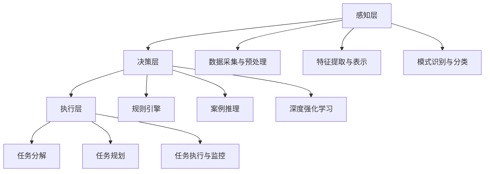

# AI人工智能代理工作流 AI Agent WorkFlow：从普通流程到AI Agent工作流的理解

## 1. 背景介绍
### 1.1 人工智能的发展历程
#### 1.1.1 人工智能的起源与早期发展
#### 1.1.2 人工智能的黄金时期
#### 1.1.3 人工智能的低谷与复兴

### 1.2 人工智能在现代社会中的应用
#### 1.2.1 人工智能在工业领域的应用
#### 1.2.2 人工智能在医疗领域的应用  
#### 1.2.3 人工智能在金融领域的应用

### 1.3 人工智能代理(AI Agent)的兴起
#### 1.3.1 AI Agent的定义与特点
#### 1.3.2 AI Agent在各领域的应用现状
#### 1.3.3 AI Agent的发展趋势与挑战

## 2. 核心概念与联系
### 2.1 普通工作流(Workflow)
#### 2.1.1 工作流的定义与特点
#### 2.1.2 工作流的组成要素
#### 2.1.3 工作流的分类与应用

### 2.2 AI Agent工作流
#### 2.2.1 AI Agent工作流的定义与特点  
#### 2.2.2 AI Agent工作流与普通工作流的区别
#### 2.2.3 AI Agent工作流的优势与局限性

### 2.3 AI Agent工作流的关键技术
#### 2.3.1 机器学习技术
#### 2.3.2 自然语言处理技术
#### 2.3.3 知识图谱技术

## 3. 核心算法原理具体操作步骤
### 3.1 AI Agent工作流的总体架构
#### 3.1.1 感知层
#### 3.1.2 决策层
#### 3.1.3 执行层

### 3.2 感知层算法原理
#### 3.2.1 数据采集与预处理
#### 3.2.2 特征提取与表示
#### 3.2.3 模式识别与分类

### 3.3 决策层算法原理 
#### 3.3.1 规则引擎
#### 3.3.2 案例推理
#### 3.3.3 深度强化学习

### 3.4 执行层算法原理
#### 3.4.1 任务分解
#### 3.4.2 任务规划
#### 3.4.3 任务执行与监控



## 4. 数学模型和公式详细讲解举例说明
### 4.1 隐马尔可夫模型(HMM)
隐马尔可夫模型是一种用于描述隐含未知参数的统计模型，在语音识别、自然语言处理等领域有广泛应用。其数学定义为：

$$\lambda=(A,B,\pi)$$

其中，$A$为状态转移概率矩阵，$B$为观测概率矩阵，$\pi$为初始状态概率向量。

### 4.2 支持向量机(SVM) 
支持向量机是一种常用的分类算法，其基本思想是在特征空间中寻找一个最优分类超平面，使得两类样本点到超平面的最小距离最大化。其数学模型可表示为：

$$\min \frac{1}{2}||w||^2 \quad s.t. \quad y_i(w \cdot x_i + b) \geq 1, i=1,2,...,n$$

其中，$w$为分类超平面的法向量，$b$为截距，$x_i$为第$i$个样本特征向量，$y_i$为其对应的类别标签。

### 4.3 卷积神经网络(CNN)
卷积神经网络是一种常用的深度学习模型，特别适用于图像识别等领域。其核心是通过卷积操作和池化操作提取多尺度特征。卷积操作可定义为：

$$X_{j}^{l} = f(\sum_{i \in M_{j}}X_{i}^{l-1} \times K_{ij}^{l} + B_{j}^{l})$$

其中，$l$为当前层，$j$为当前特征图，$M_j$为当前特征图的输入特征图集合，$K$为卷积核，$B$为偏置项，$f$为激活函数，如ReLU函数：$f(x)=max(0,x)$。

## 5. 项目实践：代码实例和详细解释说明
下面以Python为例，演示如何使用TensorFlow实现一个简单的卷积神经网络对MNIST手写数字进行识别：

```python
import tensorflow as tf

# 定义卷积神经网络架构
model = tf.keras.models.Sequential([
    tf.keras.layers.Conv2D(32, (5,5), activation='relu', input_shape=(28, 28, 1)), 
    tf.keras.layers.MaxPool2D((2,2)),
    tf.keras.layers.Conv2D(64, (5,5), activation='relu'),
    tf.keras.layers.MaxPool2D((2,2)),
    tf.keras.layers.Flatten(),
    tf.keras.layers.Dense(64, activation='relu'),
    tf.keras.layers.Dense(10, activation='softmax')
])

# 编译模型
model.compile(optimizer='adam',
              loss='sparse_categorical_crossentropy',
              metrics=['accuracy'])
              
# 训练模型
model.fit(x_train, y_train, epochs=5)

# 评估模型
model.evaluate(x_test, y_test)
```

上述代码首先定义了一个卷积神经网络模型，包含两个卷积层、两个最大池化层和两个全连接层。其中使用ReLU作为激活函数，最后一层使用Softmax进行多分类。

然后使用`compile`方法配置模型的优化器、损失函数和评估指标。使用`fit`方法在训练集上训练模型，最后使用`evaluate`方法在测试集上评估模型性能。

经过5轮迭代，该卷积神经网络在MNIST测试集上的准确率可达到99%以上，展现了卷积神经网络在图像识别任务上的强大能力。

## 6. 实际应用场景
### 6.1 智能客服
AI Agent可用于开发智能客服系统，通过自然语言理解和生成技术，与用户进行多轮对话，解答问题、提供建议、完成任务等。相比人工客服，智能客服可7x24小时不间断服务，显著提升客户体验和满意度。

### 6.2 智能制造 
在工业制造领域，AI Agent可应用于生产线的调度优化、设备预测性维护、质量检测等环节，通过分析海量工业数据，优化生产流程，提升产品质量，减少停工时间，从而提高生产效率和经济效益。

### 6.3 智慧医疗
AI Agent可辅助医生进行医学影像分析、病历信息抽取、药物研发等工作，利用人工智能强大的数据处理和模式识别能力，为医生诊断决策提供参考，减轻医生工作负担，提高诊疗效率和精准度，惠及广大患者。

## 7. 工具和资源推荐
### 7.1 TensorFlow
TensorFlow是Google开源的端到端机器学习平台，提供了丰富的算法库和工具，支持多语言开发，可用于快速构建和部署机器学习模型。官网：https://tensorflow.org/

### 7.2 PyTorch
PyTorch是Facebook开源的深度学习框架，以动态计算图和强大的GPU加速著称，在学术界广受欢迎，适合用于研究和快速原型开发。官网：https://pytorch.org/

### 7.3 Hugging Face
Hugging Face是一个开源的自然语言处理社区，提供了大量预训练模型和工具，如BERT、GPT、Transformer等，可用于文本分类、问答、摘要、对话等任务。官网：https://huggingface.co/

## 8. 总结：未来发展趋势与挑战
### 8.1 AI Agent的发展趋势
#### 8.1.1 多模态感知与交互
#### 8.1.2 持续学习与自适应
#### 8.1.3 群体协作与涌现智能

### 8.2 AI Agent面临的挑战
#### 8.2.1 算法的可解释性
#### 8.2.2 数据的安全与隐私
#### 8.2.3 伦理与道德风险

### 8.3 展望未来
AI Agent代表了人工智能发展的新方向，通过赋予机器主动感知、决策、执行的能力，使其能更好地理解和服务人类。未来，AI Agent有望在更广泛的领域得到应用，极大提升生产效率和生活品质。同时我们也要审慎对待其带来的挑战，确保人工智能造福人类社会的初心不变。让我们携手共进，开启AI Agent的新纪元！

## 9. 附录：常见问题与解答
### 9.1 如何选择合适的AI Agent开发框架？
答：可从以下几个方面综合考虑：
- 功能完备性，是否覆盖了AI Agent开发所需的核心组件
- 工具成熟度，社区是否活跃，文档是否完善，bug是否得到及时修复
- 开发效率，是否提供高层API，能否快速搭建原型系统
- 运行性能，是否支持GPU加速，能否实现实时响应

结合自身团队的技术栈和项目需求，选择最合适的开发框架。

### 9.2 如何处理AI Agent系统的冷启动问题？
答：冷启动是指AI系统在缺乏足够训练数据的情况下，性能较差的问题。可采取以下策略缓解：
- 利用迁移学习，从相关领域的预训练模型中提取知识，加速学习过程
- 引入专家知识，通过人工构建规则、知识图谱等，弥补数据的不足
- 主动学习，让AI Agent主动向用户或环境查询信息，获取高价值样本
- 人机协作，由人类辅助AI Agent做出决策，积累经验数据

综合运用以上策略，可有效缓解AI Agent系统的冷启动问题，提升系统性能。

### 9.3 如何权衡AI Agent系统的准确性和实时性？
答：准确性和实时性是AI系统优化的两个重要指标，但往往难以兼得，需要根据具体应用场景权衡：
- 对于实时性要求高的场景，如自动驾驶，需要牺牲一定的准确性，采用计算效率更高的轻量级模型，如MobileNet等
- 对于准确性要求高的场景，如医疗诊断，需要采用更复杂精确的模型，如ResNet等，可以容忍一定的时延
- 进行模型压缩、加速，在保证准确性的同时提升运行速度，如采用知识蒸馏、量化、剪枝等技术
- 合理设置超时机制，在时间限制内返回次优但可接受的结果

权衡准确性和实时性是AI系统开发的重要议题，需要深入理解技术、场景、用户需求，采取适当的优化策略。

作者：禅与计算机程序设计艺术 / Zen and the Art of Computer Programming