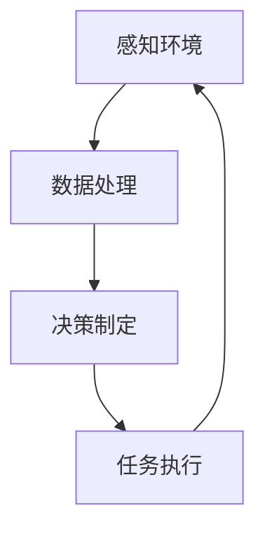

# AI人工智能代理工作流AI Agent WorkFlow：AI代理在物联网场景的应用

## 1.背景介绍

随着物联网（IoT）技术的迅猛发展，越来越多的设备和传感器被连接到网络中，形成了一个庞大的数据生态系统。物联网的核心在于通过数据的采集、传输和处理，实现对物理世界的智能化控制和管理。然而，面对海量的数据和复杂的应用场景，传统的集中式处理方式显得力不从心。人工智能（AI）代理作为一种分布式智能处理单元，能够在物联网场景中发挥重要作用。

AI代理（AI Agent）是一种能够自主感知环境、做出决策并执行任务的智能体。它们可以在物联网设备之间进行协作，优化资源利用，提高系统的整体效率。本文将深入探讨AI代理在物联网场景中的应用，介绍其核心概念、算法原理、数学模型、项目实践、实际应用场景、工具和资源推荐，并展望其未来发展趋势与挑战。

## 2.核心概念与联系

### 2.1 AI代理的定义

AI代理是一种能够自主感知环境、做出决策并执行任务的智能体。它们通常具备以下特性：
- **自主性**：能够独立完成任务，无需人工干预。
- **感知能力**：能够通过传感器获取环境信息。
- **决策能力**：能够基于感知信息和预设目标，做出最优决策。
- **执行能力**：能够执行决策，完成任务。

### 2.2 物联网的定义

物联网（IoT）是指通过互联网将各种物理设备连接起来，实现数据的采集、传输和处理，从而实现对物理世界的智能化控制和管理。物联网的核心在于通过数据的互联互通，实现设备之间的协同工作。

### 2.3 AI代理与物联网的联系

AI代理与物联网的结合，可以实现以下目标：
- **数据处理**：AI代理可以在本地处理数据，减少数据传输的延迟和带宽占用。
- **智能决策**：AI代理可以基于实时数据，做出智能决策，提高系统的响应速度和准确性。
- **协同工作**：多个AI代理可以协同工作，实现复杂任务的分布式处理。

## 3.核心算法原理具体操作步骤

### 3.1 感知算法

感知算法是AI代理获取环境信息的基础。常见的感知算法包括：
- **传感器数据融合**：将来自多个传感器的数据进行融合，提高感知的准确性。
- **图像处理**：通过计算机视觉技术，分析图像数据，提取有用信息。
- **自然语言处理**：通过语音识别和文本分析，理解自然语言指令。

### 3.2 决策算法

决策算法是AI代理基于感知信息和预设目标，做出最优决策的核心。常见的决策算法包括：
- **规则引擎**：基于预设的规则，进行决策。
- **机器学习**：通过训练模型，进行预测和决策。
- **强化学习**：通过与环境的交互，学习最优策略。

### 3.3 执行算法

执行算法是AI代理将决策转化为具体行动的关键。常见的执行算法包括：
- **路径规划**：为移动设备规划最优路径。
- **任务调度**：为多个任务分配资源，优化执行顺序。
- **控制算法**：通过控制器，实现对设备的精确控制。

### 3.4 算法流程图

以下是AI代理工作流的Mermaid流程图：



## 4.数学模型和公式详细讲解举例说明

### 4.1 感知模型

感知模型可以用数学公式表示为：

$$
S_t = f(P_t, E_t)
$$

其中，$S_t$ 表示在时间 $t$ 的感知结果，$P_t$ 表示传感器数据，$E_t$ 表示环境状态，$f$ 表示感知函数。

### 4.2 决策模型

决策模型可以用数学公式表示为：

$$
D_t = g(S_t, G)
$$

其中，$D_t$ 表示在时间 $t$ 的决策结果，$S_t$ 表示感知结果，$G$ 表示预设目标，$g$ 表示决策函数。

### 4.3 执行模型

执行模型可以用数学公式表示为：

$$
A_t = h(D_t, R)
$$

其中，$A_t$ 表示在时间 $t$ 的执行动作，$D_t$ 表示决策结果，$R$ 表示资源状态，$h$ 表示执行函数。

### 4.4 举例说明

假设一个智能家居系统中的AI代理需要控制室内温度。感知模型可以表示为：

$$
S_t = f(T_t, H_t)
$$

其中，$T_t$ 表示当前温度，$H_t$ 表示当前湿度，$S_t$ 表示感知结果。

决策模型可以表示为：

$$
D_t = g(S_t, T_{target})
$$

其中，$T_{target}$ 表示目标温度，$D_t$ 表示决策结果。

执行模型可以表示为：

$$
A_t = h(D_t, P)
$$

其中，$P$ 表示空调的功率状态，$A_t$ 表示执行动作。

## 5.项目实践：代码实例和详细解释说明

### 5.1 项目概述

本项目将实现一个基于AI代理的智能家居系统，控制室内温度。系统包括以下模块：
- **感知模块**：获取当前温度和湿度。
- **决策模块**：基于感知结果和目标温度，做出决策。
- **执行模块**：控制空调的开关和功率。

### 5.2 感知模块代码

```python
import random

class Sensor:
    def __init__(self):
        self.temperature = 25.0
        self.humidity = 50.0

    def read_temperature(self):
        self.temperature += random.uniform(-0.5, 0.5)
        return self.temperature

    def read_humidity(self):
        self.humidity += random.uniform(-1, 1)
        return self.humidity
```

### 5.3 决策模块代码

```python
class DecisionMaker:
    def __init__(self, target_temperature):
        self.target_temperature = target_temperature

    def make_decision(self, current_temperature):
        if current_temperature < self.target_temperature - 1:
            return "HEAT"
        elif current_temperature > self.target_temperature + 1:
            return "COOL"
        else:
            return "OFF"
```

### 5.4 执行模块代码

```python
class Actuator:
    def __init__(self):
        self.state = "OFF"

    def execute(self, action):
        self.state = action
        print(f"Air conditioner is {self.state}")
```

### 5.5 主程序代码

```python
if __name__ == "__main__":
    sensor = Sensor()
    decision_maker = DecisionMaker(target_temperature=22.0)
    actuator = Actuator()

    for _ in range(10):
        current_temperature = sensor.read_temperature()
        print(f"Current temperature: {current_temperature:.2f}")
        action = decision_maker.make_decision(current_temperature)
        actuator.execute(action)
```

### 5.6 代码解释

- **感知模块**：通过传感器获取当前温度和湿度。
- **决策模块**：基于当前温度和目标温度，做出加热、制冷或关闭空调的决策。
- **执行模块**：根据决策结果，控制空调的开关和功率。

## 6.实际应用场景

### 6.1 智能家居

在智能家居中，AI代理可以实现对家电设备的智能控制。例如，通过感知室内温度和湿度，AI代理可以自动调节空调的工作状态，保持室内舒适的环境。

### 6.2 智能交通

在智能交通系统中，AI代理可以实现对交通流量的智能管理。例如，通过感知道路上的车辆数量和速度，AI代理可以优化交通信号灯的控制，减少交通拥堵。

### 6.3 智能农业

在智能农业中，AI代理可以实现对农作物的智能管理。例如，通过感知土壤湿度和温度，AI代理可以自动控制灌溉系统，保证农作物的健康生长。

### 6.4 智能制造

在智能制造中，AI代理可以实现对生产过程的智能控制。例如，通过感知生产设备的状态，AI代理可以预测设备故障，提前进行维护，减少生产停机时间。

## 7.工具和资源推荐

### 7.1 开发工具

- **Python**：一种广泛使用的编程语言，适用于AI代理的开发。
- **TensorFlow**：一个开源的机器学习框架，适用于训练和部署AI模型。
- **OpenCV**：一个开源的计算机视觉库，适用于图像处理和分析。

### 7.2 硬件资源

- **Raspberry Pi**：一种小型计算机，适用于物联网设备的开发。
- **Arduino**：一种开源的电子原型平台，适用于传感器和执行器的控制。
- **ESP8266**：一种低功耗的Wi-Fi模块，适用于物联网设备的联网。

### 7.3 在线资源

- **GitHub**：一个开源代码托管平台，提供大量的AI代理和物联网项目代码。
- **Stack Overflow**：一个程序员问答社区，提供大量的技术问题解答。
- **Kaggle**：一个数据科学竞赛平台，提供大量的机器学习数据集和代码示例。

## 8.总结：未来发展趋势与挑战

### 8.1 未来发展趋势

- **边缘计算**：随着物联网设备数量的增加，边缘计算将成为AI代理的重要发展方向。通过在本地处理数据，边缘计算可以减少数据传输的延迟和带宽占用，提高系统的响应速度。
- **多智能体系统**：多个AI代理之间的协同工作将成为未来的发展趋势。通过分布式的智能处理，多个AI代理可以共同完成复杂的任务，提高系统的整体效率。
- **自适应学习**：AI代理将具备自适应学习的能力，能够根据环境的变化，自动调整决策策略，提高系统的智能化水平。

### 8.2 挑战

- **数据隐私和安全**：随着物联网设备的普及，数据隐私和安全问题将成为AI代理面临的重要挑战。如何保护用户的数据隐私，防止数据泄露和攻击，将是未来需要解决的问题。
- **计算资源限制**：物联网设备通常具有有限的计算资源，如何在有限的资源下实现高效的AI代理，将是未来需要解决的技术难题。
- **标准化和互操作性**：物联网设备和AI代理的标准化和互操作性问题，将是未来需要解决的重要问题。通过制定统一的标准，确保不同设备和代理之间的互操作性，可以提高系统的整体效率。

## 9.附录：常见问题与解答

### 9.1 什么是AI代理？

AI代理是一种能够自主感知环境、做出决策并执行任务的智能体。它们通常具备自主性、感知能力、决策能力和执行能力。

### 9.2 AI代理在物联网中的作用是什么？

AI代理在物联网中可以实现数据处理、智能决策和协同工作。通过在本地处理数据，AI代理可以减少数据传输的延迟和带宽占用；通过基于实时数据做出智能决策，AI代理可以提高系统的响应速度和准确性；通过多个AI代理的协同工作，可以实现复杂任务的分布式处理。

### 9.3 如何实现一个简单的AI代理？

实现一个简单的AI代理可以分为以下几个步骤：
1. **感知环境**：通过传感器获取环境信息。
2. **数据处理**：对传感器数据进行处理，提取有用信息。
3. **决策制定**：基于感知信息和预设目标，做出最优决策。
4. **任务执行**：将决策转化为具体行动，完成任务。

### 9.4 AI代理在智能家居中的应用有哪些？

在智能家居中，AI代理可以实现对家电设备的智能控制。例如，通过感知室内温度和湿度，AI代理可以自动调节空调的工作状态，保持室内舒适的环境；通过感知光线强度，AI代理可以自动调节灯光的亮度，节约能源。

### 9.5 AI代理在智能交通中的应用有哪些？

在智能交通系统中，AI代理可以实现对交通流量的智能管理。例如，通过感知道路上的车辆数量和速度，AI代理可以优化交通信号灯的控制，减少交通拥堵；通过感知道路状况，AI代理可以为驾驶员提供实时的交通信息，优化行车路线。

### 9.6 AI代理在智能农业中的应用有哪些？

在智能农业中，AI代理可以实现对农作物的智能管理。例如，通过感知土壤湿度和温度，AI代理可以自动控制灌溉系统，保证农作物的健康生长；通过感知气象数据，AI代理可以预测天气变化，提前采取防护措施，减少自然灾害对农作物的影响。

### 9.7 AI代理在智能制造中的应用有哪些？

在智能制造中，AI代理可以实现对生产过程的智能控制。例如，通过感知生产设备的状态，AI代理可以预测设备故障，提前进行维护，减少生产停机时间；通过感知生产线的工作状态，AI代理可以优化生产调度，提高生产效率。

### 9.8 AI代理的未来发展趋势是什么？

AI代理的未来发展趋势包括边缘计算、多智能体系统和自适应学习。边缘计算可以减少数据传输的延迟和带宽占用，提高系统的响应速度；多智能体系统可以通过分布式的智能处理，完成复杂的任务，提高系统的整体效率；自适应学习可以根据环境的变化，自动调整决策策略，提高系统的智能化水平。

### 9.9 AI代理面临的挑战有哪些？

AI代理面临的挑战包括数据隐私和安全、计算资源限制和标准化和互操作性。数据隐私和安全问题需要通过技术手段和法律法规来解决；计算资源限制问题需要通过优化算法和硬件升级来解决；标准化和互操作性问题需要通过制定统一的标准来解决。

---

作者：禅与计算机程序设计艺术 / Zen and the Art of Computer Programming