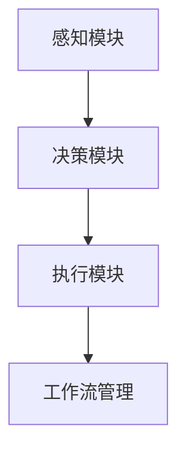

# AI人工智能代理工作流AI Agent WorkFlow：自然语言处理在工作流中的应用

## 1.背景介绍

在当今数字化和自动化的时代，人工智能（AI）和自然语言处理（NLP）技术正在迅速改变我们的工作方式。AI代理工作流（AI Agent WorkFlow）是一个新兴的领域，它结合了AI和NLP技术，旨在优化和自动化各种业务流程。本文将深入探讨AI代理工作流的核心概念、算法原理、数学模型、实际应用场景以及未来的发展趋势和挑战。

## 2.核心概念与联系

### 2.1 AI代理

AI代理是一个能够自主执行任务的智能系统。它可以感知环境、做出决策并采取行动。AI代理通常由多个模块组成，包括感知模块、决策模块和执行模块。

### 2.2 工作流

工作流是指一系列有序的任务或活动，用于完成特定的业务目标。工作流可以是手动的、自动化的或两者的结合。

### 2.3 自然语言处理

自然语言处理（NLP）是AI的一个子领域，旨在使计算机能够理解、解释和生成人类语言。NLP技术包括文本分析、语音识别、机器翻译等。

### 2.4 AI代理工作流

AI代理工作流是将AI代理和工作流管理结合起来，通过NLP技术实现自动化和智能化的业务流程。它可以显著提高工作效率、减少人为错误并优化资源配置。

## 3.核心算法原理具体操作步骤

### 3.1 感知模块

感知模块负责从环境中获取信息。这可以通过传感器、API调用或用户输入来实现。在NLP应用中，感知模块通常涉及文本或语音的输入处理。

### 3.2 决策模块

决策模块使用AI算法来分析感知模块获取的信息，并做出决策。常用的AI算法包括机器学习、深度学习和强化学习。

### 3.3 执行模块

执行模块根据决策模块的输出采取行动。这可以是发送通知、更新数据库或调用外部API等。

### 3.4 工作流管理

工作流管理涉及定义、执行和监控工作流。AI代理工作流通过NLP技术实现自动化的工作流管理。



## 4.数学模型和公式详细讲解举例说明

### 4.1 机器学习模型

机器学习模型是AI代理决策模块的核心。常用的机器学习模型包括线性回归、决策树、支持向量机等。

$$
y = \beta_0 + \beta_1 x_1 + \beta_2 x_2 + \cdots + \beta_n x_n
$$

### 4.2 深度学习模型

深度学习模型是复杂任务的理想选择。常用的深度学习模型包括卷积神经网络（CNN）、循环神经网络（RNN）等。

$$
y = f(Wx + b)
$$

### 4.3 强化学习模型

强化学习模型通过与环境的交互来学习最优策略。常用的强化学习算法包括Q学习、深度Q网络（DQN）等。

$$
Q(s, a) = r + \gamma \max_{a'} Q(s', a')
$$

## 5.项目实践：代码实例和详细解释说明

### 5.1 感知模块代码示例

```python
import speech_recognition as sr

def recognize_speech():
    recognizer = sr.Recognizer()
    with sr.Microphone() as source:
        print("请说话...")
        audio = recognizer.listen(source)
        try:
            text = recognizer.recognize_google(audio, language='zh-CN')
            print(f"你说的是: {text}")
            return text
        except sr.UnknownValueError:
            print("无法识别语音")
            return None
```

### 5.2 决策模块代码示例

```python
from sklearn.linear_model import LinearRegression

def train_model(X, y):
    model = LinearRegression()
    model.fit(X, y)
    return model

def make_decision(model, X_new):
    return model.predict(X_new)
```

### 5.3 执行模块代码示例

```python
import smtplib
from email.mime.text import MIMEText

def send_email(subject, body, to):
    msg = MIMEText(body)
    msg['Subject'] = subject
    msg['From'] = 'your_email@example.com'
    msg['To'] = to

    with smtplib.SMTP('smtp.example.com') as server:
        server.login('your_email@example.com', 'your_password')
        server.sendmail('your_email@example.com', to, msg.as_string())
```

### 5.4 工作流管理代码示例

```python
from airflow import DAG
from airflow.operators.python_operator import PythonOperator
from datetime import datetime

def task_1():
    print("任务1执行")

def task_2():
    print("任务2执行")

default_args = {
    'owner': 'airflow',
    'start_date': datetime(2023, 1, 1),
}

dag = DAG('ai_agent_workflow', default_args=default_args, schedule_interval='@daily')

task1 = PythonOperator(task_id='task_1', python_callable=task_1, dag=dag)
task2 = PythonOperator(task_id='task_2', python_callable=task_2, dag=dag)

task1 >> task2
```

## 6.实际应用场景

### 6.1 客户服务

AI代理工作流可以用于自动化客户服务，通过NLP技术理解客户问题并提供相应的解决方案。

### 6.2 医疗诊断

在医疗领域，AI代理工作流可以帮助医生进行初步诊断，减少误诊率并提高诊断效率。

### 6.3 金融服务

AI代理工作流可以用于自动化金融服务，如贷款审批、风险评估等，提高金融服务的效率和准确性。

### 6.4 供应链管理

在供应链管理中，AI代理工作流可以优化库存管理、物流调度等，提高供应链的整体效率。

## 7.工具和资源推荐

### 7.1 开源工具

- TensorFlow：一个开源的机器学习框架，适用于深度学习模型的开发。
- PyTorch：另一个流行的深度学习框架，具有灵活性和易用性。
- Apache Airflow：一个开源的工作流管理平台，适用于定义、调度和监控工作流。

### 7.2 在线资源

- Coursera和edX：提供大量关于AI和NLP的在线课程。
- GitHub：一个代码托管平台，包含大量开源项目和代码示例。

## 8.总结：未来发展趋势与挑战

### 8.1 未来发展趋势

- 更智能的AI代理：随着AI技术的不断进步，AI代理将变得更加智能和自主。
- 更广泛的应用场景：AI代理工作流将应用于更多领域，如教育、娱乐等。
- 更高效的工作流管理：通过NLP技术，工作流管理将变得更加高效和自动化。

### 8.2 挑战

- 数据隐私和安全：在使用AI代理工作流时，数据隐私和安全是一个重要的挑战。
- 技术复杂性：AI代理工作流涉及多种技术，开发和维护需要高水平的技术能力。
- 法规和伦理：随着AI技术的广泛应用，相关的法规和伦理问题也需要得到重视。

## 9.附录：常见问题与解答

### 9.1 什么是AI代理工作流？

AI代理工作流是将AI代理和工作流管理结合起来，通过NLP技术实现自动化和智能化的业务流程。

### 9.2 AI代理工作流的核心组件有哪些？

AI代理工作流的核心组件包括感知模块、决策模块、执行模块和工作流管理。

### 9.3 如何选择合适的AI算法？

选择AI算法需要根据具体的应用场景和需求来确定。常用的AI算法包括机器学习、深度学习和强化学习。

### 9.4 AI代理工作流的实际应用场景有哪些？

AI代理工作流可以应用于客户服务、医疗诊断、金融服务和供应链管理等领域。

### 9.5 如何确保AI代理工作流的安全性？

确保AI代理工作流的安全性需要采取多种措施，如数据加密、访问控制和安全审计等。

---

作者：禅与计算机程序设计艺术 / Zen and the Art of Computer Programming