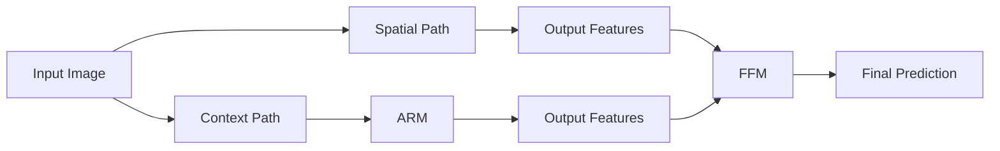

# BiSeNet原理与代码实例讲解

## 1. 背景介绍

### 1.1 语义分割的重要性
语义分割是计算机视觉领域的一个重要任务,旨在为图像的每个像素分配语义标签。它在自动驾驶、医学图像分析、遥感图像解译等领域有着广泛的应用。

### 1.2 实时性的挑战
传统的语义分割模型如FCN、SegNet等虽然取得了不错的分割精度,但是模型复杂,计算量大,难以满足实时性的要求。如何在保证分割精度的同时提高模型的推理速度,是一个亟待解决的问题。

### 1.3 BiSeNet的提出
BiSeNet(Bilateral Segmentation Network)是一种面向实时语义分割的双边网络架构,由Changqian Yu等人于2018年提出。它通过引入Spatial Path和Context Path两个分支,在编码高分辨率的空间信息和丰富的上下文信息之间取得平衡,以实现精度和速度的权衡。

## 2. 核心概念与联系

### 2.1 Spatial Path
Spatial Path是BiSeNet的一个重要组成部分,用于编码高分辨率的空间细节信息。它接收原始尺寸的输入图像,经过少量的下采样和卷积操作,保留了图像的空间结构。

### 2.2 Context Path  
Context Path用于提取全局的上下文信息。它采用多个预训练的ResNet等骨干网络作为特征提取器,通过连续的下采样获得具有丰富语义的低分辨率特征图。

### 2.3 Attention Refinement Module
Attention Refinement Module(ARM)位于Context Path中,用于优化提取到的上下文特征。它通过全局平均池化和sigmoid函数生成权重图,自适应地调整不同通道的特征响应。

### 2.4 Feature Fusion Module
Feature Fusion Module(FFM)用于融合Spatial Path和Context Path的输出特征。它通过上采样和级联的方式,将两个分支的特征图对齐并逐元素相加,同时利用Attention机制动态调整特征权重。

### 2.5 概念联系
下图展示了BiSeNet的整体架构和各模块之间的联系:



## 3. 核心算法原理具体操作步骤

### 3.1 Spatial Path

1. 输入原始尺寸的图像
2. 使用步长为2的3x3卷积进行下采样,减小特征图尺寸 
3. 使用3个3x3卷积提取特征
4. 输出1/8尺寸的特征图

### 3.2 Context Path

1. 使用预训练的ResNet等骨干网络作为特征提取器
2. 通过连续的下采样获得1/32尺寸的低分辨率特征图
3. 使用Attention Refinement Module优化特征
4. 输出优化后的上下文特征

### 3.3 Attention Refinement Module

1. 对输入特征图进行全局平均池化,生成通道描述符 
2. 使用1x1卷积将通道描述符的通道数减少到原来的1/16
3. 使用ReLU激活函数
4. 使用1x1卷积将通道数恢复到原来的大小
5. 使用Sigmoid函数将权重归一化到0-1之间
6. 将权重图与原始特征图相乘,完成特征优化

### 3.4 Feature Fusion Module

1. 使用双线性插值将Context Path的输出上采样到Spatial Path的尺寸
2. 将两个分支的特征图在通道维度上拼接
3. 使用1x1卷积调整通道数
4. 生成与Spatial Path特征图相同尺寸的融合特征
5. 将融合特征与Spatial Path特征图逐元素相加
6. 使用Attention机制生成空间权重图
7. 将空间权重图与相加后的特征图相乘,完成特征融合

### 3.5 预测输出

1. 将融合后的特征图通过1x1卷积进行分类预测
2. 使用双线性插值将预测结果上采样到原始图像尺寸
3. 输出每个像素的类别概率图

## 4. 数学模型和公式详细讲解举例说明

### 4.1 卷积操作
卷积是BiSeNet中使用最频繁的操作,对于输入特征图 $\mathbf{X} \in \mathbb{R}^{C \times H \times W}$ 和卷积核 $\mathbf{W} \in \mathbb{R}^{C' \times C \times k \times k}$,卷积的计算公式为:

$$ \mathbf{Y}_{c',i,j} = \sum_{c=0}^{C-1} \sum_{m=0}^{k-1} \sum_{n=0}^{k-1} \mathbf{W}_{c',c,m,n} \cdot \mathbf{X}_{c,i+m,j+n} $$

其中 $(i,j)$ 为特征图上的空间位置坐标, $c$ 为输入通道, $c'$ 为输出通道。

例如,对一个 $3 \times 32 \times 32$ 的RGB图像进行 $3 \times 3$ 卷积,输出通道数为16,则卷积核的形状为 $16 \times 3 \times 3 \times 3$,输出特征图的形状为 $16 \times 30 \times 30$。

### 4.2 全局平均池化
全局平均池化(Global Average Pooling)用于生成通道描述符。对于输入特征图 $\mathbf{X} \in \mathbb{R}^{C \times H \times W}$,全局平均池化的计算公式为:

$$ \mathbf{y}_c = \frac{1}{H \times W} \sum_{i=0}^{H-1} \sum_{j=0}^{W-1} \mathbf{X}_{c,i,j} $$

其中 $\mathbf{y} \in \mathbb{R}^C$ 为输出的通道描述符。

例如,对一个 $256 \times 32 \times 32$ 的特征图进行全局平均池化,输出的通道描述符形状为 $256 \times 1 \times 1$。

### 4.3 Attention机制
Attention机制用于自适应地调整特征图不同区域的权重。对于输入特征图 $\mathbf{X} \in \mathbb{R}^{C \times H \times W}$ 和权重图 $\mathbf{A} \in \mathbb{R}^{1 \times H \times W}$,Attention的计算公式为:

$$ \mathbf{Y}_{c,i,j} = \mathbf{A}_{i,j} \cdot \mathbf{X}_{c,i,j} $$

其中 $\mathbf{A}$ 通过Sigmoid函数将权重归一化到0-1之间。

例如,对一个 $256 \times 32 \times 32$ 的特征图应用Attention,权重图的形状为 $1 \times 32 \times 32$,输出特征图的形状仍为 $256 \times 32 \times 32$,但不同区域的特征响应强度被动态调整了。

## 5. 项目实践：代码实例和详细解释说明

下面以PyTorch为例,给出BiSeNet的核心模块实现代码。

### 5.1 Spatial Path

```python
class SpatialPath(nn.Module):
    def __init__(self, in_channels, out_channels):
        super(SpatialPath, self).__init__()
        self.conv1 = ConvBNReLU(in_channels, 64, 3, 2)
        self.conv2 = ConvBNReLU(64, 64, 3, 1)
        self.conv3 = ConvBNReLU(64, 64, 3, 1)
        self.conv_out = ConvBNReLU(64, out_channels, 1, 1)
        
    def forward(self, x):
        x = self.conv1(x)
        x = self.conv2(x)
        x = self.conv3(x)
        x = self.conv_out(x)
        return x
```

其中`ConvBNReLU`为卷积、批归一化和ReLU激活的组合。Spatial Path先用步长为2的卷积下采样,然后用两个3x3卷积提取特征,最后用1x1卷积调整通道数。

### 5.2 Context Path

```python
class ContextPath(nn.Module):
    def __init__(self, backbone):
        super(ContextPath, self).__init__()
        self.backbone = backbone
        self.arm16 = AttentionRefinementModule(128, 128)
        self.arm32 = AttentionRefinementModule(256, 128)
        
    def forward(self, x):
        x = self.backbone.conv1(x)
        x = self.backbone.bn1(x)
        x = self.backbone.relu(x)
        x = self.backbone.maxpool(x)
        
        x = self.backbone.layer1(x)
        x = self.backbone.layer2(x)
        x16 = self.arm16(x)
        
        x = self.backbone.layer3(x)
        x32 = self.arm32(x)
        
        return x16, x32
```

Context Path使用ResNet等预训练骨干网络提取特征,并在layer2和layer3的输出上应用ARM模块优化特征。

### 5.3 Attention Refinement Module

```python
class AttentionRefinementModule(nn.Module):
    def __init__(self, in_channels, out_channels):
        super(AttentionRefinementModule, self).__init__()
        self.conv = ConvBNReLU(in_channels, out_channels, 3, 1)
        self.gap = nn.AdaptiveAvgPool2d(1)
        self.conv_atten = nn.Conv2d(out_channels, out_channels, 1, bias=False)
        self.bn_atten = nn.BatchNorm2d(out_channels)
        self.sigmoid = nn.Sigmoid()
        
    def forward(self, x):
        x = self.conv(x)
        atten = self.gap(x)
        atten = self.conv_atten(atten)
        atten = self.bn_atten(atten)
        atten = self.sigmoid(atten)
        out = torch.mul(x, atten)
        return out
```

ARM模块先用3x3卷积调整通道数,然后用全局平均池化生成通道描述符,接着用1x1卷积、批归一化和Sigmoid生成Attention权重,最后将权重与原始特征图相乘完成优化。

### 5.4 Feature Fusion Module

```python
class FeatureFusionModule(nn.Module):
    def __init__(self, in_channels, out_channels):
        super(FeatureFusionModule, self).__init__()
        self.conv1 = ConvBNReLU(in_channels, out_channels, 1, 1)
        self.gap = nn.AdaptiveAvgPool2d(1)
        self.conv_atten = nn.Conv2d(out_channels, out_channels, 1, bias=False)
        self.bn_atten = nn.BatchNorm2d(out_channels)
        self.sigmoid = nn.Sigmoid()
        
    def forward(self, x1, x2):
        x = torch.cat([x1, x2], dim=1)
        x = self.conv1(x)
        atten = self.gap(x)
        atten = self.conv_atten(atten)
        atten = self.bn_atten(atten)
        atten = self.sigmoid(atten)
        out = torch.mul(x, atten)
        return out
```

FFM模块先将两个分支的特征图在通道维度拼接,然后用1x1卷积调整通道数。接着类似ARM模块,生成空间Attention权重并与特征图相乘,完成特征融合。

## 6. 实际应用场景

BiSeNet可以应用于多种实际场景,例如:

- 自动驾驶:对道路场景进行实时语义分割,识别车道线、车辆、行人等目标
- 医学图像分析:对CT、MRI等医学影像进行器官、病变区域的自动分割
- 遥感图像解译:对卫星、无人机拍摄的遥感影像进行土地利用分类、变化检测等
- 视频监控:对监控视频进行实时场景理解,检测异常行为,进行人员、车辆跟踪等

在这些应用中,BiSeNet能够在满足实时性要求的同时,提供较高的分割精度,极大地提升了语义分割技术的实用价值。

## 7. 工具和资源推荐

- PyTorch:流行的深度学习框架,BiSeNet的官方实现即基于PyTorch
  - GitHub仓库:https://github.com/ycszen/TorchSeg
  - 模型库:https://github.com/CoinCheung/BiSeNet
  
- TensorFlow:另一个主流的深度学习框架,也有BiSeNet的第三方实现
  - GitHub仓库:https://github.com/MaybeShewill-CV/bisenetv2-tensorflow

- 预训练权重:ImageNet预训练的骨干网络权重
  - ResNet:https://download.pytorch.org/models/resnet18-5c