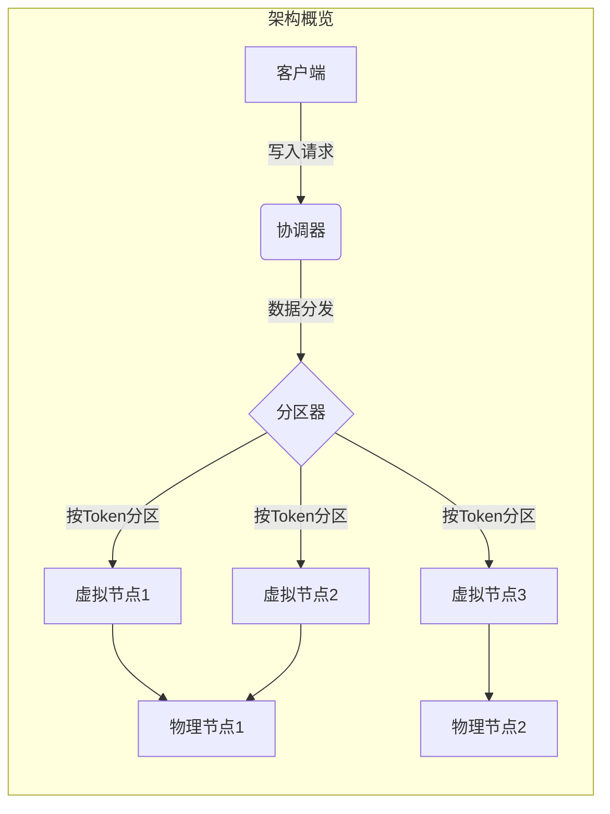

# Cassandra原理与代码实例讲解

## 1.背景介绍

在当今大数据时代,数据量的快速增长对传统关系型数据库带来了巨大挑战。为了应对这一挑战,NoSQL数据库应运而生。作为NoSQL数据库的杰出代表,Cassandra凭借其高可扩展性、高可用性和容错性,成为分布式大数据存储的不二之选。

Cassandra最初由Facebook设计,用于处理收件箱搜索等查询。后来,它被Apache软件基金会收购并开源。如今,Cassandra被广泛应用于各种场景,包括消息传递、实时数据捕获、物联网数据等。知名公司如Netflix、Instagram、Uber等都在使用Cassandra。

## 2.核心概念与联系

### 2.1 数据模型

Cassandra采用列式存储模型,非常适合分布式场景。它的数据结构主要包括:

- 节点(Node):一个Cassandra集群由多个节点组成。
- 数据中心(Data Center):节点根据网络拓扑结构分布在不同的数据中心。
- 列族(Column Family):相当于关系数据库中的表。
- 行(Row):由行键(Row Key)唯一标识。
- 列(Column):由列键(Column Key)标识,存储实际数据。
- 超级列(Super Column):将多个列组织在一起的特殊列。

### 2.2 分布式体系结构

Cassandra采用无共享架构,每个节点都是对等的,不存在单点故障问题。数据通过一致性哈希分布在集群中,并通过复制机制实现冗余备份。主要概念包括:

- 分区器(Partitioner):哈希算法,将数据分布到不同节点。
- 虚拟节点(Virtual Node):单个物理节点可映射为多个虚拟节点,提高数据分布均匀性。
- 复制因子(Replication Factor):每个数据块的复制份数。
- 一致性级别(Consistency Level):写入和读取操作所需的确认节点数。

### 2.3 Mermaid流程图



## 3.核心算法原理具体操作步骤

### 3.1 数据分区

Cassandra使用一致性哈希环将数据分布到不同节点。具体步骤如下:

1. 使用分区器(Partitioner)计算每个行键的哈希值,得到一个Token。
2. 将Token映射到哈希环上的一个位置。
3. 顺时针找到第一个节点,将该行数据存储在该节点上。

### 3.2 数据复制

为实现数据冗余,Cassandra采用复制策略复制数据。步骤如下:

1. 根据复制因子(Replication Factor)确定复制份数。
2. 从存储该行数据的节点开始,顺时针找到下N-1个节点。
3. 将该行数据复制到这N个节点上。

### 3.3 读写流程

读写数据的流程如下:

**写入**:
1. 客户端向任意节点发送写请求。
2. 该节点作为协调器,根据分区器计算Token。
3. 协调器将写请求发送给存储该数据的节点。
4. 等待足够的节点确认后,返回客户端。

**读取**:
1. 客户端向任意节点发送读请求。
2. 该节点作为协调器,根据分区器计算Token。
3. 协调器并行从多个复制节点读取数据。
4. 等待足够的节点响应,返回最新版本数据给客户端。

## 4.数学模型和公式详细讲解举例说明

### 4.1 一致性哈希算法

Cassandra使用一致性哈希算法将数据均匀分布到集群中。哈希环由$2^{64}$个位置组成,每个节点负责连续的一段Token范围。

$$
Token = Hash(Key) \bmod 2^{64}
$$

例如,对于行键"user1234",计算Token:

$$
\begin{aligned}
Token &= Hash("user1234") \bmod 2^{64} \\
      &= 195936477564932292
\end{aligned}
$$

### 4.2 复制策略

Cassandra提供多种复制策略,最常用的是SimpleStrategy和NetworkTopologyStrategy。

**SimpleStrategy**适用于单数据中心部署,复制份数由$ReplicationFactor$决定:

$$
N = ReplicationFactor
$$

**NetworkTopologyStrategy**支持多个数据中心,每个数据中心可设置不同的复制因子:

$$
N = \sum_{dc} ReplicationFactor_{dc}
$$

例如,在两个数据中心,分别设置复制因子为3和2,则总复制份数为5。

### 4.3 一致性级别

Cassandra支持多种一致性级别,用于权衡数据一致性和可用性。

对于写操作,一致性级别决定了需要确认的副本数量:

$$
R \geq \lceil \frac{ReplicationFactor + 1}{2} \rceil
$$

对于读操作,一致性级别决定了需要读取的副本数量:

$$
R \geq 1 + \lfloor \frac{ReplicationFactor}{2} \rfloor
$$

例如,复制因子为3,写入至少需要2个副本确认,读取至少需要2个副本响应。

## 5.项目实践:代码实例和详细解释说明

### 5.1 建立集群

首先,我们使用Docker快速搭建一个3节点的Cassandra集群。创建docker-compose.yml文件:

```yaml
version: '3'
services:
  cassandra-node1:
    image: cassandra:3.11
    ports:
      - 9042:9042
    environment:
      - CASSANDRA_CLUSTER_NAME=cassandra-cluster
      - CASSANDRA_SEEDS=cassandra-node1
    networks:
      - cassandra-net

  cassandra-node2:
    image: cassandra:3.11
    environment:
      - CASSANDRA_CLUSTER_NAME=cassandra-cluster
      - CASSANDRA_SEEDS=cassandra-node1
    networks:
      - cassandra-net
        
  cassandra-node3:
    image: cassandra:3.11
    environment:
      - CASSANDRA_CLUSTER_NAME=cassandra-cluster
      - CASSANDRA_SEEDS=cassandra-node1
    networks:
      - cassandra-net
        
networks:
  cassandra-net:
    driver: bridge
```

然后执行`docker-compose up -d`启动集群。

### 5.2 创建键空间和表

使用cqlsh连接到任意节点,创建键空间和表:

```sql
CREATE KEYSPACE demo WITH replication = {'class': 'SimpleStrategy', 'replication_factor': 3};

USE demo;

CREATE TABLE users (
    user_id uuid PRIMARY KEY,
    name text,
    email text
);
```

这里我们创建了一个users表,主键为uuid类型的user_id。

### 5.3 插入数据

使用Python的cassandra-driver库插入一些示例数据:

```python
from cassandra.cluster import Cluster
from uuid import uuid4

# 连接集群
cluster = Cluster(['127.0.0.1'])
session = cluster.connect('demo')

# 准备语句
insert_stmt = session.prepare("INSERT INTO users (user_id, name, email) VALUES (?, ?, ?)")

# 插入数据
for i in range(10):
    user_id = uuid4()
    name = f"User {i}"
    email = f"user{i}@example.com"
    session.execute(insert_stmt, (user_id, name, email))
```

### 5.4 查询数据

使用cqlsh查询插入的数据:

```sql
SELECT * FROM users;
```

你将看到类似如下的输出:

```
 user_id                                | email                  | name
---------------------------------------+-------------------------+----------
 50b9c6e7-b156-4c83-9737-399665e7b5d6  | user0@example.com      | User 0
 0c9e7c49-e832-4fb5-9874-f8d5b3a70e9a  | user1@example.com      | User 1
 e73a58c3-6f27-4d94-8c54-a3e3bfcd6f4f  | user2@example.com      | User 2
 ...
```

## 6.实际应用场景

Cassandra因其优秀的性能和可扩展性,被广泛应用于各种场景:

- **物联网(IoT)数据**:Cassandra适合存储来自大量传感器的时序数据。
- **消息传递系统**:Kafka等消息队列常与Cassandra结合,实现可靠的消息存储。
- **实时数据分析**:Cassandra支持快速写入和低延迟查询,适合实时分析场景。
- **内容分发网络(CDN)**:Cassandra可用于存储大规模的媒体内容和元数据。
- **产品目录**:电子商务网站使用Cassandra存储产品信息,实现高吞吐量查询。

## 7.工具和资源推荐

- **Cassandra官方文档**:https://cassandra.apache.org/doc/latest/
- **DataStax Academy**:Cassandra开发商提供的免费在线培训课程。
- **Cassandra Query Language (CQL)参考**:https://cassandra.apache.org/doc/latest/cql/
- **Cassandra驱动程序**:Python、Java、Node.js等语言的官方驱动程序。
- **Cassandra监控工具**:DataStax OpsCenter、Cassandra Reaper等。
- **Cassandra可视化工具**:DataStax DevCenter、Apache Cassandra Web工具等。

## 8.总结:未来发展趋势与挑战

Cassandra作为开源的分布式NoSQL数据库,在大数据时代扮演着重要角色。未来,Cassandra将继续朝着以下方向发展:

- **云原生支持**:更好地与Kubernetes等云原生技术栈集成。
- **人工智能支持**:优化AI/ML工作负载的存储和处理。
- **混合云部署**:支持跨多个云平台和本地环境的部署。
- **安全性增强**:提供更好的加密、身份验证和审计功能。

同时,Cassandra也面临一些挑战:

- **数据建模复杂性**:Cassandra的数据模型与关系型数据库有很大差异,需要重新设计数据模型。
- **查询灵活性**:Cassandra查询语言相对简单,对复杂查询的支持有限。
- **运维管理难度**:集群规模扩大后,运维管理变得更加复杂。
- **与其他系统集成**:与现有系统的集成需要更多工作。

## 9.附录:常见问题与解答

**Q: Cassandra适合什么样的应用场景?**

A: Cassandra非常适合需要高写入吞吐量、持续可用性和线性伸缩的应用场景,例如物联网数据、消息传递系统、实时分析等。但对于需要复杂查询的场景,Cassandra可能不是最佳选择。

**Q: Cassandra的一致性级别有什么影响?**

A: 一致性级别决定了读写操作所需的确认节点数量,影响数据一致性和可用性的权衡。一致性级别越高,数据一致性越好,但可用性会降低;反之亦然。需要根据具体场景选择合适的一致性级别。

**Q: 如何选择合适的复制策略和复制因子?**

A: 复制策略和复制因子的选择取决于数据中心的部署拓扑和预期的数据冗余级别。通常,对于单数据中心部署,可以使用SimpleStrategy;对于多数据中心部署,可以使用NetworkTopologyStrategy。复制因子越高,数据冗余度越高,但也会增加存储开销。

**Q: Cassandra适合做实时查询吗?**

A: Cassandra确实支持低延迟的实时查询,但查询灵活性有限。对于需要复杂查询的场景,可能需要结合其他技术(如Apache Spark)来实现。

**Q: Cassandra与传统关系型数据库有何不同?**

A: Cassandra采用无模式、列式存储模型,与关系型数据库的表格式存储模型有很大区别。Cassandra更注重写入性能和可扩展性,而关系型数据库更侧重于数据一致性和查询灵活性。在选择时需要权衡这些差异。

作者: 禅与计算机程序设计艺术 / Zen and the Art of Computer Programming