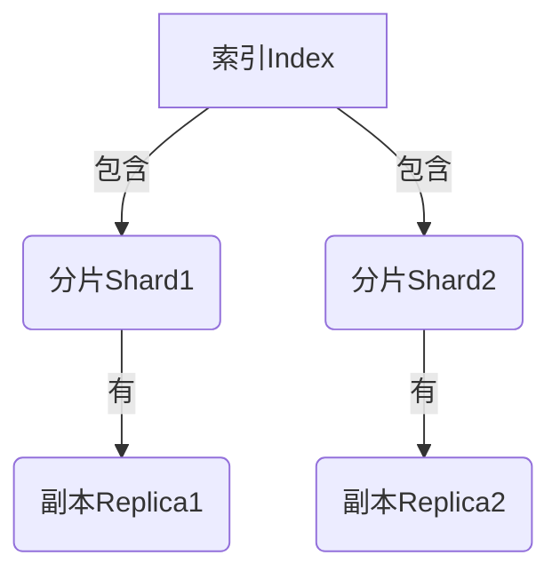

# ES索引原理与代码实例讲解

## 1.背景介绍

随着数据量的快速增长,传统的关系型数据库在处理海量数据时遇到了严峻的挑战,这促使了新一代分布式搜索引擎的诞生。Elasticsearch(简称ES)作为一个分布式、RESTful风格的搜索和数据分析引擎,以其高性能、高可用、易扩展等优势,在日志数据分析、全文搜索、安全分析等领域得到了广泛应用。

ES的核心设计理念是通过分布式系统中的分片(sharding)和备份(replication)来实现数据的水平扩展,从而支持PB级的结构化或非结构化数据的存储、搜索和分析。与传统数据库不同,ES更像是一个数据存储和分析的工具,具有schema-free、分布式、RESTful等特点。

## 2.核心概念与联系

在深入探讨ES索引原理之前,我们需要先了解ES中的一些核心概念。

### 2.1 索引(Index)

索引是ES中存储关联数据的地方,相当于关系型数据库中的"数据库"。一个索引由多个分片(shard)组成,每个分片存储索引中的一部分数据。

### 2.2 文档(Document)

文档是ES中最小的数据单元,相当于关系型数据库中的一行记录。每个文档都有一个唯一的ID,并且属于一个索引。

### 2.3 分片(Shard)

分片是ES实现数据水平扩展的关键。一个索引中的数据被分散存储在多个分片中,每个分片都是一个低级别的工作节点,承担着索引、搜索等职责。分片可以跨多个节点进行分布,从而提高系统的可用性和吞吐量。

### 2.4 副本(Replica)

为了提高数据的可用性和容错性,ES会为每个分片创建一个或多个副本。副本分布在不同的节点上,当主分片出现故障时,副本可以接管服务,保证数据不会丢失。



上图展示了一个索引包含两个主分片,每个主分片都有一个副本。分片和副本分布在不同的节点上,实现了数据的分布式存储和高可用。

## 3.核心算法原理具体操作步骤

### 3.1 索引创建

在ES中,我们可以通过HTTP RESTful API来创建一个新的索引。例如,使用curl命令创建一个名为"blogs"的索引:

```bash
curl -X PUT "localhost:9200/blogs"
```

这个命令会向ES发送一个PUT请求,创建一个名为"blogs"的新索引。如果索引已经存在,ES会返回一个错误信息。

我们也可以在创建索引时指定分片和副本的数量,例如:

```bash
curl -X PUT "localhost:9200/blogs?pretty" -H 'Content-Type: application/json' -d'
{
    "settings" : {
        "index" : {
            "number_of_shards" : 3,
            "number_of_replicas" : 2
        }
    }
}
'
```

这个命令创建了一个名为"blogs"的索引,包含3个主分片和2个副本(每个主分片有2个副本)。

### 3.2 文档索引

创建索引后,我们就可以向其中添加文档数据了。ES支持多种方式索引文档,包括:

- 使用自动生成的ID索引文档
- 使用自定义ID索引文档
- 批量索引多个文档

以下是使用自动生成ID索引一个文档的示例:

```bash
curl -X PUT "localhost:9200/blogs/_doc/" -H 'Content-Type: application/json' -d'
{
    "title": "My First Blog",
    "content": "This is the body of my first blog post...",
    "date": "2023-05-01"
}
'
```

这个命令向"blogs"索引中添加了一个新文档,ES会自动为这个文档分配一个唯一ID。

如果我们想使用自定义ID,可以在URL路径中指定:

```bash
curl -X PUT "localhost:9200/blogs/_doc/123?pretty" -H 'Content-Type: application/json' -d'
{
    "title": "My Second Blog",
    "content": "This is another blog post...", 
    "date": "2023-05-15"
}
'
```

这个命令使用ID "123"索引了一个新文档。

批量索引多个文档可以使用_bulk API,它允许在一个请求中发送多个索引操作,从而提高索引效率。

### 3.3 文档搜索

索引完成后,我们就可以对文档进行搜索了。ES提供了丰富的查询语言,支持全文搜索、结构化搜索等多种搜索方式。

以下是一个简单的全文搜索示例:

```bash
curl -X GET "localhost:9200/blogs/_search?q=first&pretty"
```

这个命令在"blogs"索引中搜索包含"first"关键词的文档。

我们也可以使用查询语句(Query DSL)进行更复杂的搜索,例如:

```bash
curl -X GET "localhost:9200/blogs/_search?pretty" -H 'Content-Type: application/json' -d'
{
    "query" : {
        "bool": {
            "must": {
                "match": {
                    "content": "blog post"
                }
            },
            "filter": {
                "range": {
                    "date": {
                        "gte": "2023-05-01",
                        "lte": "2023-05-31"
                    }
                }
            }
        }
    }
}
'
```

这个查询使用布尔查询,搜索标题中包含"blog post"关键词,并且发布日期在2023年5月的文档。

## 4.数学模型和公式详细讲解举例说明

ES的核心是一个分布式的倒排索引,它能够快速响应查询请求。倒排索引的建立过程可以用一个简单的数学模型来描述。

假设我们有一个文档集合$D = \{d_1, d_2, \ldots, d_n\}$,其中每个文档$d_i$由一个词组(term)序列$\{t_1, t_2, \ldots, t_m\}$组成。我们的目标是为每个词组$t$构建一个倒排索引$I(t)$,其中$I(t)$是一个文档ID列表,包含所有包含词组$t$的文档。

构建倒排索引的过程如下:

1. 对每个文档进行分词(tokenization),将文档拆分为一个词组序列。
2. 计算每个词组在文档集合中的文档频率(document frequency, DF),即包含该词组的文档数量:

$$
DF(t) = |\{d \in D: t \in d\}|
$$

3. 对于每个词组$t$,构建其倒排索引$I(t)$,包含所有包含$t$的文档ID。
4. 可选地,计算每个词组在每个文档中的词频(term frequency, TF),并将其与倒排索引一起存储,以支持TF-IDF相关性打分。

词频TF可以用简单的词组计数来表示,或使用更复杂的归一化方法,如:

$$
TF(t, d) = \frac{n_{t,d}}{\sum_{t' \in d} n_{t',d}}
$$

其中$n_{t,d}$表示词组$t$在文档$d$中出现的次数。

TF-IDF相关性打分公式为:

$$
\text{score}(t, d) = TF(t, d) \times IDF(t)
$$

其中$IDF(t) = \log \frac{N}{DF(t)}$是词组$t$的逆文档频率,用于减小常见词组的权重。$N$是文档总数。

通过这种倒排索引结构,ES可以快速定位包含查询词组的文档,并根据TF-IDF算法计算相关性分数,从而返回最匹配的搜索结果。

## 5.项目实践:代码实例和详细解释说明

为了更好地理解ES的索引原理,我们来看一个基于Java的实践项目。这个项目使用ES的Java高级REST客户端,演示了如何创建索引、索引文档和执行搜索查询。

### 5.1 项目设置

首先,我们需要在Maven项目中添加ES客户端依赖:

```xml
<dependency>
    <groupId>org.elasticsearch.client</groupId>
    <artifactId>elasticsearch-rest-high-level-client</artifactId>
    <version>7.17.7</version>
</dependency>
```

### 5.2 创建ES客户端

接下来,我们创建一个ES客户端实例,用于与ES服务器进行交互:

```java
RestHighLevelClient client = new RestHighLevelClient(
    RestClient.builder(
        new HttpHost("localhost", 9200, "http")));
```

这里我们假设ES服务器运行在本地的9200端口上。

### 5.3 创建索引

我们可以使用`CreateIndexRequest`创建一个新的索引:

```java
CreateIndexRequest request = new CreateIndexRequest("blogs");
request.settings(Settings.builder()
    .put("index.number_of_shards", 3)
    .put("index.number_of_replicas", 2)
);

CreateIndexResponse createIndexResponse = client.indices().create(request, RequestOptions.DEFAULT);
```

这段代码创建了一个名为"blogs"的索引,包含3个主分片和2个副本。

### 5.4 索引文档

使用`IndexRequest`可以将文档索引到ES中:

```java
IndexRequest request = new IndexRequest("blogs")
    .id("1")
    .source("""
        {
            "title": "My First Blog",
            "content": "This is the body of my first blog post...",
            "date": "2023-05-01"
        }
        """, XContentType.JSON);

IndexResponse indexResponse = client.index(request, RequestOptions.DEFAULT);
```

这段代码向"blogs"索引中索引了一个ID为"1"的文档。

### 5.5 搜索查询

要执行搜索查询,我们可以使用`SearchRequest`:

```java
SearchRequest searchRequest = new SearchRequest("blogs");
SearchSourceBuilder searchSourceBuilder = new SearchSourceBuilder();
searchSourceBuilder.query(QueryBuilders.matchQuery("content", "blog post"));
searchRequest.source(searchSourceBuilder);

SearchResponse searchResponse = client.search(searchRequest, RequestOptions.DEFAULT);
SearchHits hits = searchResponse.getHits();
for (SearchHit hit : hits) {
    String sourceAsString = hit.getSourceAsString();
    System.out.println(sourceAsString);
}
```

这段代码在"blogs"索引中搜索包含"blog post"关键词的文档,并打印出匹配的文档内容。

通过这个实践项目,我们可以看到ES Java客户端提供了友好的API,方便我们创建索引、索引文档和执行搜索查询。

## 6.实际应用场景

ES作为一款强大的分布式搜索和分析引擎,在许多领域都有广泛的应用,例如:

### 6.1 网站搜索

ES可以为网站提供高效的全文搜索功能,支持对网页内容、产品信息等进行搜索和关键词高亮显示。像Wikipedia、GitHub等知名网站都在使用ES作为其搜索引擎。

### 6.2 日志分析

ES擅长处理海量的日志数据,可以对服务器日志、应用程序日志等进行集中存储、搜索和分析。通过ES的聚合和可视化功能,我们可以发现日志中的异常模式,监控系统运行状况。

### 6.3 安全分析

ES可以用于安全领域的数据分析,如入侵检测、威胁监控等。通过索引网络流量、系统事件等数据,ES能够快速发现安全威胁,提高系统的防御能力。

### 6.4 商业智能

ES的分析能力也可以应用于商业智能领域,如电子商务网站的用户行为分析、销售数据分析等。企业可以利用ES构建数据分析平台,发现商业洞察和趋势。

### 6.5 物联网

在物联网领域,ES可以用于存储和分析来自各种传感器的海量数据,如温度、湿度、位置等。通过对这些数据进行实时搜索和分析,我们可以监控设备状态,优化物联网系统的运行。

## 7.工具和资源推荐

为了更好地使用和管理ES,我们可以借助一些优秀的工具和资源:

### 7.1 Kibana

Kibana是ES的官方数据可视化和管理平台,提供了友好的Web界面,可以方便地查看ES的集群状态、索引数据、执行搜索查询等。Kibana还支持创建各种图表和仪表板,帮助我们更直观地分析数据。

### 7.2 Logstash

Logstash是ES家族中的数据收集和处