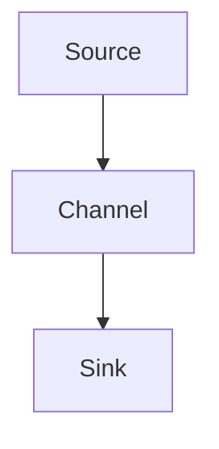

# Flume原理与代码实例讲解

## 1.背景介绍

在大数据处理领域，数据的采集、传输和存储是至关重要的环节。Apache Flume 是一个分布式、可靠且高可用的系统，专门用于高效地收集、聚合和传输大量日志数据。Flume 主要用于将数据从各种数据源（如日志文件、网络流量等）传输到集中式的数据存储系统（如 HDFS、HBase 等）。本文将深入探讨 Flume 的核心概念、算法原理、数学模型、项目实践、实际应用场景、工具和资源推荐，并展望其未来发展趋势与挑战。

## 2.核心概念与联系

### 2.1 Flume 组件

Flume 的架构由以下几个核心组件组成：

- **Source**：数据输入端，负责从外部数据源收集数据。
- **Channel**：数据缓冲区，负责暂存数据，确保数据在传输过程中的可靠性。
- **Sink**：数据输出端，负责将数据传输到目标存储系统。

### 2.2 数据流

Flume 的数据流由 Source、Channel 和 Sink 组成的 Agent 进行管理。一个 Flume Agent 可以包含多个 Source、Channel 和 Sink。数据从 Source 进入 Channel，最后由 Sink 输出到目标存储系统。

### 2.3 事件

在 Flume 中，数据以事件（Event）的形式进行传输。每个事件包含一个字节数组（body）和一组可选的头信息（headers）。

### 2.4 拓扑结构

Flume 支持多种拓扑结构，如单节点、级联、扇出和多播等。通过灵活的拓扑结构，Flume 可以适应不同的数据传输需求。



## 3.核心算法原理具体操作步骤

### 3.1 数据采集

Flume 的 Source 负责从外部数据源采集数据。常见的 Source 类型包括 Avro Source、Syslog Source、Spooling Directory Source 等。Source 将采集到的数据封装成事件，并将其发送到 Channel。

### 3.2 数据缓冲

Channel 负责暂存数据，确保数据在传输过程中的可靠性。常见的 Channel 类型包括 Memory Channel、File Channel 和 Kafka Channel。Channel 的选择取决于数据的可靠性和性能需求。

### 3.3 数据传输

Sink 负责将数据从 Channel 传输到目标存储系统。常见的 Sink 类型包括 HDFS Sink、HBase Sink、Kafka Sink 等。Sink 从 Channel 中读取数据，并将其写入目标存储系统。

### 3.4 数据处理

在数据传输过程中，Flume 支持对数据进行处理和转换。常见的处理器包括 Interceptor 和 Serializer。Interceptor 用于在数据进入 Channel 之前对数据进行预处理，Serializer 用于在数据写入目标存储系统之前对数据进行序列化。

## 4.数学模型和公式详细讲解举例说明

Flume 的数据传输过程可以用数学模型来描述。假设数据源产生的数据速率为 $\lambda$，Channel 的处理速率为 $\mu$，则系统的负载率 $\rho$ 可以表示为：

$$
\rho = \frac{\lambda}{\mu}
$$

当 $\rho < 1$ 时，系统处于稳定状态，数据可以被及时处理。当 $\rho \geq 1$ 时，系统处于过载状态，数据处理会出现延迟。

### 4.1 队列模型

Channel 可以看作是一个队列，数据在队列中等待处理。假设队列的长度为 $L$，则队列中的平均等待时间 $W$ 可以表示为：

$$
W = \frac{L}{\mu - \lambda}
$$

### 4.2 可靠性分析

Flume 的可靠性可以通过数据丢失率来衡量。假设数据丢失的概率为 $P_d$，则系统的可靠性 $R$ 可以表示为：

$$
R = 1 - P_d
$$

通过选择合适的 Channel 类型和配置参数，可以提高系统的可靠性。

## 5.项目实践：代码实例和详细解释说明

### 5.1 环境准备

首先，确保已经安装了 Apache Flume。可以通过以下命令安装：

```bash
sudo apt-get install flume-ng
```

### 5.2 配置文件

创建一个 Flume 配置文件 `flume.conf`，内容如下：

```properties
# Define the agent
agent.sources = source1
agent.channels = channel1
agent.sinks = sink1

# Define the source
agent.sources.source1.type = exec
agent.sources.source1.command = tail -F /var/log/syslog

# Define the channel
agent.channels.channel1.type = memory
agent.channels.channel1.capacity = 1000
agent.channels.channel1.transactionCapacity = 100

# Define the sink
agent.sinks.sink1.type = hdfs
agent.sinks.sink1.hdfs.path = hdfs://localhost:9000/flume/logs
agent.sinks.sink1.hdfs.fileType = DataStream
agent.sinks.sink1.hdfs.writeFormat = Text
agent.sinks.sink1.hdfs.batchSize = 100
agent.sinks.sink1.hdfs.rollSize = 0
agent.sinks.sink1.hdfs.rollCount = 10000

# Bind the source and sink to the channel
agent.sources.source1.channels = channel1
agent.sinks.sink1.channel = channel1
```

### 5.3 启动 Flume

使用以下命令启动 Flume：

```bash
flume-ng agent --conf ./conf --conf-file flume.conf --name agent -Dflume.root.logger=INFO,console
```

### 5.4 代码解释

- **Source**：使用 `exec` 类型的 Source，通过 `tail -F /var/log/syslog` 命令实时采集系统日志。
- **Channel**：使用 `memory` 类型的 Channel，设置容量为 1000，事务容量为 100。
- **Sink**：使用 `hdfs` 类型的 Sink，将数据写入 HDFS，路径为 `hdfs://localhost:9000/flume/logs`。

## 6.实际应用场景

### 6.1 日志收集

Flume 常用于分布式系统的日志收集。通过 Flume，可以将各个节点的日志集中收集到 HDFS 或其他存储系统，便于后续的分析和处理。

### 6.2 实时数据处理

Flume 可以与实时数据处理框架（如 Apache Kafka、Apache Storm 等）集成，实现实时数据的采集和处理。

### 6.3 数据迁移

Flume 还可以用于数据迁移，将数据从一个存储系统迁移到另一个存储系统。例如，可以将 MySQL 数据库中的数据迁移到 HDFS。

## 7.工具和资源推荐

### 7.1 官方文档

- [Apache Flume 官方文档](https://flume.apache.org/documentation.html)

### 7.2 社区资源

- [Stack Overflow Flume 标签](https://stackoverflow.com/questions/tagged/apache-flume)
- [GitHub Flume 项目](https://github.com/apache/flume)

### 7.3 书籍推荐

- 《Hadoop：The Definitive Guide》 - Tom White
- 《Big Data: Principles and best practices of scalable realtime data systems》 - Nathan Marz

## 8.总结：未来发展趋势与挑战

### 8.1 发展趋势

随着大数据技术的不断发展，Flume 也在不断演进。未来，Flume 可能会在以下几个方面有所突破：

- **性能优化**：通过改进算法和数据结构，提高数据传输的性能。
- **扩展性**：支持更多的数据源和目标存储系统，增强系统的扩展性。
- **智能化**：引入机器学习和人工智能技术，实现智能化的数据处理和传输。

### 8.2 挑战

尽管 Flume 在大数据处理领域有着广泛的应用，但仍面临一些挑战：

- **数据丢失**：在高并发和大数据量的情况下，如何确保数据的可靠性和完整性是一个重要的挑战。
- **系统稳定性**：在复杂的分布式环境中，如何保证系统的稳定性和高可用性是一个难题。
- **资源管理**：如何高效地管理和分配系统资源，以提高数据传输的效率和性能。

## 9.附录：常见问题与解答

### 9.1 Flume 支持哪些数据源？

Flume 支持多种数据源，包括日志文件、网络流量、数据库等。常见的 Source 类型有 Avro Source、Syslog Source、Spooling Directory Source 等。

### 9.2 如何提高 Flume 的性能？

可以通过以下几种方式提高 Flume 的性能：

- 使用高性能的 Channel 类型，如 Memory Channel。
- 调整 Channel 的容量和事务容量参数。
- 优化 Source 和 Sink 的配置参数。

### 9.3 Flume 如何保证数据的可靠性？

Flume 通过 Channel 机制保证数据的可靠性。选择合适的 Channel 类型（如 File Channel 或 Kafka Channel）可以提高数据的可靠性。此外，可以通过配置参数（如事务容量、批处理大小等）进一步优化数据传输的可靠性。

### 9.4 Flume 是否支持数据处理？

是的，Flume 支持在数据传输过程中对数据进行处理和转换。可以使用 Interceptor 对数据进行预处理，使用 Serializer 对数据进行序列化。

### 9.5 如何监控 Flume 的运行状态？

可以通过 Flume 自带的监控工具（如 Ganglia、JMX 等）监控 Flume 的运行状态。此外，还可以使用第三方监控工具（如 Prometheus、Grafana 等）进行监控。

---

作者：禅与计算机程序设计艺术 / Zen and the Art of Computer Programming