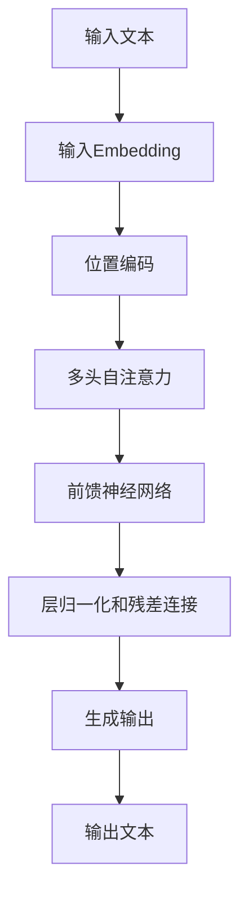

# GPT-3.5原理与代码实例讲解

## 1.背景介绍

自从GPT-3在2020年问世以来,它展现出了令人惊叹的自然语言处理能力,在各种任务上都取得了卓越的表现。GPT-3.5是GPT-3的升级版本,由OpenAI于2022年3月推出,在保留GPT-3强大语言理解和生成能力的同时,进一步优化了模型的准确性、一致性和安全性。

GPT-3.5是一种基于Transformer架构的大型语言模型,使用自监督学习方法在海量文本数据上进行预训练。它能够捕捉到自然语言的复杂模式和语义关系,从而生成高质量、上下文相关的文本输出。

## 2.核心概念与联系

### 2.1 Transformer架构

Transformer是GPT-3.5的核心架构,它完全基于注意力机制,摒弃了传统序列模型中的递归和卷积结构。Transformer由编码器和解码器组成,使用多头自注意力机制捕捉输入序列中的长程依赖关系。

### 2.2 自监督学习

GPT-3.5采用了自监督学习的方式进行预训练。具体来说,它使用了掩码语言模型(Masked Language Modeling)和下一句预测(Next Sentence Prediction)两种任务。前者要求模型根据上下文预测被掩码的单词,后者则需要判断两个句子是否相关。这种自监督学习方式使模型能够从大量无标注数据中学习到有用的语言知识。

### 2.3 微调

虽然GPT-3.5在预训练阶段没有针对特定任务进行优化,但它可以通过在下游任务数据上进行微调,快速适应新的任务。微调过程中,模型的大部分参数保持不变,只对最后几层的参数进行调整,从而将预训练知识迁移到新任务上。

## 3.核心算法原理具体操作步骤

GPT-3.5的核心算法原理可以概括为以下几个步骤:

1. **输入embedding**: 将输入文本序列转换为向量表示,作为Transformer的输入。

2. **位置编码**: 因为Transformer没有捕捉序列顺序的机制,所以需要添加位置编码,使embedding能够体现单词在序列中的位置信息。

3. **多头自注意力**: 输入序列的embedding通过多头自注意力机制,捕捉序列中单词之间的长程依赖关系,生成注意力表示。

4. **前馈神经网络**: 注意力表示通过前馈神经网络进行非线性变换,生成新的序列表示。

5. **层归一化和残差连接**: 在每个子层之后,使用层归一化和残差连接来促进梯度传播和模型收敛。

6. **生成输出**: 对于文本生成任务,解码器基于编码器的输出和前一时刻的输出,自回归地生成下一个单词,直到达到终止条件。

这个过程在Transformer的编码器和解码器中重复进行,直到生成最终的输出序列。



## 4.数学模型和公式详细讲解举例说明

### 4.1 注意力机制

注意力机制是Transformer的核心,它使用查询(Query)、键(Key)和值(Value)之间的相似性来计算注意力权重,从而捕捉输入序列中不同位置之间的依赖关系。具体来说,对于一个查询$q$和一组键值对$(k_i, v_i)$,注意力权重$\alpha_i$计算如下:

$$\alpha_i = \text{softmax}\left(\frac{q \cdot k_i}{\sqrt{d_k}}\right)$$

其中$d_k$是键的维度,用于缩放点积。然后,注意力输出就是加权求和:

$$\text{Attention}(q, K, V) = \sum_{i=1}^n \alpha_i v_i$$

多头注意力机制是将注意力机制运用于不同的子空间,然后将结果拼接起来,从而捕捉更加丰富的依赖关系。

### 4.2 掩码语言模型

掩码语言模型是GPT-3.5预训练的核心任务之一。给定一个输入序列,模型需要预测被掩码的单词。设输入序列为$\mathbf{x} = (x_1, x_2, \dots, x_n)$,其中$x_i$是被掩码的单词位置。模型的目标是最大化掩码位置的条件概率:

$$\mathcal{L}_\text{MLM} = -\mathbb{E}_\mathbf{x} \left[ \sum_{i \in \text{mask}} \log P(x_i | \mathbf{x}_{\backslash i}) \right]$$

这个目标函数促使模型学习到上下文语义,从而能够根据上下文准确预测被掩码的单词。

### 4.3 下一句预测

下一句预测任务要求模型判断两个句子是否相关。设两个句子为$\mathbf{s}_1$和$\mathbf{s}_2$,模型需要预测它们是否为连续的句子对:

$$P(\text{isNext} | \mathbf{s}_1, \mathbf{s}_2) = \text{sigmoid}(\mathbf{c}^\top \mathbf{h})$$

其中$\mathbf{h}$是两个句子的综合表示,通过对句子的Transformer输出进行池化得到;$\mathbf{c}$是一个可训练向量。这个二分类任务有助于模型捕捉句子之间的语义关联。

## 5.项目实践:代码实例和详细解释说明

以下是使用Hugging Face的Transformers库对GPT-3.5进行微调的代码示例,用于文本生成任务。

```python
from transformers import GPT2LMHeadModel, GPT2Tokenizer

# 加载预训练模型和分词器
model = GPT2LMHeadModel.from_pretrained("gpt3.5-xl")
tokenizer = GPT2Tokenizer.from_pretrained("gpt3.5-xl")

# 定义输入文本
input_text = "写一篇关于人工智能的文章:"

# 对输入文本进行编码
input_ids = tokenizer.encode(input_text, return_tensors="pt")

# 生成文本
output_ids = model.generate(
    input_ids,
    max_length=1024,
    num_beams=5,
    early_stopping=True
)

# 解码输出
output_text = tokenizer.decode(output_ids[0], skip_special_tokens=True)
print(output_text)
```

这段代码首先加载预训练的GPT-3.5模型和分词器。然后,它对输入文本进行编码,并使用`model.generate`方法生成文本输出。`max_length`参数控制输出文本的最大长度,`num_beams`指定了beam search的beam宽度,`early_stopping`则允许在生成过程中提前停止。

生成的输出文本将被打印出来。您可以根据需要调整输入文本和生成参数,以探索GPT-3.5在不同场景下的表现。

## 6.实际应用场景

GPT-3.5展现出了强大的自然语言处理能力,在诸多领域都有广泛的应用前景:

1. **内容创作**: 可用于自动生成新闻、文案、故事、诗歌等各种形式的内容。

2. **问答系统**: 能够基于上下文理解问题,并生成相关的答复。

3. **机器翻译**: 通过微调,可以将GPT-3.5应用于高质量的机器翻译任务。

4. **代码生成**: 模型具备一定的代码理解和生成能力,可用于自动化代码补全和简单程序合成。

5. **对话系统**: 可以生成上下文相关、流畅自然的对话响应,为智能助手等系统提供支持。

6. **文本摘要**: 能够对长文本进行理解和概括,自动生成高质量的文本摘要。

7. **情感分析**: 通过微调,GPT-3.5可以用于识别文本中的情感倾向和情绪。

这只是GPT-3.5应用场景的一小部分,随着模型性能的不断提高,它在自然语言处理领域的应用前景将更加广阔。

## 7.工具和资源推荐

如果您对GPT-3.5及其应用感兴趣,以下是一些值得关注的工具和资源:

1. **Hugging Face Transformers**: 这是一个流行的自然语言处理库,提供了GPT-3.5等多种预训练模型,以及用于微调和部署的工具。官网: https://huggingface.co/

2. **OpenAI API**: OpenAI提供了GPT-3.5等语言模型的API接口,方便开发者集成这些模型到自己的应用中。官网: https://openai.com/api/

3. **GPT-3 Demo**: OpenAI官方提供的GPT-3在线演示,可以直观体验模型的能力。地址: https://beta.openai.com/playground

4. **Anthropic**: 一家专注于构建安全和可解释的人工智能系统的公司,提供了基于GPT-3.5的语言模型服务。官网: https://www.anthropic.com/

5. **GPT-3 资源清单**: 这是一个汇总了GPT-3相关资源的列表,包括教程、代码示例、研究论文等。地址: https://github.com/elyase/awesome-gpt3

6. **GPT-3 Paper Explained**: 一个系列视频,深入解释了GPT-3的技术细节。地址: https://www.youtube.com/watch?v=SY5PvZrJhLE

通过利用这些工具和资源,您可以更好地了解和应用GPT-3.5,开发出更多创新的自然语言处理应用。

## 8.总结:未来发展趋势与挑战

GPT-3.5代表了大型语言模型在自然语言处理领域的最新进展,但它并非是终点,未来还有诸多值得关注和探索的方向:

1. **模型规模扩大**: 随着计算能力的提高,训练更大规模的语言模型将成为可能,有望进一步提升模型性能。

2. **多模态融合**: 将视觉、语音等其他模态的信息融合到语言模型中,实现多模态理解和生成。

3. **知识增强**: 通过知识库注入或其他方式,赋予语言模型更多的常识知识和领域知识。

4. **可解释性**: 提高模型的可解释性,使其决策过程更加透明,从而提高可信度和可控性。

5. **鲁棒性**: 增强模型对于噪声输入、对抗样本等的鲁棒性,提高其在实际应用中的可靠性。

6. **效率优化**: 设计更高效的模型架构和训练算法,降低大型语言模型的计算和存储开销。

7. **人机协作**: 探索人工智能与人类专家之间的协作模式,发挥各自的优势,提高决策和创作的质量。

8. **伦理和安全**: 解决语言模型中可能存在的偏见、不当内容等问题,确保其在伦理和安全方面的可靠性。

总的来说,GPT-3.5是一个里程碑式的进展,但仍有许多值得探索和改进的空间。未来,我们将见证大型语言模型在自然语言处理领域带来更多令人兴奋的突破和应用。

## 9.附录:常见问题与解答

1. **GPT-3.5与GPT-3有何区别?**

GPT-3.5是GPT-3的升级版本,在保留了GPT-3强大的语言生成能力的同时,进一步优化了模型的准确性、一致性和安全性。它使用了更大的训练数据集,并采用了一些新的训练技术,如反向语言建模等。

2. **GPT-3.5的模型规模有多大?**

GPT-3.5的最大版本包含约175亿个参数,比GPT-3的175亿参数略有增加。不过,OpenAI也提供了更小规模的版本,如6.7亿参数的版本。

3. **GPT-3.5是如何实现文本生成的?**

GPT-3.5采用了自回归(auto-regressive)的方式进行文本生成。具体来说,它根据输入文本和已生成的文本,预测下一个最可能出现的单词或标记,并将其添加到输出序列中,循环往复直到达到终止条件。

4. **GPT-3.5的训练数据来源是什么?